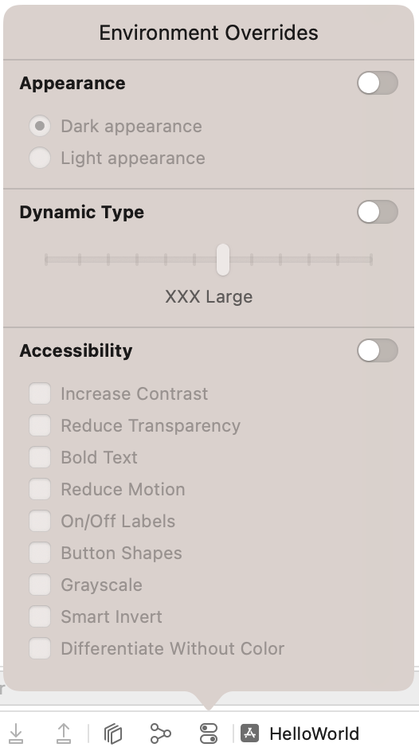
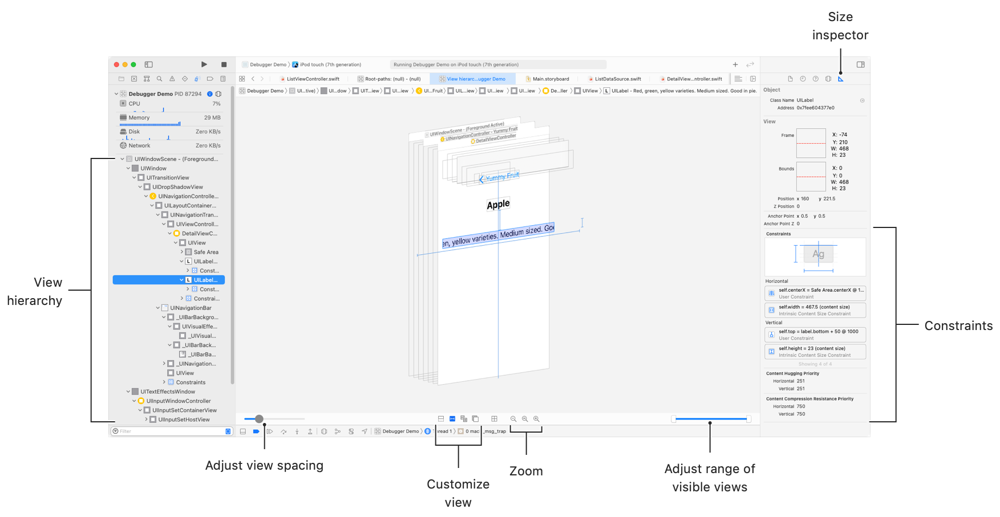
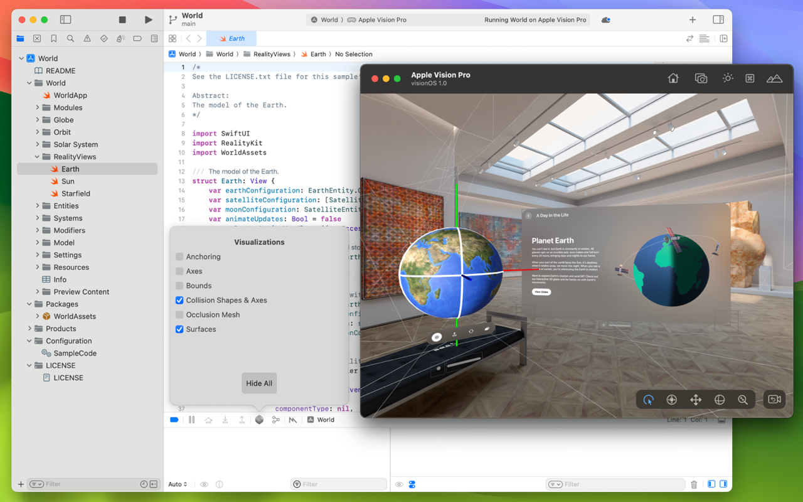

> 导航：[Technologies](../technologies.md) · [Xcode](../xcode.md) · [Debugging](debugging.md)

# 诊断运行中 App 外观方面的问题

文章

检查你正在运行的 App，以调查其显示内容在外观和位置方面的问题。

## 概述

有时你的 App 的内容可能会显得缺失、位置不对，或外观不正确。要识别并诊断这些问题的原因，请附加调试器、重现错误，然后通过检查界面中的变化、正在执行的代码以及变量的状态来缩小根本原因的范围。如果你在 Info 设置中使用 Debug executable 复选框将某个 scheme 的运行操作配置为调试，那么当 App 使用该 scheme 时，调试器会自动附加。要将调试器附加到已经在运行的进程，请选择 Debug → Attach to Process，然后从列表中选择你的 App 的进程。

临时覆盖系统设置以控制你的 App 的外观，并揭示只有在这些设置生效时才会出现的问题；通过在叠放的图层中可视化你的视图来理解布局问题；通过添加视觉叠加层来调试沉浸式空间中的内容。

### 调整系统配置以确定其对视图的影响

有些视觉问题只有在使用特定的环境设置配置系统时才会出现。当面向 iOS、iPadOS、macOS 和 tvOS App 时，Xcode 提供了环境覆盖来帮助你调试这些问题。使用这些环境覆盖来更改界面风格、动态字体大小，并诱发其他辅助功能选项的效果，以便你了解这些更改对视图的布局和视觉外观的影响。

要启用一个或多个这些覆盖，请点按 Xcode 调试工具栏上的 Environment Overrides 按钮，切换覆盖类别旁边的开关，并在类别标题下配置控制项。

Xcode 调试器工具栏显示了 Environmental Overrides 弹出菜单，每个覆盖类型右侧都有切换开关。Appearance 位于顶部，下面是深色外观和浅色外观的选项；Dynamic Type 在其下方，滑动条当前设置为 XXX Large；Accessibility 位于底部，选项包括 Increase Contrast、Reduce Motion 和 Smart Invert 等。

- **Appearance** — 以浅色或深色外观查看你的 App 的内容。使用单选按钮在浅色和深色外观之间进行选择。
- **Dynamic Type** — 使用不同的动态字体大小查看你的 App 的内容。使用滑块选择大小。有关动态字体的更多信息，请参阅 [DynamicTypeSize](../swiftui/dynamictypesize.md)。
- **Accessibility** — 查看各种辅助功能对你的 App 的内容产生的影响。点按复选框以切换辅助功能。

### 解决 UIKit 和 SwiftUI 视图布局中的问题

使用视图调试器（在面向 iOS、iPadOS、macOS、tvOS 和 watchOS App 时可用）来诊断界面中某一项位置错误或大小错误的原因。在你的 App 呈现该视图之后，在你的 App 中设置一个断点，例如在 `viewDidAppear:` 方法中；然后在调试器在你的断点处暂停时，点按调试栏中的 Debug View Hierarchy 按钮。或者，也可以在你的 App 呈现该视图之后直接点按 Debug View Hierarchy 按钮。

调试器会在中央画布上显示当前视图的 3D 渲染效果，并在 Debug 导航器中显示视图层级结构的表示。朝任意方向拖动视图可以查看当前视图叠放的 3D 表示，并使用画布底部的控制项来调整视图以及视图之间的间距。

Xcode 显示视图调试器，经过旋转以查看视图叠放的三维表示。视图调试器显示了一个被选中的 UILabel，它延伸到视图的前沿和后沿并且文本被截断，该视图的四个约束被高亮显示。

点按以在可视化渲染或 Debug 导航器的视图层级结构中选择一个视图，然后在 Object 检查器或 Size 检查器中检查详细信息。根据布局类型解决你的布局问题：

- **基于框架的布局** — 视图调试器会显示你在 Size 检查器中指定的框架。如果大小不是你期望的样子，请单步执行你的代码以诊断框架计算方面的问题，然后修复并重新测试。
- **使用 Auto Layout 的视图** — Size 检查器会显示约束。点按一个约束以在视图调试器中高亮显示它。分析影响位置或大小错误的视图的约束以诊断问题。在你的代码中或在 Interface Builder 中调整你的约束，然后重新测试。
- **使用 SwiftUI 构建的视图** — Size 检查器会显示 SwiftUI 如何确定你的视图的大小和位置。根据这些信息，分析并调整你的 SwiftUI 代码，然后重新测试。

### 理解沉浸式空间中对象之间的关系

对于在沉浸式空间中包含内容的 visionOS App，查看坐标轴、边界框以及其他通常不可见的信息的可视化表示通常会很有帮助。Xcode 的调试工具包括了在模拟器或设备上显示这些信息的选项。使用它们来确保你的实体位于你期望的位置，并按照你预期的方式与彼此以及周围环境进行交互。例如，如果某个实体没有响应事件，启用 Collision Shapes 可以确认事件处理所需的碰撞形状是否存在，并指示其边界。

一台 macOS 显示器，左侧是 Xcode 窗口，右侧是模拟器窗口。Xcode 的调试工具栏显示了 Visualizations 弹出菜单，其中包括为 Anchoring、Axes、Bounds、Collisions Shapes and Axes、Occlusion Mesh 和 Surfaces 启用可视化的选项，其中 Collisions Shapes and Axes 和 Surfaces 已被选中。模拟器显示了一个沉浸式体验，左侧是一个可交互的 3D 地球仪，右侧是一个 2D 窗口。每个实体周围都出现了轮廓线以指示其碰撞形状，彩色箭头指示坐标轴，边框线和对角线标记出表面。

要用叠加层为你的内容添加注释，请点按 Xcode 调试工具栏上的 Debug Visualizations 按钮，然后选择一个或多个选项：

- **Anchoring** — 红色、绿色和蓝色箭头指示每个锚点的 x、y 和 z 轴，黄色线条连接实体和它们的锚点。使用此选项可以理解实体相对于空间中其他现实世界物体的位置。
- **Axes** — 红色、绿色和蓝色箭头指示空间中每个对象的 x、y 和 z 轴。使用此选项可以理解每个对象的朝向。
- **Bounds** — 绿色线条指示每个实体的边界边缘。
- **Collision Shapes and Axes** — 实体碰撞形状周围的灰色轮廓，以及指示实体坐标轴的红色、绿色和蓝色箭头。使用此选项可以理解事件检测方面的问题。
- **Occlusion Mesh** — 空间中现实物体周围的多色线框。使用此选项可以识别虚拟对象被正确或错误地隐藏在现实物体后面的区域。
- **Surfaces** — 标记每个表面的白色边框线和对角线。使用此选项可以理解系统检测到的表面的边界。

> [!note] 注意
> Anchoring、Axes 和 Bounds 选项适用于你正在调试的 App 的实体，而 Collision Shapes & Axes 选项适用于共享空间中的所有实体。Occlusion Mesh 和 Surfaces 选项适用于系统在你周围环境中检测到的对象。

## 另请参阅

### 调试策略

- [Diagnosing memory, thread, and crash issues early](diagnosing-memory-thread-and-crash-issues-early.md) — 在测试期间使用 Xcode 的 sanitizer 工具识别你的 App 中的运行时崩溃和未定义行为。
- [Analyzing HTTP traffic with Instruments](../foundation/analyzing-http-traffic-with-instruments.md) — 测量你的 App 基于 HTTP 的网络性能和使用情况。
- [Detecting when your app contacts domains that may be profiling users](detecting-when-your-app-contacts-domains-that-may-be-profiling-users.md) — 使用 Instruments 评估你的 App 或其第三方 SDK 是否连接到可能对用户进行画像分析的域名。
