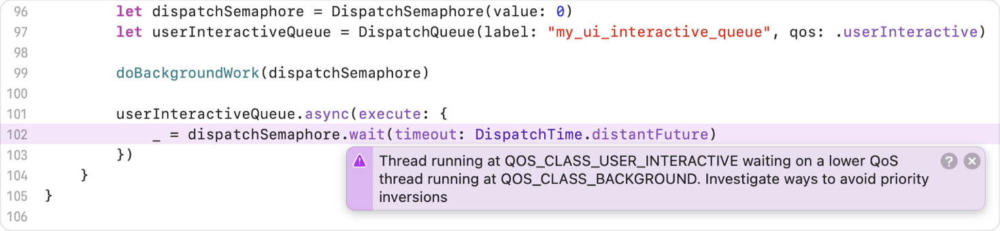
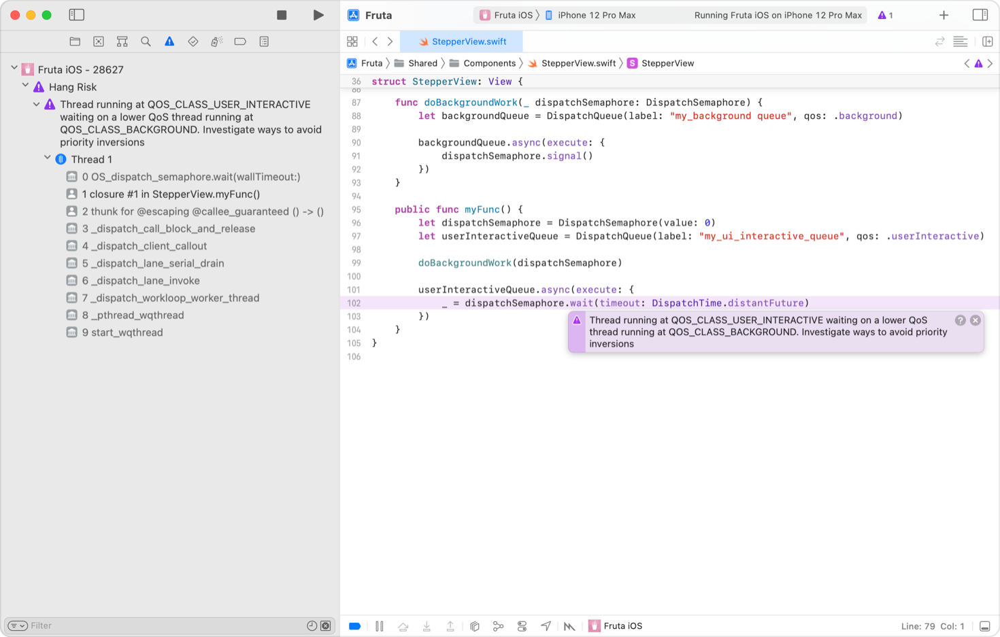
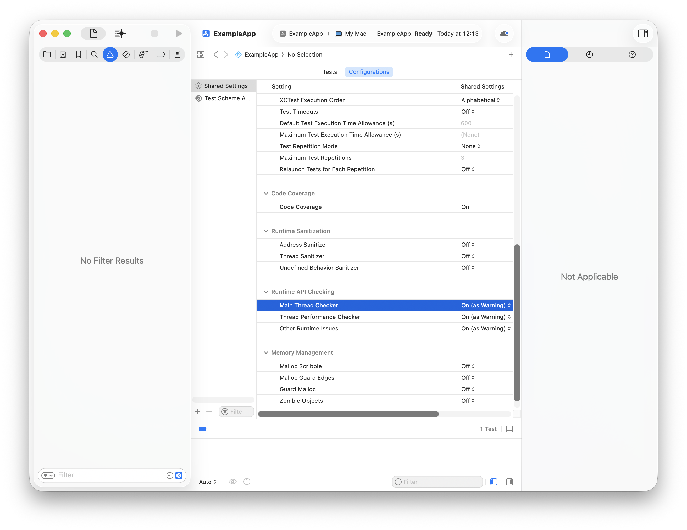
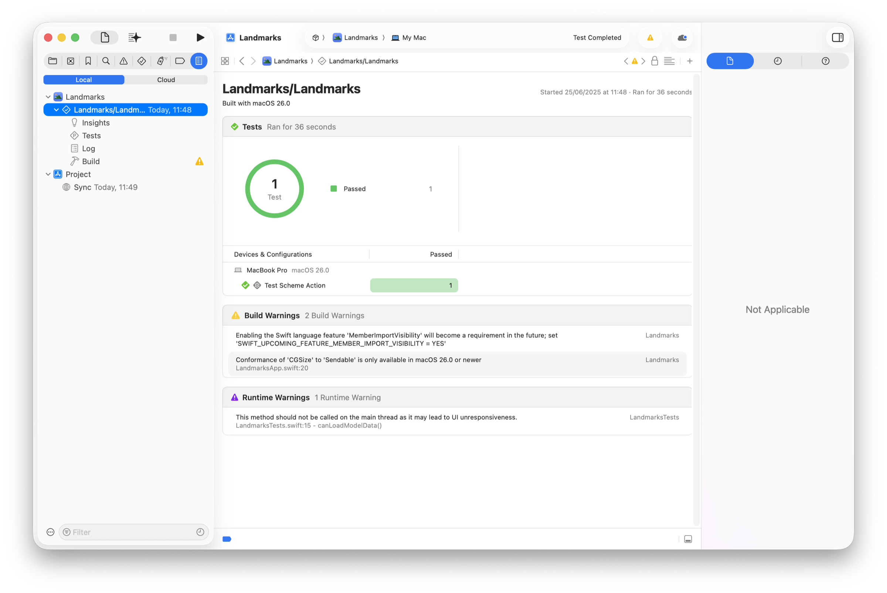
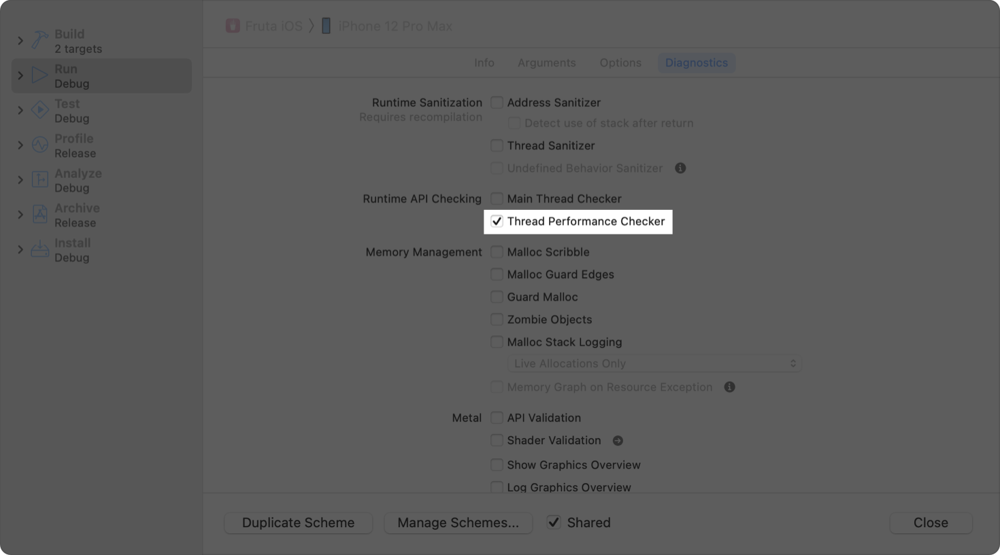

> 导航：[技术](../technologies.md) · [Xcode](../xcode.md) · [性能与指标](performance-and-metrics.md)

# 尽早诊断性能问题

<sub>文章</sub>

在开发和测试期间，使用 Xcode 中的线程性能检查器（Thread Performance Checker）工具诊断 App 中潜在的性能问题。

## 概述

在开发期间识别潜在的性能问题可以节省后续的测试时间。解决性能问题（例如优先级反转和主线程上的非 UI 工作）可以使你的 App 保持响应。优先级反转发生在低优先级线程阻塞了高优先级线程时，这可能会导致 App 无响应。同样，主线程上的非 UI 工作（如同步网络请求或 I/O）可能会阻塞主线程数百毫秒，这会阻止用户与你的 App 交互。

线程性能检查器工具会检测优先级反转和主线程上的非 UI 工作。它不需要任何重新编译。使用线程性能检查器工具来检测、诊断和解决性能问题。

### 理解已检测到的问题

线程性能检查器工具会在问题导航器（Issue navigator）和源代码编辑器（source editor）中显示问题。请仔细阅读诊断信息。



要深入了解问题，请在问题导航器中展开问题的回溯。



点击问题描述中的 Generate，即可使用 Xcode 中的智能功能生成修复方案。有关更多信息，请参阅[在 Xcode 中使用智能功能编写代码](writing-code-with-intelligence-in-xcode.md)。

显示的问题指向项目中可能导致挂起（hang）的代码。当你的 App 在数百毫秒内无响应时，就会发生挂起。要了解有关挂起的更多信息，请参阅[改善 App 响应能力](improving-app-responsiveness.md)和 WWDC 讲座视频[了解和消除 App 挂起](https://developer.apple.com/videos/play/wwdc2021/10258/)。

### 诊断并解决优先级反转

如果你在代码中使用了并发原语，例如 [dispatch_semaphore_wait](../dispatch/dispatch_semaphore_wait.md) 和 [dispatch_group_wait](../dispatch/dispatch_group_wait.md)，或者调用了使用这些原语的 API，那么当你的 App 使用的调度队列的服务质量（QoS）类别不匹配时，你的 App 很容易出现优先级反转。当你使用这些原语时，系统无法自动将优先级从高优先级线程传播到低优先级线程。你可以采取以下预防措施来避免代码中出现优先级反转：

- 在调用异步内部方法或 API 时，不要使用 `dispatch_semaphore_wait` 和 `dispatch_group_wait` 来模拟同步行为。如果底层功能并非必要，请移除相关代码。
- 当没有同步变体可用时，确保等待线程的 QoS 等于或低于发起信号的线程的 QoS。在创建 [Dispatch Queue](../dispatch/dispatch-queue.md) 或 [OperationQueue](../foundation/operationqueue.md) 时，明确指定工作的 QoS 类别。

下面 `initiateBackgroundWork` 中的代码显式创建了一个具有后台 QoS 的调度队列。`doBackgroundWorkAsync` 在后台 QoS 下异步发出后台工作完成的信号。后台工作完成后，它会在主线程上以 [userInteractive](../dispatch/dispatchqos/userinteractive.md) QoS 更新 UI 标签。

```swift
func initiateBackgroundWork() {
    let dispatchSemaphore = DispatchSemaphore(value: 0)
    let backgroundQueue = DispatchQueue(label: "background_queue", 
                                        qos: .background)
    
    backgroundQueue.async {
        // 在单独的线程上执行工作，使用后台维护或清理任务的服务质量等级，
        // 并在工作完成时发出信号。
       doBackgroundWorkAsync {
           dispatchSemaphore.signal()
       }
       
       _ = dispatchSemaphore.wait(timeout: DispatchTime.distantFuture)
       
       DispatchQueue.main.async { [weak self] in
           self?.label.text = "Background work completed"
       }
    })
}
```

要了解有关优先级反转和 QoS 的更多信息，请参阅 [Modernizing Grand Central Dispatch Usage](https://developer.apple.com/videos/play/wwdc2017/706/) 和 [Energy Efficiency Guide for iOS Apps](https://developer.apple.com/library/archive/documentation/Performance/Conceptual/EnergyGuide-iOS/PrioritizeWorkWithQoS.html)。

### 诊断并消除主线程上的非 UI 工作

主线程上长时间运行的同步 I/O 和网络请求会使你的 App 无响应。例如，要执行实时捕获，你需要实例化一个 [AVCaptureSession](../avfoundation/avcapturesession.md) 对象并添加相应的输入和输出。在你的 App 主线程上调用 `AVCaptureSession` 对象的 [startRunning()](<../avfoundation/avcapturesession/startrunning().md>) 方法可能会导致挂起。你可以采取以下预防措施来避免主线程上的非 UI 工作：

- 不要在主线程上同步读取或写入文件和 I/O 设备。相反，应在单独的串行调度队列上执行此工作，并通过将一个 block 加入主队列来通知 I/O 的完成。
- 使用执行 I/O 操作的 API 的异步变体，使其在主线程之外工作。
- 不要在你的 App 主线程上执行同步网络请求。相反，应使用异步网络 API，例如 [URLSession](../foundation/urlsession.md)。

### 在测试中检测运行时问题

Xcode 会在你使用 [Swift Testing](../testing.md) 或 [XCTest](../xctest.md) 编写的测试中检测运行时问题，包括使用 [XCUIAutomation](../xcuiautomation.md) 自动控制 App UI 的 UI 测试。

默认情况下，Xcode 会将测试中的运行时问题报告为警告。要在发生运行时问题时使测试失败，请按照以下步骤操作：

1. 选择“Product”>“Test Plan”>“Edit Test Plan”。按照 Xcode 显示的任何提示进行操作。
2. 切换到测试计划编辑器（Test Plan editor）中的“Configurations”面板。
3. 将“Runtime API Checking”部分中的配置值更改为“On (as Failure)”。你可以单独设置每个值，例如，将主线程问题报告为失败，这样你就可以专注于解决这些问题，而不会因为其他运行时问题而导致失败。



要将运行时问题重新变为警告，请将配置值更改为“On (as Warnings)”。有关配置测试计划的更多信息，请参阅[通过将测试组织到测试计划中来改善代码评估](organizing-tests-to-improve-feedback.md)。

如果你将 Xcode 配置为将测试中的运行时问题报告为警告，Xcode 会在测试报告（Test Report）中的“Runtime Warnings”部分、测试导航器（Test navigator）和问题导航器中显示这些问题。



### 停用线程性能检查器工具

对于在项目中构建 App 的 scheme，线程性能检查器工具 default 处于启用状态。要停用它，请选择“Product”>“Scheme”>“Edit Scheme”以显示 Scheme 编辑器（Scheme Editor）。选择“Run”scheme，导航到“Diagnostics”部分，然后取消选中“Thread Performance Checker”工具复选框。



除了线程性能检查器工具之外，还应始终使用一套全面的性能测试来测试你的代码。有关测试代码的更多信息，请参阅[测试](testing.md)。

> [!important] 重要
> 线程性能检查器工具目前仅在 macOS 和 iOS 上受支持。

解决某些性能问题可能需要进行重大的代码重构或重新设计底层逻辑。要抑制你打算稍后解决的问题的警告，请设置 `PERFC_SUPPRESSION_FILE` 环境变量，以在抑制文件中提供类和方法的列表。线程性能检查器工具只会显示不涉及这些类和方法的问题。请为你的抑制文件使用以下格式：

```other
class:UIActivityViewController
class:NSThread
method:-[UIViewController view]
method:readv
```

要停用测试中的运行时问题，请编辑测试计划并将“Runtime API Checking”配置值设置为“Off”。

## 另请参阅

### 相关文档

- [解决 watchdog 终止问题](addressing-watchdog-terminations.md) —— 识别被 watchdog 终止的无响应 App 的特征，并解决问题。
- [改善 App 响应能力](improving-app-responsiveness.md) —— 通过消除 App 中的挂起和卡顿，打造感觉响应迅速的用户体验。

### 响应能力

- [分析已发布 App 中的响应能力问题](analyzing-responsiveness-issues-in-your-shipping-app.md) —— 识别用户遇到的响应能力问题，并使用 Xcode Organizer 中的挂起和卡顿数据来确定最需要修复哪些问题。
- [改善 App 响应能力](improving-app-responsiveness.md) —— 通过消除 App 中的挂起和卡顿，打造感觉响应迅速的用户体验。
- [理解用户界面的响应能力](understanding-user-interface-responsiveness.md) —— 通过检查事件处理和渲染循环，让你的 App 响应更加迅速。
- [理解和改善 SwiftUI 性能](understanding-and-improving-swiftui-performance.md) —— 识别并解决长时间运行的视图更新，并降低更新频率。
- [理解 App 中的挂起](understanding-hangs-in-your-app.md) —— 通过检查主线程和主运行循环，确定用户交互延迟的原因。
- [理解 App 中的卡顿](understanding-hitches-in-your-app.md) —— 通过检查渲染循环，确定运动过程中的中断原因。
- [减少 App 的启动时间](reducing-your-app-s-launch-time.md) —— 通过最小化启动时间，为你的 App 打造更灵敏的体验。
- [减少 App 中的终止](reduce-terminations-in-your-app.md) —— 通过解决常见的终止原因，最大限度地减少系统停止你的 App 的频率。
