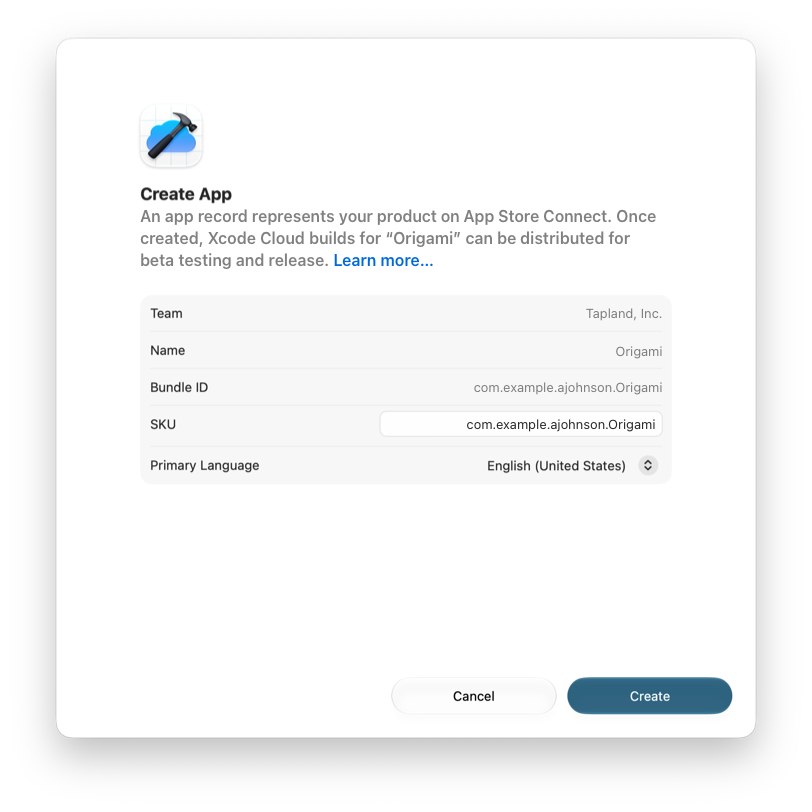
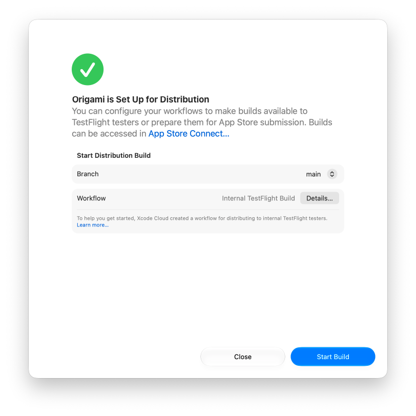

> 导航：[Technologies](../technologies.md) · [Xcode](../xcode.md) · [Xcode Cloud](xcode-cloud.md)

# 通过 TestFlight 分发你的 Xcode Cloud 构建版本

文章

为内部测试者创建一个 TestFlight 分发工作流。

## 概述

当你准备好获取反馈时，使用 Xcode Cloud 将构建版本交付给 TestFlight。使用 TestFlight 分发你的 App 可以让人们尝试新功能并报告 bug。当你准备好通过 App Store 分发你的 App 时，你也可以使用 Xcode Cloud 交付构建版本。

## 开始之前

在创建分发工作流之前，先设置 Xcode Cloud 以在开发期间构建和测试你的 App。有关更多信息，请参阅 [Getting started with Xcode Cloud](getting-started-with-xcode-cloud.md)。

如果你在 App Store Connect 中没有 App 记录，请在设置分发之前确保你的 Apple Developer Program 账户拥有创建 App 记录的权限。要加入 Apple Developer Program，请参阅 [Become a member](https://developer.apple.com/programs/enroll/)。

## 创建 App 记录

要开始，请点按 Report 导航器中的 Cloud 标签页。按住 Control 键点按你的产品，并从上下文菜单中选择 Set Up Distribution。

如果你的账户中存在一个与你的 bundle 标识符匹配的 App 记录，Xcode Cloud 会使用它。否则，如果你的 App 名称和 bundle 标识符是唯一的，Xcode Cloud 会为你创建一个新的 App 记录。

如果出现 Create App 表单，请验证团队、App 名称和 bundle 标识符是否正确。如果因为另一个 App 已经使用了你的 App 名称而出现错误消息，请在 Name 文本栏中输入一个新的 App 名称。如有必要，更改该表单中的任何其他信息，然后点按 Create。

Create App 表单的屏幕截图，显示了 App 记录的详细信息，包括 App 名称和 bundle ID，下方是 Create 按钮。

如果出现的是 Confirm Existing App 表单，请验证 App 名称和 bundle 标识符是否正确，然后点按 Next。

Xcode Cloud 默认会创建一个用于开始内部 TestFlight 分发的工作流。如果你想为你的工作流添加一个内部 TestFlight 后置操作，请先在 App Store Connect 中创建一个内部测试者组。有关更多信息，请参阅 [Add internal testers](https://developer.apple.com/help/app-store-connect/test-a-beta-version/add-internal-testers)。

或者，也可以在 Xcode 中设置分发之前，先在 App Store Connect 中创建一个 App 记录。有关更多信息，请参阅 [Add a new app](https://developer.apple.com/help/app-store-connect/create-an-app-record/add-a-new-app)。

## 开始你的第一次构建

然后，使用 Xcode Cloud 开始构建你的 App 或框架。

1. 在下一个表单中，确认 Xcode Cloud 用于构建你的产品的分支。
2. 点按 Start Build。

Set Up for Distribution 表单的屏幕截图，显示了用于从你的代码仓库中选择分支的弹出式菜单，下方是 Start Build 按钮。

Xcode Cloud 会为你归档该构建版本并将其上传到 App Store Connect。

## 查看构建进度

作为最后一步，在 Report 导航器的 Cloud 面板中查看该构建版本。要改为在 App Store Connect 中查看分发构建版本并管理工作流，请点按你的 App，然后点按 Xcode Cloud 标签页。在侧栏中，导航到你的构建版本、工作流和设置。

## 另请参阅

### 基础

- [Getting started with Xcode Cloud](getting-started-with-xcode-cloud.md) — 在开发期间使用 Xcode Cloud 在云端构建和测试你的 App。
- [About continuous integration and delivery with Xcode Cloud](about-continuous-integration-and-delivery-with-xcode-cloud.md) — 了解使用 Xcode Cloud 进行的持续集成和交付如何帮助你创建高质量的 App 和框架。
- [Setting up your project to use Xcode Cloud](setting-up-your-project-to-use-xcode-cloud.md) — 在配置你的项目或工作区以使用 Xcode Cloud 之前，先查看账户、项目和源代码管理方面的要求。
- [Configuring your first Xcode Cloud workflow](configuring-your-first-xcode-cloud-workflow.md) — 设置你的项目或工作区以使用 Xcode Cloud，并采用持续集成和交付。
