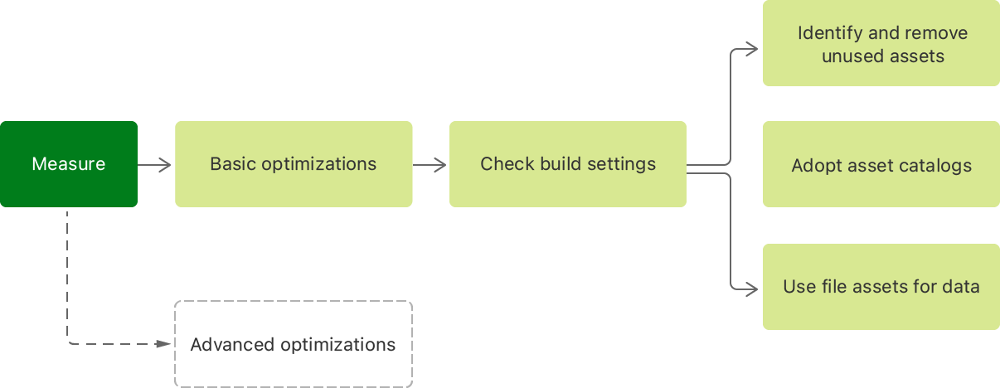

> 导航：[技术](../technologies.md) · [Xcode](../xcode.md) · [性能与指标](performance-and-metrics.md) · [减小 App 大小](reducing-your-app-s-size.md)

# 进行基本优化以减小 App 大小

文章

调整项目构建设置，并在 App 开发生命周期早期采用资源目录等技术。

## 概述

测量 App 大小后，你可以进行一些基本优化来减小它。如果正在启动一个新的 App 项目，请采用资源目录等技术，为 App 打下稳固基础。尽早采用这些技术，可以降低日后需要进行高成本优化的可能性。

展示如何优化 App 大小的流程图。首先测量 App 大小，然后进行基本优化，并可选择进行高级优化。基本优化包括检查构建设置、移除未使用的资源、采用资源目录，以及使用资源文件存储数据。

### 检查目标的发布构建设置

测量 App 大小后，你可能会发现它比预期更大。这可能是因为你无意中更改了项目设置。`Release` 配置的默认优化级别是 `Fastest, Smallest [-Os]`，它可以显著减小编译后二进制文件的大小。请检查目标的构建设置，确保使用此优化级别。

### 识别并移除未使用的资源

接下来，查看 App 的 IPA 文件内部，确定 App 是否包含未使用的资源或不必要的文件。首先按照[减小 App 大小](reducing-your-app-s-size.md)中所述步骤，为 App 的每个变体创建一个经过_瘦身_的 IPA 文件。然后执行以下操作：

1. 打开“访达”，前往要检查的 IPA 文件。
2. 将 IPA 文件的扩展名改为 ZIP。（IPA 文件实际上就是一个解压后具有特定结构的 ZIP 归档。）
3. 解压文件，显示 Payloads 目录中的 App 捆绑包。你可以在“访达”中打开 ZIP 文件，也可以在“终端”App 中运行 `unzip -lv /path/to/your/app.zip`。
4. 右键点按 App 捆绑包，然后选择 Show Package Contents。

在适当情况下，从 Xcode 项目或目标中移除所有未使用的文件。例如，确保没有将 App 的 `README` 文件添加到目标，并移除所有未使用的图像资源和头文件等。

### 为 App 资源采用资源目录

资源目录允许 Xcode 和 App Store 优化 App 资源，从而显著减小 App 大小。请使用资源目录，而不是将资源直接放入 App 捆绑包；然后执行以下操作：

- 为每项资源（例如图像、纹理或数据资源）标记相关元数据，以指明该资源适用于哪些设备。这样可以最大限度地发挥 App 瘦身的大小缩减效果；对于包含并非每台设备都需要的资源的 App，效果可能非常显著。
- 为图像定义可调整大小的中心区域，并可选择设置两端不缩放区域，以减小图像大小。若要进一步了解，请参阅[向图像添加可调整大小的区域](https://help.apple.com/xcode/mac/current/#/deve65bd8d0d)。
- 设置每种资源类型的压缩级别。特别是对于使用广色域图像或 Metal 纹理的 App，请考虑 `ASTC` 压缩选项。有关压缩广色域图像或纹理的更多信息，请参阅[使用广色域](https://developer.apple.com/videos/play/wwdc2016/712/)。

若要进一步了解资源目录，请参阅[向 Xcode 项目添加图像](adding-images-to-your-xcode-project.md)和[使用资源目录管理资源](managing-assets-with-asset-catalogs.md)，并观看 [Xcode 中的 App 瘦身](https://developer.apple.com/videos/play/wwdc2015/404/)。

### 对随 App 提供的数据使用资源文件

检查 App 的 IPA 文件时，你可能会发现 App 二进制文件占用了大量空间。如果 App 随附数据，请考虑使用资源文件，而不是将数据放入代码。例如，使用属性列表将数据与 App 捆绑，而不是在代码中使用字符串。此外，一些开发者使用源代码提供其他资源，例如图像。请考虑改用资源文件，并将其放入资源目录。将数据和资源从源代码移到资源文件，可以显著减小 App 二进制文件的大小，也让 App Store Connect 能够更高效地压缩 App。

## 另请参阅

### 大小优化

- [进行高级优化以进一步减小 App 大小](doing-advanced-optimization-to-further-reduce-your-app-s-size.md) — 优化 App 的资源文件、采用按需资源，并减小 App 更新的大小。
