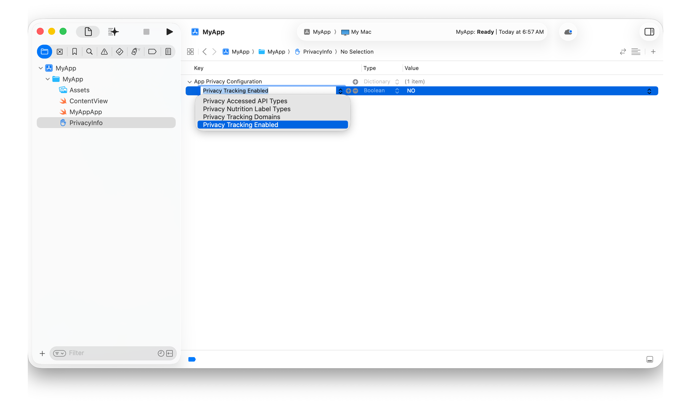

> 导航：[技术](../technologies.md) · [Xcode](../xcode.md) · [捆绑包与框架](bundles-and-frameworks.md)

# 编辑属性列表文件

文章

在结构化文件中添加、移除和更改键与值。

## 概述

你可以使用属性列表文件向系统提供有关 App 和其他代码捆绑包的结构化数据。例如，每个捆绑包都包含由 Xcode 管理的[信息属性列表](../bundleresources/information-property-list.md)，用于向系统描述该捆绑包。此外，许多 App 还包含描述其 [Entitlements](../bundleresources/entitlements.md) 的属性列表，以及描述其收集的数据和特定 API 使用方式的 [Privacy manifest 文件](../bundleresources/privacy-manifest-files.md)。

默认情况下，Xcode 会根据项目构建设置中的值生成捆绑包的信息属性列表文件。你可以使用项目编辑器中的 Info 面板管理这些值，而无需直接编辑该文件。如有需要，也可以提供一个手动编辑的文件。有关更多信息，请参阅[管理 App 的信息属性列表值](../bundleresources/managing-your-app-s-information-property-list.md)。

类似地，Xcode 会根据你使用目标编辑器中的 Signing & Capabilities 面板添加到目标的 [Capabilities](capabilities.md)，管理 App 或扩展的 [Entitlements](../bundleresources/entitlements.md) 文件。通常无需直接编辑 entitlement 属性列表文件。有关更多信息，请参阅[向 App 添加功能](adding-capabilities-to-your-app.md)。

手动创建属性列表文件时，请使用 Xcode 属性列表编辑器更新文件内容，同时确保结构有效。

### 创建属性列表文件

要在 Xcode 中创建属性列表文件，请按照以下步骤操作：

1. 选择 File \> New \> File from Template。
2. 从 Resource 组中选择 Property List 模板。
3. 点按 Next。
4. 输入文件名，然后点按 Create。

要创建 Privacy manifest 文件，请改为从 Resource 组中选择 App Privacy 模板。有关更多信息，请参阅 [Privacy manifest 文件](../bundleresources/privacy-manifest-files.md#Create-a-privacy-manifest)。

### 向文件添加属性

若要向属性列表文件添加属性，请在 Xcode 编辑器中打开该文件，将指针悬停在文件标题上，然后点按标题旁边出现的 Add 按钮（+）。输入键名并按下 Enter 键，或点按文本字段之外的位置。

你也可以将指针悬停在现有条目上，然后点按出现的 Add 按钮，在属性列表文件的任意层级添加条目。

如果现有条目的值是基本类型（例如字符串、数字或布尔值），Xcode 会将新条目创建为文件结构中与现有条目同级的键；如果现有条目是数组元素，则创建为同一数组中的新元素。

如果现有条目的值是集合类型（字典或数组），则其行为取决于该值处于展开还是折叠状态。如果值已展开，Xcode 会在值为字典时在其中创建新的键值对，在值为数组时创建新的数组元素。否则，Xcode 会将新条目创建为文件结构中与现有条目同级的键值对。

### 设置属性的类型和值

Xcode 会跟踪常见属性列表文件的模式，包括信息属性列表和 Privacy manifest 文件，并在你向文件添加键时设置正确的类型。若要更改自定键的类型，请使用属性列表编辑器 Type 列中的弹出式菜单选择新类型。

使用编辑器 Value 列中的弹出式菜单，将布尔键的值设置为 `YES` 或 `NO`。对于字符串或数字等其他基本类型，请在编辑器的 Value 列中输入值。若要向字典或数组添加元素，请参阅上面的[向文件添加属性](editing-property-list-files.md#Add-a-property-to-the-file)。

### 从文件中移除属性

若要从属性列表文件中移除键或从数组中移除元素，请将指针悬停在该元素上，然后点按出现的 Remove 按钮（-）。

### 查看原始键和值

默认情况下，Xcode 会在常见属性列表文件中显示便于阅读的键和值表示形式。若要查看原始键和值，请在属性列表编辑器中按住 Control 键点按，然后选中 Raw Keys and Values。若要返回便于阅读的表示形式，请取消选中 Raw Keys and Values。

## 另请参阅

### 捆绑包

- [在捆绑包中放置内容](../bundleresources/placing-content-in-a-bundle.md) — 根据类型将捆绑包内容放在正确位置。
- [管理 App 的信息属性列表值](../bundleresources/managing-your-app-s-information-property-list.md) — 使用 Xcode 自定 App 的信息属性列表值。
- [在捆绑包中嵌入非标准代码结构](embedding-nonstandard-code-structures-in-a-bundle.md) — 使用以非标准方式构造的代码，同时避免代码签名和分发问题。
