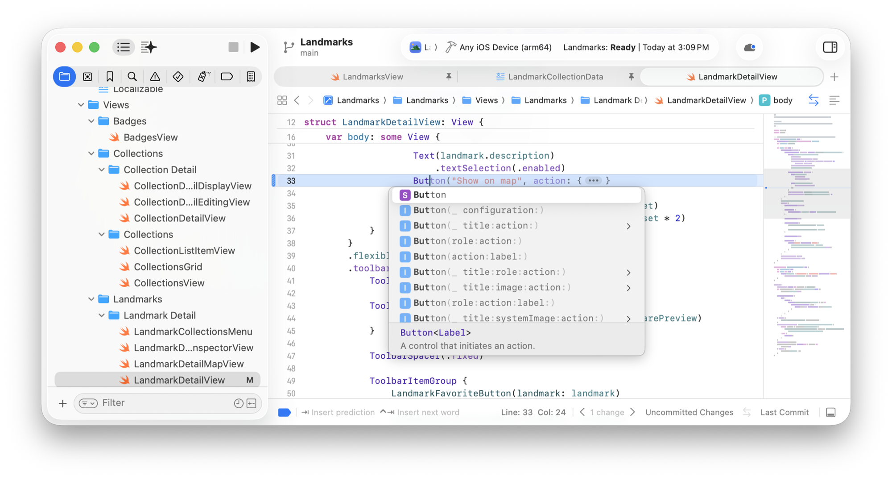
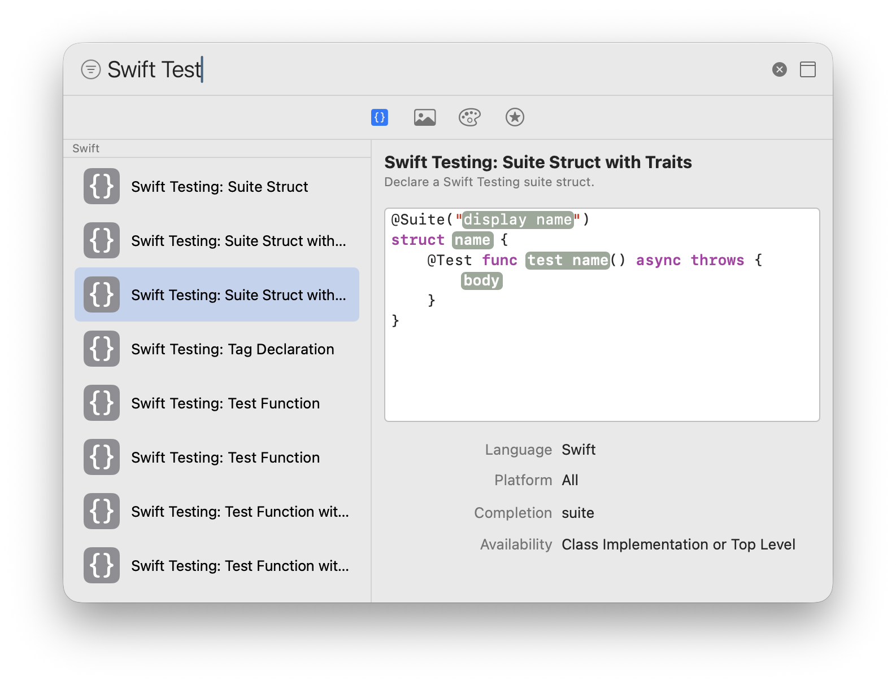
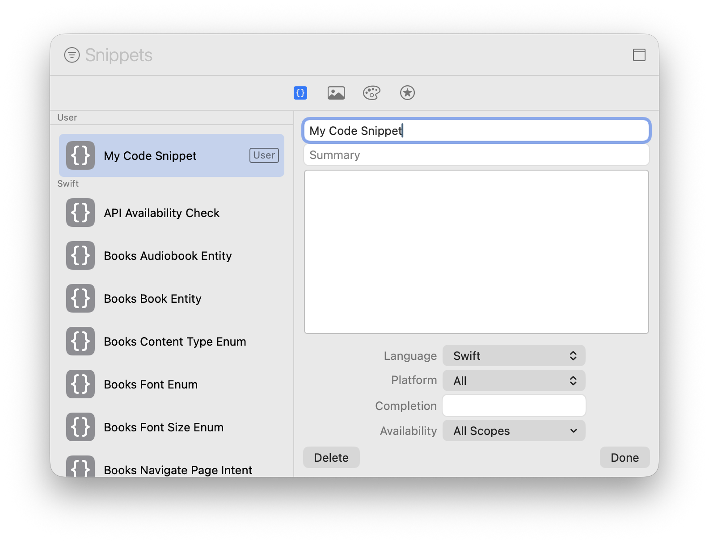
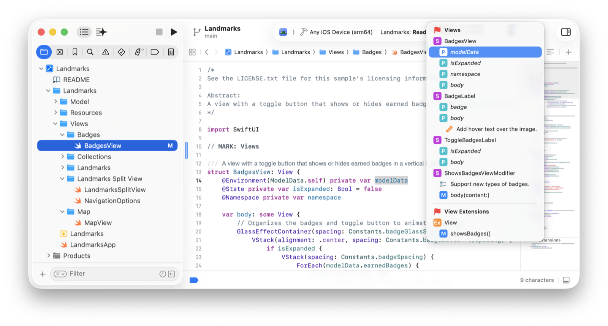
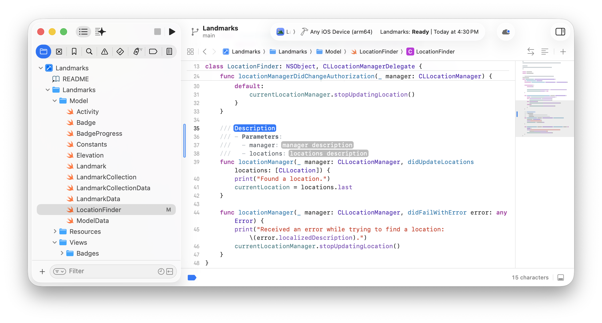

> 导航：[技术](../technologies.md) · [Xcode](../xcode.md) · [源代码编辑器](source-editor.md)

# 在 Xcode 中编辑源文件

<sub>文章</sub>

使用源代码编辑器的各项功能，帮助你更快地编写、导览、记录并理解代码。

## 概述

编写代码时，可以使用 Xcode 提供的代码补全和代码片段来节省时间。还可以利用跳转栏和小地图功能，在项目文件中快速导览。然后向代码添加注释，以便在 Quick Help 中查看，并在之后生成文档。

首先，在 Project navigator 中选择一个源文件，Xcode 会在右侧的源代码编辑器中将其打开。

有关为项目窗口配置多个编辑器和助理的信息，请参阅[配置 Xcode 项目窗口](configuring-the-xcode-project-window.md)。有关使用编码智能生成代码、游乐场、预览和文档的信息，请参阅[在 Xcode 中使用智能功能编写代码](writing-code-with-intelligence-in-xcode.md)。

### 使用代码补全输入代码

在源代码编辑器中输入代码时，可以使用代码补全来辅助输入变量名和函数名。对带参数的方法或函数使用代码补全时，Xcode 会为需要添加的每个参数提供占位符。



<sub>Xcode 的屏幕截图，左侧显示 Project navigator，右侧显示源代码编辑器，其中已输入单词 Button 的一部分，并显示一个菜单，选中了第一项代码补全建议。</sub>

若要在占位符之间导览，请按下 Tab 和 Shift-Tab（或分别选择 Navigate \> Jump to Next Placeholder 和 Navigate \> Jump to Previous Placeholder）。

在 Swift 文件中，预测式代码补全会在插入点提供代码建议。输入内容或按下 Return 键换行时，Xcode 会预测该位置的代码。例如，如果在源代码编辑器中输入 `Image`，Xcode 会预测用于完成语句的其余代码。当代码补全文本出现在插入点时，按下 Tab 键添加预测式代码补全建议，或按下 Return 键接受常规代码补全。

你可以选择 Xcode \> Settings \> Editing \> Completion 来自定或停用代码补全。

### 添加和创建可复用的代码片段

对于常见代码结构，Xcode 提供了可插入代码的预置代码片段，你也可以自行创建。

要在代码中插入片段：

1. 选择 View \> Show Library。
2. 在资源库中，使用顶部搜索栏和工具栏按钮筛选片段。
3. 选择一个片段并将其拖到源代码编辑器中的所需位置。
4. 在源代码编辑器中，按下 Tab 和 Shift-Tab 键，在片段的占位符之间导览。



<sub>Xcode 资源库的屏幕截图，顶部搜索栏中输入了 Swift Test，边栏中选中了 Swift Testing: Suite Struct with Traits，右侧显示带占位符的代码片段。</sub>

要创建自己的代码片段：

1. 在源代码编辑器中为片段选择一些代码并按住 Control 键点按，或者在源代码编辑器任意位置按住 Control 键点按，然后从快捷菜单中选择 Create Code Snippet。
2. 在打开的资源库中，在右侧表单中输入片段的名称和摘要。
3. 编辑下方片段中的代码，并使用 `<#placeholder name#>` 标记占位符。
4. 选择语言和平台，输入用于代码补全的任何文本，并选择作用域。
5. 点按 Done。



<sub>Xcode 资源库的屏幕截图，边栏中选中了新代码片段，右侧显示用于输入片段名称、摘要和代码的表单。</sub>

若要删除你创建的代码片段，请在资源库边栏中选择该片段，然后点按 Delete。

### 为代码添加标注以提高可见性

跳转栏和小地图都提供了快捷的可视方式，帮助你在源代码编辑器中导览。若要显示位于源代码编辑器右侧的小地图，请从编辑器工具栏右侧的 Adjust Editor Options 菜单中选择 Minimap。

然后使用 `MARK`、`TODO` 和 `FIXME` 注释标注代码，增强这些工具在组织代码时的能力。



<sub>Xcode 项目窗口的屏幕截图，左侧显示 Project navigator，右侧显示源代码编辑器，其中跳转栏菜单和小地图显示了 MARK、TODO 和 FIXME 注释。</sub>

添加 `MARK` 注释，为代码的某个部分添加标题。在注释中加入短横线，可指示 Xcode 在跳转栏和小地图中的该部分前显示分隔线。

```swift
// MARK: 视图

/// 一种带有切换按钮的视图，可在垂直布局中显示或隐藏已获得的徽章。
struct BadgesView: View {
```

添加 `TODO` 注释，指出你希望日后完成工作的地方。跳转栏会使用图标高亮显示 `TODO` 注释，以便识别。

```swift
// TODO: 支持新类型的徽章。
func body(content: Content) -> some View {
```

添加 `FIXME` 注释，注明代码中需要修复的位置。跳转栏会使用不同的图标高亮显示 `FIXME` 注释。

```swift
// FIXME: 在图像上添加悬停文本。
Image(systemName: badge.symbolName)
```

除了组织方面的好处，一致使用 `MARK`、`TODO` 和 `FIXME` 注释，还能提升你搜索常见部分、未来更新和所需修复的能力。

对于 Objective-C，请改用 `#pragma mark`、`#pragma fixme` 和 `#pragma todo` 宏。

### 向代码添加 Quick Help 注释

你可以使用 Quick Help 了解现有 API，也可以记录自己的符号，供自己或其他开发者使用。若要查看 Quick Help，请按住 Control 键点按符号，然后从快捷菜单中选择 Show Quick Help。

若要为代码中的符号添加 Quick Help，请按住 Command 键点按没有文档注释的符号声明，然后选择 Add Documentation。Xcode 会添加以三个斜杠（`///`）开头的注释行，并根据符号声明包含描述、参数、抛出错误和返回值的占位符。使用 Markup 语法更新占位符，以完成注释并为符号启用 Quick Help。



<sub>Xcode 项目窗口的屏幕截图，左侧显示 Project navigator，右侧显示源代码编辑器，其中函数上方出现了文档注释，并选中了第一个占位符文本。</sub>

然后，若要在 Quick Help 中检查文档，请按住 Control 键点按符号，然后选择 Show Quick Help。Xcode 会对文档注释中的信息进行格式化并显示。

有关编写和分发代码文档的更多信息，请参阅[编写文档](writing-documentation.md)。

## 另请参阅

### 源文件的创建、组织和编辑

- [在源代码编辑器中使用编码智能](using-coding-intelligence-in-the-source-editor.md) — 在要更改代码的位置直接提交提示。
- [使用游乐场宏运行代码片段](running-code-snippets-using-the-playground-macro.md) — 向代码添加游乐场，在画布中运行并显示结果。
