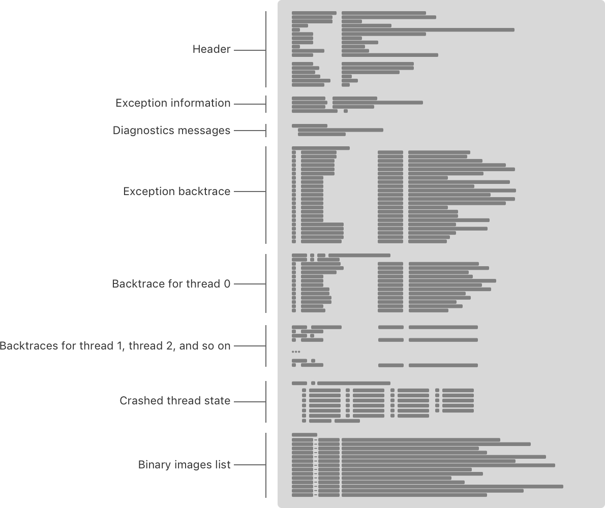

> 导航：[技术](../technologies.md) · [Xcode](../xcode.md) · [调试](debugging.md) · [使用崩溃报告和设备日志诊断问题](diagnosing-issues-using-crash-reports-and-device-logs.md)

# 检查崩溃报告中的字段

<sub>文章</sub>

了解崩溃报告的结构以及每个字段包含的信息。

## 概述

崩溃报告的每个部分都包含信息，帮助你诊断崩溃的来源。



### 标头

崩溃报告以标头部分开始，描述崩溃发生的环境。

```other
Incident Identifier: 6156848E-344E-4D9E-84E0-87AFD0D0AE7B
CrashReporter Key:   76f2fb60060d6a7f814973377cbdc866fffd521f
Hardware Model:      iPhone8,1
Process:             TouchCanvas [1052]
Path:                /private/var/containers/Bundle/Application/51346174-37EF-4F60-B72D-8DE5F01035F5/TouchCanvas.app/TouchCanvas
Identifier:          com.example.apple-samplecode.TouchCanvas
Version:             1 (3.0)
Code Type:           ARM-64 (Native)
Role:                Foreground
Parent Process:      launchd [1]
Coalition:           com.example.apple-samplecode.TouchCanvas [1806]

Date/Time:           2020-03-27 18:06:51.4969 -0700
Launch Time:         2020-03-27 18:06:31.7593 -0700
OS Version:          iPhone OS 13.3.1 (17D50)
```

标头中的字段可以包含以下信息。没有单个崩溃报告会包含所有这些字段。

- `Incident Identifier`：报告的唯一标识符。两个报告永远不会共享相同的 `Incident Identifier`。
- `CrashReporter Key`：一个匿名的按设备区分的标识符。来自同一设备的两个报告包含相同的值。擦除设备时会重置此标识符。
- `Beta Identifier`：崩溃应用的设备和开发者组合的唯一标识符。来自同一开发者且来自同一设备的 App 的两个报告包含相同的值。此字段仅在 App 的 TestFlight 构建中出现，并取代 `CrashReporter Key` 字段。
- `Hardware Model`：App 运行时的具体设备型号。
- `Process`：崩溃进程的可执行文件名称。这与 App 信息属性列表中的 [CFBundleExecutable](../bundleresources/information-property-list/cfbundleexecutable.md) 值匹配。方括号中的数字是进程 ID。
- `Path`：可执行文件在磁盘上的位置。macOS 会用占位值替换可识别用户身份的路径组件以保护隐私。
- `Identifier`：崩溃进程的 [CFBundleIdentifier](../bundleresources/information-property-list/cfbundleidentifier.md)。如果二进制文件没有 [CFBundleIdentifier](../bundleresources/information-property-list/cfbundleidentifier.md)，此字段将包含进程名称或占位值。
- `Version`：崩溃进程的版本。该值是 App 的 [CFBundleVersion](../bundleresources/information-property-list/cfbundleversion.md) 与 [CFBundleShortVersionString](../bundleresources/information-property-list/cfbundleshortversionstring.md) 的拼接。
- `AppStoreTools`：用于编译 App 的 bitcode 并将 App 瘦身（thin）至设备特定变体的 Xcode 版本。
- `AppVariant`：App 瘦身产生的 App 的特定变体。此字段包含多个值，将在本节后面描述。
- `Code Type`：崩溃进程的 CPU 架构。值为 `ARM-64`、`ARM`、`X86-64` 或 `X86` 之一。
- `Role`：崩溃时分配给进程的 [task_role](../kernel/task_role_t.md)。此字段在分析崩溃报告时通常没有帮助。
- `Parent Process`：启动崩溃进程的进程的名称和进程 ID（在方括号中）。
- `Coalition`：包含该 App 的进程联盟（process coalition）的名称。进程联盟跟踪相关进程组之间的资源使用情况，例如支持 App 中特定 API 功能的操作系统进程。大多数进程，包括 App 扩展，会形成自己的联盟。
- `Date/Time`：崩溃的日期和时间。
- `Launch Time`：App 启动的日期和时间。
- `OS Version`：发生崩溃的操作系统版本，包括构建号。

`AppVariant` 字段包含三个用冒号分隔的值，例如 `1:iPhone10,6:12.2`。这些字段代表：

- 一个内部系统值。此值对诊断崩溃没有帮助。在该示例中，此值为 `1`。
- 瘦身变体的名称。该变体代表一类具有相似特征的设备，例如屏幕比例、内存类别和 Metal GPU 系列。瘦身变体的名称并不表示崩溃报告的确切硬件型号，可能与 `Hardware Model` 字段不同。在该示例中，此值为 `iPhone10,6`。
- 操作系统版本变体。对于每类设备，App 瘦身会为不同版本的操作系统创建额外的变体。在该示例中，此值为 `12.2`，表示此变体针对运行 iOS 12.2 或更高版本的 iOS 设备。

### 异常信息

每个崩溃报告都包含异常信息。此信息部分告诉你进程如何退出，但可能无法完全解释 App 退出的原因。此信息很重要，但经常被忽视。

```other
Exception Type:  EXC_BREAKPOINT (SIGTRAP)
Exception Codes: 0x0000000000000001, 0x0000000102afb3d0
```

> [!note] 注意
> 此异常信息不涉及 API 或 Objective-C 与 C++ 语言特性抛出的语言异常。崩溃报告会单独记录语言异常信息。

以下字段提供有关异常的信息。没有单个崩溃报告会包含所有这些字段。

- `Exception Type`：导致进程退出的 Mach 异常的名称，以及括号中对应的 BSD 信号的名称。请参阅[了解崩溃报告中的异常类型](understanding-the-exception-types-in-a-crash-report.md)。
- `Exception Codes`：关于异常的处理器特定信息，编码为一个或多个 64 位十六进制数。通常，此字段不会出现，因为操作系统会以本部分其他字段中的人类可读形式呈现这些信息。
- `Exception Subtype`：异常代码的人类可读描述。
- `Exception Message`：从异常代码提取的额外人类可读信息。
- `Exception Note`：不特定于某个异常类型的额外信息。如果此字段包含 `EXC_CORPSE_NOTIFY`，则崩溃并非源自硬件陷阱，要么是因为进程被操作系统显式退出，要么是进程调用了 `abort()`。如果此字段包含 `SIMULATED (this is NOT a crash)`，则进程并未崩溃，但操作系统可能随后要求该进程退出。如果此字段包含 `NON-FATAL CONDITION (this is NOT a crash)`，则进程并未退出，因为导致创建崩溃报告的问题是非致命的。
- `Termination Reason`：操作系统退出进程时指定的退出原因信息。进程内部和外部的关键操作系统组件在遇到致命错误时退出进程，并在该字段中记录原因。你可以在该字段中找到的信息示例包括关于无效代码签名、缺少依赖库或在缺少用途字符串时访问隐私敏感信息的消息。
- `Triggered by Thread` 或 `Crashed Thread`：发生异常的线程。

### 诊断消息

操作系统有时会包含额外的诊断信息。此信息使用多种格式，具体取决于崩溃原因，并且并非每个崩溃报告中都存在。

进程退出前不久出现的框架错误消息会显示在 `Application Specific Information` 字段中。在此示例中，[Dispatch](../dispatch.md) 框架记录了关于错误使用调度队列（dispatch queue）的错误：

```other
Application Specific Information:
BUG IN CLIENT OF LIBDISPATCH: dispatch_sync called on queue already owned by current thread
```

> [!note] 注意
> `Application Specific Information` 有时会从崩溃报告中省略，以避免在消息中记录隐私敏感信息。

进程因看门狗（watchdog）违反而退出会包含一个 `Termination Description` 字段，其中包含关于看门狗触发原因的信息。

```other
Termination Description: SPRINGBOARD, 
    scene-create watchdog transgression: application<com.example.MyCoolApp>:667
    exhausted real (wall clock) time allowance of 19.97 seconds 
```

[处理看门狗终止](addressing-watchdog-terminations.md) 更详细地介绍了看门狗终止以及如何解读这些信息。

因内存访问问题导致的进程崩溃会包含 `VM Region Info` 字段中关于虚拟内存区域的信息。

```other
VM Region Info: 0 is not in any region.  Bytes before following region: 4307009536
      REGION TYPE                      START - END             [ VSIZE] PRT/MAX SHRMOD  REGION DETAIL
      UNUSED SPACE AT START
--->  
      __TEXT                 0000000100b7c000-0000000100b84000 [   32K] r-x/r-x SM=COW  ...pp/MyGreatApp
```

[调查内存访问崩溃](investigating-memory-access-crashes.md) 更详细地介绍了此信息。

### 回溯

系统将崩溃进程的每个线程捕获为回溯（backtrace），记录进程结束时线程上正在运行的代码。这些回溯类似于你在调试器中暂停进程时看到的内容。由语言异常引起的崩溃包含一个额外的回溯，即 `Last Exception Backtrace`，位于第一个线程之前。如果你的崩溃报告包含 `Last Exception Backtrace`，请参阅[处理语言异常崩溃](addressing-language-exception-crashes.md) 了解特定于语言异常崩溃的信息。

每个回溯的第一行列出了线程编号和线程名称。出于隐私原因，通过 Xcode 中的[崩溃管理器](https://help.apple.com/xcode/mac/current/#/dev675635e70) 传递的崩溃报告不包含线程名称。此示例显示了三个线程的回溯；`Thread 0` 已崩溃，并通过其名称被识别为 App 的主线程：

```other
Thread 0 name:  Dispatch queue: com.apple.main-thread
Thread 0 Crashed:
0   TouchCanvas                       0x0000000102afb3d0 CanvasView.updateEstimatedPropertiesForTouches(_:) + 62416 (CanvasView.swift:231)
1   TouchCanvas                       0x0000000102afb3d0 CanvasView.updateEstimatedPropertiesForTouches(_:) + 62416 (CanvasView.swift:231)
2   TouchCanvas                       0x0000000102af7d10 ViewController.touchesMoved(_:with:) + 48400 (<compiler-generated>:0)
3   TouchCanvas                       0x0000000102af80b8 @objc ViewController.touchesMoved(_:with:) + 49336 (<compiler-generated>:0)
4   UIKitCore                         0x00000001ba9d8da4 forwardTouchMethod + 328
5   UIKitCore                         0x00000001ba9d8e40 -[UIResponder touchesMoved:withEvent:] + 60
6   UIKitCore                         0x00000001ba9d8da4 forwardTouchMethod + 328
7   UIKitCore                         0x00000001ba9d8e40 -[UIResponder touchesMoved:withEvent:] + 60
8   UIKitCore                         0x00000001ba9e6ea4 -[UIWindow _sendTouchesForEvent:] + 1896
9   UIKitCore                         0x00000001ba9e8390 -[UIWindow sendEvent:] + 3352
10  UIKitCore                         0x00000001ba9c4a9c -[UIApplication sendEvent:] + 344
11  UIKitCore                         0x00000001baa3cc20 __dispatchPreprocessedEventFromEventQueue + 5880
12  UIKitCore                         0x00000001baa3f17c __handleEventQueueInternal + 4924
13  UIKitCore                         0x00000001baa37ff0 __handleHIDEventFetcherDrain + 108
14  CoreFoundation                    0x00000001b68a4a00 __CFRUNLOOP_IS_CALLING_OUT_TO_A_SOURCE0_PERFORM_FUNCTION__ + 24
15  CoreFoundation                    0x00000001b68a4958 __CFRunLoopDoSource0 + 80
16  CoreFoundation                    0x00000001b68a40f0 __CFRunLoopDoSources0 + 180
17  CoreFoundation                    0x00000001b689f23c __CFRunLoopRun + 1080
18  CoreFoundation                    0x00000001b689eadc CFRunLoopRunSpecific + 464
19  GraphicsServices                  0x00000001c083f328 GSEventRunModal + 104
20  UIKitCore                         0x00000001ba9ac63c UIApplicationMain + 1936
21  TouchCanvas                       0x0000000102af16dc main + 22236 (AppDelegate.swift:12)
22  libdyld.dylib                     0x00000001b6728360 start + 4

Thread 1:
0   libsystem_pthread.dylib           0x00000001b6645758 start_wqthread + 0

Thread 2:
0   libsystem_pthread.dylib           0x00000001b6645758 start_wqthread + 0
...
```

在线程编号之后，回溯的每一行代表回溯中的一个栈帧（stack frame）。

```other
0   TouchCanvas                       0x0000000102afb3d0 CanvasView.updateEstimatedPropertiesForTouches(_:) + 62416 (CanvasView.swift:231)
```

栈帧的每一列都包含崩溃时正在执行的代码的信息。以下列表使用上面示例中栈帧 0 的组成部分。

- `0`。栈帧编号。栈帧按调用顺序排列，其中帧 0 是执行停止时正在执行的函数。帧 1 是调用帧 0 中函数的函数，依此类推。
- `TouchCanvas`。包含正在执行函数的二进制文件的名称。
- `0x0000000102afb3d0`。正在执行的机器指令的地址。对于每个回溯中的帧 0，这是进程结束时线程上正在执行的机器指令的地址。对于其他栈帧，这是控制权返回到该栈帧后执行的第一条机器指令的地址。
- `CanvasView.updateEstimatedPropertiesForTouches(_:)`。在完全符号化（symbolicated）的崩溃报告中，这是正在执行的函数的名称。出于隐私原因，函数名称有时被限制在前 100 个字符。
- `62416`。`+` 后面的数字是从函数入口点到函数内当前指令的字节偏移量。
- `CanvasView.swift:231`。包含代码的文件名和行号（如果你有该二进制文件的 `dSYM` 文件）。

在某些情况下，文件名或行号信息与原始源代码不匹配：

- 如果源文件名是 `<compiler-generated>`，则表示编译器为该帧创建了代码，并且该代码不在你的源文件中。如果这是崩溃线程中的顶部帧，请查看前几个栈帧以寻找线索。
- 如果源文件的行号是 `0`，则表示回溯未映射到原始代码中的特定代码行。这是因为编译器优化了代码（例如通过内联函数），并且崩溃时正在执行的代码与原始代码中的确切行不对应。在这种情况下，该帧的函数名称仍然是一个线索。

### 线程状态

崩溃报告的线程状态部分列出了 App 崩溃时崩溃线程的 CPU 寄存器及其值。理解线程状态是一个高级主题，需要了解应用程序二进制接口（ABI）。请参阅[为 Apple 平台编写 ARM64 代码](writing-arm64-code-for-apple-platforms.md)。

```other
Thread 0 crashed with ARM Thread State (64-bit):
    x0: 0x0000000000000001   x1: 0x0000000000000000   x2: 0x0000000000000000   x3: 0x000000000000000f
    x4: 0x00000000000001c2   x5: 0x000000010327f6c0   x6: 0x000000010327f724   x7: 0x0000000000000120
    x8: 0x0000000000000001   x9: 0x0000000000000001  x10: 0x0000000000000001  x11: 0x0000000000000000
   x12: 0x00000001038612b0  x13: 0x000005a102b075a7  x14: 0x0000000000000100  x15: 0x0000010000000000
   x16: 0x00000001c3e6c630  x17: 0x00000001bae4bbf8  x18: 0x0000000000000000  x19: 0x0000000282c14280
   x20: 0x00000001fe64a3e0  x21: 0x4000000281f1df10  x22: 0x0000000000000001  x23: 0x0000000000000000
   x24: 0x0000000000000000  x25: 0x0000000282c14280  x26: 0x0000000103203140  x27: 0x00000001bacf4b7c
   x28: 0x00000001fe5ded08   fp: 0x000000016d311310   lr: 0x0000000102afb3d0
    sp: 0x000000016d311200   pc: 0x0000000102afb3d0 cpsr: 0x60000000
   esr: 0xf2000001  Address size fault
```

寄存器为内存访问问题引起的崩溃提供了额外信息。[了解崩溃线程的寄存器](analyzing-a-crash-report.md#Understand-the-crashed-threads-registers) 进一步讨论了这种情况。

### 二进制映像

崩溃报告的二进制映像部分列出了崩溃时进程中加载的所有代码，例如 App 可执行文件和系统框架。二进制映像部分中的每一行代表单个二进制映像。iOS、iPadOS、tvOS、visionOS 和 watchOS 使用以下格式：

```other
Binary Images:
0x102aec000 - 0x102b03fff TouchCanvas arm64  <fe7745ae12db30fa886c8baa1980437a> /var/containers/Bundle/Application/51346174-37EF-4F60-B72D-8DE5F01035F5/TouchCanvas.app/TouchCanvas
...
```

此列表包含前面示例中的组成部分：

- `0x102aec000 - 0x102b03fff`。进程内二进制映像的地址范围。第一个地址是二进制文件的加载地址。请参阅[使用命令行符号化崩溃报告](adding-identifiable-symbol-names-to-a-crash-report.md#Symbolicate-the-crash-report-with-the-command-line) 了解如何使用此值。
- `TouchCanvas`。二进制文件名称。
- `arm64`。操作系统加载到进程中的二进制映像的 CPU 架构。
- `fe7745ae12db30fa886c8baa1980437a`。唯一标识该二进制映像的构建 UUID。在符号化崩溃报告时，使用此值定位相应的 `dSYM` 文件。有关构建 UUID 的更多信息，请参阅[构建 App 以包含调试信息](building-your-app-to-include-debugging-information.md)。
- `/var/containers/.../TouchCanvas.app/TouchCanvas`。二进制文件在磁盘上的路径。macOS 会用占位值替换可识别用户身份的路径组件以保护隐私。

macOS 为此部分使用以下格式：

```other
Binary Images:
       0x1025e5000 -        0x1025e6ffb +com.example.apple-samplecode.TouchCanvas (1.0 - 1) <5ED9BD63-2A55-3DDD-B3FF-EFCF61382F6F> /Users/USER/*/TouchCanvas.app/Contents/MacOS/TouchCanvas
```

此列表包含前面示例中的组成部分：

- `0x105f97000 - 0x105f98ffb`。进程内二进制映像的地址范围。第一个地址是二进制文件的加载地址。请参阅[使用命令行符号化崩溃报告](adding-identifiable-symbol-names-to-a-crash-report.md#Symbolicate-the-crash-report-with-the-command-line) 了解如何使用此值。
- `+com.example.apple-samplecode.TouchCanvas`。二进制文件的 [CFBundleIdentifier](../bundleresources/information-property-list/cfbundleidentifier.md)。`+` 前缀表示此二进制文件不是 macOS 的一部分。
- `1.0 - 1`。二进制文件的 [CFBundleShortVersionString](../bundleresources/information-property-list/cfbundleshortversionstring.md) 和 [CFBundleVersion](../bundleresources/information-property-list/cfbundleversion.md)。
- `5ED9BD63-2A55-3DDD-B3FF-EFCF61382F6F`。唯一标识该二进制映像的构建 UUID。在符号化崩溃报告时，使用此值定位相应的 `dSYM` 文件。有关构建 UUID 的更多信息，请参阅[构建 App 以包含调试信息](building-your-app-to-include-debugging-information.md)。
- `/Users/USER/*/TouchCanvas.app/Contents/MacOS/TouchCanvas`。二进制文件在磁盘上的路径。macOS 会用占位值替换可识别用户身份的路径组件以保护隐私。

## 另请参阅

### 崩溃报告

- [为崩溃报告添加可识别的符号名称](adding-identifiable-symbol-names-to-a-crash-report.md) — 将崩溃报告中的十六进制地址替换为对应于你 App 代码的函数名和行号。
- [识别常见崩溃的原因](identifying-the-cause-of-common-crashes.md) — 在崩溃报告中查找可识别常见问题的模式，并根据该模式调查问题。
- [分析崩溃报告](analyzing-a-crash-report.md) — 在崩溃报告中识别有助于诊断问题的线索。
- [解读崩溃报告的 JSON 格式](interpreting-the-json-format-of-a-crash-report.md) — 了解系统在崩溃报告的 JSON 中包含的对象的结构和属性。
- [了解崩溃报告中的异常类型](understanding-the-exception-types-in-a-crash-report.md) — 了解异常类型告诉你关于 App 崩溃原因的哪些信息。
