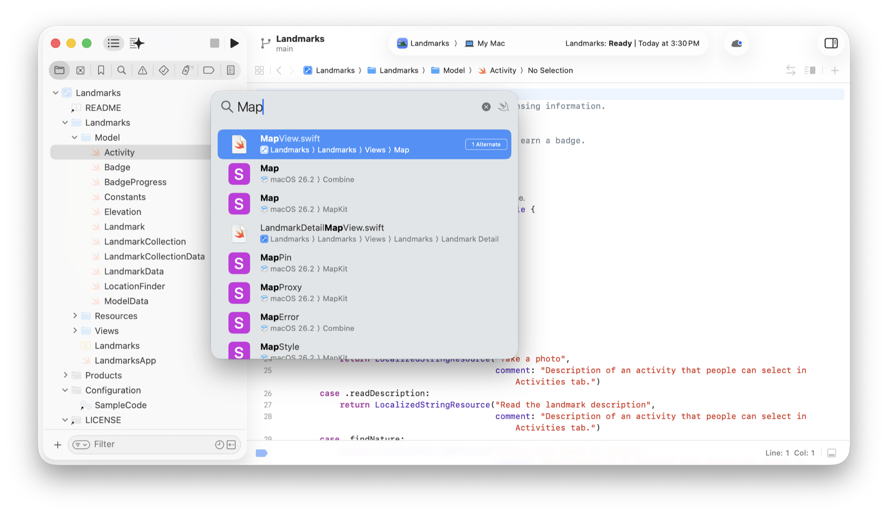
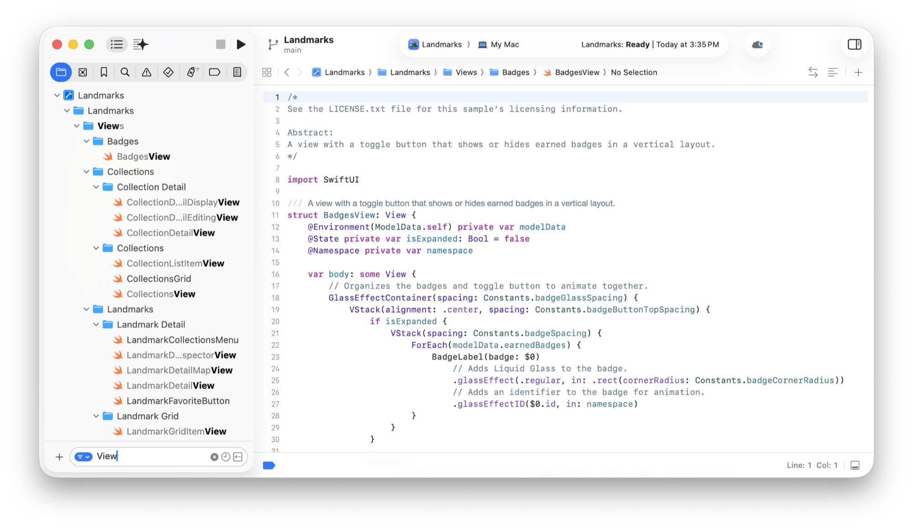
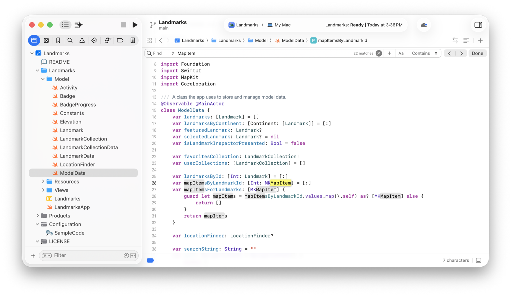
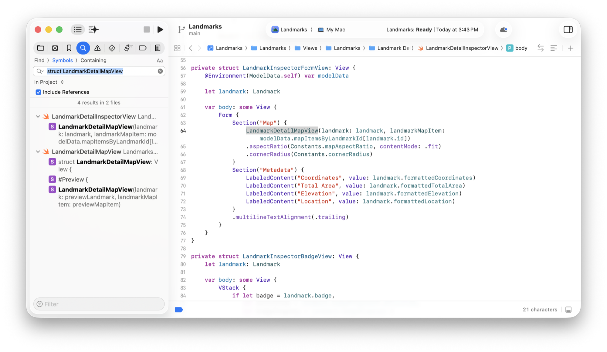
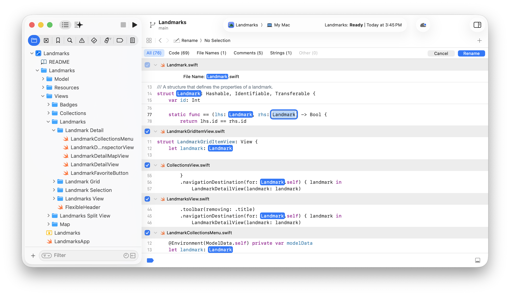
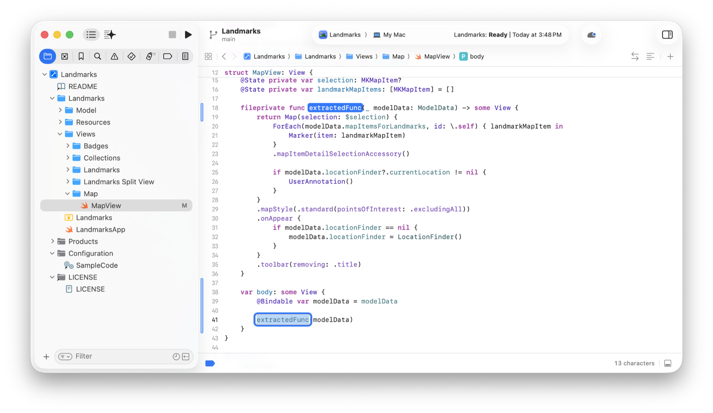

> 导航：[技术](../technologies.md) · [Xcode](../xcode.md) · [源码编辑器](source-editor.md)

# 查找和重构代码

文章

在代码中搜索文本、模式和符号，以便快速轻松地进行重构。

## 概述

编写和分析代码时，你经常需要查找某个符号，以了解它的用法并确定其他代码如何使用它。使用 Xcode 的搜索功能在代码中查找文本和符号，以分析潜在更改、确定当前功能或调试代码。

重命名文件或符号，为其提供更具描述性和意义的名称，从而明确其用途。发现重复代码或可复用代码时，请重构代码。将现有代码转换为更易复用的函数、方法或变量。

### 按名称或所含符号查找文件

按下 Shift-Command-O 调出 Open Quickly 对话框，可以快速打开文件。输入文件名或符号名的一部分，对话框会显示可能匹配的项目列表。

Xcode 的截图，其中显示带有搜索词和匹配项的 Open Quickly 对话框。匹配结果包括文件和结构体。

从搜索结果中选择一个项目将其打开，并前往匹配的文件或符号。如果文件已在标签页中打开，Xcode 会切换到该标签页；否则，Xcode 会在新标签页中打开文件。

当项目中有大量文件时，请在 Project 导览器底部的 Filter 栏中输入文件名的一部分。Xcode 会显示匹配的组名和文件名及其父级分组，以便你轻松查看它们在项目中的位置。

Xcode 的截图，其中 Project 导览器的过滤栏中含有搜索词，并且上方列表中显示并突出标记了匹配文件。

### 在源代码中查找文本或模式

要在文件中查找文本，请在 Xcode 源码编辑器中打开文件，然后从菜单栏选择 Find \> Find（或按下 Command-F）。Xcode 会在文件顶部显示 Find 栏及其搜索控制项（controls）。

Xcode 的截图，其中源代码编辑器上方的 Find 栏已输入搜索词。源码编辑器中突出显示了多个与搜索词匹配的项目。

输入搜索词。Xcode 会搜索文件、突出显示匹配项，并注明找到的匹配项数量。使用以下选项细化搜索：

- 点按左侧的 Find Options 菜单，以显示替换文本、运行最近搜索或清除最近搜索历史记录的选项。
- 点按 Insert Pattern 按钮（+），在搜索词中加入制表符、换行符或特殊字符。
- 切换 Case Sensitive 按钮，指明是否希望 Xcode 匹配搜索词的大小写。
- 点按 Match Style 按钮，自定义 Xcode 在源代码中查找搜索词的方式。
- 使用箭头按钮在匹配项之间移动。
- 点按 Done 按钮关闭 Find 栏。

### 在源代码中查找符号

要在代码中查找符号，请按住 Control 键点按变量名或函数名，然后选择 Find \> Find Selected Symbol in Workspace。

Xcode 会在 Find 导览器中显示该符号的声明，并在下方列出代码中引用该符号的所有位置。

也可以打开 Find 导览器，并从顶部的 Find 弹出式菜单中选择 Symbols。在下方的搜索栏中输入符号名的一部分，然后按下 Return。

使用以下选项细化 Symbols 搜索：

- 选择 Find 或 Replace。
- 选择要搜索的内容：文本、符号引用、符号定义、与正则表达式匹配的文本或调用层级结构。
- 选择匹配样式，自定义 Xcode 查找搜索词的方式。
- 点按放大镜图标以查看最近搜索。
- 自定义搜索范围：项目中，或项目内的任意组/文件夹中。如果使用工作区，可以搜索整个工作区，也可以只搜索其中一个项目。
- 选择 Ignoring Case 或 Matching Case。

如果搜索返回大量匹配项，请在 Filter 栏中输入另一个词来缩小结果范围。

### 在整个项目中重命名符号

要重命名项目中的函数、方法、类、结构体或枚举，请按住 Control 键点按符号的声明或任一符号用法，然后选择 Refactor \> Rename。Xcode 会突出显示该符号、在项目中搜索其名称，并显示该符号出现的所有位置。

Xcode 的截图，其中显示了名为 Landmark 的示例类的重命名视图。该视图突出显示了几个文件中多个位置的类名，并将焦点置于可供用户输入更新后类名的位置。

在突出显示的选区中输入新名称，Xcode 会预览所有更改。点按某个建议的重命名实例，可以切换 Xcode 是否对其重命名。点按 Rename 完成更改，或点按 Cancel 放弃更改。

要重命名局部变量或实例变量，请按住 Control 键点按该变量，然后选择 Edit All in Scope。Xcode 会在源码编辑器中突出显示作用域内该变量的各个实例。输入新名称，Xcode 会将所有实例更新为同一名称。要取消名称更改，请选择 Edit \> Undo。

### 将代码重构为函数

如果函数中存在重复代码或可以复用的代码，请将其重构为函数。选择要重构的代码行，然后按住 Control 键点按并选择 Refactor \> Extract to Method。Xcode 会创建一个新函数并突出显示其名称，以便你对其重命名。

Xcode 的截图，其中源码编辑器中显示了一个提取出的函数。提取函数的调用位置被突出显示，以便用户重命名该函数。

如果这些代码行引用了参数，Xcode 会将它们加入新函数的参数列表。要重命名参数，请按住 Command 键点按该参数并选择 Edit All in Scope，或按住 Control 键点按并选择 Refactor \> Rename。
