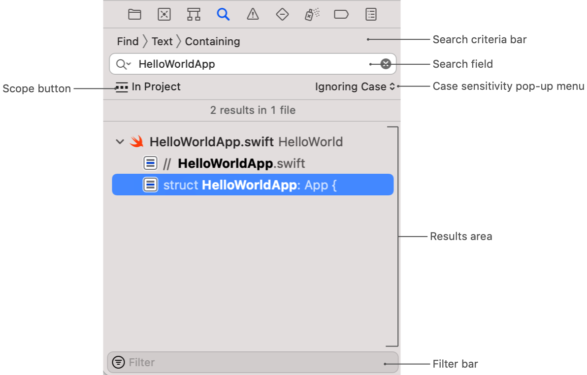
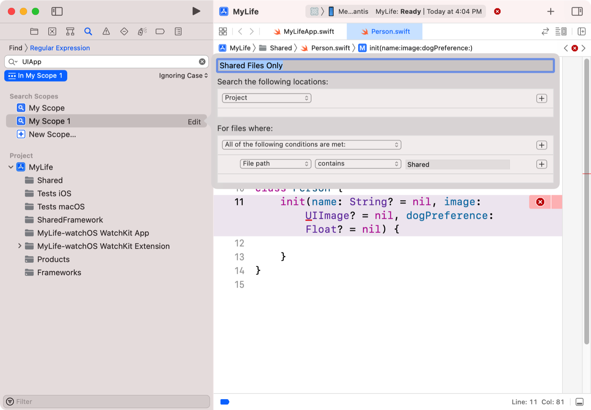
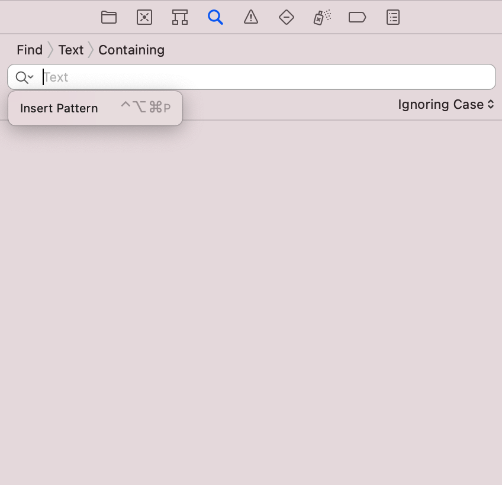
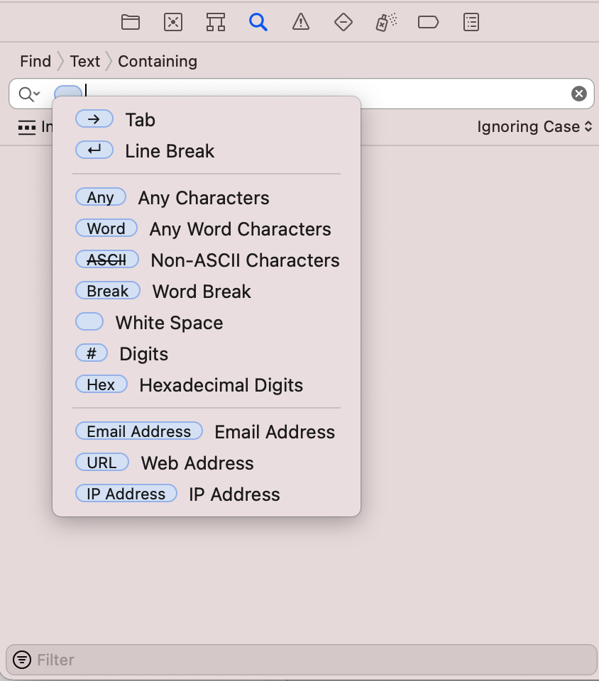
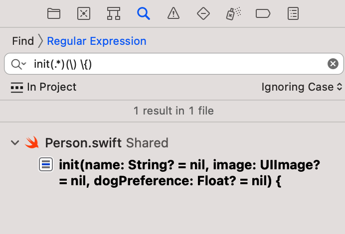

> 导航：[技术](../technologies.md) · [Xcode](../xcode.md) · [项目与工作区](projects-and-workspaces.md)

# 在项目中查找与替换内容

文章

搜索项目中部分或全部文本字符串或符号名称，并使用正则表达式执行高级搜索。

## 概述

Xcode 在“查找导航器”（Find navigator）中提供了复杂的搜索和替换功能，你可以从项目的导航器区域访问它。使用“查找导航器”在整个项目中搜索文本和符号。要执行高级搜索，请使用正则表达式，或使用导航器的控制（controls）来缩小搜索操作的范围。

要显示“查找导航器”，请单击项目导航器区域中的放大镜图标。

### 查找文本字符串

要在项目中搜索文本：

1. 在搜索条件栏中，选择“查找”>“文本”。
2. 选择搜索条件：“包含”、“匹配”、“起始为”或“结尾为”。
3. 在搜索字段中输入文本。
4. 从弹出菜单中选择一个区分大小写的选项。
5. 按 Return 键。

Xcode 会显示搜索结果。当你选择一个结果时，Xcode 会在编辑区域中显示该结果。要快速导航到上一个或下一个结果，请选择“查找”>“在项目中查找下一个”或“查找”>“在项目中查找上一个”。

> [!tip] 提示
> 要快速填充搜索字段，请在编辑器中选择一些文本，然后选择“查找”>“在项目中查找”。Xcode 会将选定的文本复制到搜索字段中。

### 查找符号引用和定义

Xcode 提供了两种搜索符号的方式：

- 使用“查找”>“引用”在代码中搜索指定的符号名称。
- 使用“查找”>“定义”搜索包含指定符号定义的源文件。

执行搜索时，搜索结果仅包含代码中引用该符号的位置。结果不包括代码注释或其他项目文件中对符号的引用。要优化结果，请更改搜索的匹配行为和区分大小写选项。

### 替换找到的文本实例

要搜索文本并将其替换为另一个字符串：

1. 在搜索条件栏中，选择“替换”>“文本”。
2. 选择搜索条件：“包含”、“匹配”、“起始为”或“结尾为”。
3. 在搜索字段中输入文本。
4. 从弹出菜单中选择一个区分大小写的选项。
5. 在替换字段中输入文本。
6. 按 Return 键。

Xcode 会显示搜索结果，但不会自动替换文本。要替换单个结果的文本，请选择它并单击“替换”按钮。要替换所有结果的文本，请单击“全部替换”。

### 过滤搜索结果列表

在任何搜索之后，你可以通过在过滤栏中输入辅助字符串来进一步缩小搜索结果范围。“查找导航器”会临时移除不包含你在过滤栏中输入字符串的结果。要恢复原始结果，请清除过滤栏中的文本。

### 限制查找或替换操作的范围

执行搜索时，默认情况下 Xcode 会搜索项目中的所有文件。要仅搜索一部分文件，请单击“范围”并从出现的选项中进行选择。

- 单击一个项目或组，将搜索限制在 Xcode 项目的指定部分。
- 创建自定义范围，将搜索限制在特定位置的文件，或具有特定名称、路径、扩展名、类型或源代码控制状态的文件。

### 优化搜索以匹配预定义的模式字符串

模式令牌（pattern token）帮助你匹配包含可变内容的字符串。例如，你可以使用模式令牌来表示字符串中的电子邮件地址。

要向搜索字符串添加模式，请单击搜索字段中的放大镜，然后从弹出菜单中选择“插入模式”。

从弹出菜单中选择你想要的模式，将其添加到搜索字段中。Xcode 为空格、URL、十六进制数字和其他特定字符集定义了模式令牌。包含一个或多个令牌以及字面文本，以执行复杂的模式匹配。

### 使用正则表达式查找或替换

正则表达式让你可以定义自己的自定义模式字符串，用于匹配。Foundation 框架中的 [NSRegularExpression](../foundation/nsregularexpression.md) 类定义了 Xcode 正则表达式所使用的语法。

要使用正则表达式查找或替换文本：

1. 在搜索条件栏中，选择“查找”>“正则表达式”或“替换”>“正则表达式”。
2. 选择搜索条件：“包含”、“匹配”、“起始为”或“结尾为”。
3. 在“查找”或“替换”搜索字段中输入正则表达式。
4. 从弹出菜单中选择一个区分大小写的选项。
5. 按 Return 键。

## 另请参阅

### 导航

- [配置 Xcode 项目窗口](configuring-the-xcode-project-window.md) — 自定义 Xcode 项目窗口和编辑区域，以便在你偏好的配置中查看和编辑项目文件。
