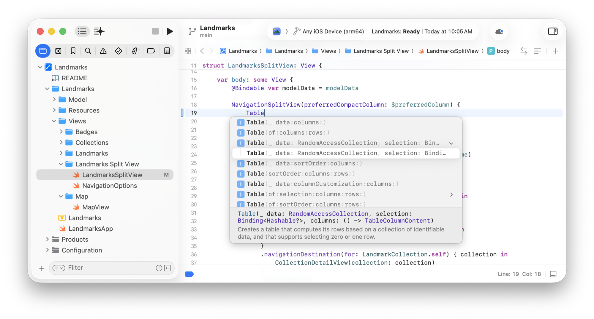
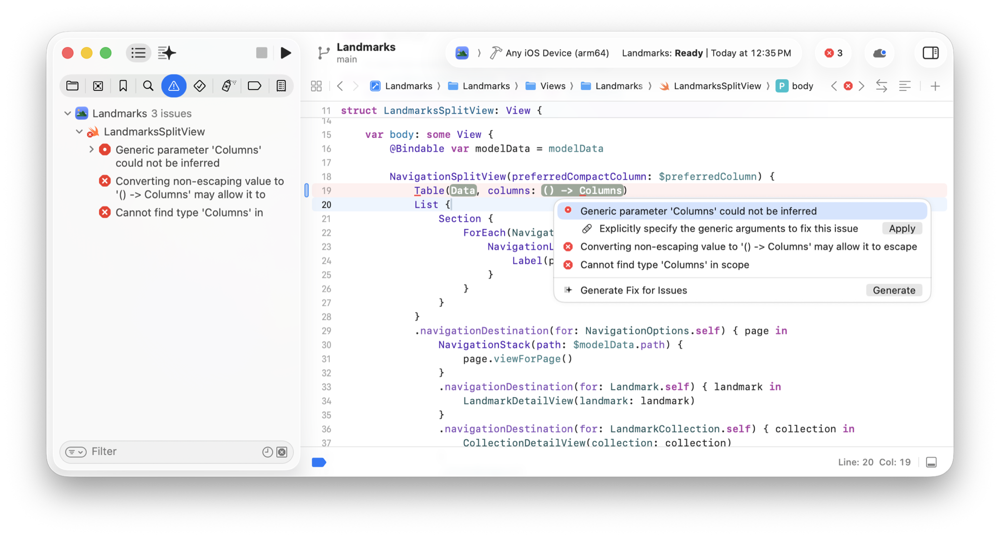

> 导航：[Technologies](../technologies.md) · [Xcode](../xcode.md) · [Source editor](source-editor.md)

# 输入时自动修复代码问题

文章

利用代码补全减少与输入相关的错误，并让 Xcode 为你修复常见的错误。

## 概述

Xcode 包含许多有助于减少常见编码错误的功能，例如拼错符号名称或忘记添加结束分隔符。借助这些功能，你可以把更多时间用在为 App 增添价值上，而不是花在修复本可避免的问题上。在获得你明确同意的前提下，Xcode 可以帮你定位正确的符号、修复常见错误，并通过直接修改你的代码来自动匹配大括号、圆括号和方括号。

### 使用代码补全避免语法错误

当你在源代码编辑器中开始输入符号名称时，Xcode 会显示补全该名称的建议列表。你可以按 Escape 键或点按源代码编辑器中的其他位置来关闭该列表。如果多个可能的补全项共享一段相同的字符串，Xcode 会高亮显示该字符串；如果没有相同的字符串，Xcode 则会高亮显示字符串中匹配的部分。

按上箭头键和下箭头键可以在可能的补全项列表中导览。你也可以点按列表中的某一项来选中它。Xcode 会在列表下方显示所选项目的说明。

一张 Xcode 截图，左侧是项目导览器，右侧是源代码编辑器，显示了已选中某个符号的补全列表及其下方的说明。

对于有多种签名的初始化方法，点按右侧的显示三角形即可查看下方的各个变体。

要将建议的补全项插入源代码，选中该项后双击，或按 Return 键。如果没有看到想要的补全项，或者列表太长，继续输入即可缩小建议范围。

如果你插入了一个带参数的方法或函数，Xcode 会为每个需要填写的参数提供一个占位符。要在占位符之间导览，按 Tab 键和 Shift-Tab 键（或选择「导览」\> 「跳到下一个占位符」和「导览」\> 「跳到上一个占位符」）。

要阻止 Xcode 在你输入时提示补全：

1. 选择「Xcode」\> 「设置」（或按 Command-逗号）。
2. 在侧边栏中选择「编辑」，然后在右侧选择「补全」。
3. 从「输入时显示代码补全」弹出式菜单中选择「从不」。

或者，你可以按需调用代码补全：选择「按需」，然后在输入时按 Control-空格键或 Escape 键。你可以在「Xcode」\> 「设置」\> 「快捷键」中更改代码补全的快捷键。

### 自动匹配大括号、圆括号和方括号

Xcode 可以帮你识别并配平代码中的起始和结束分隔符——大括号、圆括号和方括号。你可以通过以下一种或多种方式利用这项功能：

- 输入一个起始分隔符，然后按 Return 键或任意字符，即可自动插入对应的结束分隔符。
- 输入一个结束分隔符，或将插入点移到某个已有结束分隔符之后，源代码编辑器会短暂高亮显示对应的起始分隔符。
- 反过来，将插入点移到某个起始分隔符之后，也会暂时高亮显示对应的结束分隔符。
- 将插入点移到两个分隔符之间，然后选择「编辑器」\> 「选择」\> 「配平分隔符」，即可选中这两个分隔符及其间的代码。或者，双击其中一个分隔符也可以达到同样效果。
- 在源代码编辑器中选中代码，然后输入一个起始分隔符，即可自动用一对匹配的分隔符将所选内容括起来。

要阻止 Xcode 自动插入分隔符：

1. 选择「Xcode」\> 「设置」，然后在侧边栏中选择「编辑」。
2. 关闭「自动插入结束大括号」和「用匹配的分隔符括住所选内容」这两项设置。

### 对代码应用修复

在你于源代码编辑器中输入代码时，Xcode 会检查语法，并在你暂停输入时提供修复建议。

Xcode 会用红色或黄色下划线标出问题，并显示问题摘要和图标。点按该图标可查看有关该问题的更多信息，并且在许多情况下会提供一个你可以应用的修复方案。

一张 Xcode 截图，左侧是问题导览器，右侧是源代码编辑器，其中显示了关于三个问题的更多信息。

要应用某个问题的修复：

1. 点按问题摘要右侧的图标。
2. 在弹出窗口中，点按你想要应用的修复方案右侧的「应用」按钮。

如果弹出窗口中包含多个问题，可使用上箭头键和下箭头键（或「导览」\> 「跳到下一个问题」和「导览」\> 「跳到上一个问题」）在它们之间切换。要关闭弹出窗口，按 Escape 键或点按其他任意位置。

你可以在「Xcode」\> 「设置」\> 「通用」下的「问题」部分，配置源代码编辑器中显示的问题的外观和行为。例如，要关闭修复建议，关闭「显示实时问题」设置即可。

如果你已经设置好编码智能，可以点按弹出窗口底部出现的「生成」按钮来修复这些问题。请参阅[在 Xcode 中借助智能编写代码](writing-code-with-intelligence-in-xcode.md)。
