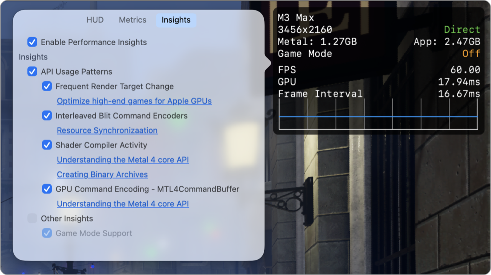
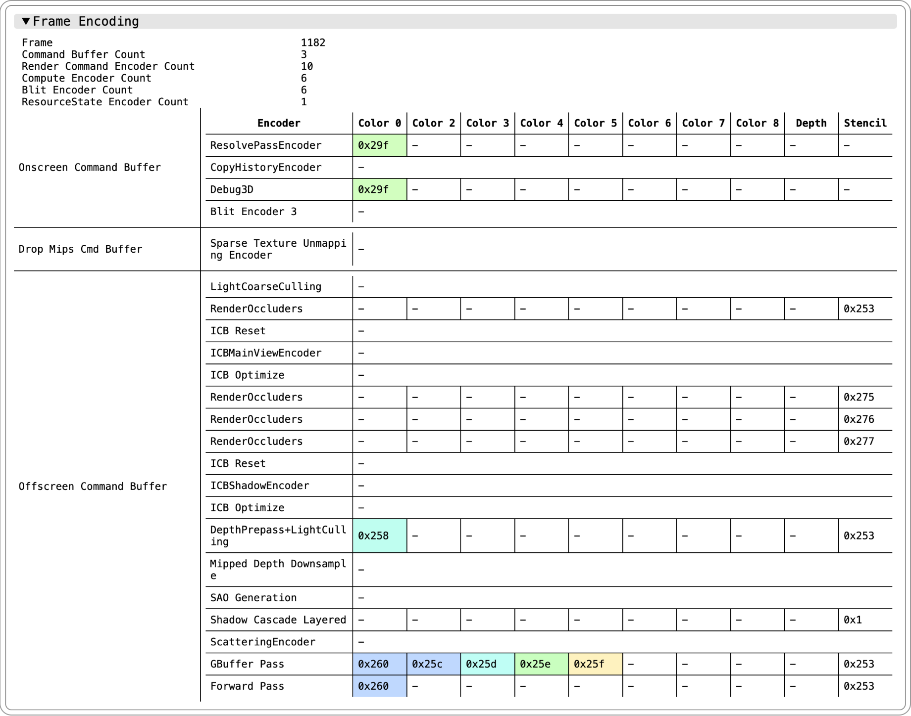

> 导航：[技术](../technologies.md) · [Xcode](../xcode.md) · [调试](debugging.md) · [Metal 开发者工作流程](metal-developer-workflows.md)

# 使用 Metal 性能 HUD 获取性能洞察

<sub>文章</sub>

在 App 运行时使用 Metal 性能 HUD（Metal Performance HUD）捕捉潜在性能问题。

## 概述

为帮助你优化性能，Metal 性能 HUD 会分析你的 App 的 Metal API 调用模式，并自动标记潜在问题。该分析适用于原生 App 以及通过评估环境运行的 Windows 游戏。每条洞察（insight）都提供了链接，指向详细说明问题并概述解决方法的文档。

你还可以生成特定时段的性能报告，以更深入地了解你的 App 在该时间段内的性能。更多信息请参阅[使用 Metal 性能 HUD 生成性能报告](generating-performance-reports-with-metal-performance-hud.md)。

通过将 `MTL_HUD_INSIGHTS_ENABLED` 环境变量设置为 `1`，或在 macOS 上通过配置面板开启性能洞察。详见[自定义 Metal 性能 HUD](customizing-metal-performance-hud.md)。

```
export MTL_HUD_INSIGHTS_ENABLED=1
```



### 分析和解读性能洞察

当性能洞察激活时，Metal 性能 HUD 会收集每一帧的 Metal API 统计数据。如果在指定时长（默认 5 秒）内，至少有一半的帧出现了表明 Apple GPU 上存在潜在性能问题的模式，则会在主叠加层旁边显示一个洞察叠加层。


HUD 可识别原生 App 的四种主要问题类型，以及来自 Game Porting Toolkit 的特定 D3D12 API 使用问题，下文将予以讨论。

每帧编码器数量过多可能是 Apple GPU 的性能瓶颈。Metal 性能 HUD 通过检查连续渲染命令编码器来寻找具有相似颜色附件（color attachments）的编码器，从而帮助优化性能。这些编码器是通过采用 Metal 4 中的颜色附件映射功能进行合并的主要候选对象。颜色附件映射允许你为绘制操作定义逻辑与物理颜色附件之间的关系，从而使单个编码器能够利用多样化的颜色附件集。了解更多信息，请参阅[理解 Metal 4 核心 API](../metal/understanding-the-metal-4-core-api.md)。

当 HUD 检测到这一洞察时，它会在性能报告中包含一份完整的编码表，以帮助你定位这些特定的编码器。了解更多信息，请参阅[使用 Metal 性能 HUD 生成性能报告](generating-performance-reports-with-metal-performance-hud.md)。



由于使用 blit 命令编码器进行资源拷贝而导致频繁的编码器切换，是另一个潜在的优化领域。这种模式会将当前的渲染或计算编码器拆分成多个编码器。你可以通过批量更新资源，或采用 Metal 4 命令编码（其中 blit 命令是计算命令编码器的一部分）来减轻此开销。

运行时串行、阻塞式的着色器编译通常会导致卡顿。Metal 4 通过新的着色器编译方法缓解了这一问题，这些方法允许更精细的控制和更高的并行度。

当 App 将大部分帧间隔时间用于编码 GPU 工作时，可能会出现 CPU 瓶颈。使用 Metal 4，你可以更明确地控制命令编码，并提高编码时的 CPU 性能。更多信息请参阅[理解 Metal 4 核心 API](../metal/understanding-the-metal-4-core-api.md)。

> [!important] 重要
> 下方的洞察仅出现在 Game Porting Toolkit 评估环境中。

在 D3D12 中，资源屏障（Resource Barrier）通常过于粗粒度，这可能导致在通过 Game Porting Toolkit 评估环境运行应用时出现过度同步。在移植到 Metal 时，你可以使用更细粒度的同步原语，例如 [MTLFence](../metal/mtlfence.md) 和 [MTLEvent](../metal/mtlevent.md)，以提升性能。

Apple GPU 不直接支持曲面细分和几何着色阶段，需要进行模拟。你可以采用网格着色器（mesh shaders）作为替代方案来提高性能。

## 另请参阅

### 运行时诊断

- [在运行时检查实时资源](inspecting-live-resources-at-runtime.md) — 在调试 Metal App 时，通过查看纹理和缓冲区的内容来验证你的资源。
- [验证 App 的 Metal API 使用情况](validating-your-apps-metal-api-usage.md) — 使用 API 验证捕获 Metal App 中的运行时问题。
- [验证 App 的 Metal 着色器使用情况](validating-your-apps-metal-shader-usage.md) — 使用着色器验证捕获常见的着色器运行时问题。
- [监控 Metal App 的图形性能](monitoring-your-metal-apps-graphics-performance.md) — 在 App 运行时使用 Metal 性能 HUD 捕获性能问题。
- [自定义 Metal 性能 HUD](customizing-metal-performance-hud.md) — 修改 Metal 性能 HUD 的外观以监控你的图形性能。
- [了解 Metal 性能 HUD 指标](understanding-metal-performance-hud-metrics.md) — 了解 Metal 性能 HUD 报告的每个指标的含义。
- [使用 Metal 性能 HUD 生成性能报告](generating-performance-reports-with-metal-performance-hud.md) — 使用 Metal 性能 HUD 记录 App 的性能。
