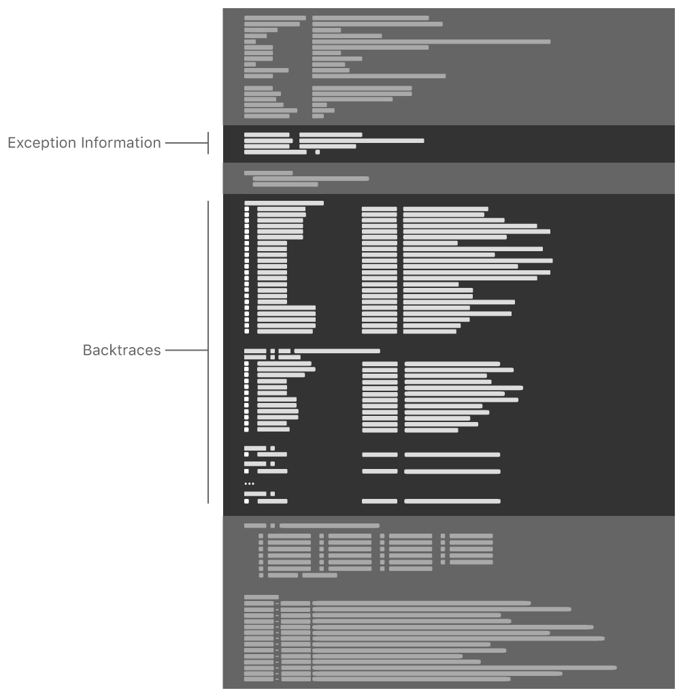

> 导航：[Technologies](../technologies.md) · [Xcode](../xcode.md) · [Debugging](debugging.md) · [Diagnosing issues using crash reports and device logs](diagnosing-issues-using-crash-reports-and-device-logs.md)

# 识别常见崩溃的原因

在崩溃报告中查找能够识别常见问题的规律模式，并根据该模式排查问题。

## 概述

通过在崩溃报告中查找特定的规律模式，并根据该模式所显示的内容采取相应的诊断操作，你可以识别出许多 App 崩溃的原因。要识别规律模式，你需要查阅每份崩溃报告中都有的两个部分：

- 「Exception Information」部分中的异常代码，标明了 App 崩溃的具体方式。
- 回溯记录（backtrace）显示了崩溃发生时线程正在执行的代码。



某些常见类型的崩溃在「Backtraces」部分中带有「Diagnostic Messages」部分或 `Last Exception Backtrace`，进一步描述了该问题。并非所有崩溃报告都包含这些部分。[检查崩溃报告中的字段](examining-the-fields-in-a-crash-report.md)详细描述了每个部分和字段。

将本文中提供的示例与你正在排查的崩溃报告进行比对。一旦找到匹配项，请转到有关该类型崩溃的更详细文章。

判断你的崩溃报告是否包含某个常见问题的规律模式，是诊断问题的第一步。在某些情况下，建议的诊断操作无法识别出问题的原因，这时需要对整份崩溃报告进行更全面的分析。[分析崩溃报告](analyzing-a-crash-report.md)描述了如何对崩溃报告进行详细分析。

> [!important] 重要
> 在查找特定规律模式之前，先确认你拥有一份由操作系统生成的、已完全符号化的崩溃报告。请参阅[确定崩溃报告是否已完成符号化](adding-identifiable-symbol-names-to-a-crash-report.md#Determine-if-a-crash-report-is-symbolicated)。

### 判断崩溃是否为 Swift 运行时错误

Swift 使用内存安全技术尽早捕获编程错误。如果 Swift 运行时遇到编程错误，运行时会捕获该错误并有意让 App 崩溃。这类崩溃在崩溃报告中具有可识别的规律模式。在 ARM 处理器上，崩溃报告中的异常信息如下所示：

```other
Exception Type:  EXC_BREAKPOINT (SIGTRAP)
...
Termination Signal: Trace/BPT trap: 5
Termination Reason: Namespace SIGNAL, Code 0x5
```

在 Intel 处理器上（包括面向 macOS、Mac Catalyst 的 App，以及 iOS、iPadOS、tvOS 和 watchOS 的模拟器），崩溃报告中的异常信息如下所示：

```other
Exception Type:        EXC_BAD_INSTRUCTION (SIGILL)
...
Exception Note:        EXC_CORPSE_NOTIFY

Termination Signal:    Illegal instruction: 4
Termination Reason:    Namespace SIGNAL, Code 0x4
```

此外，崩溃报告会显示遇到该错误的线程，回溯记录中的第 0 帧会标明你 App 中包含该错误的具体代码行，例如：

```other
Thread 0 Crashed:
0   MyCoolApp                         0x0000000100a71a88 @objc ViewController.viewDidLoad() (in MyCoolApp) (ViewController.swift:18)
```

[处理 Swift 运行时错误导致的崩溃](addressing-crashes-from-swift-runtime-errors.md)描述了如何解决这类崩溃。

### 判断崩溃是否为 Objective-C 并发属性访问错误

Objective-C 运行时能够检测出多个线程并发向同一个强属性写入值的情况；或者一个线程从某个强属性读取值的同时，另一个线程正向该属性写入值的情况。当 Objective-C 运行时检测到这种情况时，会捕获该错误并有意让 App 崩溃。在大多数情况下，崩溃报告中的异常信息如下所示：

```console
Exception Type:    EXC_BAD_ACCESS (SIGSEGV)
Exception Subtype: KERN_INVALID_ADDRESS at 0x400000000000bad0 -> 0x000000000000bad0 (possible pointer authentication failure)
```

如果崩溃发生在 watchOS 上的 32 位进程中，崩溃报告中的异常信息如下所示：

```console
Exception Type:    EXC_BAD_ACCESS (SIGSEGV)
Exception Subtype: KERN_INVALID_ADDRESS at 0x0000bad0
```

要解决这类崩溃，请重新组织你的代码，使不同线程不会并发读写该属性的值。或者，为该属性声明添加 `atomic` 关键字，并确保所有线程都通过属性存取方法访问该值：

```objc
@interface MyController : NSObject { }

@property (atomic, strong) MyAppService *service;

- (void)connectToService;
- (MyServiceResult *)updateServiceStatus;

@end

@implementation MyController

- (void)connectToService {
    dispatch_async(aQueue, ^{
        self.service = [[MyAppService alloc] init];
        [self.service connect];
    });
}

- (MyServiceResult *)updateServiceStatus {
    return self.service.status;
}

@end
```

有关使用 Thread Sanitizer 检测对内存位置的并发访问的信息，请参阅[尽早诊断内存、线程和崩溃问题](diagnosing-memory-thread-and-crash-issues-early.md)。

### 查找语言异常的迹象

当 Apple 的系统框架在运行时遇到某些类型的编程错误时（例如使用越界索引访问数组），会抛出语言异常。要判断崩溃是否由语言异常引起，首先确认崩溃报告包含以下模式：

```other
Exception Type:  EXC_CRASH (SIGABRT)
Exception Codes: 0x0000000000000000, 0x0000000000000000
Exception Note:  EXC_CORPSE_NOTIFY
```

由语言异常引起的崩溃，其崩溃报告中还会有一个 `Last Exception Backtrace`：

```other
Last Exception Backtrace:
0   CoreFoundation                    0x19aae2a48 __exceptionPreprocess + 220
1   libobjc.A.dylib                   0x19a809fa4 objc_exception_throw + 55
```

如果你的崩溃报告包含这些模式，请参阅[处理语言异常崩溃](addressing-language-exception-crashes.md)了解如何处理该崩溃。

### 检查看门狗信息

操作系统会使用看门狗（watchdog）来监控 App 的响应能力。如果某个 App 无响应，看门狗会终止它，并生成一份「Termination Reason」中带有 `0x8badf00d` 代码的崩溃报告：

```other
Exception Type:  EXC_CRASH (SIGKILL)
Exception Codes: 0x0000000000000000, 0x0000000000000000
Exception Note:  EXC_CORPSE_NOTIFY
Termination Reason: Namespace SPRINGBOARD, Code 0x8badf00d
```

在无响应 App 的崩溃报告中，`Termination Description` 包含来自看门狗的、关于该 App 时间使用情况的信息。例如：

```other
Termination Description: SPRINGBOARD, 
    scene-create watchdog transgression: application<com.example.MyCoolApp>:667
    exhausted real (wall clock) time allowance of 19.97 seconds 
    | ProcessVisibility: Foreground 
    | ProcessState: Running 
    | WatchdogEvent: scene-create 
    | WatchdogVisibility: Foreground 
    | WatchdogCPUStatistics: ( 
    |  "Elapsed total CPU time (seconds): 15.290 (user 15.290, system 0.000), 28% CPU", 
    |  "Elapsed application CPU time (seconds): 0.367, 1% CPU" 
    | )
```

> [!note] 注意
> 为便于阅读，此示例中包含了额外的换行。在该示例对应的原始崩溃报告文件中，看门狗信息所占的行数更少。

请参阅[处理看门狗终止](addressing-watchdog-terminations.md)来诊断你的 App 为何无响应。

### 判断崩溃报告是否包含僵尸对象的迹象

_僵尸对象（zombie object）_是指已从内存中释放、不复存在，却仍被 Objective-C 运行时发送消息的对象。向已释放的对象发送消息，可能会导致 Objective-C 运行时的 [objc_msgSend](../objectivec/objc_msgsend.md)、`objc_retain` 或 `objc_release` 函数发生崩溃，例如下面这个涉及 [objc_msgSend](../objectivec/objc_msgsend.md) 的示例：

```other
Thread 0 Crashed:
0   libobjc.A.dylib                   0x00000001a186d190 objc_msgSend + 16
1   Foundation                        0x00000001a1f31238 __NSThreadPerformPerform + 232
2   CoreFoundation                    0x00000001a1ac67e0 __CFRUNLOOP_IS_CALLING_OUT_TO_A_SOURCE0_PERFORM_FUNCTION__ + 24
```

另一种同样表明存在僵尸对象的模式，是存在一个 `Last Exception Backtrace`，其中某个栈帧包含 [doesNotRecognizeSelector(_:)](<../objectivec/nsobject-swift.class/doesnotrecognizeselector(__).md>) 方法：

```other
Last Exception Backtrace:
0   CoreFoundation                    0x1bf596a48 __exceptionPreprocess + 220
1   libobjc.A.dylib                   0x1bf2bdfa4 objc_exception_throw + 55
2   CoreFoundation                    0x1bf49a5a8 -[NSObject+ 193960 (NSObject) doesNotRecognizeSelector:] + 139
```

如果你的崩溃报告显示你的 App 存在僵尸对象，请参阅[排查僵尸对象引发的崩溃](investigating-crashes-for-zombie-objects.md)。

### 判断是否存在内存访问问题

当你的 App 以意料之外的方式使用内存时，你将收到一份有关内存访问问题的崩溃报告。这类崩溃报告的异常类型为 `EXC_BAD_ACCESS`，并且在 `VM Region Info` 字段中带有附加信息。例如：

```other
Exception Type:  EXC_BAD_ACCESS (SIGSEGV)
Exception Subtype: KERN_INVALID_ADDRESS at 0x0000000000000000
VM Region Info: 0 is not in any region.  Bytes before following region: 4307009536

      REGION TYPE                      START - END             [ VSIZE] PRT/MAX SHRMOD  REGION DETAIL
      UNUSED SPACE AT START
--->
      __TEXT                 0000000100b7c000-0000000100b84000 [   32K] r-x/r-x SM=COW  ...pp/MyGreatApp
```

[排查内存访问崩溃](investigating-memory-access-crashes.md)包含了有关不同类型内存访问问题及排查方法的信息。

### 判断是否缺少某个框架

如果某个 App 因缺少所需框架而崩溃，崩溃报告会包含 `EXC_CRASH (SIGABRT)` 异常代码。你还会在崩溃报告中找到一个 `Termination Description`，标明动态链接器 `dyld` 找不到的具体框架。以下是一个示例，为便于阅读加入了额外换行：

```other
Exception Type: EXC_CRASH (SIGABRT)
Exception Codes: 0x0000000000000000, 0x0000000000000000
Exception Note: EXC_CORPSE_NOTIFY
Termination Description: DYLD, dependent dylib '@rpath/MyFramework.framework/MyFramework'
    not found for '<path>/MyCoolApp.app/MyCoolApp', tried but didn't find: 
    '/usr/lib/swift/MyFramework.framework/MyFramework' 
    '<path>/MyCoolApp.app/Frameworks/MyFramework.framework/MyFramework' 
    '@rpath/MyFramework.framework/MyFramework' 
    '/System/Library/Frameworks/MyFramework.framework/MyFramework'
```

> [!important] 重要
> 此消息的具体内容取决于具体的操作系统及其版本。但在所有情况下，该消息都会明确表明未能找到某个预期的框架。

[处理缺少框架导致的崩溃](addressing-missing-framework-crashes.md)讨论了如何解决此问题。

## 主题

### 运行时错误

- [处理 Swift 运行时错误导致的崩溃](addressing-crashes-from-swift-runtime-errors.md) — 识别 Swift 运行时错误的迹象，并处理由运行时错误导致的崩溃。
- [处理语言异常崩溃](addressing-language-exception-crashes.md) — 识别语言异常的迹象，并处理由未捕获的语言异常导致的崩溃。
- [读懂异常消息](reading-an-exception-message.md) — 了解并处理 App 崩溃的常见原因。

### 系统终止

- [处理看门狗终止](addressing-watchdog-terminations.md) — 识别被看门狗终止的无响应 App 的特征，并处理该问题。

### 内存访问错误

- [排查僵尸对象引发的崩溃](investigating-crashes-for-zombie-objects.md) — 识别僵尸对象的特征并排查崩溃原因。
- [排查内存访问崩溃](investigating-memory-access-crashes.md) — 识别由内存访问问题引发的崩溃，并排查崩溃原因。

### App 配置错误

- [处理缺少框架导致的崩溃](addressing-missing-framework-crashes.md) — 从崩溃报告中识别缺失的框架，并调整你 App 的构建以正确包含该框架。

## 另请参阅

### 崩溃报告

- [为崩溃报告添加可识别的符号名称](adding-identifiable-symbol-names-to-a-crash-report.md) — 用与你 App 代码对应的函数名和行号，替换崩溃报告中的十六进制地址。
- [分析崩溃报告](analyzing-a-crash-report.md) — 识别崩溃报告中有助于诊断问题的线索。
- [检查崩溃报告中的字段](examining-the-fields-in-a-crash-report.md) — 了解崩溃报告的结构，以及每个字段所包含的信息。
- [解读崩溃报告的 JSON 格式](interpreting-the-json-format-of-a-crash-report.md) — 了解系统在崩溃报告 JSON 中包含的对象的结构和属性。
- [了解崩溃报告中的异常类型](understanding-the-exception-types-in-a-crash-report.md) — 了解异常类型能告诉你哪些关于 App 崩溃原因的信息。
