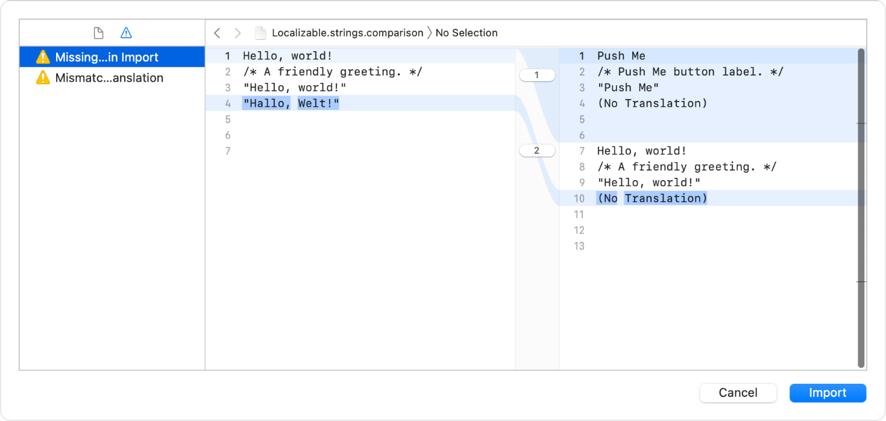

> 导航：[Technologies](../technologies.md) · [Xcode](../xcode.md) · [Localization](localization.md)

# 导入本地化内容

文章

将你为某种语言和地区所翻译或改编的文件导入到你的项目中。

## 概述

在你完成对某个目录内容的本地化之后，将本地化内容导入回你的项目。当你导入本地化内容时，Xcode 会用该目录中 XLIFF 文件里的本地化版本来更新你项目中的字符串文件。

### 使用 Xcode 导入本地化内容

在项目导览器中选择项目，然后选择「Product」\> 「Import Localizations」。在出现的导入对话框中，选择 Xcode 本地化目录文件夹，然后点按「导入」。Xcode 会读入这些文件，如果存在未翻译的文件，会提醒你。

在出现的表单中，查看警告和错误。在左侧栏中，点按工具栏中的「问题视图」按钮，然后选择下方出现的某条消息。在右侧的对比编辑器中，左侧显示导入的目录版本文件，右侧显示当前的项目文件。

要查看所有更改，点按工具栏中的「文件视图」按钮，然后在下方的导览器中选择一个文件。当你准备好导入这些文件后，点按「导入」。Xcode 会用该目录中的本地化版本来更新字符串文件和 `.stringsdict` 文件。Xcode 也会更新资源目录中的所有可本地化资源和素材。

### 使用命令导入本地化内容

你也可以使用 `xcodebuild` 命令搭配 `-importLocalizations` 参数来导入该目录：

`xcodebuild -importLocalizations -project <projectname> -localizationPath <dirpath>`

请务必针对项目中涉及的语言和地区测试你的 App。

## 另请参阅

### 翻译与改编

- [为你的 App 创建供本地化人员使用的截图](creating-screenshots-of-your-app-for-localizers.md) — 与本地化人员分享你 App 的截图，为翻译提供上下文。
- [导出本地化内容](exporting-localizations.md) — 将项目中的可本地化文件提供给本地化人员。
- [编辑 XLIFF 和字符串目录文件](editing-xliff-and-string-catalog-files.md) — 翻译或改编你从项目中导出的、针对某种语言和地区的可本地化文件。
- [在故事板和 XIB 文件中锁定视图](locking-views-in-storyboard-and-xib-files.md) — 在本地化面向用户的字符串时，防止对你的 Interface Builder 文件进行更改。
