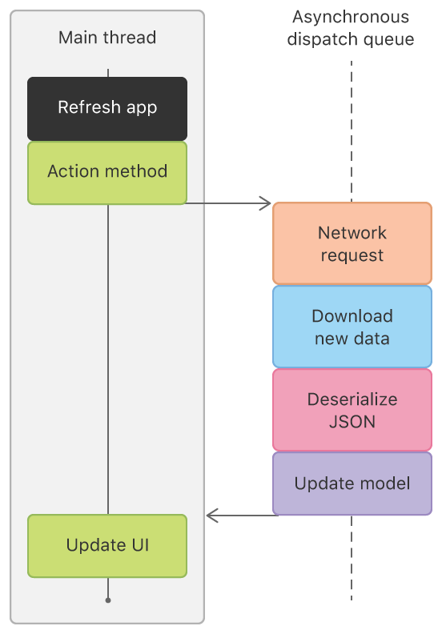
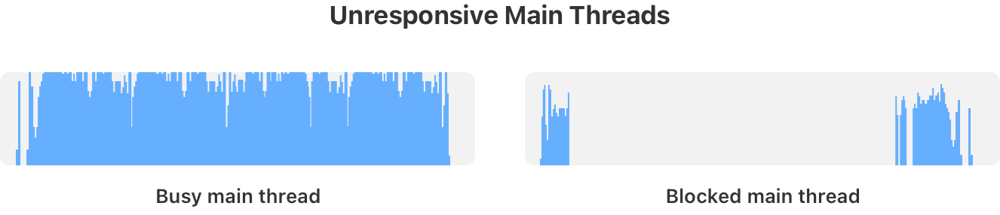
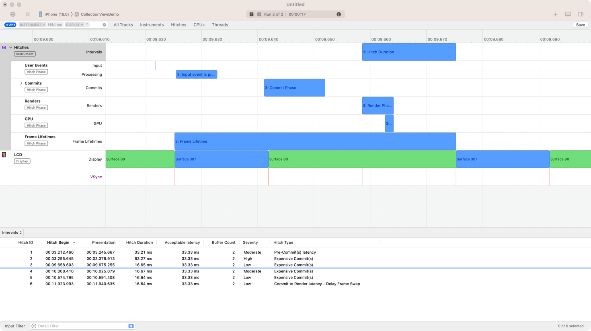

> 导航：[Technologies](../technologies.md) · [Xcode](../xcode.md) · [Performance and metrics](performance-and-metrics.md)

# 提升 App 响应能力

<sub>文章</sub>

通过消除 App 中的挂起和卡顿，营造响应灵敏的用户体验。

## 概述

一个能对用户交互即时做出响应的 App，会让用户感觉它在配合自己的工作流程。当 App 实时响应手势和点按时，会让用户产生一种正在直接操纵屏幕上对象的体验。而用户交互出现明显延迟（_挂起（hang）_）、或屏幕上的画面出现跳跃（_卡顿（hitch）_）的 App，会打破这种错觉，让用户怀疑该 App 是否正常运作。为避免出现挂起和卡顿，在开发和测试 App 时请牢记以下大致的阈值。

- **< 100 毫秒** — 针对离散型用户交互所做的主线程同步工作。
- **< 1 个显示刷新间隔（8 或 17 毫秒）** — 主线程工作以及处理连续型用户交互的工作。

在主线程上执行的工作，既会影响用户输入事件与对应屏幕更新之间的延迟，也会影响屏幕更新的最大频率。

如果离散型用户交互的延迟超过 100 毫秒，就会开始变得明显，进而造成挂起。事件处理和渲染管线的其他阶段也会拖累整体延迟。可以假定你 App 的主线程能用于完成工作的时间不到这个数值的一半。更短的延迟通常不会被察觉。

要实现流畅、不间断的动态效果，屏幕每次更新时都需要有新的一帧准备就绪。在 Apple 设备上，这个更新频率最高可达每秒 120 次，即每 8.3 毫秒一次。Apple 设备另一个常见的显示刷新率是 60Hz，即每 16.7 毫秒更新一次。根据系统状况和你 App 执行的其他工作，你可能无法用满整个显示刷新间隔来准备下一次屏幕更新。如果你的 App 为更新屏幕而需要在主线程上执行的工作耗时不到 5 毫秒，该更新通常能够按时就绪。如果耗时更长，你就需要仔细审视你所针对的具体设备，以及你的 App 需要支持的显示刷新率。请参阅下文关于卡顿的部分，了解用于判断你是否达到相应响应能力阈值的工具和准则。

同样地，避免把不必须在主线程上执行的工作调度到主线程上，即便是异步调度也不行，例如通过 `dispatch_async` 或 `await` 在主要 Actor 上执行某个函数调用的结果。由于你无法控制主线程具体在何时处理你的工作，也无法控制用户当时正在做什么，这类工作有可能恰好在一次连续型用户交互进行到一半时出现，从而造成卡顿。

> [!note] 注意
> 上述阈值只是非常粗略的准则，用来帮助你理解应当追求的执行时间。各种交互场景还有更多细微差别，有时你会有更多余地。要进一步了解这些情况、卡顿与挂起之间的区别、渲染循环的工作方式，以及 Apple 开发者工具如何检测每种类型的无响应，请参阅[了解用户界面响应能力](understanding-user-interface-responsiveness.md)。

本文描述了若干最佳实践，帮助你避免在 App 中引入挂起和卡顿，同时也介绍了多种工具，帮助你检测和分析这类响应能力问题。

### 让主线程只处理界面相关工作，避免挂起

确保你的 App 只在主线程上与用户界面（UIKit、AppKit 或 SwiftUI）交互。将所有其他操作导向后台线程、操作队列或 Grand Central Dispatch 队列。要进一步了解挂起，以及为何必须让主线程只处理界面相关工作，请参阅[了解你 App 中的挂起](understanding-hangs-in-your-app.md)。

在使用 [Swift 并发](https://docs.swift.org/swift-book/LanguageGuide/Concurrency.html)时，确保不会无意中在 [MainActor](../swift/mainactor.md) 上执行工作。要把工作移出主要 Actor，正确的做法取决于你能否将繁重的工作重构为一个不受 Actor 隔离的异步函数。如果你能以这种方式包装这项耗时较长的工作，使其成为 `async` 且 `nonisolated`，那么用一个 `Task` 加 `await` 就能轻松在主要 Actor 之外执行它。如果做不到这一点，就把这个同步函数包在对 [detached(name:priority:operation:)](<../swift/task/detached(name_priority_operation_)-795w1.md>) 函数的调用里执行。

下面有三段几乎完全相同的代码示例。第一段展示了在你能将耗时较长的工作包装成 `nonisolated` 的 `async` 函数时，如何正确地脱离主要 Actor 执行。第二段展示了一个常见错误：代码看起来像是避免了挂起，实际上并没有。这个例子只是因为 `Task` 隐式继承了其外层上下文的 Actor 约束，而让挂起晚了一点点出现。最后一段展示了如何通过改用分离任务（detached task）来打破这种隐式的 Actor 约束继承。这些示例之间的细微差异会导致完全不同的执行行为。在你自己编写 Swift 并发代码时，请留意这些差异。

以下代码示例展示了：当耗时较长的函数是 `async` 且 `nonisolated`，或者你能将其包装成这样的函数时，如何成功把这项工作移出主要 Actor：

```swift
import SwiftUI

struct ContentView: View {
    var body: some View {
        Button("I don't hang") {
            Task { 
                await doLongRunningWork()
                updateUI()
            }
        }
    }
    @MainActor func updateUI() { /* ... */ }
}
private func doLongRunningWork() async { /* a lot of work */ } // 由于是自由函数，隐式为 nonisolated
```

在上面的例子中创建一个 `Task`，可以让按钮的操作立即返回，而不必等待这个新任务执行完毕。具体来说，`Task` 本身继承了其外层上下文的 Actor，因此_确实_会在主要 Actor 上执行。从 Swift 5.7 开始，Swift 会在并发线程池中执行像上例中 `doLongRunningWork()` 这样的、不受任何 Actor 约束的异步函数，脱离任何 Actor。随后 `updateUI()` 函数的执行会回到主要 Actor 上，因为它属于一个被约束在主要 Actor 上的 `Task`。这正是我们想要的行为。

> [!note] 注意
> 有关 Actor 与任务如何互动，以及 isolated/nonisolated、同步/异步函数在何种情况下会在 Actor 上或脱离 Actor 执行的更多信息，请参阅[利用 Swift 并发消除数据争用](https://developer.apple.com/videos/play/wwdc2022/110351/)。

该函数的 `nonisolated` 特性和 `async` 特性，二者对实现这种行为都是必不可少的。当耗时较长的工作只能同步执行时，仅仅把它包在一个 `Task` 里是_不够_的。例如，以下代码会造成挂起：

```swift
// 此代码会造成挂起，这里仅用于说明。
import SwiftUI

struct ContentView: View {
    var body: some View {
        Button("Hang later!") {
            // 不要这样做。请改用 Task.detached {}，或者让 `doLongRunningWork()` 变成 async。
            Task {
                doLongRunningWork()
                updateUI()
            }
        }
    }
}
private func doLongRunningWork() { /* a lot of work */ } // 是 nonisolated，但是同步的。
```

请注意，这段代码与前一个例子几乎完全相同，只是 `doLongRunningWork()` 不是 `async`，所以函数调用前面没有 `await` 关键字。这样写_确实_会创建一个独立的 Swift 并发任务，让按钮的操作能快速返回而不阻塞界面。然而，由于 SwiftUI `View` 上的 `body` 属性标注了 `@MainActor`，意味着它必须在主要 Actor 上执行，所创建的任务也就继承了其外层上下文。

默认情况下，任务在创建时会从其外层上下文继承上下文。因此，在 `body` 属性的上下文中新创建的任务同样被约束在主要 Actor 上，这意味着它只能在主要 Actor 上执行，仍然会长时间阻塞主要 Actor。这只是把挂起_推迟_到了按钮操作本身立即执行完毕之后。Swift 并发会把该任务加入主要 Actor 的队列，并很快在那里执行它，这会让主线程持续繁忙，无法处理传入的事件。

如果无法把该函数改成 `async`，就把它包在一个 `detached` 任务中，显式地选择不继承外层执行上下文。

```swift
import SwiftUI

struct ContentView: View {
    var body: some View {
        Button("Hang in UI interaction") {
            Task.detached {
                doLongRunningWork()
                await updateUI()
            }
        }
    }
}
private func doLongRunningWork() { /* a lot of work */ } // 是 nonisolated，但是同步的。
```

对于那些可以以较低优先级执行、完成后也不需要更新界面的后台工作来说，这种做法通常也是合适的。选择分离任务可以确保该任务不会继承 Actor 上下文，因此它可以在线程池中的任意线程上执行。与前一个例子的另一个区别是：整个任务都在主要 Actor 之外执行，而不只是那一个 `async` 函数。另外请注意，代码中调用 `updateUI()` 时使用了 `await` 关键字，因为分离任务不在主要 Actor 上执行，所以受主要 Actor 约束的函数必须以异步方式执行。

请留意默认的优先级传播规则。分离任务不会从其创建上下文继承任何优先级，默认情况下只会以 `.medium` 优先级执行。可以考虑使用 `.detached(priority: .background)` 或类似的服务质量级别来选择更合适的优先级。

> [!note] 注意
>请参阅[可视化并优化 Swift 并发](https://developer.apple.com/videos/play/wwdc2022/110350/)，了解如何使用 Instruments 检测你的 Swift 并发任务何时在主要 Actor 上执行。

在使用调度队列或手动线程管理时，应将工作异步派发到后台队列或线程，并在后台工作完成时，异步通知主线程或主队列更新界面。不要让主线程与后台线程同步，也不要让主线程加入（join）某个后台线程。这两种做法都会阻塞主线程，直到后台工作完成，从而使你的 App 无法享受并发操作带来的好处。

### 分析你 App 中哪些部分需要在主线程上执行，哪些不需要

一般来说，应将界面更新拆分为「为显示准备数据」和「在视图重绘时更新视图对象以显示这些数据」两部分。你的 App 可以在后台完成数据准备，只需要使用主线程来更新其视图。请向用户表明这项准备工作正在进行，并在合适的情况下让他们有机会取消或执行其他任务。

例如，某个特定的 App 使用 [UIRefreshControl](../uikit/uirefreshcontrol.md)，让用户可以下拉某个表格视图，从网络刷新其内容。`UIRefreshControl` 上的 `valueChanged` 事件会触发该 App `UIViewController` 子类上的一个操作方法。当 UIKit 调用这个操作方法时，App 会使用 [URLSession](../foundation/urlsession.md) 和 `NSURLDataTask` 向服务器发起请求。网络任务完成后，App 会检查下载是否成功。如果成功，App 会从下载的数据中反序列化出一个 JSON 对象，根据该 JSON 对象中的字段更新其模型对象上的属性，并重新配置其视图以反映更新后的模型。

在所有这些任务中，只有来自 UIKit 的操作方法调用，以及 App 视图的重新配置需要使用主线程。App 可以将其余所有任务异步派发到后台，如下图所示：



<sub>一张插图，描绘了某个 App 如何使用异步调度队列来提升其主线程的响应能力。</sub>

### 使用高层级的并发构造，避免线程数量过多

随着设备上运行的线程数量增加，操作系统会更少地将每个线程调度到某个 CPU 核心上。任何单个线程（包括你 App 的主线程）在某个核心上运行的时间都会变短。因此，避免创建过多线程对维持系统性能非常重要。

Swift 并发、[Dispatch](../dispatch.md) 和 [OperationQueue](../foundation/operationqueue.md) 都维护着一个内部工作线程池，并会根据设备容量和负载进行调优。使用这些技术而不是自行创建后台线程，可以确保在尽可能多地调度工作，与让操作系统运行其他线程（包括主线程和操作系统任务）之间取得平衡。

### 通过最小化视图更新时间避免卡顿

为提供看起来连续流畅的动态效果，Apple 设备最高会以每秒 120 次的频率更新屏幕。当你的 App 处于前台时，主线程上的绘制代码需要在下一帧被需要之前完成，以避免丢帧和画面卡顿。绘制某一帧耗时过长会造成卡顿。

尽可能使用标准视图，以确保高效的视图绘制。如果你需要一个自定视图或自定控制来提供标准组件所不具备的功能，请确保它的 [draw(_:)](<../uikit/uiview/draw(__).md>) 方法只在指定的矩形区域内绘制。在 `draw(_:)` 中应依赖预先准备好的数据，不要在此方法中执行 I/O 或复杂计算。只在作为参数传入 `draw(_:)` 的矩形区域内绘制，以避免对不会绘制到屏幕上的视图组件进行昂贵的计算。

只有在自上一次调用 `draw(_:)` 以来，某个视图的 [setNeedsDisplay()](<../uikit/uiview/setneedsdisplay().md>) 方法被调用过时，UIKit 和 AppKit 才会调用该视图的 `draw(_:)` 方法来为某一帧更新该视图。只有在视图的呈现内容需要更新时，才调用 `setNeedsDisplay()`。

要进一步了解不同类型的卡顿以及渲染循环的各个阶段，请参阅[了解你 App 中的卡顿](understanding-hitches-in-your-app.md)。

### 针对可变刷新率优化你的 App

如果你的 App 直接与图形系统交互，例如自行进行渲染时，请留意可变刷新率的显示屏。如果你只使用 SwiftUI、UIKit 和 AppKit 这类高层级界面 API，这些框架会负责让动画及类似的渲染工作适配显示屏的刷新率。如果你无法确保准备下一帧所需的工作能在约 5 毫秒内完成，或者你的 App 能够根据系统状况调整其渲染性能和精细程度，可以考虑让你的 App 适配可变刷新率。

一般来说，与其追求一个有时会错过帧截止时间的更高刷新率，不如瞄准一个 App 能够稳定达到的、稍低一些的刷新率，因为每一次错过截止时间都会造成一次卡顿。使用 [CADisplayLink](../quartzcore/cadisplaylink.md) 或 [CVDisplayLink](../corevideo/cvdisplaylink.md)，在 vsync 发生的那一刻立即开始处理下一帧的工作，而不是可能在某个 vsync 间隔的中途才开始，从而确保将渲染时间利用到最大。

> [!note] 注意
> - 请参阅[优化 iPhone 和 iPad App 以支持 ProMotion 显示屏](../quartzcore/optimizing-iphone-and-ipad-apps-to-support-promotion-displays.md)，进一步了解如何处理可变刷新率。
> - 请参阅[针对可变刷新率显示屏进行优化](https://developer.apple.com/videos/play/wwdc2021/10147/)，了解固定刷新率与自适应同步显示屏之间的区别，以及如何充分利用可变刷新率显示屏。

### 编写性能测试，确保受限于主线程的代码能快速完成

对于必须在主线程上执行的代码，创建一个 XCTest 性能测试来衡量你 App 运行该代码所花费的时间。在 [measure(_:)](<../xctest/xctestcase/measure(__).md>) 代码块中执行相关代码。你既可以接受该代码块的平均运行时间作为基准，也可以编辑基准值并将其设为 100 毫秒。如果代码所需的执行时间明显超出基准时间，该性能测试就会失败。

100 毫秒是离散型用户交互在变得明显之前能容忍的最大延迟。不过要注意，有些用户对延迟更为敏感，因此可以考虑使用更低的阈值。另外请记住，系统在连续型用户交互期间运行的代码（例如表格视图和集合视图的数据源方法）必须完成得快得多。对于此类代码，可以考虑使用 5 毫秒的限制。

> [!note] 注意
> 请参阅[使用 XCTest 消除动画卡顿](https://developer.apple.com/videos/play/wwdc2020/10077/)，了解如何使用 [XCTOSSignpostMetric](../xctest/xctossignpostmetric.md) 编写性能测试，为某段代码衡量卡顿率、卡顿次数等类似指标。

### 检测挂起及潜在的挂起风险

在开发过程中，无论是实现新功能还是修改 App 现有部分，都有多种工具可以主动检测挂起。这些工具在追查已发布版本 App 的问题报告时同样有用。

- 在你 App 的 scheme 中打开「Thread Performance Checker」，这样当你从 Xcode 运行 App 时，就能收到优先级反转的通知。更多信息请参阅[尽早诊断性能问题](diagnosing-performance-issues-early.md)。
- 打开「设置」App 并前往「开发者」\> 「挂起检测」，即可启用设备端挂起检测。这会在你使用设备期间，就设备上 App 出现的挂起通知你。你的 iOS 设备会捕获一份挂起报告，随后你可以在 Mac 上对其进行分析。设备端挂起检测适用于 iOS 设备上以开发方式签名的构建版本以及 TestFlight 构建版本。
- 使用 Instruments 中的 Time Profiler、CPU Profiler 或 Hitches 模板来主动分析你的 App（对于 visionOS，请改用 RealityKit Trace 模板）。所有这些模板都包含 Hangs instrument，它会显示录制过程中遇到的所有挂起，供你进一步分析。Instruments 中的挂起检测功能是在 Instruments 14 中引入的，需要 macOS 13、iOS 16、tvOS 16 或 watchOS 9 及以上版本。

### 找出挂起的原因

App 出现挂起，是因为在 App 需要响应某个需要更新屏幕的事件时，主线程不可用。这可能有两种原因：要么主线程正忙于执行代码，要么它正被阻塞，等待某项资源变为可用或等待某次系统调用完成。



<sub>一张插图，并排展示了两幅直方图，它们在 Instruments 的 Time Profiler instrument 的 CPU Usage 轨道中也会以同样的形式出现。整幅插图的标题是「无响应的主线程」。左侧图表中，柱状条在图表宽度的大部分区域都达到或接近顶部，标注为「忙碌的主线程」。右侧图表中，前一部分看起来类似，但在图表宽度的大部分区域出现了一大段没有柱状条的空白。到了末尾，柱状条又重新出现。这幅图表标注为「被阻塞的主线程」。</sub>

在你用上述某个工具检测到某次具体的挂起、并能够重现它之后，将设备连接到 Mac，在重现该问题的同时用 Instruments 对你的 App 进行分析。然后，你可以在跟踪文档中添加其他 instrument，以追查问题并精确分析造成挂起的原因。你也可以将设备端挂起检测生成的 tailspin 文件导入 Instruments，进行同样的分析。要了解如何使用 Instruments 追查并修复挂起，请参阅[挂起分析入门](../tutorials/instruments/getting-started-with-hang-analysis.md)，或观看[使用 Instruments 分析挂起](https://developer.apple.com/videos/play/wwdc2023/10248/)。

### 使用 Instruments 检测并分析卡顿

要主动查找卡顿，或调查你正在修复的某个具体卡顿问题，请使用 Instruments 中的 Animation Hitches 模板。启动 Instruments，选择你的 App 和 Animation Hitches 模板，然后点按录制按钮。接着在你的 App 中使用你想要调查的功能，Instruments 会高亮显示所有发生的卡顿。



<sub>一张 Instruments 的截图，显示了从 Hitches 模板录制的跟踪记录。在 Hitches instrument 的轨道下方，还有 User Events、Commits、Renders、GPU 和 Frame Lifetimes 的轨道。此外还有一条轨道，显示每一帧在屏幕上停留的时长以及 vsync 发生的时间。这些轨道展示了当前时间区间内一次卡顿的各个组成部分，轨道区域下方的列表中一共列出了六次卡顿。</sub>

养成这样的习惯：每当你所做的更改可能影响滚动或动画行为时，都使用 Animation Hitches 模板对代码进行分析。仅仅几毫秒的延迟就可能造成一次卡顿，因此微小的性能差异也可能带来很大影响。为确保获得真实的测量结果，在用 Instruments 查找卡顿时，最好在真实设备上运行你的 App。此外，也可以考虑使用你的 App 所支持的较旧设备，以便更容易发现问题。

> [!note] 注意
> Animation Hitches 模板不适用于 visionOS。要分析 visionOS App 的渲染性能和丢帧情况，请改用 Instruments 中的 RealityKit Trace 模板，其中包含 RealityKit Frames 和 RealityKit Metrics instrument。更多信息请参阅[分析你 visionOS App 的性能](../visionos/analyzing-the-performance-of-your-visionos-app.md)。

要进一步了解如何使用 Instruments 分析并修复不同类型的卡顿，请参阅[在提交阶段查找并修复卡顿](https://developer.apple.com/videos/play/tech-talks/10856)和[解密并消除渲染阶段的卡顿](https://developer.apple.com/videos/play/tech-talks/10857)。要更好地理解 Hitches instrument 所展示的渲染循环各个环节，请参阅[了解显示刷新间隔及相关截止时间](understanding-hitches-in-your-app.md#Understand-the-display-refresh-interval-and-associated-deadlines)。

### 获取来自实际使用场景的报告和指标

发布前测试并不总能捕获用户可能遇到的所有问题。在某些情况下，你 App 中的挂起和卡顿会躲过发布前测试，进入已发布的 App 版本。Xcode Organizer 通过提供有关用户在使用你的 App 时最常遇到的问题的诊断信息，填补了发布前与发布后之间的空白。

要更好地了解你已发布 App 的表现，以及有多少用户遇到了挂起和卡顿，可以在 Xcode Organizer 中查看汇总数据，或使用你自己的基础设施和 [MetricKit](../metrickit.md) 收集报告。

Apple 设备上的操作系统会监控正在运行的 App 是否出现挂起和卡顿，并采用群体抽样的方式定期收集有关这些问题的报告。有关分析用户所遇到的挂起和卡顿的更多信息，请参阅[分析你已发布 App 中的响应能力问题](analyzing-responsiveness-issues-in-your-shipping-app.md)。

## 另请参阅

### 相关文档

- [分析你已发布 App 的性能](analyzing-the-performance-of-your-shipping-app.md) — 查看你通过 App Store 分发的 App 的功耗和性能指标。
- [挂起分析入门](../tutorials/instruments/getting-started-with-hang-analysis.md) — 了解如何使用 Instruments 分析挂起。
- [使用 Instruments 分析挂起](https://developer.apple.com/videos/play/wwdc2023/10248/)
- [使用 Xcode 和设备端检测追查挂起](https://developer.apple.com/videos/play/wwdc2022/10082)
- [探索 UI 动画卡顿与渲染循环](https://developer.apple.com/videos/play/tech-talks/10855)
- [在提交阶段查找并修复卡顿](https://developer.apple.com/videos/play/tech-talks/10856)
- [解密并消除渲染阶段的卡顿](https://developer.apple.com/videos/play/tech-talks/10857)
- [使用 XCTest 消除动画卡顿](https://developer.apple.com/videos/play/wwdc2020/10077/)

### 响应能力

- [分析你已发布 App 中的响应能力问题](analyzing-responsiveness-issues-in-your-shipping-app.md) — 识别用户遇到的响应能力问题，并使用 Xcode Organizer 中的挂起和卡顿数据来判断哪些问题最值得修复。
- [了解用户界面响应能力](understanding-user-interface-responsiveness.md) — 通过审视事件处理和渲染循环，提升你 App 的响应能力。
- [了解并提升 SwiftUI 性能](understanding-and-improving-swiftui-performance.md) — 识别并处理耗时过长的视图更新，并降低更新频率。
- [了解你 App 中的挂起](understanding-hangs-in-your-app.md) — 通过审视主线程和主运行循环，确定用户交互延迟的原因。
- [了解你 App 中的卡顿](understanding-hitches-in-your-app.md) — 通过审视渲染循环，确定动态效果中断的原因。
- [尽早诊断性能问题](diagnosing-performance-issues-early.md) — 在开发和测试期间，使用 Xcode 中的 Thread Performance Checker 工具诊断你 App 中的潜在性能问题。
- [缩短你 App 的启动时间](reducing-your-app-s-launch-time.md) — 通过最小化启动所耗费的时间，为你的 App 打造响应更灵敏的体验。
- [减少你 App 中的终止情况](reduce-terminations-in-your-app.md) — 通过处理常见的终止原因，最小化系统停止你 App 的频率。
