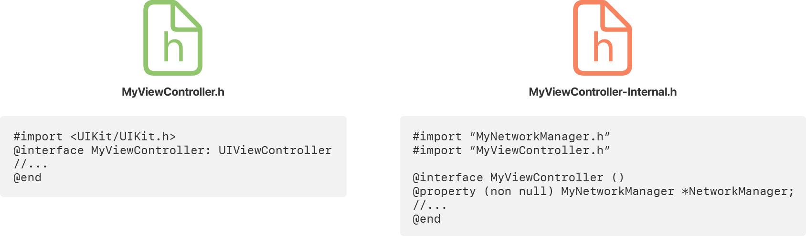

> 导航：[技术](../technologies.md) · [Xcode](../xcode.md) · [构建系统](build-system.md)

# 使用良好编码实践提高构建效率

<sub>文章</sub>

减少代码导出的符号数量，并向编译器提供所需的明确类型信息，以缩短编译时间。

## 概述

哪怕只将构建时间缩短几秒，累积到整个开发过程中也会产生显著影响。Xcode 会尽一切可能以最快速度构建代码。它会并行执行构建任务，并利用所有可用资源输出完成的产品。不过，你也可以确保不为编译器制造不必要的工作，从而帮助 Xcode。

多年来，Xcode 编译器引入了多项优化来缩短编译时间。其中大多数优化会自动应用，但有些需要你对代码作出小幅更改。此外，同时支持 Objective-C 和 Swift 代码的项目可能还需要其他优化，以确保快速编译。

> [!note] 注意
> 你还可以通过项目级更改优化构建时间。有关优化构建时间的更多信息，请参阅[提高增量构建速度](improving-the-speed-of-incremental-builds.md)。

### 在 import 语句中包含框架名称

将头文件导入源文件时，请始终在 import 语句中包含父框架或库的名称。在基于 C 的代码中，导入头文件通常会将头文件内容拷贝到源代码中。包含框架名称后，编译器便可以选择使用模块映射导入头文件，从而显著缩短导入时间。使用模块映射时，编译器只需载入并处理一次框架的头文件，然后将生成的符号信息缓存到磁盘。从另一个源文件导入同一框架时，编译器会复用缓存数据，无需再次读取和预处理头文件。

对于系统框架和在项目中创建的自定义框架，都应包含框架名称。以下示例显示了系统框架和自定义框架的 import 语句，二者都有模块映射。最后一条 import 语句不会使用可用的模块映射，而是继续直接载入并处理头文件内容。

```occ
// 导入框架的模块映射
#import <UIKit/UIKit.h>
#import <PetKit/PetKit.h>     // 自定义框架

// 以文本方式包含头文件。
#import "MyHeader.h"

```

有关如何向自定义框架添加模块映射的信息，请参阅“为自定义框架和库创建模块映射”。

### 尽量减少 Swift 与 Objective-C 之间共享的符号数量

在项目中混合使用 Swift 和 Objective-C 代码时，Swift 代码可能需要了解部分 Objective-C 代码，反之亦然。编译器使用两个特殊头文件来处理符号信息交换：

- Objective-C 桥接头文件决定哪些 Objective-C 符号可供 Swift 代码使用。
- 编译器生成的 Swift 头文件列出 Objective-C 代码中可以使用的所有公开 Swift 符号。

减小这两个头文件的大小可以减少编译器工作量并缩短编译时间。文件越小，编译器处理头文件的速度越快。编译源文件时，符号查找速度也会更快。

配置 Objective-C 桥接头文件的内容时，只包含 Swift 源代码实际引用的头文件和符号。如果 Swift 代码只使用 Objective-C 类的一部分，请将 Swift 代码不使用的符号移入实现文件中的 category，或移入仅供内部使用的头文件。

下图展示了如何将外部使用的符号与类内部使用的符号分开。`MyViewController.h` 头文件只包含 Swift 代码公开引用的符号子集。`MyViewController-Internal.h` 头文件则在类的 category 扩展中包含其余符号。在 Objective-C 实现文件中包含这两个头文件，但在 Objective-C 桥接文件中只包含公开头文件。



<sub>一张示意图，其中一个头文件包含公开符号，另一个单独的头文件包含仅供内部使用的符号。</sub>

编译器会使用生成的头文件，自动让所有公开 Swift 符号可供 Objective-C 代码使用。若要尽量减小此生成头文件的大小，请按以下方式更新 Swift 代码：

- 将 Swift 类的内部方法和属性标记为 `private`。该关键字可防止符号被包含在生成的头文件中。
- 优先选择基于代码块的 API，而非基于函数的 API。代码块属于实现的一部分，不会生成公开符号信息。
- 支持最新版本的 Swift 语言。Swift 3 及更早版本会自动推断大多数符号的 Objective-C 类型信息，从而增大生成头文件的大小。较新版本的 Swift 只在较少情况下执行自动类型推断，减小了头文件的总体大小。

### 向 Swift 编译器提供明确的类型信息

Swift 编译器能够根据赋给变量的值推断其类型。对于简单值，推断过程很快。例如，将值 `0.0` 赋给属性时，编译器可以迅速确定其类型是浮点数。不过，如果将复杂值赋给变量，编译器必须执行额外工作来计算类型信息。

请看以下结构体，其中 `bigNumber` 属性没有明确的类型信息。为确定该属性的类型，Swift 编译器必须求出 [reduce(_:_:)](<../swift/array/reduce(____).md>) 函数的结果，这需要相当长的时间。

```swift
struct ContrivedExample {
   var bigNumber = [4, 3, 2].reduce(1) {
      soFar, next in
      pow(next, soFar)
   }
}
```

最佳实践是像下面的示例一样明确提供类型，而不是让编译器确定类型。提供明确的类型信息可以减少编译器必须完成的工作，还能让它执行更多错误检查。

```swift
struct ContrivedExample {
   var bigNumber : Double = [4, 3, 2].reduce(1) {
      soFar, next in
      pow(next, soFar)
   }
}
```

### 在明确的协议中定义委托方法

委托（delegate）是 Apple 平台上的标准设计模式，提供了一种在对象之间通信的实用方式。虽然委托允许任意对象之间进行通信，但请始终为委托对象提供明确的类型信息。

请看以下示例，其中委托被声明为任意类型的可选对象。尽管这种声明完全合法，但实际上会给编译器带来更多工作。编译器必须假定项目或所引用框架中的任何对象都可能包含该函数，因此会搜索整个项目，确保该函数存在于某处。

```swift
weak var delegate: AnyObject?
func reportSuccess() {
   delegate?.myOperationDidSucceed(self)
}
```

与使用任意对象相比，更好的方法是提供具体类型信息。通常可以像下面的示例一样，使用委托协议指定类型信息。明确的协议可以帮助编译器更快地找到方法，还能让编译器对赋给 `delegate` 属性的对象执行额外的类型检查。

```swift
weak var delegate: MyOperationDelegate?
func reportSuccess() {
   delegate?.myOperationDidSucceed(self)
}

protocol MyOperationDelegate {
   func myOperationDidSucceed(_ operation: MyOperation)
}
```

### 简化复杂的 Swift 表达式

Swift 语言允许你以极具表现力的方式编写代码，但请确保代码不会影响编译时间。请看一个使用 `reduce` 函数对一组值求和的函数示例。如果所有参数都传入 `nil`，函数会返回 `nil`；如果传入一个或多个参数，则会返回这些参数的总和。该函数利用了 Swift 的一项功能：编译器使用闭包中的单行表达式确定闭包的返回类型。

```swift
func sumNonOptional(i: Int?, j: Int?, k: Int?) -> Int? {
   return [i, j, k].reduce(0) {
      soFar, next in
      soFar != nil && next != nil ? soFar! + next! : (soFar != nil ? soFar! : (next != nil ? next! : nil))
   }
}
```

虽然此函数是合法的 Swift 语法，但单行闭包会让代码难以阅读，也更难由编译器求值。事实上，编译器会中止并报错，指出无法在合理时间内对表达式进行类型检查。该单行闭包也没有必要。[reduce(_:_:)](<../swift/array/reduce(____).md>) 函数的定义会让它返回与传入值相同的类型，此处即为可选整数。

与使用如此复杂的表达式相比，最好创建更简单、更易读的内容。以下代码与单行闭包版本行为相同，但更易阅读且能快速编译。

```swift
func sumNonOptional(i: Int?, j: Int?, k: Int?) -> Int? {
   return [i, j, k].reduce(0) {
      soFar, next in
      if let soFar = soFar {
         if let next = next { return soFar + next }
         return soFar
      } else {
         return next
      }
   }
}
```

## 另请参阅

### 性能

- [配置项目以使用可合并库](configuring-your-project-to-use-mergeable-libraries.md) — 使用可合并动态库，让发布构建的 App 启动时间接近静态链接，同时不损失调试构建中的动态链接构建速度。
- [提高增量构建速度](improving-the-speed-of-incremental-builds.md) — 向 Xcode 构建系统说明项目中与 target 相关的依赖关系，并减少每个构建周期中的编译器工作量。
- [使用明确的模块依赖关系构建项目](building-your-project-with-explicit-module-dependencies.md) — 使用 Xcode 构建系统消除不必要的模块变体，从而缩短编译时间。
