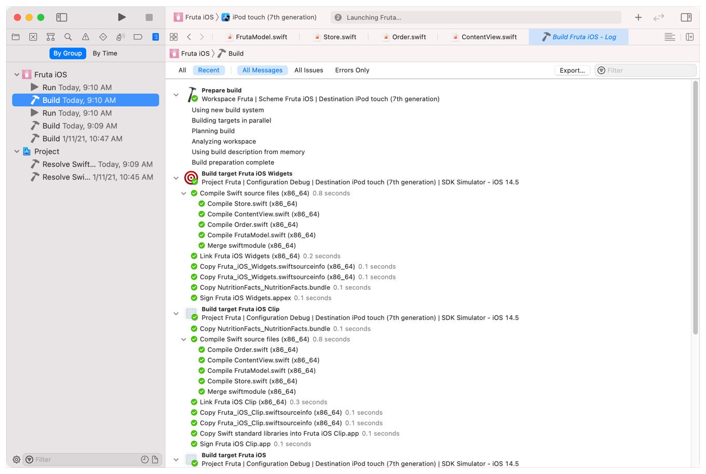
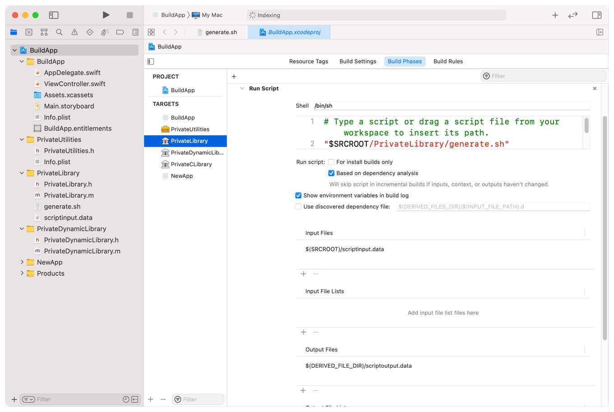
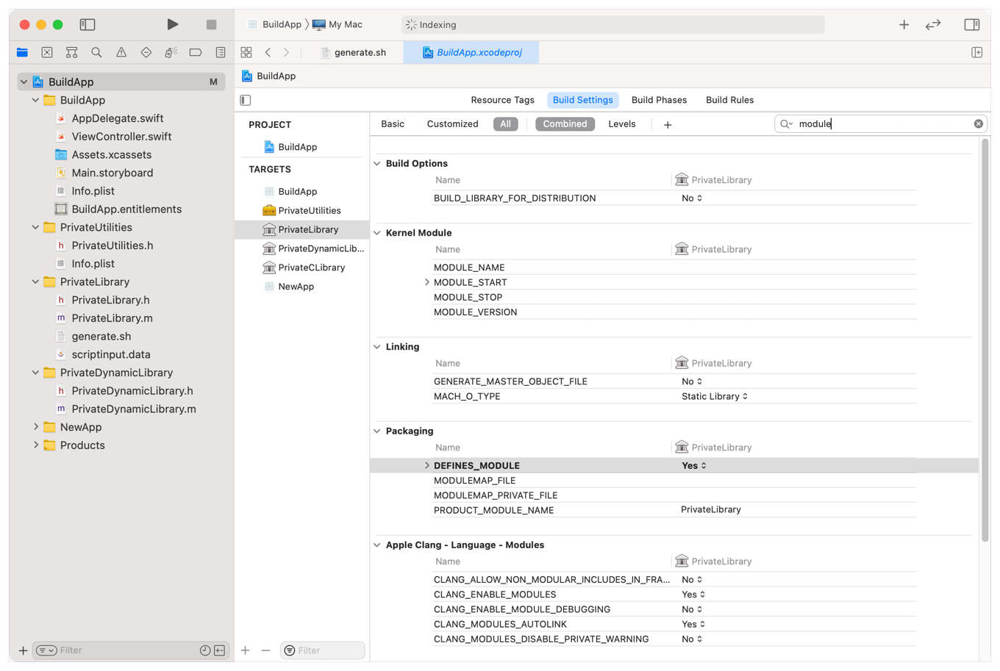
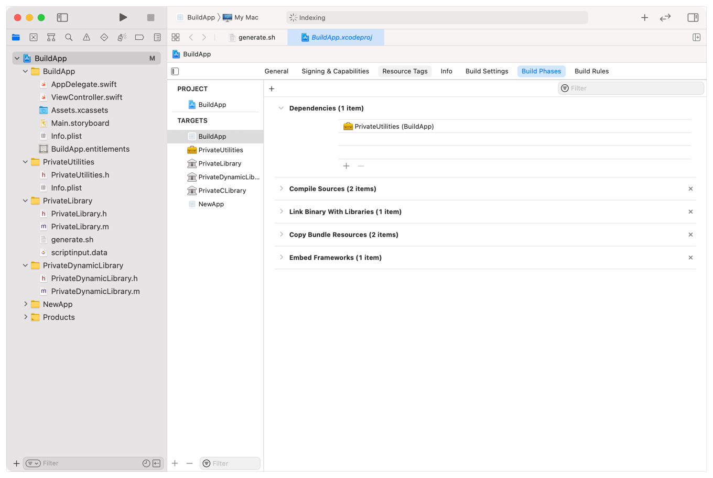
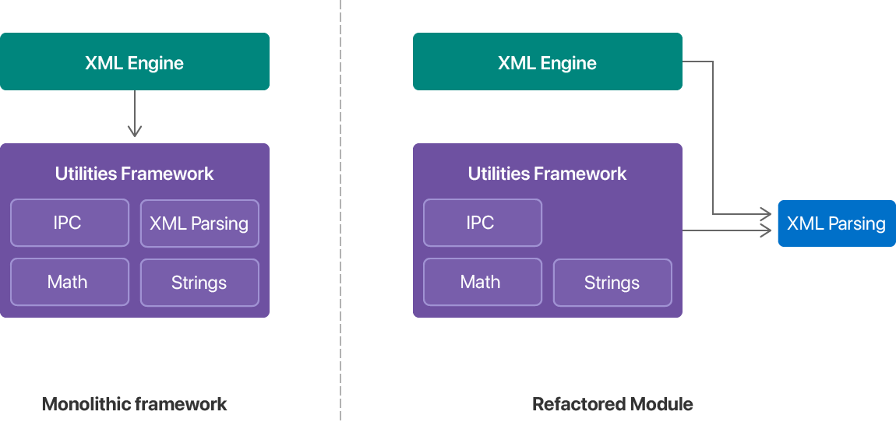
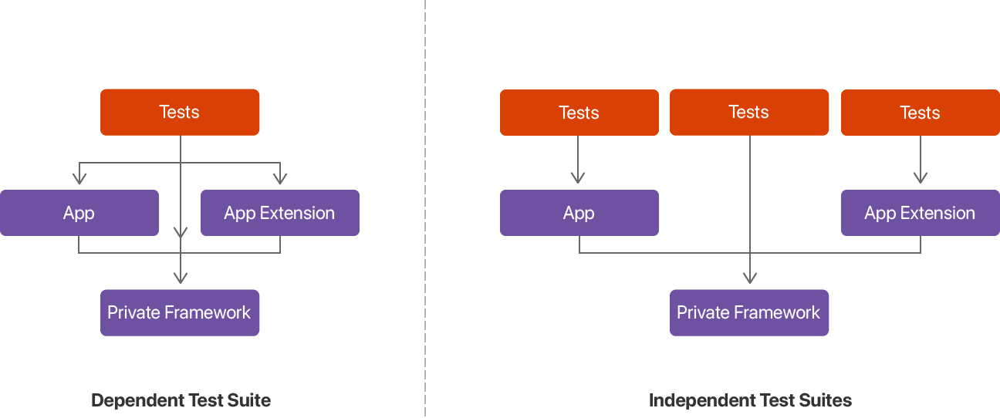

> 导航：[Technologies](../technologies.md) · [Xcode](../xcode.md) · [Build system](build-system.md)

# 提高增量构建速度

文章

向 Xcode 构建系统说明项目中与 target 相关的依赖关系，并减少每个构建周期中的编译器工作量。

## 概述

Xcode 构建系统负责管理 target 中代码的编译和链接。常见 target 类型包括 App、App 扩展、框架、库和测试套件。简单项目可能只包含一个 target，例如要构建的 App。更复杂的项目可能包含多个相互依赖的 target，例如私有框架和依赖该框架的 App。

请始终确保项目的 target 间依赖关系和配置详情准确无误。构建 target 时，Xcode 会尽可能并行执行工作。依赖项越少，并行程度越高，但要防止构建和运行时错误，准确的依赖关系图必不可少。同样，提供详细的配置数据有助于 Xcode 正确且高效地调度构建时任务。

> [!note] 注意
> 遵循编码最佳实践也能提高 Xcode 编译时的效率。有关更多信息，请参阅[使用良好编码实践提高构建效率](improving-build-efficiency-with-good-coding-practices.md)。

### 测量每项构建任务的耗时

执行任何构建优化前，请始终先收集计时信息，确定在哪些位置进行优化可能最有效。在 Xcode 中打开项目，然后选取 Product \> Perform Action \> Build With Timing Summary，以使用详细计时信息构建 target。若要查看特定构建的计时信息，请在 Report navigator 中选择该构建。

> [!note] 注意
> 若要使用 `xcodebuild` 命令行工具生成计时信息，请向该工具传递 `-showBuildTimingSummary` 选项。

首次构建项目时，Xcode 会构建所有内容，之后的构建则为增量构建。对于每次增量构建，请特别关注准备部分，以及 Xcode 为每个 target 执行的具体任务。

- 如果 Xcode 没有并行构建 target，请打开 target 的 Scheme Editor，并确保 Build Order 选项设为 Dependency Order。
- 查找自定义脚本等额外任务，并评估 Xcode 是否需要在每次增量构建期间运行这些脚本。
- 如果某个文件的编译时间明显长于其他文件，请检查该文件，查看是否由头文件导入问题造成延迟。

### 为自定义脚本和构建规则声明输入与输出

如果在 Xcode 项目中使用自定义构建脚本，请确保 Xcode 只在需要时运行这些脚本。你可以使用脚本运行自定义工具、以编程方式设置构建环境变量，或执行其他特定于 target 的任务。例如，可以使用脚本根据专有数据源生成资产或其他资源文件。默认情况下，Xcode 会在每个构建周期（包括增量构建）运行自定义脚本。相对于其他任务，它还会串行执行这些脚本。

如果不需要 Xcode 在每次构建 target 时运行脚本，请至少为脚本提供一个输入文件和一个输出文件。Xcode 使用脚本的输入和输出文件确定何时运行脚本。具体而言，当以下任一条件成立时，Xcode 会运行脚本：

- 脚本没有任何输入文件。
- 脚本没有任何输出文件。
- 脚本的输入文件发生更改。
- 脚本的输出文件缺失。

在 Run Script 构建阶段编辑器中指定输入和输出文件以及脚本本身。你可以单独指定输入和输出文件，也可以在 Xcode 文件列表中指定；Xcode 文件列表是扩展名为 `.xcfilelist` 的文件，每行列出一个文件名。

即使脚本实际上不需要这些文件，你仍必须指定输入和输出文件，才能防止 Xcode 每次都运行脚本。对于不需要输入的脚本，请提供一个永不更改的文件作为输入文件。对于没有输出的脚本，请让脚本创建一个静态输出文件，以便 Xcode 有可供检查的内容。

### 为自定义框架和库创建模块映射

模块映射可以缩短导入头文件所需的时间，从而改善源代码编译时间。模块映射向编译器提供框架所包含的头文件列表。框架包含模块映射后，编译器不会为每个源文件单独预处理头文件，而是构建框架符号信息的缓存，并在后续编译中复用该缓存，从而节省大量时间。

系统框架已经包含模块映射，但你必须为项目中的所有自定义框架提供模块映射。若要添加模块映射，请为框架或库启用 `DEFINES_MODULE` 构建设置。Xcode 会为新框架自动启用此构建设置，但旧项目可能需要你手动设置。启用后，编译器会根据 target 的公开头文件内容生成模块映射。

> [!important] 重要
> 若要获得模块映射的优势，请始终在所有 import 语句中包含框架名称。如果不包含框架名称，编译器就无法确定是否存在模块映射。有关如何从模块导入头文件的更多信息，请参阅[在 import 语句中包含框架名称](improving-build-efficiency-with-good-coding-practices.md#Include-framework-names-in-import-statements)。

创建模块映射前，请确保框架满足以下要求：

- 框架的头文件不得依赖任何外部上下文信息。Xcode 会将模块映射与项目的其余源文件分开编译。不要依赖特定于源代码的信息来更改头文件中符号的含义或值。
- 模块必须自包含。由于 Xcode 会单独编译模块映射，框架的头文件必须包含正确编译所需的全部内容。

为了最大程度地复用模块映射，请使用相同的构建选项编译 App 的源文件。Xcode 会使用与导入框架的源文件相同的选项构建框架模块映射。如果 App 源文件使用不同选项，Xcode 就必须为每组新选项重新编译模块映射。使用相同选项可以让 Xcode 在后续每个源文件中复用缓存。

### 确保 target 的依赖关系准确

验证 target 具有准确的依赖关系，可以确保它们正确且及时地构建。过期的依赖关系可能迫使 Xcode 串行构建原本可以并行构建的 target。缺失依赖关系可能导致正确性问题，甚至构建错误。例如，如果 App 没有明确依赖单独的代码模块（如 App 扩展），Xcode 可能会使用无法正常工作的旧版模块来构建 App。

当你知道 Xcode 项目中的两个 target 之间存在依赖关系时，请在二者之间创建明确的依赖关系。Xcode 会根据项目配置自动创建某些依赖关系。例如，将新框架嵌入现有 App 时，Xcode 会自动将框架添加到 App 的依赖项列表。其他时候，你需要使用 Dependencies 构建阶段编辑器自行指定依赖关系，如下所示。使用 + 和 - 按钮添加或移除 target 的依赖项。

如果 target 依赖另一个 Xcode 项目中的代码，请将该项目拖入当前项目的导航器面板以创建引用。另一个项目出现在导航器面板中后，Xcode 就能获得跟踪该项目中项目依赖关系所需的信息。如果没有此引用，远程项目发生更改时，Xcode 不会知道需要构建你的 target。

### 重构 target 以提高并行程度

target 间依赖关系要求 Xcode 按特定顺序构建这些 target。当一个 target 有许多依赖项，或依赖大型单体模块时，Xcode 必须串行执行更多任务。若要改善构建性能，请简化 target 的依赖项列表，并拆分单体 target，使 Xcode 可以并行完成更多工作。

请看下图，其中 XML 引擎依赖一个单体实用工具框架。虽然 XML 引擎只依赖框架的一小部分，但框架的任何部分发生更改时，Xcode 都必须重新构建该引擎。将框架拆分成更小的模块并创建更细粒度的依赖关系，可能会消除一些不必要的重新构建。在重构后的版本中，实用工具框架的更改不再自动触发 XML 引擎重新构建。

一张对比单体模块和重构后模块的示意图，其中显示 XML 解析在重构后的模块中移到了实用工具框架之外。

当一个 target 依赖许多子 target 时，Xcode 必须等所有子 target 完成后才能开始构建该 target。请看一个对 App、App 扩展和私有框架执行自动化测试的单一 Tests target。按 target 拆分测试后，只要对应 target 准备就绪，Xcode 就可以独立运行每个测试套件，从而提高并行程度。

一张示意图，其中将依赖三个其他 target 的单一测试 target，改为三个各自只依赖一个其他 target 的测试 target。

你需要判断修改项目 target 是否能带来收益。增加 target 数量可以提高并行程度，但也会增加项目复杂性。请始终验证对 target 或依赖关系所作的更改，确保代码仍能正确构建。此外，请始终测量最终构建速度，确认更改带来了切实改善。

## 另请参阅

### 性能

- [配置项目以使用可合并库](configuring-your-project-to-use-mergeable-libraries.md) — 使用可合并动态库，让发布构建的 App 启动时间接近静态链接，同时不损失调试构建中的动态链接构建速度。
- [使用良好编码实践提高构建效率](improving-build-efficiency-with-good-coding-practices.md) — 减少代码导出的符号数量，并向编译器提供所需的明确类型信息，以缩短编译时间。
- [使用明确的模块依赖关系构建项目](building-your-project-with-explicit-module-dependencies.md) — 使用 Xcode 构建系统消除不必要的模块变体，从而缩短编译时间。
