> 导航：[Technologies](../technologies.md) · [Xcode](../xcode.md) · [Debugging](debugging.md) · [Metal debugger](metal-debugger.md)

# 检查加速结构

文章

通过检查加速结构，揭示光线相交的性能瓶颈。

## 概述

_加速结构_是 Metal 用来加速 GPU 上光线相交测试的数据结构。Metal 调试器允许你使用加速结构查看器检查加速结构。打开加速结构后，可以查看它及其相关属性，以及各种高亮显示。

### 浏览加速结构

你可以使用加速结构查看器的两个面板浏览加速结构：左侧的结构大纲或右侧的场景视图。

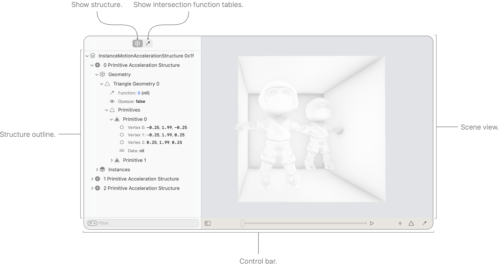

结构大纲会显示加速结构的组件及其各种属性。你可以点按结构大纲中的任意一行，在场景视图中高亮显示加速结构的相应组件；也可以按住 Control 键点按以跳转到该组件。

场景视图会显示加速结构的 3D 表示。你可以使用以下控制在场景中浏览或与加速结构交互：

| 操作 | 结果 |
|---|---|
| W（或 ↑） | 以视口中心为中心放大 |
| A（或 ←） | 向左平移 |
| S（或 ↓） | 以视口中心为中心缩小 |
| D（或 →） | 向右平移 |
| 上箭头/下箭头 | 向上平移/向下平移 |
| Option-上箭头/下箭头 | 以指针为中心放大/缩小 |
| 拖动 | 旋转相机 |
| 按住 Control 键点按 | 根据选择模式执行选择 |
| 按住 Shift-Control 键点按 | 选择图元加速结构 |
| 按住 Option-Control 键点按 | 选择几何体 |
| 按住 Option-Command-Control 键点按 | 选择图元 |
| 按住 Command-Control 键点按 | 选择实例 |

### 更改相机模式

使用 Fly 相机时，在场景视图中拖动会旋转相机。使用 Orbit 相机时，拖动会让相机围绕指针下方的任意图元运行；如果没有图元，则围绕场景中心运行。你可以点按控制栏中的 Camera 按钮，在模式之间切换。

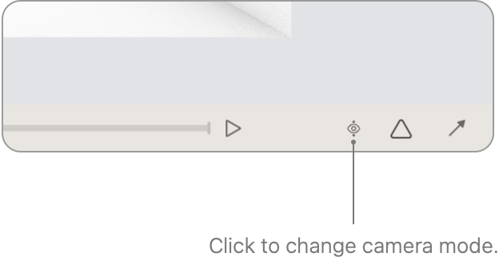

### 配置相交函数

Xcode 会根据你打开加速结构的方式，自动选择用于渲染场景的相交函数表。例如，如果从 Bound Resources 查看器打开加速结构，Xcode 会选择 intersector 标签匹配的任意已绑定相交函数表。有关更多信息，请参阅[检查命令的绑定资源](inspecting-the-bound-resources-for-a-command.md)。如果从 All Resources 查看器或 Memory 查看器打开加速结构，Xcode 会自动选择工作负载中最后一个 intersector 标签匹配的相交函数表。有关更多信息，请参阅[分析内存用量](analyzing-memory-usage.md)。

你可以切换到相交函数表大纲，配置加速结构查看器使用哪个相交函数表。如果选择 None，加速结构查看器不会使用任何相交函数，而只依赖几何体相交。如果选择相交函数表，系统会使用与每个几何体的相交函数表偏移量对应的相交函数，评估是否接受相交。有关更多信息，请参阅 [intersectionFunctionTableOffset](../metal/mtlaccelerationstructuregeometrydescriptor/intersectionfunctiontableoffset.md) 和 [Metal 着色语言规范](https://developer.apple.com/metal/Metal-Shading-Language-Specification.pdf)中的 `accept_intersection`。

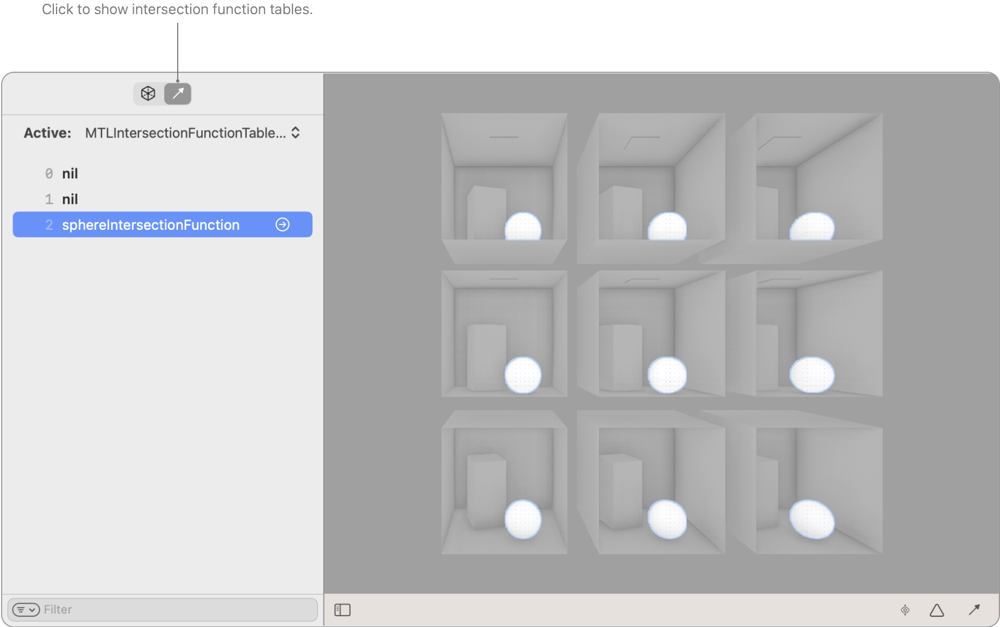

一张相交函数表大纲的屏幕截图，其中选中了球体相交函数，并在场景视图中高亮显示了匹配的几何体。

### 配置加速结构遍历行为

点按控制栏右下角的箭头，可以覆盖加速结构遍历的默认行为。弹出框中的选项允许你配置与 intersector 相同的属性，以控制遍历行为（请参阅 [Metal 着色语言规范](https://developer.apple.com/metal/Metal-Shading-Language-Specification.pdf)）。请让遍历行为与着色器匹配，以确保加速结构查看器显示正确。

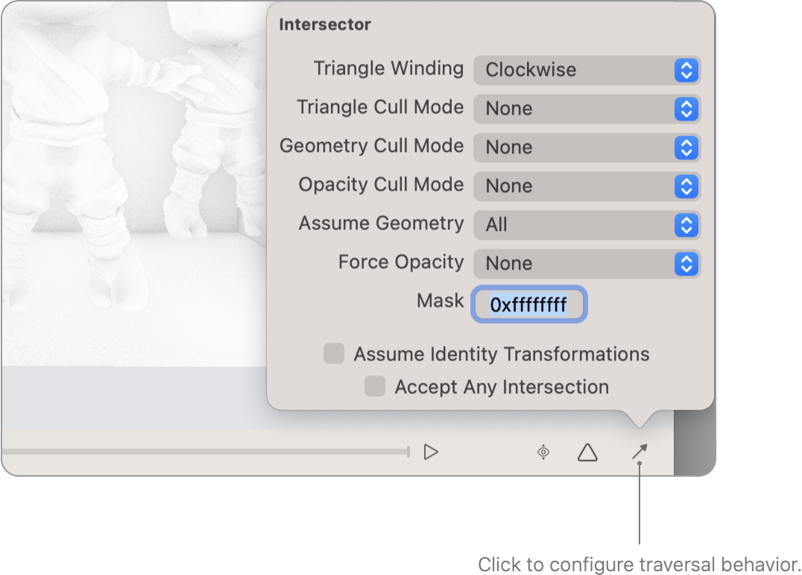

### 使用高亮显示查看加速结构

你可以使用不同的高亮显示查看加速结构，以突出各种属性。若要启用模式并在模式之间切换，请点按控制栏中的 Highlight 按钮。

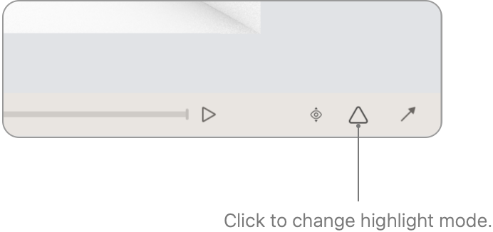

- **Bounding Volume Traversals** — 你可以使用 Bounding Volume Traversals 模式，高亮显示场景中遍历开销较高的区域。Xcode 会使用从白色（遍历次数较少）到深蓝色（遍历次数较多）的色阶，对与加速结构相交所需的遍历次数进行颜色编码。当你在视口中移动指针时，检查器（位于左下角）会更新指针下方像素的多项遍历统计信息，以及视口中对应的最小值和最大值。

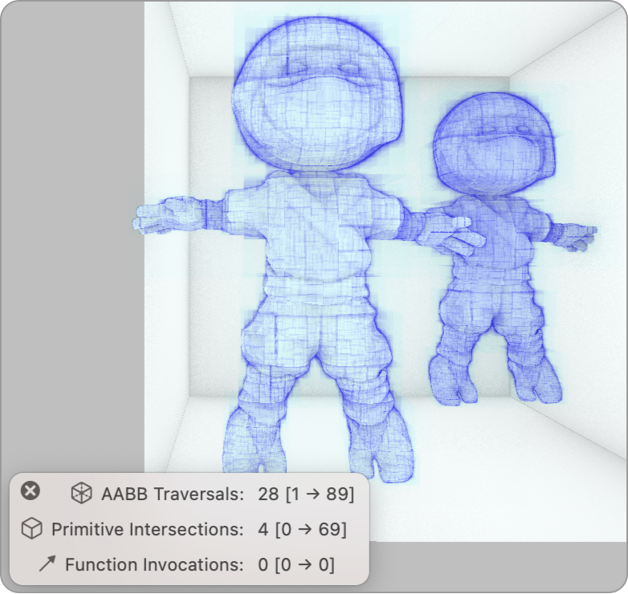

一张加速结构查看器的屏幕截图，其中使用 Bounding Volume Traversals 高亮模式显示场景。

- **All Node Traversal** — 你可以使用 All Node Traversal 模式，高亮显示场景中开销较高但可能被遮挡的部分。
Xcode 使用与 Bounding Volume Traversals 高亮相同的颜色编码，但在遇到表面时不会停止遍历。在下面的示例中，你可以看到忍者头部内部的眼睛：

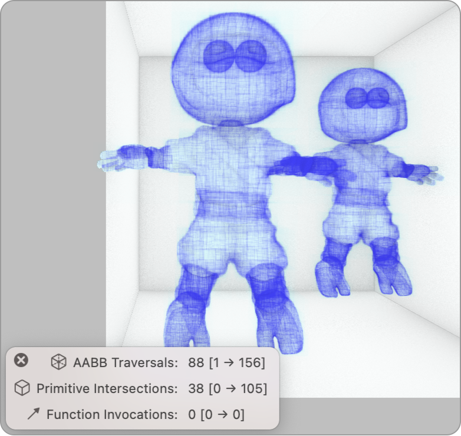

- **Acceleration Structures** — 此模式会高亮显示不同的图元加速结构。当你在视口中移动指针时，检查器会显示图元加速结构索引。

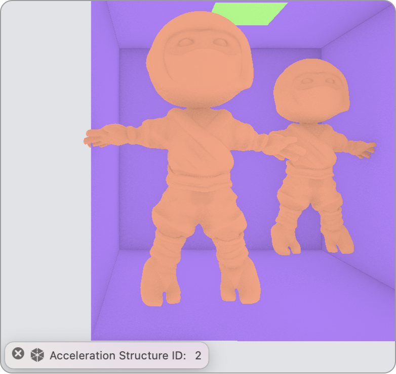

- **Geometries** — 此模式会高亮显示图元加速结构中的不同几何体。当你在视口中移动指针时，检查器会显示 `geometry_id` 属性。有关更多信息，请参阅 [Metal 着色语言规范](https://developer.apple.com/metal/Metal-Shading-Language-Specification.pdf)。

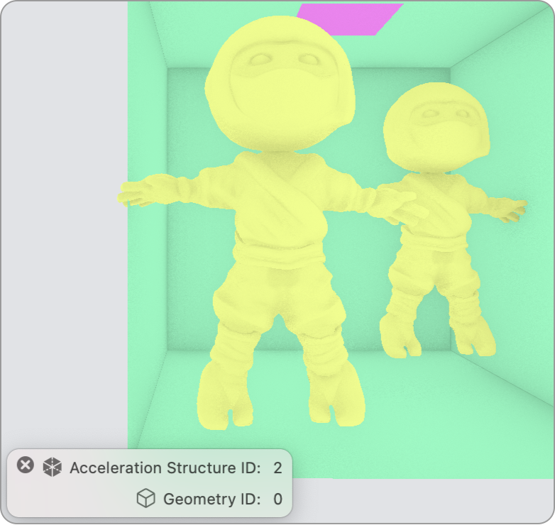

- **Primitives** — 此模式会高亮显示图元加速结构中的不同图元。当你在视口中移动指针时，检查器会显示 `geometry_id` 和 `primitive_id` 属性。有关更多信息，请参阅 [Metal 着色语言规范](https://developer.apple.com/metal/Metal-Shading-Language-Specification.pdf)。

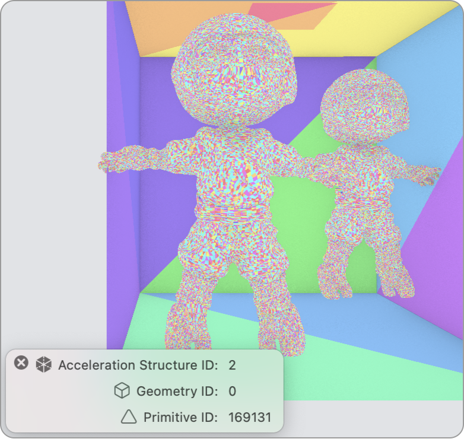

- **Instances** — 此模式会高亮显示图元加速结构的不同实例。当你在视口中移动指针时，检查器会显示 `instance_id` 属性。有关更多信息，请参阅 [Metal 着色语言规范](https://developer.apple.com/metal/Metal-Shading-Language-Specification.pdf)。

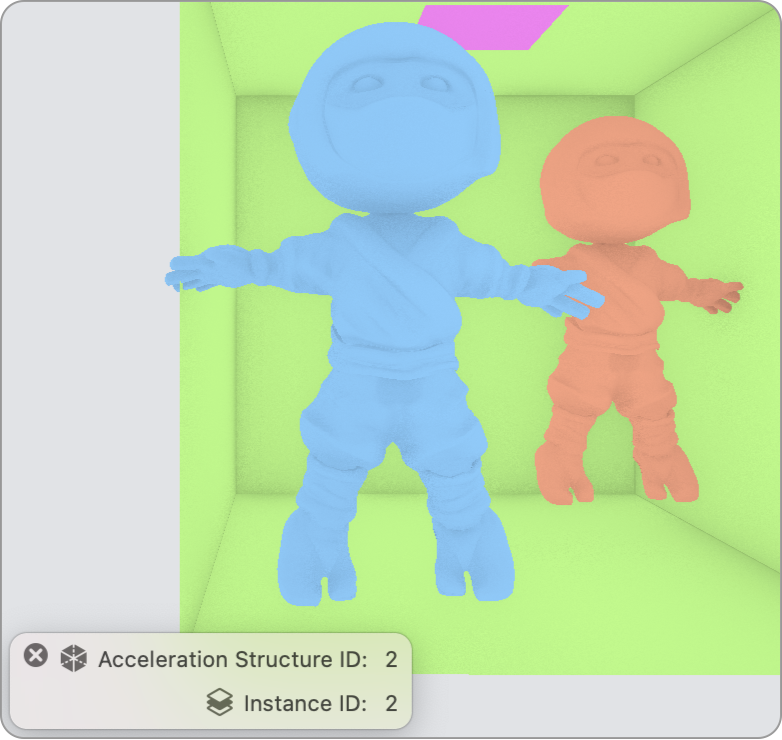

- **Intersection Functions** — 此模式会高亮显示不同的相交函数。当你在视口中移动指针时，检查器会显示相交函数索引。

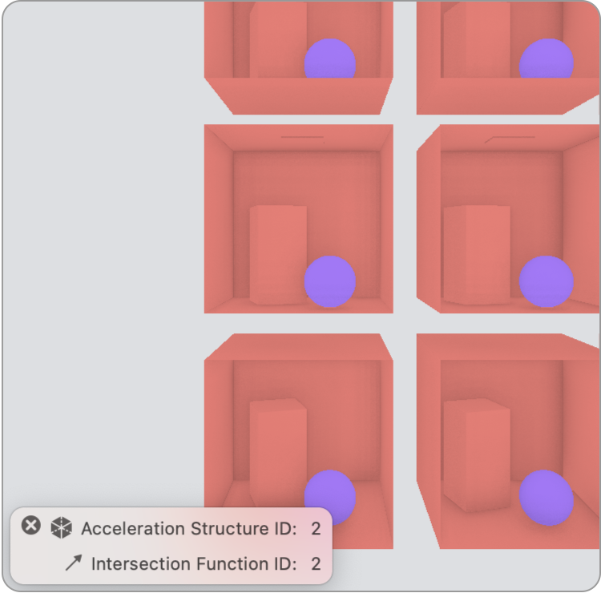

### 查看每图元数据

若要查看每图元数据，请先在结构大纲中浏览到某个图元。然后点按 data 属性旁边的箭头，打开包含每图元数据的缓冲区查看器。

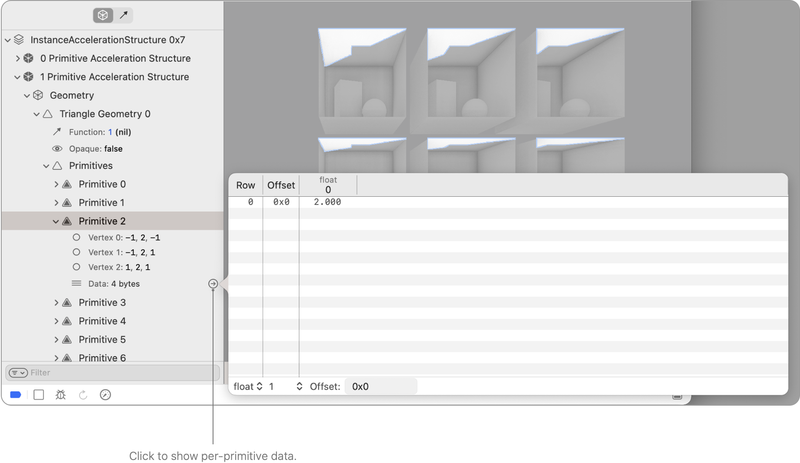

有关如何配置缓冲区查看器以更好地解释数据的信息，请参阅[检查缓冲区](inspecting-buffers.md)。

> [!tip] 提示
> 你可以随时在场景视图中按住 Option-Command-Control 键点按，快速在结构大纲中显示相应图元。

### 查看运动数据

如果加速结构包含运动数据，Xcode 会自动在结构大纲中为每个实例或每个几何体显示其他运动数据属性。

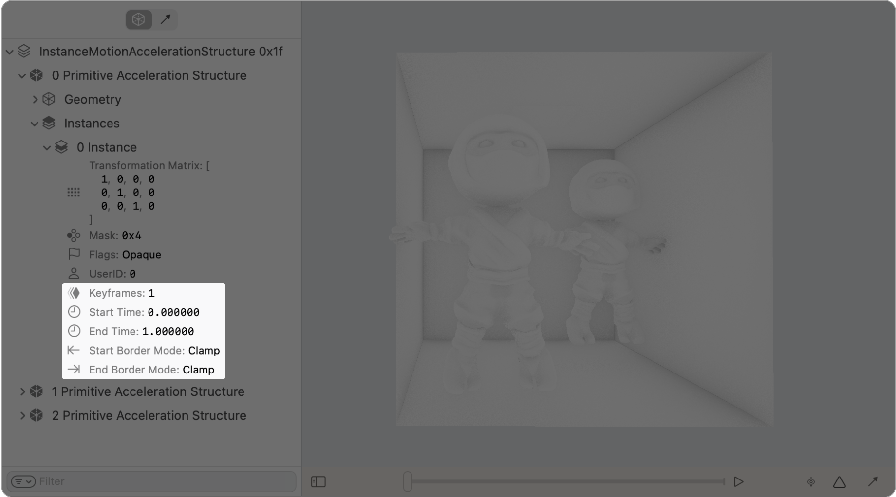

一张加速结构查看器的屏幕截图，其中高亮显示了实例加速结构中某个实例的运动数据属性。

控制栏中还会显示其他运动控制。你可以拖动运动时间线播放头来更改预览时间。也可以点按 Play/Pause 按钮，让 Xcode 在最小开始时间和最大结束时间之间反复来回播放当前运动时间。

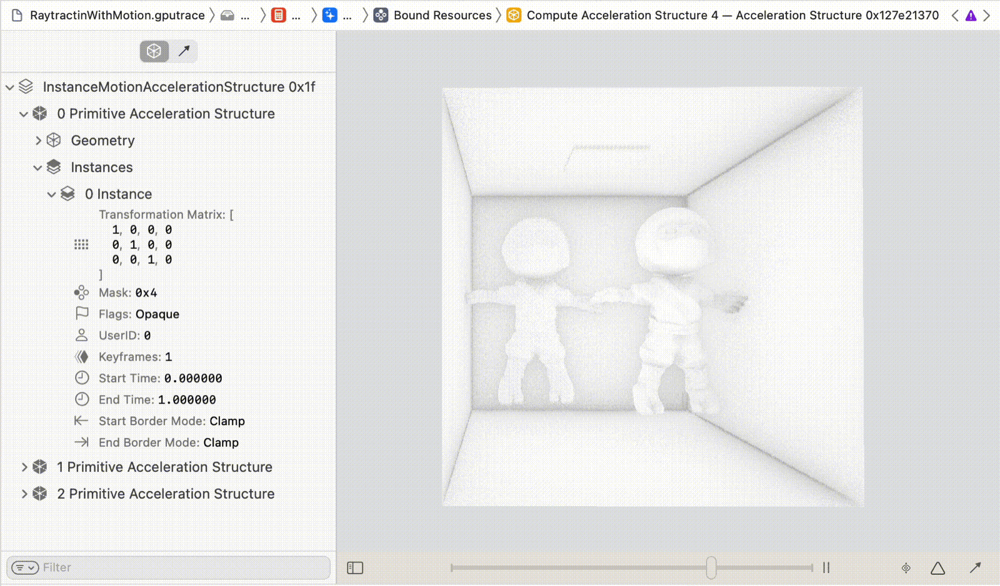

一段加速结构查看器直观显示实例运动加速结构的屏幕录制。当前运动时间在最小开始时间和最大结束时间之间反复来回播放。

## 另请参阅

### Metal 资源检查

- [检查缓冲区](inspecting-buffers.md) — 通过检查缓冲区内容来确认缓冲区格式。
- [检查管线状态](inspecting-pipeline-states.md) — 通过检查渲染和计算通道的属性，确定它们的行为方式。
- [检查采样器状态](inspecting-sampler-states.md) — 通过检查采样器状态的属性，验证其配置。
- [检查着色器](inspecting-shaders.md) — 通过检查和编辑着色器，提升 App 的着色器性能。
- [检查纹理](inspecting-textures.md) — 通过检查纹理内容，发现纹理中的问题。
