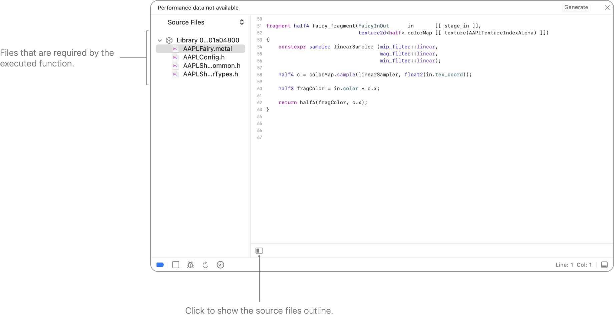
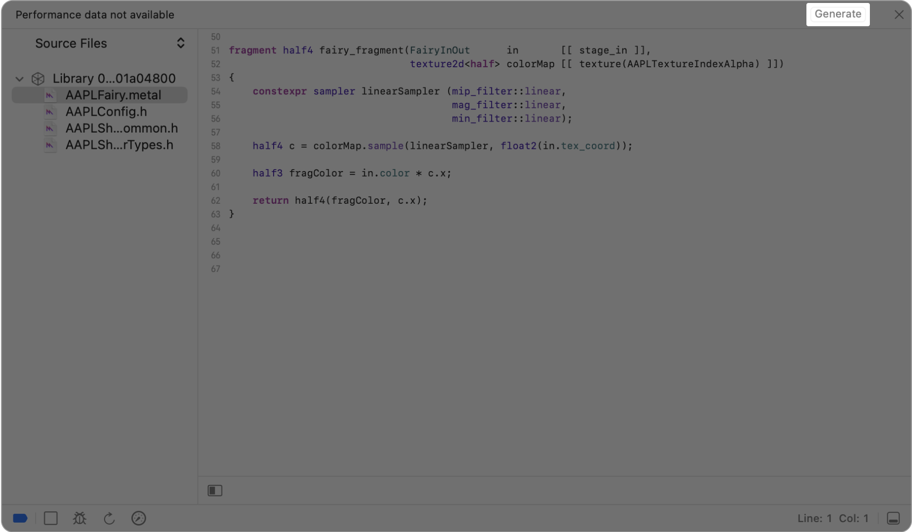
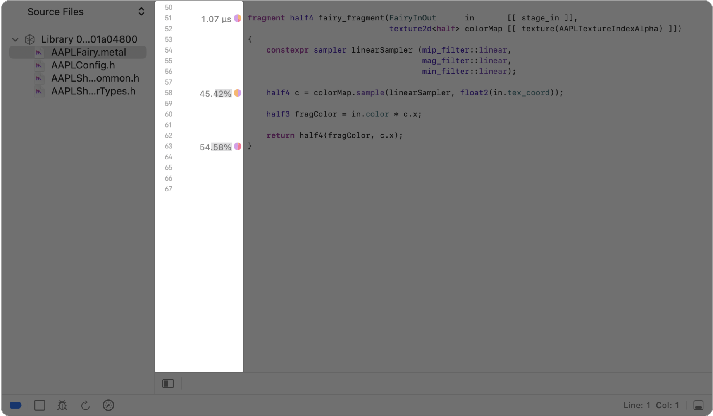
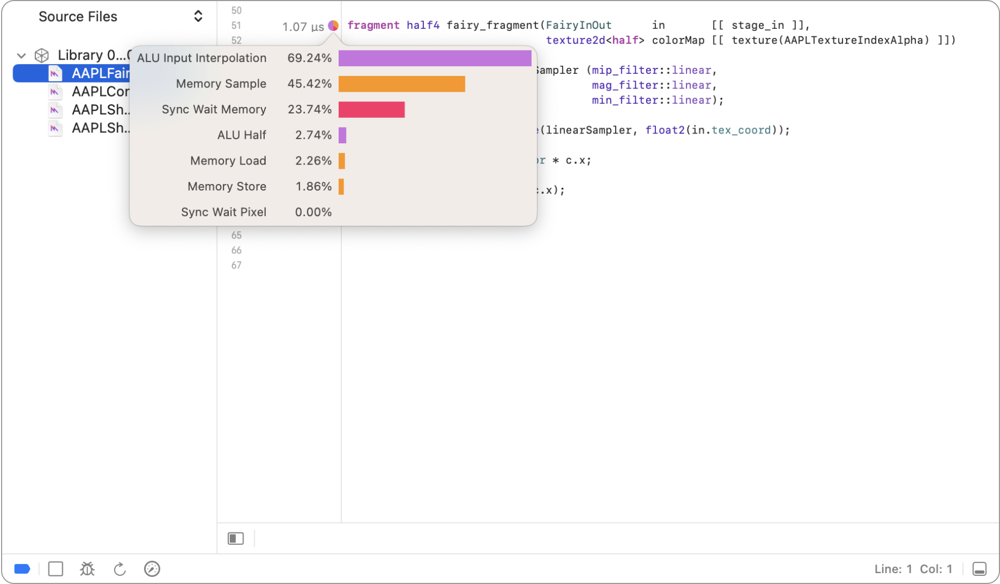
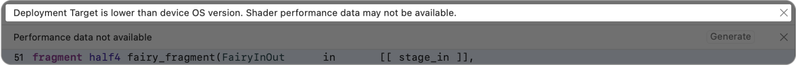
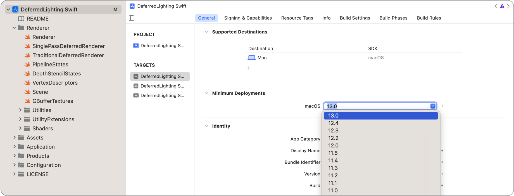
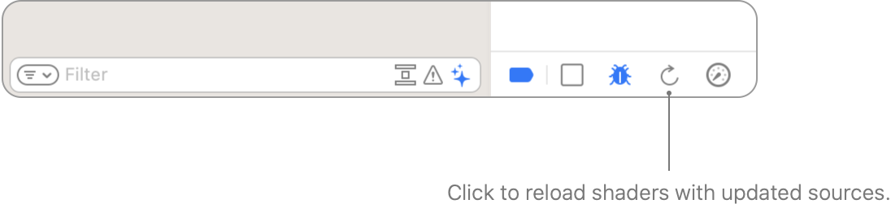
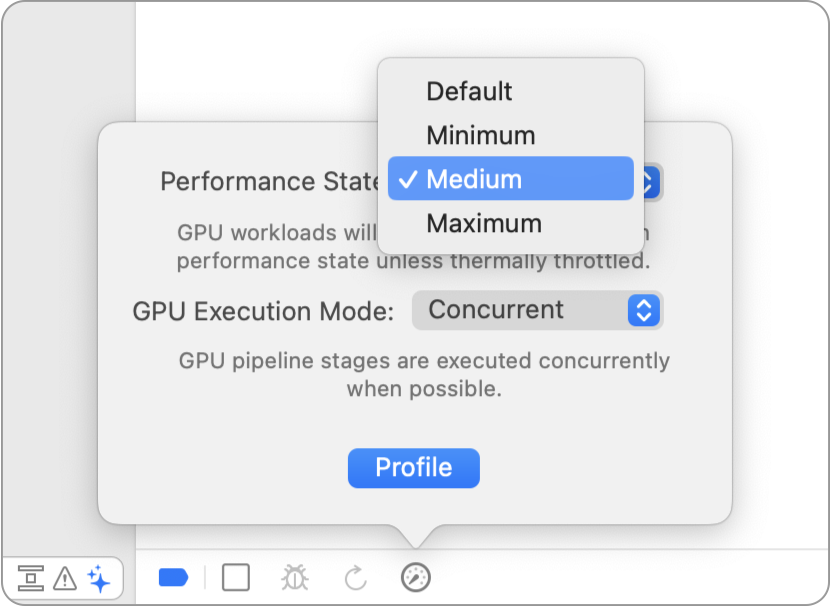

> 导航：[Technologies](../technologies.md) · [Xcode](../xcode.md) · [Debugging](debugging.md) · [Metal debugger](metal-debugger.md)

# 检查着色器

文章

通过检查和编辑你的着色器来提升你的 App 的着色器性能。

## 概述

Metal 调试器允许你使用着色器编辑器查看和编辑着色器。打开着色器后，你可以查看和编辑其源代码，或所执行函数所需的 Metal 库中任何其他文件的源代码。要了解更多信息，请参阅 [Inspecting the bound resources for a command](inspecting-the-bound-resources-for-a-command.md)。

在对 Metal 工作负载进行性能分析时，你可以查看逐行的性能指标。当你进行更改时，可以重新加载着色器以更新 Metal 工作负载和性能数值。

> [!important] 重要
> 在捕获 Metal 工作负载时请包含源代码，因为着色器编辑器需要它才能正常工作。要了解更多信息，请参阅 [Building your project with embedded shader sources](building-your-project-with-embedded-shader-sources.md)。

### 浏览你的着色器

着色器编辑器在所执行函数的上下文中显示你的源代码，并包含熟悉的 Xcode 源代码编辑功能，比如 [Fixing issues in your code as you type](fixing-issues-in-your-code-as-you-type.md)。

除了包含所执行函数的源代码外，你还可以编辑该函数所需的 Metal 库中的其他文件。点击左下角的切换左侧边栏按钮以显示源文件大纲，然后选择另一个文件。

着色器编辑器的屏幕截图，左侧显示着色器源文件列表，右侧显示所选着色器源文件的内容。

### 查看逐行性能指标

性能分析完成后，你可以在着色器编辑器中查看逐行性能指标。如果你在 Metal 捕获弹出窗口中选择重放后进行性能分析（参阅 [Capturing a Metal workload in Xcode](capturing-a-metal-workload-in-xcode.md)），或在重放窗口中选择性能分析 GPU 追踪（参阅 [Replaying a GPU trace file](replaying-a-gpu-trace-file.md)），这会自动发生。或者，你也可以通过点击右上角的生成按钮直接在着色器编辑器中进行性能分析。

然后，等待性能分析完成。你可以在 Xcode 窗口顶部的活动栏中查看其状态。

在对 Metal 工作负载进行性能分析后，着色器编辑器会显示每一行的统计信息。对于搭载 Apple 4 系列或更新 GPU 的设备，数值统计信息右侧会有一个饼图，帮助你提升某个函数或某一行代码的性能。要了解有关 Apple GPU 4 系列设备的更多信息，请参阅 [Tailor your apps for Apple GPUs and tile-based deferred rendering](../metal/tailor-your-apps-for-apple-gpus-and-tile-based-deferred-rendering.md) 和 [Metal feature set tables](https://developer.apple.com/metal/Metal-Feature-Set-Tables.pdf)。

着色器编辑器的屏幕截图，突出显示了源代码旁边的逐行着色器性能分析数据。它以百分比显示权重，并以饼图显示分类细目。

你可以将指针悬停在饼图上以放大它，并显示 GPU 在执行该行代码时所做工作的更多详情。GPU 执行的工作可分类为内存、ALU、同步或控制流。

通过了解 GPU 为着色器中每一行执行的活动，你可以推断出提升着色器性能所需的代码更改。

| GPU 活动 | 说明和建议 |
|---|---|
| ALU | GPU 在算术逻辑单元中花费的时间量。尽可能将 float 改为 half-float 以减少在 ALU 中花费的时间。同时，尽量减少对 `sqrt`、`sin`、`cos` 和 `recip` 等复杂指令的使用。 |
| Memory | GPU 等待访问你的 App 的缓冲区或纹理内存所花费的时间量。可以通过对纹理进行降采样来减少时间，或者，如果你在内存上花费的时间不多，则可以转而提升纹理分辨率。 |
| Control flow | 由于着色器中的分支或循环，GPU 在条件、递增或跳转指令上花费的时间量。使用恒定的迭代次数来最小化循环的控制流时间，因为在这种情况下 Metal 编译器可以生成经过优化的代码。 |
| Synchronization | GPU 在执行开始前等待所需资源或事件所花费的时间量。同步类型如下所述。 |
| Synchronization (wait memory) | GPU 等待依赖的内存访问（例如纹理采样或缓冲区读/写）所花费的时间量。 |
| Synchronization (wait pixel) | GPU 等待底层像素释放资源所花费的时间量。除了颜色附件外，像素还可能来自深度或模板缓冲区，或用户定义的资源。混合是导致像素等待的常见原因。使用光栅顺序组来减少等待时间。 |
| Synchronization (barrier) | 当一个线程到达屏障，且 GPU 等待同一组中其余线程到达该屏障后才能继续时，GPU 所花费的时间量。 |
| Synchronization (atomics) | GPU 在原子指令上花费的时间量。 |

为确保你看到最新的性能分析数值，请将你的 App 的部署目标设置为匹配的操作系统版本，即使只是暂时的。如果部署目标与你的操作系统版本不匹配，着色器编辑器会在顶部显示警告。

你可以在 Xcode 项目设置中更改部署目标。如果你临时更改了部署目标，请不要忘记在部署你的 App 之前将其改回来。

### 更新你的着色器

更改着色器后，你可以点击调试栏中的重新加载着色器按钮，用新的源代码更新已捕获的帧。

更新已捕获的帧后，Xcode 会执行以下操作：

- 重新绘制 App 窗口。
- 更新性能分析器统计信息和饼图。
- 重新绘制助理编辑器中的附件。
- 保持你在已捕获帧中的位置，提供一个交互式环境来提升你的着色器性能调优工作。

> [!important] 重要
> 为避免在不同运行之间得到误导性的结果，在对着色器进行迭代时，使用一致的性能状态会很有帮助。

你可以通过点击调试栏中的 GPU 性能分析器按钮，使用特定的性能状态进行性能分析。

然后，选择你想要的性能状态。

如果你的着色器产生了不正确的结果，你也可以对其进行调试。要了解更多信息，请参阅 [Debugging the shaders within a draw command or compute dispatch](debugging-the-shaders-within-a-draw-command-or-compute-dispatch.md)。

## 另请参阅

### Metal 资源检查

- [Inspecting acceleration structures](inspecting-acceleration-structures.md) — 通过检查你的加速结构来揭示光线相交瓶颈。
- [Inspecting buffers](inspecting-buffers.md) — 通过检查缓冲区内容来确认你的缓冲区格式。
- [Inspecting pipeline states](inspecting-pipeline-states.md) — 通过检查渲染和计算通道的属性来确定它们的行为。
- [Inspecting sampler states](inspecting-sampler-states.md) — 通过检查采样器状态的属性来验证其配置。
- [Inspecting textures](inspecting-textures.md) — 通过检查纹理内容来发现纹理中的问题。
