> 导航：[Technologies](../technologies.md) · [Xcode](../xcode.md) · [Debugging](debugging.md) · [Metal debugger](metal-debugger.md)

# 检查纹理

文章

通过检查纹理内容来发现纹理中的问题。

## 概述

Metal 调试器允许你在纹理查看器中查看纹理的内容。首先，将纹理翻转到正确的方向，并调整颜色以确保准确性。然后，检查像素问题，比如无穷值、非数字值，或任何超出你的显示器当前 EDR headroom 的值。将指针悬停在纹理内的像素上以检查其值，然后通过选择一个像素并将其与其他像素进行比较来发现任何异常。最后，跨 mipmap 级别进行比较以检查视觉问题。要了解更多信息，请参阅 [Inspecting the bound resources for a command](inspecting-the-bound-resources-for-a-command.md) 或 [Analyzing memory usage](analyzing-memory-usage.md)。

### 浏览你的纹理

纹理查看器包含若干用于与你的纹理交互并显示纹理的控制。如果你的纹理包含多个切片，比如 [MTLTextureType.type2DArray](../metal/mtltexturetype/type2darray.md)，标题栏中的控制在你点击某个纹理图像之前处于禁用状态。活动的纹理图像带有系统强调色边框。

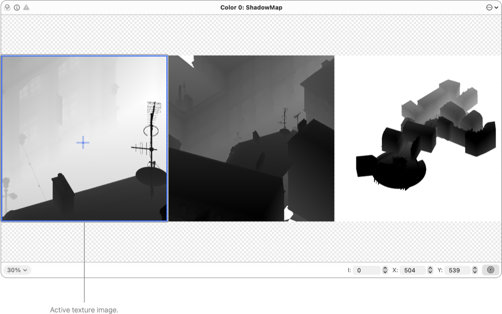

纹理查看器的屏幕截图，由标题栏、画布和控制栏组成。它显示了一个包含三个切片的纹理，第一个纹理切片处于选中状态。

包含相关内容的纹理切片组，比如类型为 [MTLTextureType.typeCube](../metal/mtltexturetype/typecube.md) 的纹理的各个面，属于同一个纹理图像。

### 翻转你的纹理

如果你的渲染器使用了不同的坐标系，导致你的纹理图像上下颠倒或水平翻转，你可以在纹理查看器中将其翻转到正确的方向。点击纹理操作按钮，然后选择水平翻转或垂直翻转。Xcode 会将相关的纹理切片组（比如立方体贴图）作为一个整体进行翻转，而将不相关的纹理切片单独翻转。

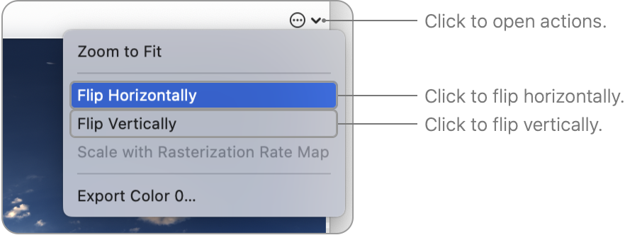

### 配置纹理渲染

Xcode 会根据你的纹理自动配置颜色属性，但你也可以通过点击标题栏中的颜色按钮来手动配置它们。你以每个纹理图像为单位来配置纹理渲染。请遵循以下准则：

- 将颜色空间设置为设备显示屏所使用的颜色空间。例如，如果你正在调试 iPhone 工作负载，请使用 sRGB。
- 如果你使用的显示屏支持扩展动态范围，你可以启用扩展动态范围内容选项，以扩展范围渲染纹理。启用此选项后，Xcode 会在任何包含超出你的显示器 EDR headroom 的值的像素上绘制阴影线。可以考虑降低显示器亮度以增加可用的 headroom。
- 如果你将颜色空间选择为默认（不进行颜色匹配），Xcode 会显示用于手动配置渲染的附加控制。然后你可以配置可见颜色的范围、通道重排，以及 alpha 是否已预乘。

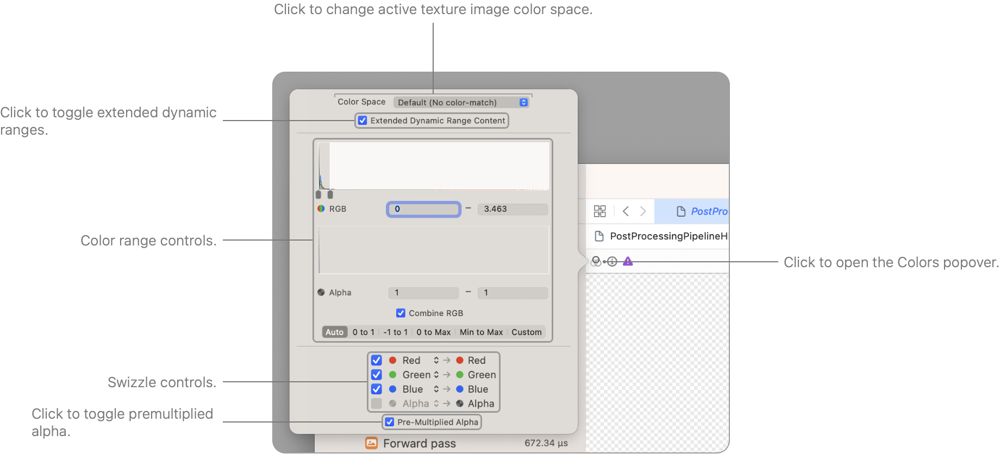

纹理图像颜色选项弹出窗口的屏幕截图。它由颜色空间、色调映射和颜色重排的控制组成。

### 查看纹理属性

你可以通过点击标题栏中的信息按钮来查看活动纹理图像的属性，比如宽度和高度。

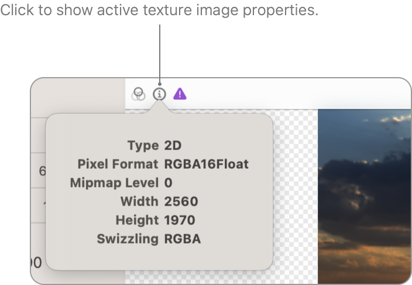

### 查看纹理问题

如果你的纹理包含任何值为无穷、非数字，或超出你的显示器当前 EDR headroom 的像素（或采样点），标题栏中的问题按钮就会变为可用状态。

你可以点击问题按钮来查看更多信息，然后点击跳转按钮以聚焦到导致该问题的像素（或采样点）。

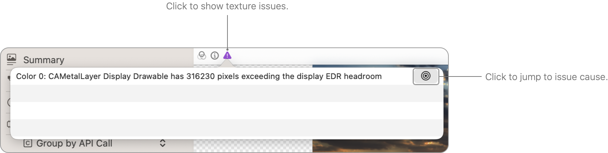

问题弹出窗口的屏幕截图，指示存在超出显示器 EDR headroom 的像素。消息旁边有一个按钮，用于跳转到其中一个此类像素。

### 检查、选择和比较像素值

将指针移到某个像素上（如果你的纹理类型为 [MTLTextureType.type2DMultisample](../metal/mtltexturetype/type2dmultisample.md) 或 [MTLTextureType.type2DMultisampleArray](../metal/mtltexturetype/type2dmultisamplearray.md)，则为某个采样点）以检查其值。

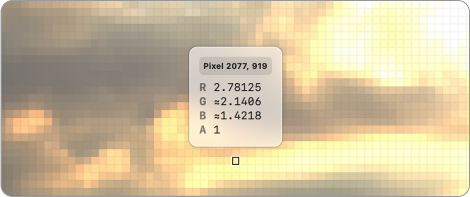

然后，你可以通过点击来选择该像素。或者，你可以点击并按住，让 Xcode 选中该像素、放大，并立即打开值检查器。

你还可以使用控制栏右侧的坐标输入控制来选择像素。输入你想要的像素坐标，比如 `X: 100` 和 `Y: 100`。根据你的纹理配置，Xcode 可能会显示附加控制。

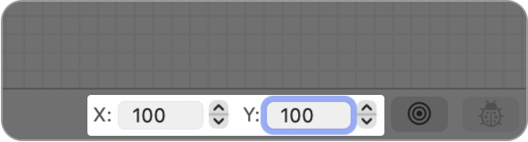

点击控制栏中的跳转按钮，可放大到选中的像素或采样点。当你点击每个文本字段右侧的步进器时，Xcode 会自动聚焦。

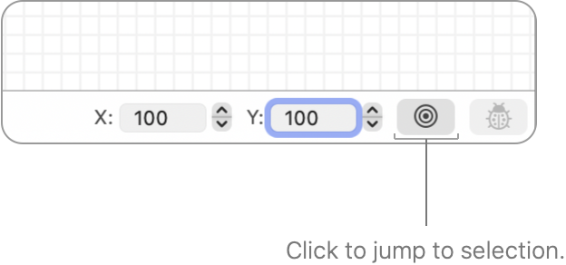

你也可以将指针移到另一个像素（或采样点）上以比较值。如果选中的像素在指针下方像素的左侧，选中像素的值会显示在检查器的左侧；如果在右侧，值则显示在右侧。Xcode 会在检查器中高亮显示选中像素的坐标，以显示哪些值对应哪个像素。

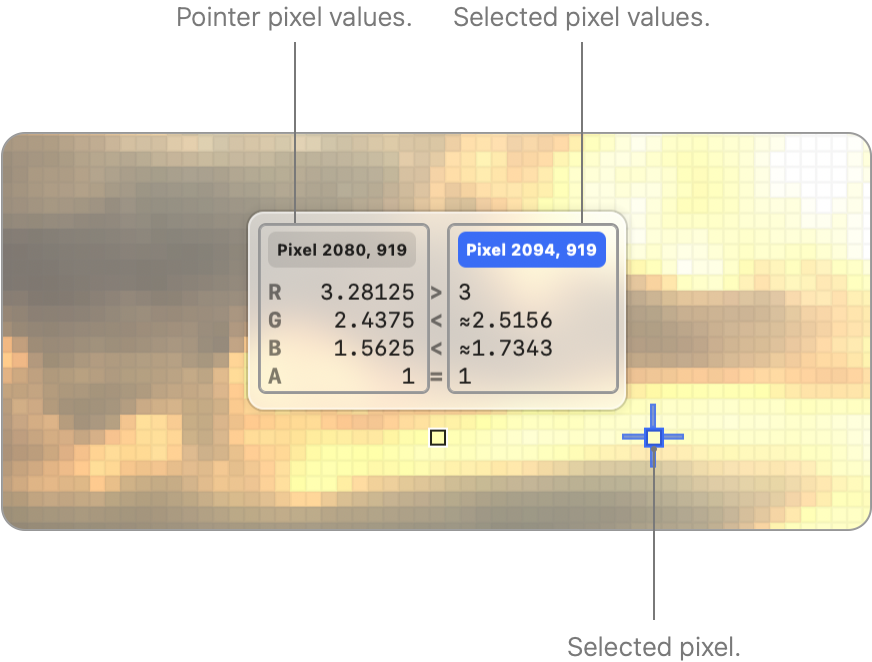

值检查器的屏幕截图，比较了指针下方像素与选中位置的像素值。指针悬停在像素 2080, 919 上，选中位置在像素 2094, 919。

如果你打开了多个附件查看器或纹理查看器，你可以跨不同的纹理比较像素。有关在 Xcode 工作区内配置编辑器的信息，请参阅 [Configuring the Xcode project window](configuring-the-xcode-project-window.md)。

### 比较 mipmap 级别

默认情况下，纹理查看器会并排显示你的纹理的所有 mipmap 级别。但是，如果你想直观地比较不同的 mipmap 级别，可以启用堆叠。点击纹理操作按钮，然后选择堆叠 Mips。

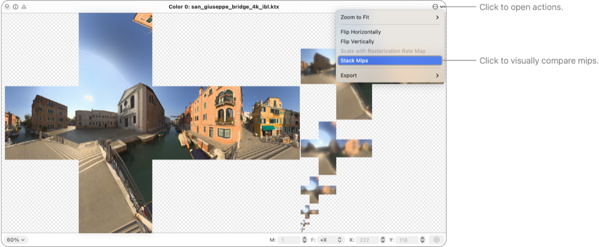

纹理查看器的屏幕截图，显示了一个带 mipmap 的立方体贴图纹理。操作菜单已打开，堆叠 Mips 菜单项已高亮显示。

拖动控制栏中的切片滑块，以直观地比较不同的 mipmap 级别。

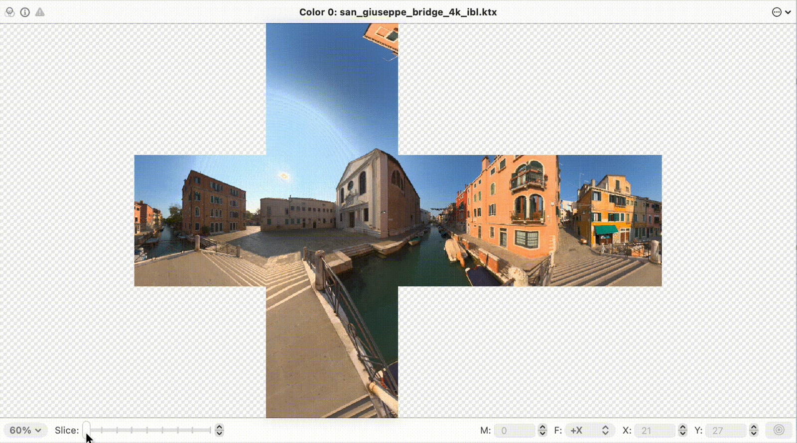

纹理查看器的屏幕录像，展示了用户沿滑块移动指针时纹理不同 mipmap 级别的可视化效果。

> [!note] 注意
> 默认情况下，纹理查看器会使用 z 坐标堆叠 3D 纹理，比如 [MTLTextureType.type3D](../metal/mtltexturetype/type3d.md)。你可以禁用堆叠以并排查看深度切片。如果你的 3D 纹理有多个 mipmap 级别，你可以选择堆叠 Mips 或堆叠 Z。

## 另请参阅

### Metal 资源检查

- [Inspecting acceleration structures](inspecting-acceleration-structures.md) — 通过检查你的加速结构来揭示光线相交瓶颈。
- [Inspecting buffers](inspecting-buffers.md) — 通过检查缓冲区内容来确认你的缓冲区格式。
- [Inspecting pipeline states](inspecting-pipeline-states.md) — 通过检查渲染和计算通道的属性来确定它们的行为。
- [Inspecting sampler states](inspecting-sampler-states.md) — 通过检查采样器状态的属性来验证其配置。
- [Inspecting shaders](inspecting-shaders.md) — 通过检查和编辑你的着色器来提升你的 App 的着色器性能。
