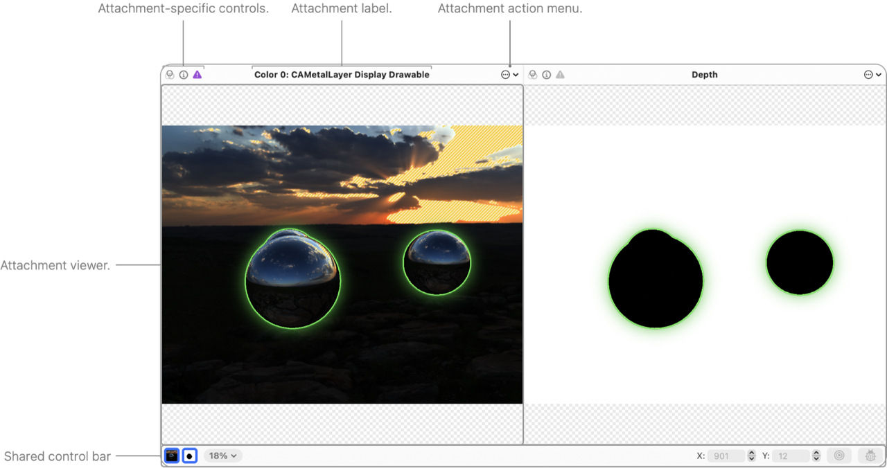
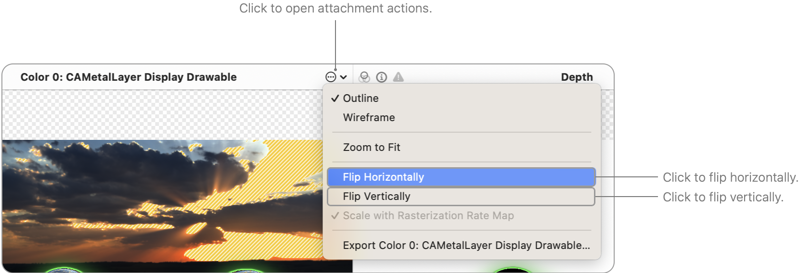
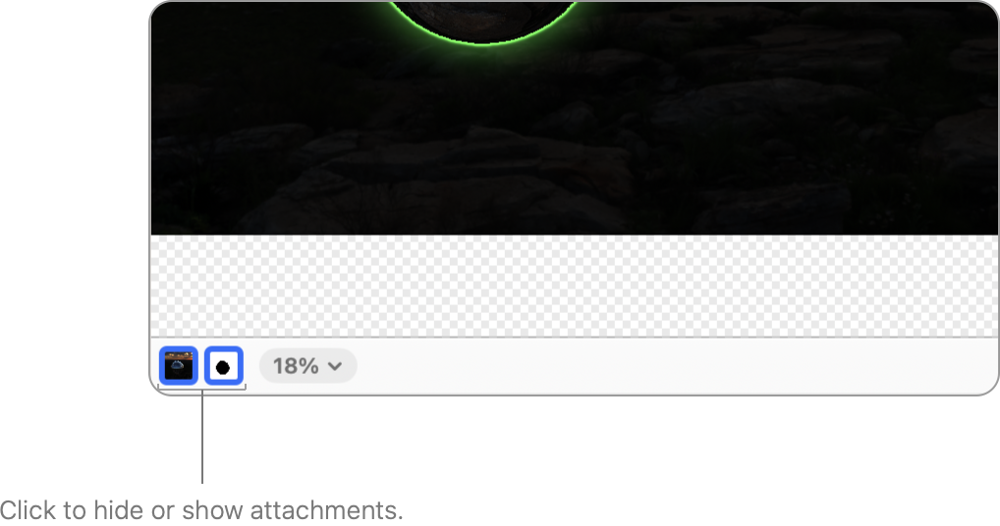
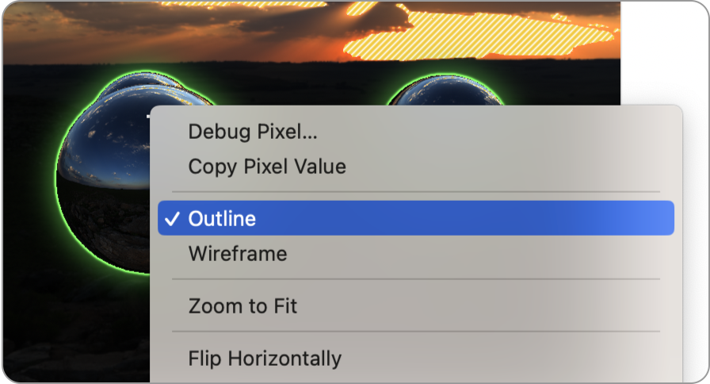
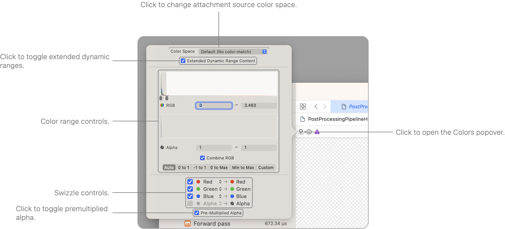
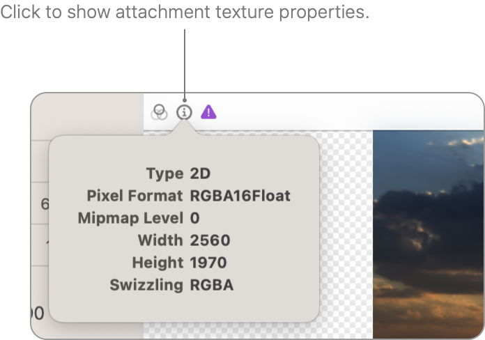
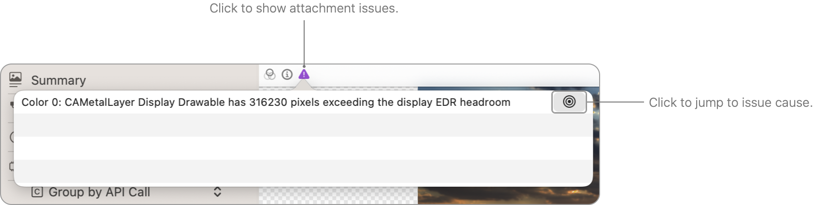
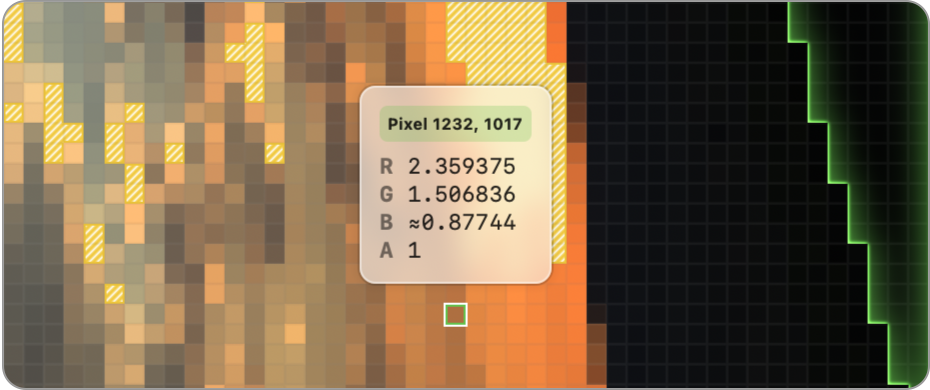
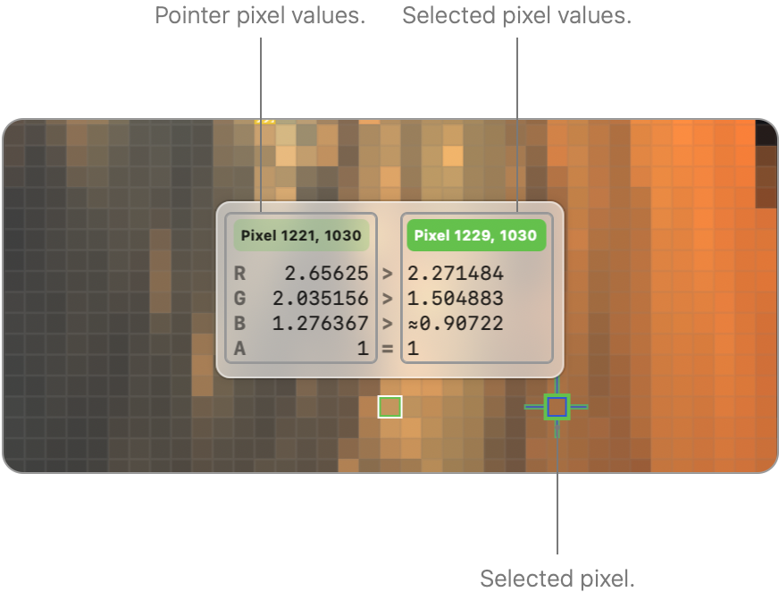
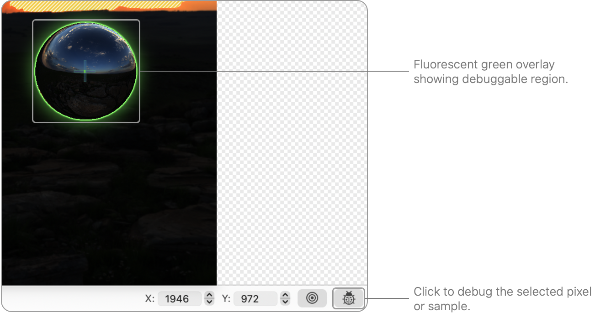

> 导航：[Technologies](../technologies.md) · [Xcode](../xcode.md) · [Debugging](debugging.md) · [Metal debugger](metal-debugger.md)

# 检查绘制命令的附件

文章

通过检查各个像素和采样点来发现附件问题。

## 概述

Metal 调试器允许你使用附件查看器查看渲染附件的内容。你可以检查各个像素（或采样点），并使用着色器调试器对其进行调试。要了解更多信息，请参阅 [Inspecting the bound resources for a command](inspecting-the-bound-resources-for-a-command.md)。

### 检查你的附件

附件查看器包含若干控制，供你与附件交互并显示附件。每个可见的附件都有自己的查看器和标题栏，其中包含特定于该附件的控制。附件查看器底部的控制栏包含同时作用于所有附件的控制。

### 翻转你的附件

如果你的渲染器使用了不同的坐标系，导致你的附件上下颠倒或水平翻转，你可以在附件查看器中将其翻转到正确的方向。点击附件操作按钮，然后选择水平翻转或垂直翻转。

### 配置可见附件

你可以使用控制栏左侧的预览控制来配置可见附件。要隐藏或显示某个附件，将指针移到附件预览上并点击以切换其可见性。

Xcode 同样会更新已隐藏附件的预览，因此你可以一目了然地看出它们是否包含任何值得关注的内容。

### 切换叠加层可见性

要隐藏叠加层（比如荧光绿轮廓线），请点击附件，然后点击已选中的叠加层以取消选中。

### 配置附件渲染

Xcode 会根据你的编码器和附件自动配置颜色属性，但你也可以通过点击特定于该附件的控制中的颜色按钮来手动配置它们。请遵循以下准则：

- 使用与你渲染时相同的颜色空间。Xcode 会自动将其配置为你的 App 在 [CAMetalLayer](../quartzcore/cametallayer.md) 上设置的 [colorspace](../quartzcore/cametallayer/colorspace.md) 属性。如果你没有设置此属性，请将附件查看器中的颜色空间配置为设备显示屏所使用的颜色空间。
  例如，如果你正在调试 iPhone 工作负载，请使用 sRGB。
- 如果你使用的显示屏支持扩展动态范围，你可以启用扩展动态范围内容选项，以扩展范围渲染附件。启用此选项后，Xcode 会在任何包含超出你的显示器 EDR headroom 的值的像素上绘制阴影线。降低显示器亮度以增加可用的 headroom。
- 如果你将颜色空间选择为默认（不进行颜色匹配），Xcode 会显示用于手动配置渲染的附加控制。然后你可以配置可见颜色的范围、通道重排，以及 alpha 是否已预乘。

纹理图像颜色选项弹出窗口的屏幕截图。它由颜色空间、色调映射和颜色重排的控制组成。

### 查看附件属性

你可以通过点击特定于该附件的控制中的信息按钮，来查看某个附件的属性，比如纹理宽度和高度。

### 查看附件问题

如果你的附件包含任何值为无穷、非数字，或超出你的显示器当前 EDR headroom 的像素（或采样点），特定于该附件的控制中的问题按钮就会变为可用状态。例如，如果你在片元着色器中意外除以 `0`，Xcode 会在任何不正确的像素（或采样点）上绘制阴影线。

你可以点击问题按钮来查看更多信息，然后点击跳转按钮以聚焦到导致该问题的像素（或采样点）。

问题弹出窗口的屏幕截图，显示存在超出显示器 EDR headroom 的像素。消息旁边出现一个按钮，用于跳转到其中一个此类像素。

### 检查像素值

将指针移到某个像素或采样点上以检查其值。

### 检查、选择和比较像素值

将指针移到某个像素上（如果你的渲染通道进行多重采样抗锯齿，则为某个采样点）以检查其值。

然后，你可以通过点击来选择该像素。或者，你可以点击并按住，让 Xcode 选中该像素、放大，并立即打开值检查器。

你还可以使用控制栏右侧的坐标输入控制来选择像素。输入你想要的像素坐标，比如 `X: 100` 和 `Y: 100`。根据你的纹理配置，Xcode 可能会显示附加控制，比如采样点索引。

如果选中的像素位于可调试区域内，坐标会以绿色高亮显示（参见下方的「调试像素」）。如果选中的像素位于此类区域之外，Xcode 会改用你的系统强调色进行高亮显示。

点击控制栏中的跳转按钮，可放大到选中的像素或采样点。当你点击每个文本字段右侧的步进器时，Xcode 会自动聚焦。

你也可以将指针移到另一个像素（或采样点）上以比较值。如果选中的像素在指针下方像素的左侧，选中像素的值会显示在检查器的左侧；如果在右侧，值则显示在右侧。Xcode 会在检查器中高亮显示选中像素的坐标，以显示哪些值对应哪个像素。

如果你打开了多个附件查看器或纹理查看器，你可以跨不同的纹理比较像素。要了解更多信息，请参阅 [Inspecting textures](inspecting-textures.md)。有关在 Xcode 工作区内配置编辑器的更多信息，请参阅 [Configuring the Xcode project window](configuring-the-xcode-project-window.md)。

值检查器的屏幕截图，比较了指针下方像素与选中位置的像素值。指针悬停在像素 1221, 1030 上，选中位置在像素 1229, 1030。

### 调试像素

Xcode 会用荧光绿叠加层勾勒出受当前绘制命令影响的任何区域。如果你注意到这些区域内有像素（或采样点）出现了意外的值，请选中它们，然后点击控制栏右侧的调试按钮开始调试片元着色器。Xcode 会自动打开你的片元着色器源代码，并显示该像素的详细线程执行历史记录。有关调试着色器的更多信息，请参阅 [Debugging the shaders within a draw command or compute dispatch](debugging-the-shaders-within-a-draw-command-or-compute-dispatch.md)。

## 另请参阅

### Metal 命令分析

- [Inspecting the bound resources for a command](inspecting-the-bound-resources-for-a-command.md) — 通过检查编码器中任意点的绑定资源来发现问题。
- [Inspecting the geometry of a draw command](inspecting-the-geometry-of-a-draw-command.md) — 通过检查当前几何图形，找出你的 App 的顶点、对象或网格函数中的问题。
- [Debugging the shaders within a draw command or compute dispatch](debugging-the-shaders-within-a-draw-command-or-compute-dispatch.md) — 使用着色器调试器识别并修复你的 App 中有问题的着色器。
- [Analyzing draw command and compute dispatch performance with GPU counters](analyzing-draw-command-and-compute-dispatch-performance-with-gpu-counters.md) — 通过检查性能计数器来识别帧捕获中的问题。
- [Analyzing draw command and compute dispatch performance with pipeline statistics](analyzing-draw-command-and-compute-dispatch-performance-with-pipeline-statistics.md) — 通过检查管线统计信息来识别帧捕获中的问题。
