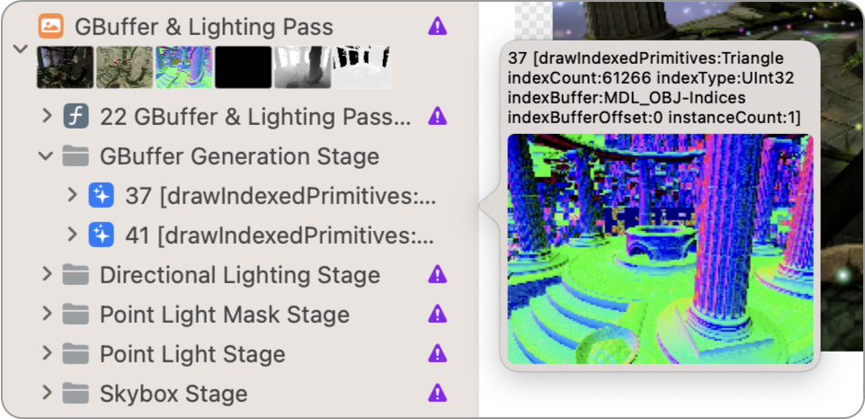
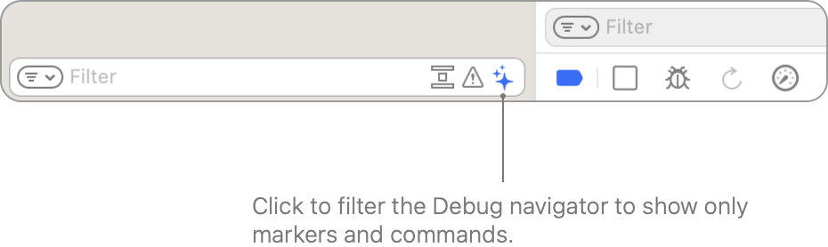
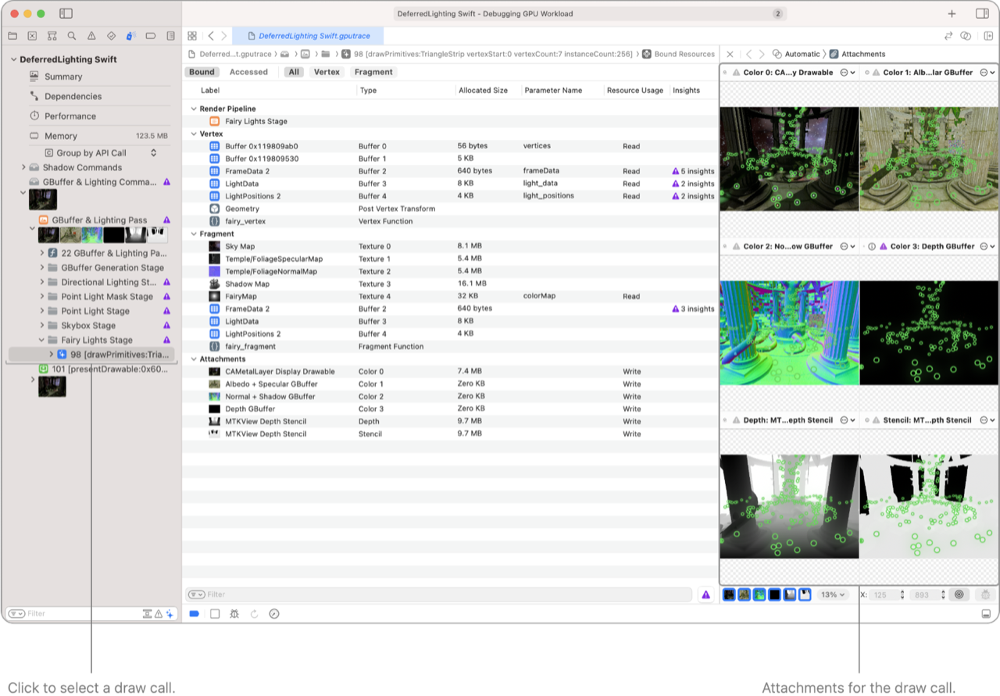
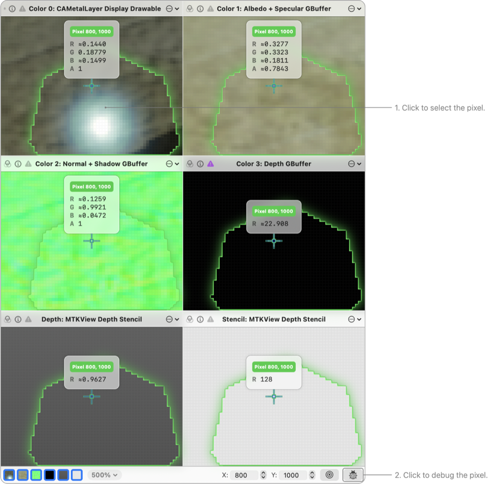
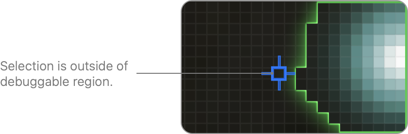
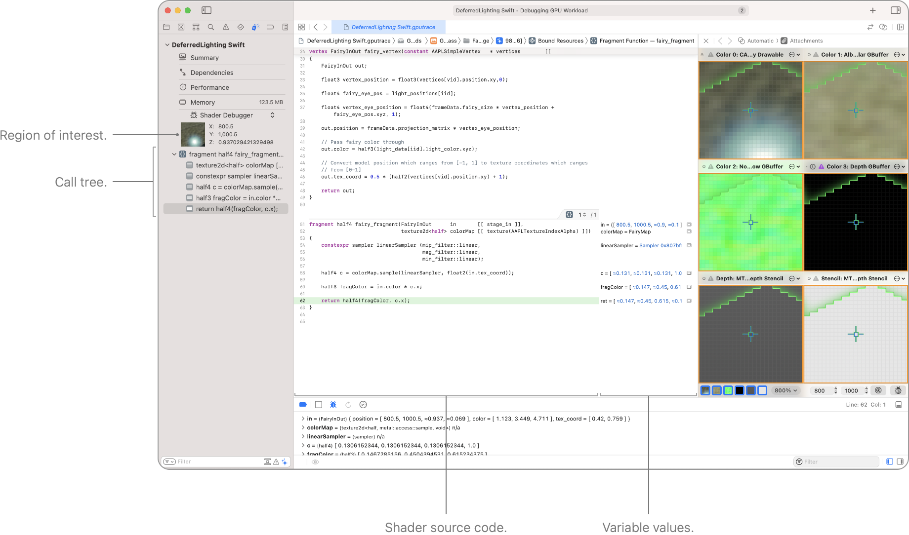

> 导航：[技术](../technologies.md) · [Xcode](../xcode.md) · [调试](debugging.md) · [Metal 调试器](metal-debugger.md)

# 调查视觉伪影

文章

使用 Metal 调试器（Metal debugger）发现、诊断并修复 App 中的视觉伪影（visual artifacts）。

## 概述

如果你在运行 App 时注意到任何视觉伪影，可以使用 Metal 调试器来查找并调查有问题的像素。首先，配置你的构建以包含着色器源代码（参见[使用嵌入的着色器源代码构建项目](building-your-project-with-embedded-shader-sources.md)）。然后，在你注意到想要调试的视觉伪影时，对 App 进行一次帧捕获（参见[在 Xcode 中捕获 Metal 工作负载](capturing-a-metal-workload-in-xcode.md)）。

有了帧捕获之后，使用调试导航器（Debug navigator）找到包含视觉伪影的绘制命令，并使用附件查看器（Attachments viewer）找到有问题的像素。对该像素进行调试以启动着色器调试器（shader debugger），然后逐行执行你的着色器源代码并检查变量值，直到你发现问题所在。接着，编辑着色器源代码并重新加载着色器，以验证你的修复是否有效。

### 在调试导航器中快速浏览渲染附件

在 Metal 调试器中，导航到有问题的绘制命令。当你把指针移动到左侧调试导航器中的各行上方时，Metal 调试器会显示第一个附件的预览。你可以借此快速找到任何值得进一步检查的绘制命令。

一张 Xcode 调试导航器的截图，展示了当指针悬停在列表中任意命令上方时出现的弹出窗口。

你还可以对导航器进行筛选，使其只显示标记和命令，从而更容易比较不同的绘制命令。

当你找到有问题的绘制命令时，点击它以选中它。Metal 调试器会自动在右侧的助理编辑器中显示你的附件。

一张 Metal 调试器的截图，为某个绘制命令并排展示了绑定资源查看器和附件查看器。

### 检查某个绘制命令的附件

使用附件查看器查找任何有问题的像素。你可以滚动来缩放，拖动来平移。有关附件查看器的更多信息，请参阅[检查绘制命令的附件](inspecting-the-attachments-of-a-draw-command.md)。

一张 Metal 调试器的截图，展示了当指针悬停在像素 721, 815 上方时，附件查看器与数值检查器一同显示的情形。Debug 按钮被高亮显示。

点击有问题的像素以选中它，然后点击 Debug 按钮。

如果有问题的像素不在可调试区域内，它会带有一个非绿色的选择指示符（如下方截图中的蓝色指示符）。这表示该绘制命令没有写入这个像素，因此你无法对它进行调试。由于附件查看器会记住你的缩放比例和位置，你可以在调试导航器中快速逐个查看不同的绘制命令，以找到正确的那一个。

一张 Metal 调试器的附件查看器截图，其中选中的像素落在某个绘制命令的可调试区域之外。

### 调试你的片段着色器

着色器调试器会在 Shader 编辑器（Shader editor）中显示着色器源代码（参见[检查着色器](inspecting-shaders.md)）。左侧的调用树显示了着色器中每一行已执行的代码。变量的值会显示在着色器源代码每一行的右侧。例如，在下方截图中，你可以看到 `in` 变量的值包含 `721.5`、`815.5` 等等。

一张 Metal 调试器的截图，并排展示了 Shader 编辑器和附件查看器。调试导航器显示了感兴趣的区域和调用树。

逐行执行你的着色器源代码并检查变量值，直到你发现问题所在。对着色器源代码进行修改，然后点击调试栏中的 Reload Shaders 按钮，以刷新变量值以及附件。

如果你仍然看到视觉伪影，请按需继续编辑着色器并重新加载，直到问题解决。

> [!important] 重要
> 对着色器源代码所做的更改只存在于 Metal 调试器之中。你原始的着色器源代码不会改变。
> 如果重新加载着色器后，你的着色器结果看起来正确，请务必将你的更改复制回原始的着色器源代码中。

要了解更多信息，请参阅[调试绘制命令或计算派发中的着色器](debugging-the-shaders-within-a-draw-command-or-compute-dispatch.md)。

## 另请参阅

### 基础

- [在 Xcode 中捕获 Metal 工作负载](capturing-a-metal-workload-in-xcode.md) — 通过配置你的项目来使用 Metal 调试器，分析 App 的性能。
- [以编程方式捕获 Metal 工作负载](capturing-a-metal-workload-programmatically.md) — 通过调用 Metal 的帧捕获功能，分析 App 的性能。
- [重播 GPU 跟踪文件](replaying-a-gpu-trace-file.md) — 在 Metal 调试器中使用 GPU 跟踪文件调试和分析 App 的性能。
- [优化 GPU 性能](optimizing-gpu-performance.md) — 使用 Metal 调试器找到并解决性能瓶颈。
- [使用交互式命令行工具调试](debugging-with-interactive-command-line-tools.md) — 无需离开终端即可调查 GPU 跟踪记录中的渲染问题。
- [通过 AI agent 调查 GPU 问题](investigating-gpu-issues-with-ai-agents.md) — 将一份庞大的 GPU 跟踪记录交给 AI agent 自主调查，从而找出问题的根本原因。
