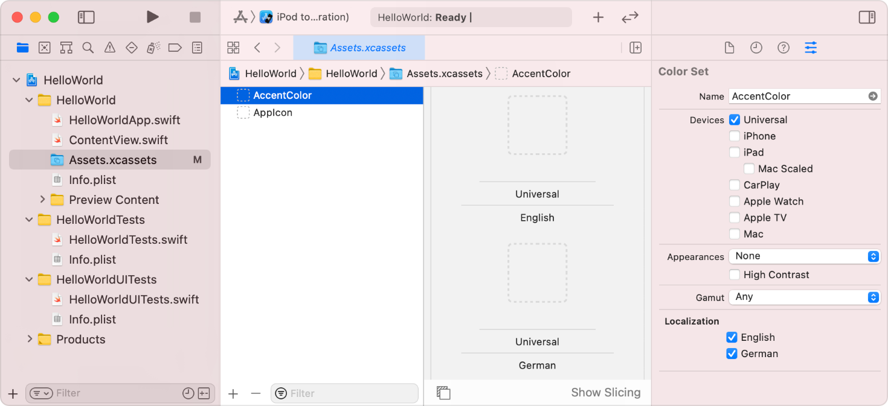

> 导航：[技术](../technologies.md) · [Xcode](../xcode.md) · [本地化](localization.md)

# 在目录中本地化素材

文章

使用素材目录（asset catalog）本地化颜色、图像、符号、watch 复杂功能（watch complication）等内容。

## 概述

你可以使用_素材目录_来组织和管理各种类型的素材，例如图像、精灵、纹理、贴纸和数据。大多数类型的素材都可以有多种变体，以支持不同的设备特征，包括针对语言和地区设置的变体。

你可以本地化某些类型的素材目录，并在 Xcode 中直接向目录添加这些素材的本地化版本。

可本地化的素材类型包括：

- 颜色集
- 图像集
- 符号集
- Watch 复杂功能
- Apple TV 图像堆栈
- 精灵图集

### 将素材目录添加到本地化中

在项目导航器中，选择素材目录，然后在编辑区域的大纲视图中选择你要本地化的素材。在属性检查器的 Localization 下，点按 Localize。选择你要为该素材添加的本地化。Xcode 会在编辑区域中显示相应的占位空间。

将本地化后的素材拖放到对应本地化的空间中，或者导出这些本地化内容，让本地化人员之后再添加素材。

## 另请参阅

### 资源和素材

- [向本地化中添加资源](adding-resources-to-localizations.md) — 在你添加到项目中的本地化里包含更多资源。
