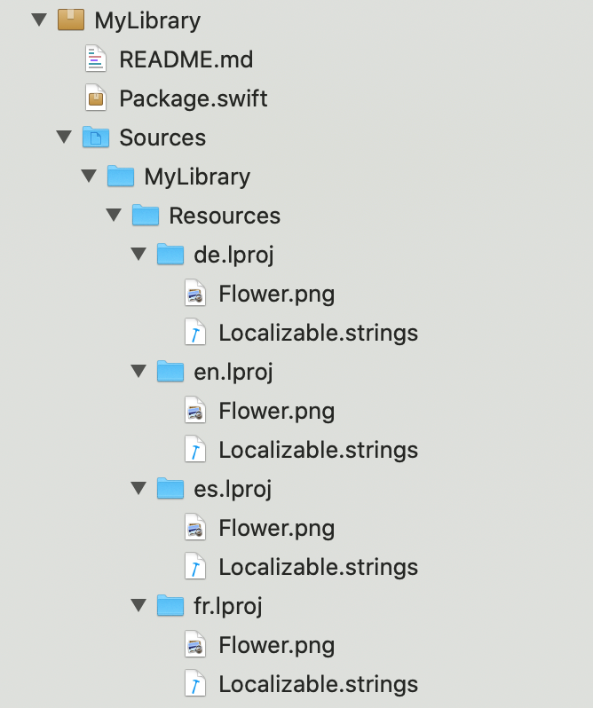

> 导航：[技术](../technologies.md) · [Xcode](../xcode.md) · [Swift 软件包](swift-packages.md)

# 本地化软件包资源

<sub>文章</sub>

确保你的 Swift 软件包为多种语言区域（locale）提供本地化资源。

## 概述

本地化 Swift 软件包中的资源有助于确保其对尽可能多的开发者有用。尽早采用本地化资源有助于避免后续的额外开发成本。

### 声明默认本地化

要本地化软件包的资源，请在软件包清单中将可选的 [defaultLocalization](../packagedescription/package/defaultlocalization.md) 参数传递给软件包初始化器。此示例将英语设为默认本地化：

```swift
let package = Package(
    name: "MyLibrary",
    defaultLocalization: "en",
    platforms: [
    ],
    products: [
        // Products 定义了软件包生成的可执行文件和库，并使它们对其他软件包可见。
    ],
    dependencies: [
        // Dependencies 声明了本软件包依赖的其他软件包。
        // .package(url: /* 软件包 url */, from: "1.0.0"),
    ],
    targets: [
        // Targets 是软件包的基本构建块。一个 target 可以定义一个模块或一个测试套件。
        // Targets 可以依赖本软件包内的其他 targets，以及本软件包所依赖的软件包中的 products。
)
```

在软件包清单中为 `defaultLocalization` 声明值后，Xcode 会要求软件包包含本地化资源。

> [!important] 重要
> 声明支持的语言或命名包含本地化资源的目录时，请使用两个字母的 ISO 639-1 或三个字母的 ISO 639-2 语言代码，并可附带可选的区域或文字标识符。欲了解更多信息，请参阅 [CFBundleDevelopmentRegion](../bundleresources/information-property-list/cfbundledevelopmentregion.md)。

### 将资源添加到特定语言目录

要使用 Xcode 的默认本地化机制，请将本地化资源放置在特定语言目录中。特定语言目录的名称使用 ISO 639 语言代码和可选标识符，后跟 `.lproj` 后缀，且不包含子目录。例如，在英国使用的英语资源位于名为 `en-GB.lproj` 的目录中。通过将软件包资源放置在以 `.lproj` 结尾的目录中并使用 ISO 639 语言代码，Xcode 可以自动推断语言。

将你的 `.lproj` 目录放在名为 `Resources` 的父目录中，以便你识别它包含软件包资源。

当你构建 Swift 软件包时，Xcode 会验证软件包的本地化资源并显示警告或错误，以帮助防止运行时出现问题。例如，Xcode 会检测：

- `.lproj` 目录内的子目录。
- 某个语言区域缺少资源。
- 重复、冲突或不可访问的资源。

以下截图显示了包含本地化资源的 Swift 软件包的结构。



<sub>在 Xcode 项目导航器中展开的 Swift 软件包截图，本地化资源目录位于名为 Resources 的父目录中。</sub>

### 本地化故事板与 Interface Builder 文件

如果 Swift 软件包包含故事板或 Interface Builder 文件作为资源，请采用基本国际化（base internationalization），这样本地化人员无需直接修改这些文件。要让 Xcode 自动识别 Swift 软件包中的基本国际化：

1. 在软件包清单中为 [defaultLocalization](../packagedescription/package/defaultlocalization.md) 声明一个值。
2. 为本地化资源创建一个目录，例如命名为 `Resources`。
3. 创建一个名为 `Base.lproj` 的子目录，并将软件包的故事板和 Interface Builder 文件放入其中。
4. 将所有支持语言的 `.lproj` 目录放置在 `Resources` 目录中。

如果你更愿意显式声明用于基本国际化的资源，请使用 process 规则并传递 [Resource.Localization.base](../packagedescription/resource/localization/base.md)。例如，使用以下方式声明一个支持基本国际化的 `.xib` 文件：

`.process(”path/to/MyViewController.xib”, localization: .base)`

有关基本国际化的更多信息，请参阅[国际化用户界面](https://developer.apple.com/library/archive/documentation/MacOSX/Conceptual/BPInternational/InternationalizingYourUserInterface/InternationalizingYourUserInterface.html#//apple_ref/doc/uid/10000171i-CH3-SW2)。

### 访问本地化资源

Xcode 会识别 `.lproj` 目录中的本地化资源，并自动创建资源包（resource bundle）。因此，你可以使用在 App 开发中已熟知的 API 在软件包代码中访问本地化资源文件。例如，使用 [Foundation](../foundation.md) 在运行时访问本地化字符串：

`let localizedString = NSLocalizedString(”a_localized_string”, bundle: Bundle.module, comment: “a comment”)`.

同样，你可以使用 [UIImage](../uikit/uiimage.md) 访问本地化图像资源：

`UIImage(named: “image name”, in: .module, with: nil)`.

有关更多信息，请参阅[在代码中访问资源](bundling-resources-with-a-swift-package.md#Access-a-resource-in-code)。

## 另请参阅

### 软件包创建

- [使用 Xcode 创建独立的 Swift 软件包](creating-a-standalone-swift-package-with-xcode.md) — 将可执行或可共享的代码捆绑到独立的 Swift 软件包中。
- [将资源与 Swift 软件包捆绑](bundling-resources-with-a-swift-package.md) — 将资源文件添加到 Swift 软件包并在代码中访问它们。
- [将二进制框架作为 Swift 软件包分发](distributing-binary-frameworks-as-swift-packages.md) — 通过创建包含一个或多个 XCFramework 的 Swift 软件包，使二进制文件可供其他开发者使用。
- [与 App 同步开发 Swift 软件包](developing-a-swift-package-in-tandem-with-an-app.md) — 将已发布的 Swift 软件包作为本地软件包添加到 App 项目中，并同步开发软件包和 App。
- [使用本地软件包组织代码](organizing-your-code-with-local-packages.md) — 通过将 App 代码组织到本地 Swift 软件包中，简化维护、促进模块化并鼓励代码复用。
- [PackageDescription](../packagedescription.md) — 创建可复用代码，以轻量级方式组织代码，并在项目之间或与其他开发者之间共享代码。
