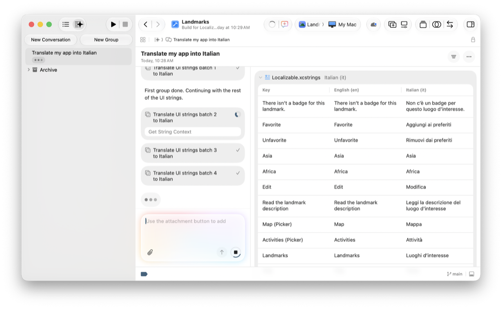
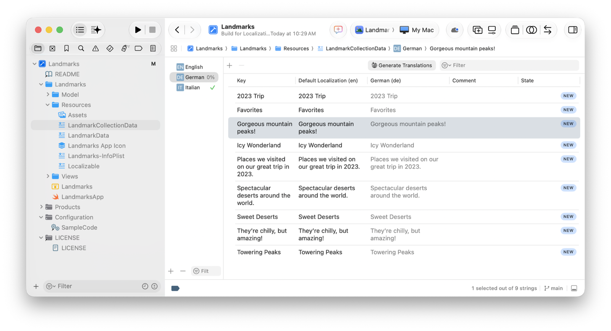
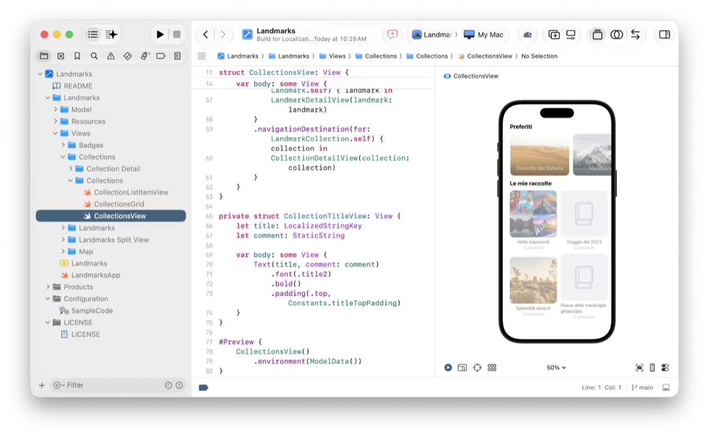

> 导航：[技术](../technologies.md) · [Xcode](../xcode.md) · [编码智能](coding-intelligence.md)

# 使用代理本地化你的 App

<sub>文章</sub>

使用代理编码工具将 App 中的字符串翻译成多种语言和区域。

## 概述

代理通过为你执行任务简化了 App 的本地化过程，例如添加语言、更新字符串目录（string catalog）、翻译字符串，甚至在需要时添加特定语言的复数变体（plural variant）。Xcode 向代理提供正确的上下文和特定于语言的样式指导，使其为你的 App 做出最佳翻译。

开始之前，请在“智能”设置中启用代理，并在编码助理中选择该代理。有关更多信息，请参阅[设置编码智能](setting-up-coding-intelligence.md)。

## 添加语言和翻译

在编码助理中，在消息文本字段中输入提示，例如：

- _将我的 App 翻译成意大利语。_

Xcode 通过添加语言为你的项目准备翻译。然后，它构建项目中的所有目标，将所有可本地化的字符串添加到字符串目录。Xcode 还会本地化信息属性列表文件（Information Property List）中人类可读的文本。

如果你有一个大型项目，可以将字符串组织到多个字符串目录中。如果你使用`tableName`或`table`参数将字符串目录名称传递给本地化 API，Xcode 会将字符串添加到具有该名称的字符串目录中。否则，它将使用默认文件名`Localizable.xcstrings`。

在翻译过程中，Xcode：

- 提供字符串在代码中出现位置的上下文
- 识别字符串的复数变体和设备变体
- 识别相似的字符串，以与你现有的术语保持一致
- 遵循任何自定义样式的要求，例如适合儿童的用语或正式商务语气

你可以在逐字稿中查看翻译的进度，并在工件窗格（artifacts pane）中看到 Xcode 更改的文件。



<sub>一张截图，显示对话侧边栏、中间的本地化逐字稿，以及右侧工件窗格中对字符串目录的更改。逐字稿显示“将我的 App 翻译成意大利语”的提示正在处理中，其中一个翻译批次正在进行，两个翻译批次已完成。工件窗格显示“Localizable”字符串目录已翻译成意大利语。</sub>

代理完成翻译后，Xcode 会在逐字稿中显示更改摘要。更改摘要包括工件区域中添加或更改的文件的详细信息。你可以将 Xcode 创建的文件移动到项目中的其他位置。

为了区分代理翻译和用户提供的翻译，Xcode 会在字符串目录编辑器中将翻译的状态设置为“机器翻译”（Machine Translated）。如果你将本地化导出为 XML 本地化交换文件格式（XLIFF），Xcode 还会将`state-qualifier`属性设置为`leveraged-mt`。

## 使用可本地化的 API

如果 Xcode 在更新字符串目录时遗漏了一些面向用户的字符串，请确保你在代码中使用了可本地化的 API。

如果你的 App 使用 [SwiftUI](../swiftui.md)，该框架提供的视图将面向用户的字符串视为可本地化的，因此 Xcode 会自动找到它们。然而，其他创建人类可读字符串的 Swift 代码，必须显式使用 [init(localized:)](<../swift/string/init(localized_).md>) 初始化器才能成为可本地化的。

```swift
String(localized: "Hello, world!")
```

更新你的 Swift 代码以使用此初始化器，然后再次构建你的 App 以更新字符串目录。

有关其他初始化器选项，请参阅[创建本地化字符串](../swift/string.md#Creating-a-Localized-String)。对于 UIKit 和 AppKit，请确保使用类似的可本地化 API。有关更多信息，请参阅[准备 App 文本以供翻译](preparing-your-apps-text-for-translation.md)。

## 在字符串目录编辑器中生成翻译

你也可以在字符串目录编辑器中生成特定的翻译。使用编辑器工具栏中的“生成翻译（Generate Translations）”按钮将翻译添加到语言和字符串：

- 要为所有语言生成缺失的翻译，请在侧边栏中选择源本地化，然后点按“生成翻译”。
- 要为特定语言生成缺失的翻译，请在侧边栏中选择该语言，然后点按“生成翻译”。
- 要为某种语言中的特定字符串生成翻译，请选择该语言，在编辑器区域中选择字符串，然后点按“生成翻译”。

你也可以按住 Control 键点按侧边栏中的语言或编辑器中的字符串，然后从上下文菜单中选择“生成翻译”。



<sub>一张截图，显示左侧的项目导航器（Project navigator）和右侧的字符串目录编辑器。字符串目录编辑器在侧边栏中显示已添加但翻译进度为零的德语，详细区域中选中了一个字符串，工具栏中显示了“生成翻译”按钮。</sub>

## 测试机器翻译

你可以立即在预览中测试翻译，或通过在模拟器或实体设备上运行你的 App 来测试。

在 Device Hub 中运行你的 App 之前，先在运行方案（Run scheme）中设置语言和区域。然后确保更改语言时所有文本都能适配。例如，使用“动态字体”（Dynamic Type），以便在需要更多高度的语言中，文字和字母不会被裁剪。



<sub>一张截图，显示左侧的项目导航器中选中了一个源文件，中间的源代码编辑器显示了预览的代码，右侧的画布（canvas）显示了翻译成意大利语的预览。</sub>

此外，请验证从右到左的语言是否有足够的空间。有关更多信息，请参阅[预览本地化](previewing-localizations.md)和[在运行 App 时测试本地化](testing-localizations-when-running-your-app.md)。

从使用你支持的语言并居住在你支持的区域的人们那里获取反馈。有关分发选项，包括使用 TestFlight，请参阅[向注册设备分发你的 App](distributing-your-app-to-registered-devices.md)和[为 beta 测试和发布分发你的 App](distributing-your-app-for-beta-testing-and-releases.md)。

## 提供翻译指导

你可以向配置文件（例如 `AGENTS.md` 或 `CLAUDE.md` 文件）添加翻译指导，代理会自动读取这些文件。例如，在你的代理配置文件中，引用你存储在项目中单独的 `TRANSLATION.md` 文件中的翻译指导。你可以包含 App 使用的术语词汇表，或代理不应翻译的字符串列表。

要在所有 Xcode 项目之间共享配置文件，请参阅[自定义代理环境](extending-and-customizing-agents.md#Customize-agent-environments)。

## 另请参阅

### 相关文档

- [使用字符串目录本地化和变体文本](localizing-and-varying-text-with-a-string-catalog.md) — 使用字符串目录管理可本地化字符串、添加语言、翻译文本、处理复数变体以及按设备变体文本。
