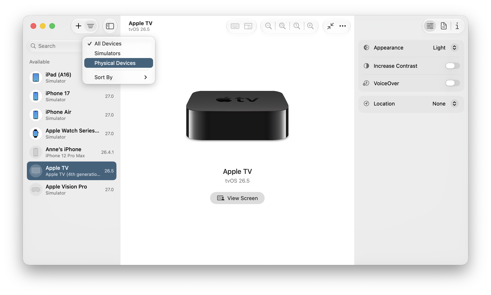
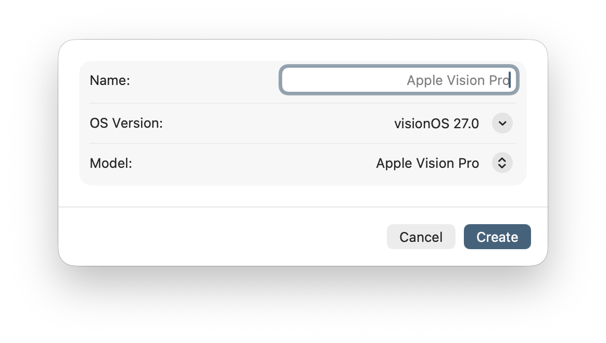
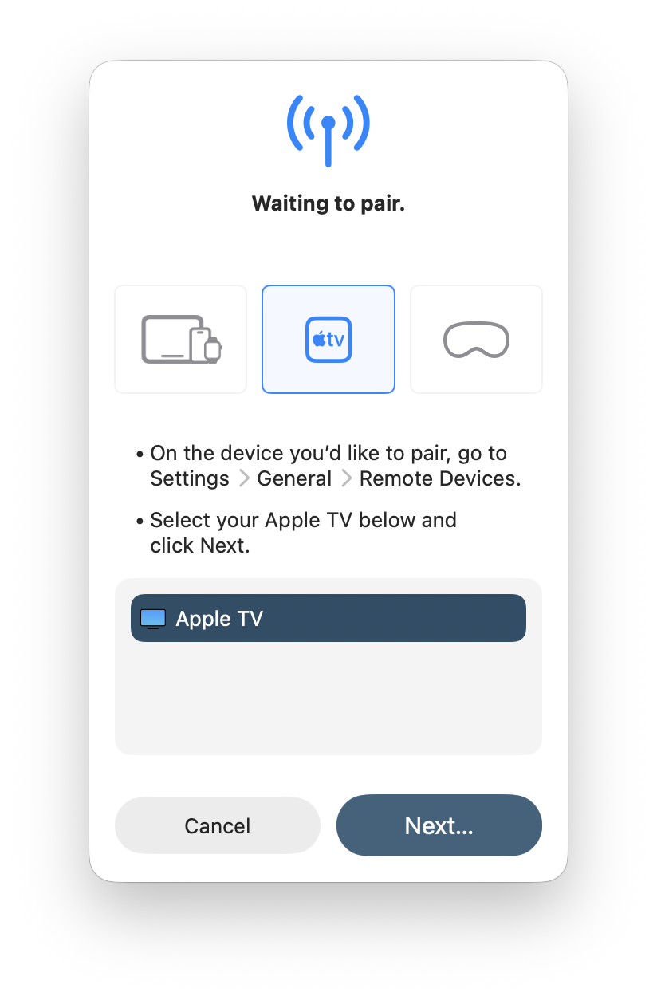

> 导航：[技术](../technologies.md) · [Xcode](../xcode.md) · [Device Hub](device-hub.md)

# 在 Device Hub 中管理模拟与实体设备

文章

添加自定义模拟器并将实体设备与你的 Mac 配对，以便在 Xcode 中将它们选为运行目标。

## 概述

使用 Device Hub 可添加特定的模拟器配置，并配对你要用来测试 App 的实体设备。

要在不运行 App 的情况下从 Xcode 打开 Device Hub，请从运行目标弹出菜单中选取“管理设备…”，或者选取 Xcode > 打开开发者工具 > Device Hub。如果你是在模拟器上运行 App 则会不同，Device Hub 将打开一个紧凑的窗口，你可以将其展开以显示侧边栏。

在 Device Hub 侧边栏中，只有你在此处添加的模拟器，或你之前在 Xcode 中选为运行目标的模拟器才会出现。同样，只有与你的 Mac 配对的实体设备才会出现。要分别查看可用的模拟设备或实体设备，请从侧边栏顶部的过滤弹出菜单中选取“模拟器”或“实体设备”。

Device Hub 扩展窗口的截图，其中侧边栏显示了模拟设备和实体设备并打开了过滤菜单，中间的画布显示了一台 Apple TV 设备，右侧是设置检查器。

要查看设备的状态，在侧边栏中选择该设备，任何问题都会显示在右侧的画布中。如果你当前正在该设备上运行 App 或已启动模拟设备，则会改为显示设备屏幕。要在检查器中进一步了解设备信息，请点按工具栏最右侧的“信息”按钮。

如需了解如何在 Device Hub 管理的设备上运行你的 App，请参阅[在模拟设备或实体设备上运行你的 App](running-your-app-on-simulated-or-physical-devices.md)。

## 添加额外的模拟器

你可以为 Xcode 运行目标弹出菜单中没有出现的特定平台和操作系统版本添加模拟器。

要添加具有特定配置的模拟器，请点按侧边栏顶部的“添加设备”按钮（+），然后从弹出菜单的“模拟器”下方选择一台设备。在对话框中，你可以视需要输入模拟器的名称，并选择操作系统版本与机型，然后点按“创建”。该模拟器将显示在侧边栏的“可用”下方。

要从 Device Hub 移除模拟器，请在侧边栏中按住 Control 键点按该模拟器，然后选取“移除”。

## 将实体设备与你的 Mac 无线配对

> [!important] 重要
> 将你的 iPhone 或 iPad 升级至 iOS 或 iPadOS 27 或更高版本才可进行无线配对；否则，请使用线缆。

首先，确保设备与你的 Mac 连接到同一个 Wi-Fi 网络，以便 Mac 能够发现该设备。

然后，点按工具栏中的“添加设备”按钮（+），并从弹出菜单中选取“配对附近的设备…”。接着，从表单（sheet）顶部的按钮中选择设备类型，并按照出现的指示操作。例如，你可能需要先在设备上启用开发者模式才能继续。

对于首次配对的设备，在你于 Device Hub 中开始配对流程之前，设备上可能不会显示“开发者模式”设置。要配对 Apple Watch，请在关联的 iPhone 和 Apple Watch 上都启用开发者模式。更多信息，请参阅[在设备上启用开发者模式](enabling-developer-mode-on-a-device.md)。

对于 tvOS 和 visionOS 设备，请确保你的 Wi-Fi 网络已启用 IPv6。然后通过本地网络将设备广播到目标 Mac：

- 在 visionOS 中，选取“设置”>“通用”>“远程设备”。
- 在 tvOS 中，选取“设置”>“遥控器与设备”>“远程 App 与设备”。

如果 Mac 上出现对话框，询问是否允许其查找设备，请点按“允许”。在 Device Hub 表单中，选择其发现的设备并点按“下一步”。在下一个表单中，输入设备上显示的 PIN 码。

无线配对实体设备时出现的表单截图，其中选中了 Apple TV，下方是设备专属的指示。

当设备上出现“信任此电脑？”对话框时，轻点“信任”。对于已连接 iPhone 的 Apple Watch，请在 iPhone 和 Apple Watch 上都轻点“信任”。如果你不小心关闭了信任对话框，或轻点“信任”后设备未立即显示在 Device Hub 中，请尝试重新启动设备。

完成以上步骤后，设备就会出现在 Device Hub 侧边栏中。如果日后升级了操作系统，你需要重新配对设备。要主动取消设备配对，请按住 Control 键点按侧边栏中的设备，然后选取“取消配对”。

## 使用线缆配对设备

使用合适的线缆将设备连接到你的 Mac。如果设备上出现“信任此电脑”对话框，请轻点“信任”。

在 Device Hub 中，于侧边栏内选择该设备，然后按照画布中的指示操作。如果出现“配对”按钮，请点按它。如有必要，请在设备上启用开发者模式。更多信息，请参阅[在设备上启用开发者模式](enabling-developer-mode-on-a-device.md)。

对于 Apple Watch，请先配对与之关联的 iPhone。对于 Apple Watch Series 5 或更早机型，请确保你的 Mac 已连接到与手表相同的、兼容 Bonjour 的 Wi-Fi 网络。否则，你的 Apple Watch 将不会显示。

完成这些步骤后，设备将显示在 Device Hub 侧边栏的“可用”下，并且画布中会出现一个“查看屏幕”按钮。你可以断开物理线缆，然后通过 Xcode，使用与 Mac 在同一网络中且已启用 IPv6 的 Wi-Fi，在该设备上运行 App。

> [!note] 注意
> 对于较早版本的 iOS，Xcode 要求你的 iPhone 始终保持与 Mac 的物理连接，才能在任意机型的 Apple Watch 上运行你的 App。

## 另请参阅

### 基础

- [在模拟设备或实体设备上运行你的 App](running-your-app-on-simulated-or-physical-devices.md)——在模拟的 iOS、iPadOS、tvOS、visionOS 或 watchOS 设备上，或在与你的 Mac 配对的实体设备上启动你的 App。
- [在设备上启用开发者模式](enabling-developer-mode-on-a-device.md)——授予或拒绝本地安装的 App 在 iOS、iPadOS、watchOS 和 visionOS 中运行的权限。
