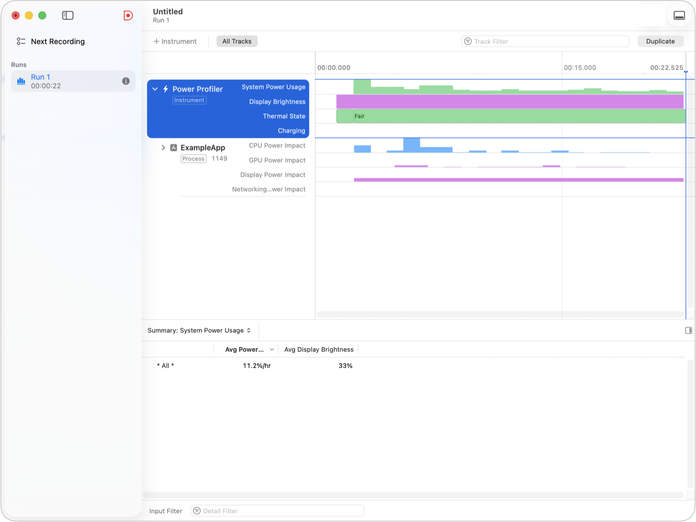
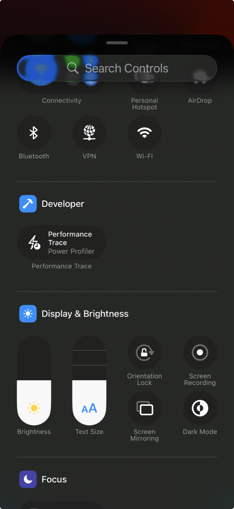

> 导航：[技术](../technologies.md) · [Xcode](../xcode.md) · [性能与指标](performance-and-metrics.md)

# 使用 Power Profiler 测量 App 的功耗

文章

无论设备是否连接到 Xcode，你都可以分析你的 App 的功耗影响（power impact）。

## 概述

设备的各个子系统在 App 使用时，需要从电池中消耗额外电力。高效使用这些子系统可以减少你的 App 的功耗需求，从而延长用户需要充电前的时间，并改善他们使用你的 App 的体验。有关更多信息，请参阅[分析 App 的电池使用情况](analyzing-your-app-s-battery-use.md)。

使用 Instruments 中的 Power Profiler 来收集和分析你的 App 对增加功耗的设备子系统的使用数据。或者，当你不在办公桌前时，在你的设备上使用 Power Profiler 记录一个性能跟踪（performance trace），然后在 Instruments 中可视化数据。Power Profiler 适用于 iOS 26 或更高版本的 iPhone，以及 iPadOS 26 或更高版本的 iPad。

基于你的分析结果，制定计划来采用节能设计和 API 最佳实践，以减少你的 App 的功耗。对比更改前后的跟踪数据，以验证更改确实降低了 App 的功耗。

### 使用 Instruments 记录和分析功耗跟踪

确保你的设备在 Xcode 中可用，无论是通过无线方式还是使用线缆，并在 Xcode 中将运行目标设置为你想要使用的设备。有关更多信息，请参阅[在模拟或物理设备上运行 App](running-your-app-on-simulated-or-physical-devices.md)。按照以下步骤记录一个功耗跟踪：

1. 在 Xcode 中，选择 Product > Profile。
2. 在 Instruments 打开的“选择模板…”窗口中，选择“空白”模板。
3. 点击 Add Instrument 按钮，然后选择 Power Profiler instrument。
4. 选择要记录的目标设备和 App。如果你选择“所有进程”，Instruments 仅记录整个系统的功耗跟踪，并且不会报告你的 App 的功耗指标。
5. 点击记录以开始收集数据。
6. 与你想要分析的 App 中的功能进行交互。
7. 在 Instruments 中，点击 Stop 按钮以停止收集数据。

Instruments 的截图。Power Profiler 轨道显示了整个系统功耗、显示亮度、热状态和充电状态的通道。App 的轨道显示了来自不同设备子系统的功耗影响的通道。

Instruments 中的 Power Profiler 轨道显示了整个系统功耗，以每小时消耗的总电池能量中的比例表示。此外，它还显示以下信息：

- 设备是否连接到充电器
- 设备的热状态
- 显示亮度
- Apple silicon 处于休眠状态的时段

Xcode 在与你的设备配对时会使 Apple silicon 保持唤醒状态，因此 Instruments 仅在你于未连接到 Xcode 的设备上收集性能跟踪时才显示休眠和唤醒事件。请参阅[在设备上收集功耗数据](measuring-your-app-s-power-use-with-power-profiler.md#Gather-power-consumption-data-on-a-device)。

> [!note] 注意
> 当设备正在充电（无论通过线缆还是 MagSafe）时，Instruments 将整个系统功耗报告为 `0`。要记录整个系统功耗，请将设备配对到 Xcode 并使用无线调试。

点击轨道左侧的展开三角形以展开 Power Profiler 轨道。Power Profiler 会为你的目标 App 或扩展显示一个轨道。该轨道包含多个通道，显示该进程因使用 CPU、GPU、显示器和网络而导致的功耗影响。

功耗影响指标的值越高，表示功耗越大。你可以在时间线中比较功耗影响指标，例如，查看你的 App 是否因网络使用而非 CPU 使用导致了更大的功耗影响，并优先调查子系统。你可以随时间比较功耗影响指标，包括同一设备上的多次跟踪。

> [!important] 重要
> 功耗影响指标值因设备型号而异，因此你无法比较在不同型号设备上记录的功耗影响指标值。

点击你的 App 轨道旁边的展开三角形，以显示提供有关你的 App 使用设备子系统的更详细信息的通道。

### 在设备上收集功耗数据

某些场景难以在连接到你 Mac 的设备上复现，例如低电量情况，以及通过 CarPlay 使用你的 App。在这些情况下，请在设备上收集一个性能跟踪，然后将其传输到你的 Mac，以便在 Instruments 中分析。测试你 App 的人员也可以在使用你的 App 时收集性能跟踪，并与你共享跟踪文件。

要设置设备以收集包含功耗指标的性能跟踪：

1. 按照[在设备上启用开发者模式](enabling-developer-mode-on-a-device.md)中的步骤打开开发者模式。
2. 打开“设置”，并导航至“开发者”>“性能跟踪”。
3. 打开“性能跟踪”，并按照设备上的提示进行操作。
4. 将跟踪模式更改为“Power Profiler”。
5. 在已监控 App 列表中，点击你 App 名称旁边的开关，以开启对你 App 的跟踪。如果你未为任何 App 开启跟踪，则“性能跟踪”仅会记录整个系统的功耗指标。
6. 从屏幕右上角向下轻扫以打开“控制中心”。
7. 点击“添加”按钮（+）。
8. 点击“添加控制”。
9. 选择“性能跟踪”控制。

要收集一个功耗跟踪：

1. 打开“控制中心”。
2. 点击“性能跟踪”控制。
3. 与你的 App 进行交互。“性能跟踪”最多可收集 10 小时的数据。
4. 再次在“控制中心”中点击“性能跟踪”控制以停止收集性能数据。

要将功耗跟踪发送到你的 Mac 或其他开发者：

1. 打开“设置”。
2. 导航至“开发者”>“性能跟踪”。
3. 在可用跟踪文件列表中，点击跟踪文件旁边的“共享”按钮。
4. 与其他开发者共享跟踪文件，或使用隔空投送将其发送到你的 Mac。

在“访达”中，双击你收到的 `*.aar` 文件，以将其解压缩为一个可在 Instruments 中打开的 `*.atrc` 文件。

### 进行更改以减少功耗

结合来自 Power Profiler 的信息与使用其他工具收集的数据，来识别你的 App 功能如何耗电，并规划你的性能优化工作。

如果你的 App 消耗大量 CPU 功耗，请将 Power Profiler 与 CPU Profiler、Processor Trace 或 CPU Counters instrument 结合使用，以将高功耗与你 App 运行的代码关联起来，并确定需要提高效率的函数。有关更多信息，请参阅[使用 Processor Trace instrument 分析 CPU 使用情况](analyzing-cpu-usage-with-processor-trace.md)和[解决 CPU 瓶颈](addressing-cpu-bottlenecks.md)。

如果你的 App 消耗大量 GPU 功耗，请使用 Metal 调试器来寻找使你的 App 的 GPU 使用更高效的机会。有关更多信息，请参阅[优化 GPU 性能](optimizing-gpu-performance.md)。

如果你的 App 消耗大量显示功耗，请考虑调整你的 App 的 UI 以降低其平均像素亮度。例如，确保你的 App 支持深色外观。有关更多信息，请参阅[在界面中支持深色模式](../uikit/supporting-dark-mode-in-your-interface.md)。

如果你的 App 消耗大量网络功耗，请将 Power Profiler 与 Network Connections 和 HTTP Traffic instrument 结合使用，以将高功耗与你 App 发出的网络请求关联起来，并确定减少网络连接频率或 App 传输数据量的策略。有关更多信息，请参阅[使用 Instruments 分析 HTTP 流量](../foundation/analyzing-http-traffic-with-instruments.md)。

在做出更改后，再次使用 Power Profiler 来验证你的更改是否改善了你的 App 的功耗。考虑在更改前后捕获多次记录，因为设备状态和其他外部因素会影响为每个指标记录的特定值。

## 另请参阅

### 电源

- [分析 App 的电池使用情况](analyzing-your-app-s-battery-use.md) — 通过减少 App 的功耗，来增加你的 App 在单次电池充电后的可用使用时间。
- [减少 App 的电池使用](reducing-your-app-s-battery-use.md) — 采用设计原则和推荐的 API 以消耗更少电力。
