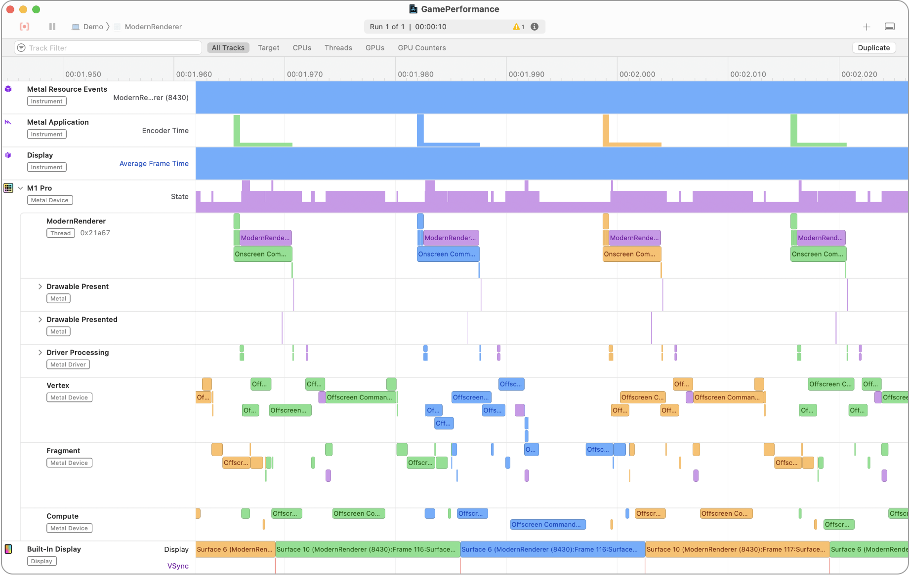

> 导航：[技术](../technologies.md) · [Xcode](../xcode.md) · [调试](debugging.md)

# Metal 开发者工作流程

定位并修复与你的 App 使用 Metal API 和 GPU 函数相关的问题。

## 概述

Metal 附带了一套全面的高级开发者工具套件，可帮助你调试和优化你的 Metal App。

### 运行时诊断

你可以在运行 App 时启用 API Validation（API 验证），以检查 Metal API 的错误使用。更多信息，请参阅[验证你的 App 的 Metal API 使用](validating-your-apps-metal-api-usage.md)。

在运行 App 时启用 Shader Validation（着色器验证），以检查越界内存访问、遗漏的 `useResource` 调用以及堆栈溢出等问题。更多信息，请参阅[验证你的 App 的 Metal 着色器使用](validating-your-apps-metal-shader-usage.md)。

Metal Performance HUD（Metal 性能 HUD）提供一个视觉叠加层，用于在你的 App 运行时捕获性能问题。更多信息，请参阅[监控你的 Metal App 的图形性能](monitoring-your-metal-apps-graphics-performance.md)。

### 运行时性能分析

Instruments 中的 Metal System Trace（Metal 系统追踪）工具提供了 CPU 和 GPU 上并行工作以及 Metal App 内存使用情况的直观时间线。

你可以使用 Game Performance（游戏性能）模板（参见[分析你的 Metal App 的性能](analyzing-the-performance-of-your-metal-app.md)）或 Game Memory（游戏内存）模板（参见[分析你的 Metal App 的内存使用](analyzing-the-memory-usage-of-your-metal-app.md)）开始分析。

### 高级 Metal 调试和分析

Xcode 中的 Metal Debugger（Metal 调试器）提供了用于调试和分析你的 Metal App 的高级工具。

你可以使用 Dependencies（依赖）查看器和 Memory（内存）查看器获取 Metal 工作负载的摘要，检查单个资源，并有选择地调试你的着色器。有关调试的更多信息，请参阅[调查视觉伪影](investigating-visual-artifacts.md)。

此外，你可以通过使用 Performance（性能）时间线和逐行着色器分析结果深入分析性能瓶颈，来优化你的 Metal App。有关分析的更多信息，请参阅[优化 GPU 性能](optimizing-gpu-performance.md)。

了解更多关于 [Metal Debugger](metal-debugger.md) 的信息。

## 主题

### 项目调试准备

- [构建包含内嵌着色器源码的项目](building-your-project-with-embedded-shader-sources.md) — 通过在构建中包含源码来准备调试项目的着色器。
- [命名资源和命令](naming-resources-and-commands.md) — 使用标签和分组增强 Metal App 的调试体验。
- [创建和使用自定义捕获范围](creating-and-using-custom-capture-scopes.md) — 使用自定义捕获范围捕获特定的 GPU 命令。

### 运行时诊断

- [在运行时检查实时资源](inspecting-live-resources-at-runtime.md) — 在调试 Metal App 时，通过查看纹理和缓冲区的内容来验证你的资源。
- [验证你的 App 的 Metal API 使用](validating-your-apps-metal-api-usage.md) — 使用 API Validation（API 验证）捕获 Metal App 中的运行时问题。
- [验证你的 App 的 Metal 着色器使用](validating-your-apps-metal-shader-usage.md) — 使用 Shader Validation（着色器验证）捕获常见的着色器运行时问题。
- [监控你的 Metal App 的图形性能](monitoring-your-metal-apps-graphics-performance.md) — 在你的 App 运行时，使用 Metal Performance HUD（Metal 性能 HUD）捕获性能问题。
- [自定义 Metal Performance HUD](customizing-metal-performance-hud.md) — 修改你的 Metal 性能 HUD 的外观以监控图形性能。
- [理解 Metal Performance HUD 指标](understanding-metal-performance-hud-metrics.md) — 了解 HUD 报告的每个指标所表示的内容。
- [使用 Metal Performance HUD 获取性能洞察](gaining-performance-insights-with-metal-performance-hud.md) — 在你的 App 运行时，使用 Metal HUD 捕获潜在的性能问题。
- [使用 Metal Performance HUD 生成性能报告](generating-performance-reports-with-metal-performance-hud.md) — 使用 HUD 记录你的 App 的性能。

### 计数器

- [查找你的 Metal App 的 GPU 占用](finding-your-metal-apps-gpu-occupancy.md) — 通过占用率了解执行着色器的 GPU 使用情况。
- [减少着色器瓶颈](reducing-shader-bottlenecks.md) — 通过检查 GPU 子系统的限制和利用率计数器，识别并减少拥塞点。
- [测量 GPU 的内存带宽使用](measuring-the-gpus-use-of-memory-bandwidth.md) — 通过测量 GPU 的内存带宽，检查你的 Metal App 是否正确读写内存。

## 另请参阅

### 图形

- [Metal Debugger](metal-debugger.md) — 使用 GPU 追踪调试和分析你的 Metal 工作负载。
