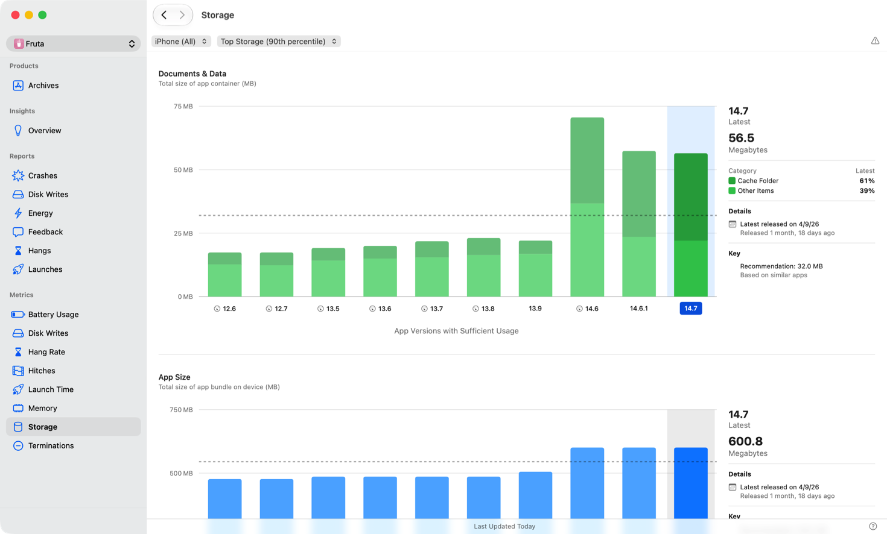

> 导航：[技术](../technologies.md) · [Xcode](../xcode.md) · [性能与指标](performance-and-metrics.md)

# 监测 App 的存储指标

文章

使用 Xcode Organizer 跟踪 App 的存储占用（storage footprint）随时间的变化，以发现“文稿与数据”（Documents & Data）和 App 大小（App Size）方面的衰退（regression）。

## 概述

维持合理的存储占用非常重要，因为设备的存储空间有限且由所有 App 共享。如果某个 App 意外增大其存储使用量，可能会导致用户无法安装新 App、延迟系统更新，或因存储空间不足而触发性能下降。使用 Xcode Organizer 中的“存储”面板，监测 App 的“文稿与数据”和“App 大小”在不同版本间的变化。

Xcode Organizer 中“存储指标”面板的截图，显示了“文稿与数据”图表（包含表示缓存文件夹大小和其他项目的堆叠直方条），以及“App 大小”图表（显示各版本 App 捆绑包大小的直方条）。横向贯穿每个图表的虚线指示你的 App 存储指标与其他同类 App 的对比情况。

### 管理数据使用与缓存行为

Xcode Organizer 中的“存储”面板会显示一个“文稿与数据”图表，分解展示你的 App 使用的总存储量。该图表中的每个直方条代表一个 App 版本。顶部部分显示 App 缓存文件夹（cache folder）中的数据量，底部部分代表其他存储。图表右侧的信息以 MB 为单位显示最新版本 App 的这两项总量，并分别给出缓存文件夹所占百分比和其他项目所占百分比。

当设备存储空间不足时，系统会自动清除缓存文件夹中的文件，从而释放空间，无需用户手动删除 App 数据。虽然系统会管理缓存大小，但不要完全依赖系统进行缓存管理，尤其是对于常用 App——系统不太可能清除其缓存。主动移除未使用和无法访问的缓存文件，以使 App 的缓存大小保持在合理范围内。仅将 App 可以重新生成或无需即可运行的文件存储在缓存文件夹中。如需了解哪些文件属于缓存文件夹，以及它与其他短期目录的区别，请参阅[存储短期文件](https://developer.apple.com/documentation/foundation/using-the-file-system-effectively?#Store-short-lived-files)。

某些网络 API（例如 [URLSessionDownloadTask](../foundation/urlsessiondownloadtask.md)）会将数据写入临时位置而非缓存文件夹。使用这些 API 的 App 需要负责管理下载的内容。关于下载文件的存储位置以及如何减少 App 总磁盘占用的指导，请参阅[减少 App 的磁盘使用](reducing-your-app-s-disk-usage.md)。

### 监测 App 的大小

“存储”面板中的“App 大小”图表显示了不同版本间 App 捆绑包（bundle）在设备上的总大小。

使用此图表检测 App 捆绑包大小在不同版本间是否出现意外增长。突然的增长可能表明添加了素材、资源或代码而未进行相应的优化。

将最新版本与早期版本进行比较，以确认 App 大小的变化与预期更新一致。如果 App 大小持续增长，请考虑检查素材目录、移除未使用的资源，并对非所有用户在安装时都需要的内容使用按需资源（on-demand resources）。

两个图表均显示一条虚线，指示 App 存储指标与同类 App 的对比情况。使用面板顶部的弹出菜单，按设备类型和存储使用百分位数对数据进行过滤。

### 改善 App 的存储使用

如需在代码层面减少 App 磁盘占用的指导，包括使用可清除文件夹、管理 iCloud 文件以及避免不必要的写入，请参阅[减少 App 的磁盘使用](reducing-your-app-s-disk-usage.md)。

## 另请参阅

### 相关文档

- [减小 App 的大小](reducing-your-app-s-size.md) — 测量 App 的大小，优化其素材和设置，并采用有助于在移动互联网连接上精简安装的技术。

### 磁盘使用

- [减少磁盘写入](reducing-disk-writes.md) — 通过优化 App 将数据写入永久存储的方式来改善其响应能力。
- [减少 App 的磁盘使用](reducing-your-app-s-disk-usage.md) — 测量并最小化 App 用于存储文件的空间。
