> 导航：[Technologies](../technologies.md) · [Xcode](../xcode.md) · [调试](debugging.md) · [Metal 开发者工作流程](metal-developer-workflows.md)

# 监测你 Metal App 的图形性能

<sub>文章</sub>

在你的 App 运行时，使用 Metal Performance HUD 捕获性能问题。

## 概述

Metal Performance HUD（抬头显示）会在你的 App 上添加一个实时叠加层，显示常见的图形性能信息，并可选择将其记录下来。该叠加层能帮助你发现细微的性能问题，例如渲染时间的较大波动，从而让你找到在 Xcode 中（参阅[在 Xcode 中捕获 Metal 工作负载](capturing-a-metal-workload-in-xcode.md)）或在 Instruments 中（参阅[分析你 Metal App 的性能](analyzing-the-performance-of-your-metal-app.md)）进行捕获的最佳范围。

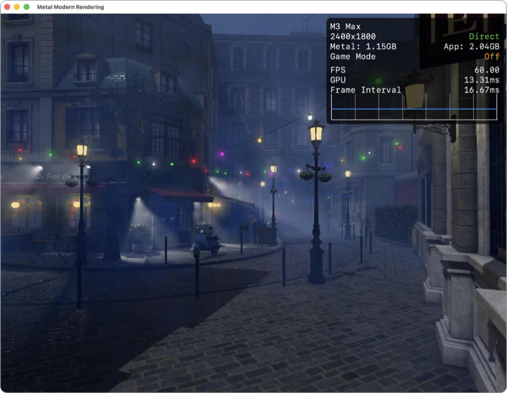

默认情况下，HUD 顶部会显示 Metal 设备、分辨率、呈现模式是直接呈现还是合成呈现的指示符、App 和 Metal 分配的内存量，以及游戏模式是否开启（参阅 [在 Mac 上使用游戏模式](https://support.apple.com/en-us/105118)）。

HUD 的底部区域显示平均每秒帧数（FPS）、GPU 时间和帧间隔。帧间隔下方是一张图表，绘制了过去 120 帧的帧间隔。

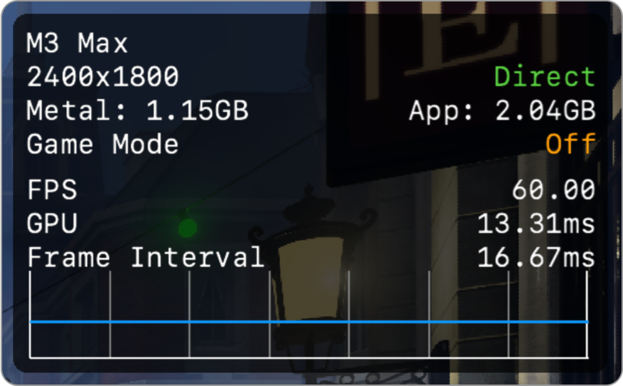

<sub>Metal Performance HUD 的裁剪屏幕截图，显示了 GPU、分辨率、显示缩放系数、呈现模式和刷新率。</sub>

你还可以自定 HUD，加入更多指标。要了解更多信息，请参阅[自定 Metal Performance HUD](customizing-metal-performance-hud.md)。

有关 HUD 提供的指标的更多信息，请参阅[了解 Metal Performance HUD 指标](understanding-metal-performance-hud-metrics.md)。

### 在 Xcode 中启用 HUD 和日志记录

按照以下步骤操作，使用 scheme 设置中的运行时诊断选项来启用 Metal Performance HUD：

1. 在 Xcode 工具栏中，从 Scheme 菜单选择 Edit Scheme。或者，选择 Product \> Scheme \> Edit Scheme。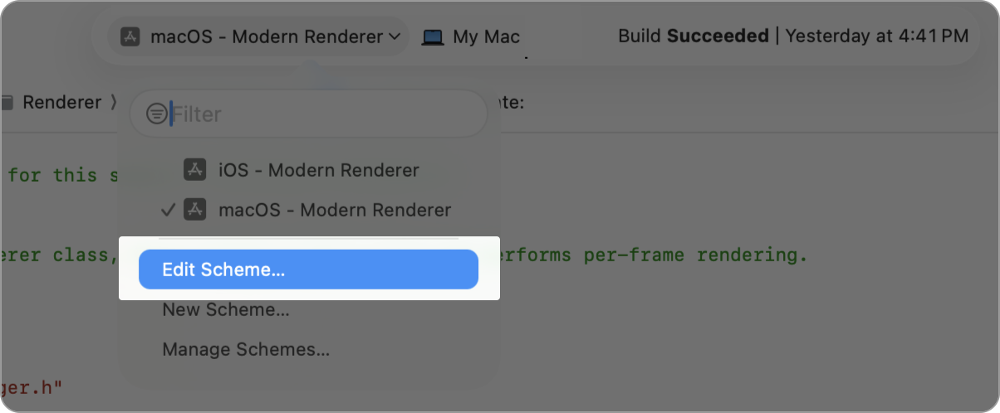
2. 在 scheme 操作面板中，选择 Run。
3. 在操作设置标签页中，点按 Diagnostics。
4. 选择 Show Graphics Overview 以启用 Metal Performance HUD，然后点按 Close。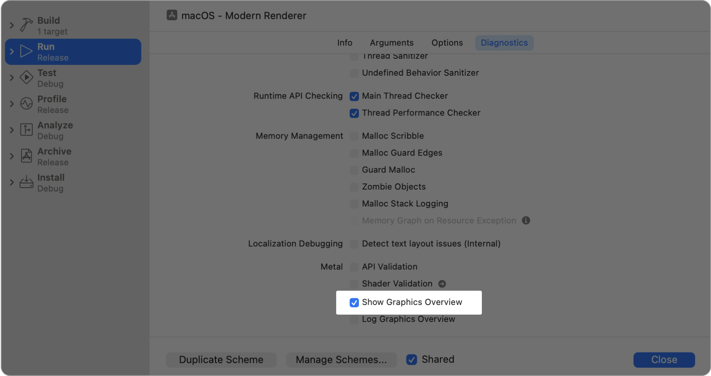

现在，每次你运行该 scheme 时，Xcode 都会启用 Metal Performance HUD 运行时。

你还可以选择性地通过选择 Log Graphics Overview 选项，来启用逐帧统计数据向控制台的输出。

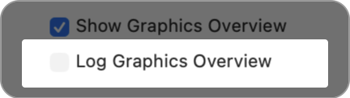

> [!note] 注意
> 你需要同时选中 Show Graphics Overview 和 Log Graphics Overview 选项，才能输出逐帧统计数据。

### 使用环境变量启用 HUD 和日志记录

你可以通过在你的 Metal App 上设置以下环境变量，来启用 Metal Performance HUD 和日志记录：

- **MTL_HUD_ENABLED=1** — 启用 Metal Performance HUD。
- **MTL_HUD_LOG_ENABLED=1** — 启用逐帧统计数据的日志记录。需要 `MTL_HUD_ENABLED=1`。
- **MTL_HUD_LOG_SHADER_ENABLED=1** — 启用着色器编译活动的日志记录。需要 `MTL_HUD_ENABLED=1`。

### 在设备上启用 HUD 和日志记录

你可以按照以下步骤，在 iOS、iPadOS 或 tvOS 设备的开发者设置中启用 Metal Performance HUD 和日志记录：

1. 打开“设置”App。
2. 选择 Developer。
3. 在 Graphics HUD 下，切换 Show Graphics HUD 选项以启用 Metal Performance HUD。
4. 切换 Log Graphics Performance 选项以启用日志记录。

Metal Performance HUD 会出现在你自行构建并安装到你开发设备上的 App 中。

> [!note] 注意
> 你的设备需要拥有开发描述文件，Developer 选项才会出现在“设置”App 中。

以下屏幕截图展示了 iOS 中的相关选项：

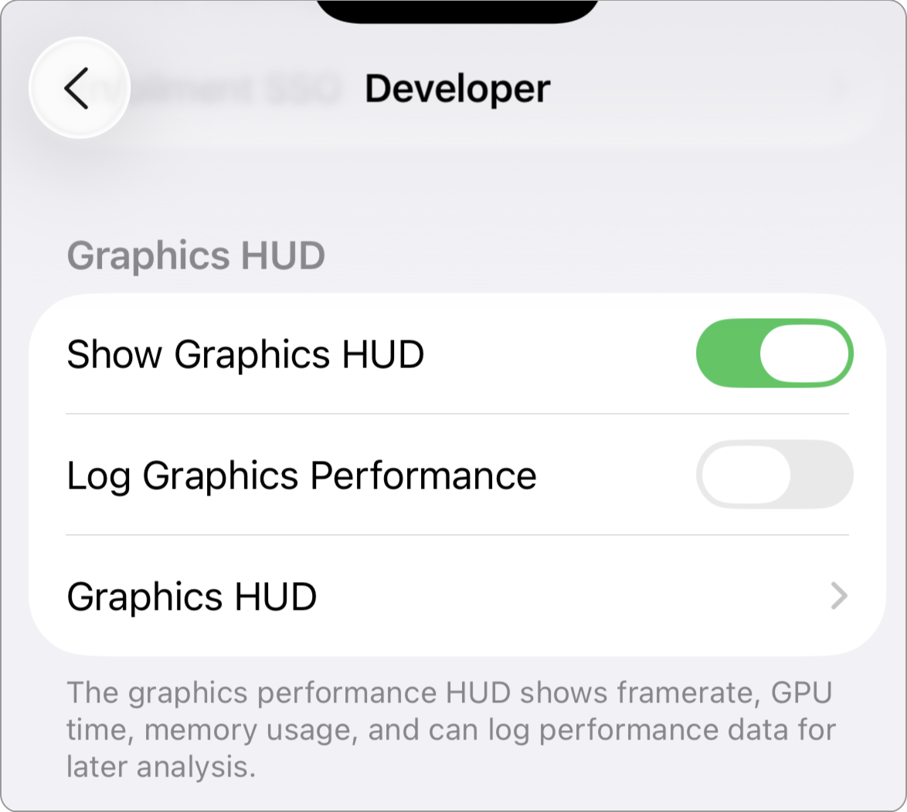

<sub>iOS 中开发者设置的屏幕截图，高亮显示了用于启用 Metal Performance HUD 叠加层和日志记录的切换开关。</sub>

以下屏幕截图展示了 tvOS 中的相关选项：

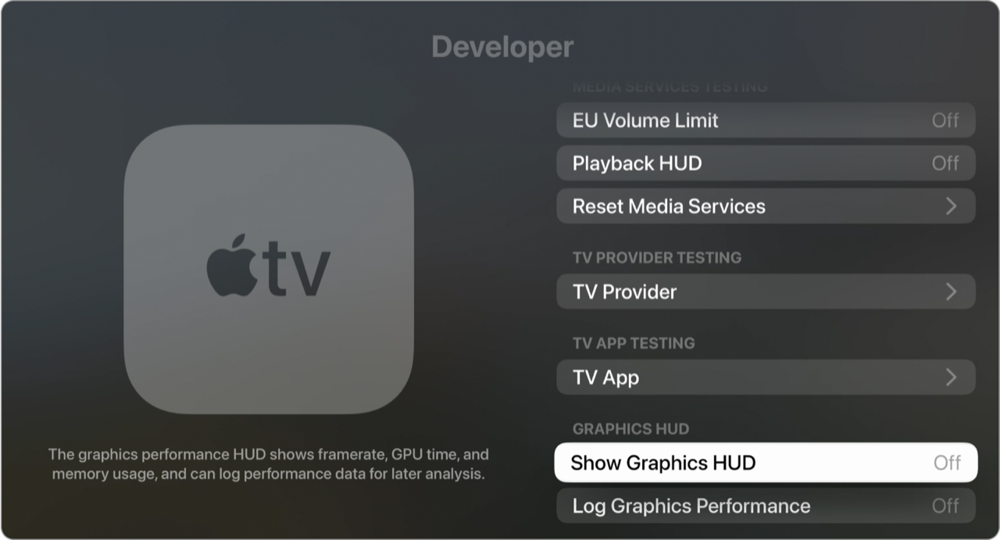

<sub>tvOS 中开发者设置的屏幕截图，高亮显示了用于启用 Metal Performance HUD 叠加层和日志记录的切换开关。</sub>

### 通过信息属性列表和用户默认设置启用 HUD 和日志记录

或者，你也可以通过以下方法之一，以编程方式启用 HUD 和日志记录：

- 将 `MetalHudEnabled` 添加到你 App 的 `Info.plist` 文件中。
- 在你 App 的 [UserDefaults](../foundation/userdefaults.md) 中添加 `MetalHUDForceEnabled=1`。

### 利用日志记录功能

如果你启用了日志记录，在你的 App 运行期间，HUD 每秒会向控制台写入一次以下格式的数据：

```
metal-HUD: <first-frame-number-integer>,<graphics-memory-usage-float>,<process-memory-usage-float>,<first-frame-present-interval-float>,<first-frame-gpu-time-float>,...<last-frame-present-interval-float>,<last-frame-gpu-time-float>
```

例如，在运行[使用 Swift 渲染带有延迟光照的场景](../metal/rendering-a-scene-with-deferred-lighting-in-swift.md)示例代码项目时，HUD 会向控制台写入以下数据：

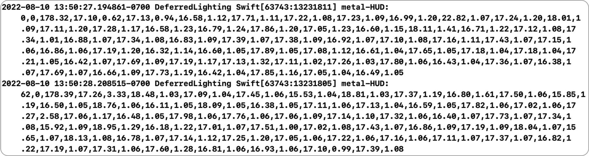

当你启用着色器编译器日志记录后，在你的 App 运行期间，Metal HUD 会为每个已编译的着色器发出信号标记。子系统为 `com.apple.metal.hud`，类别为 `Logging`。

```
[com.apple.metal.hud:Logging] CompileShader: name: ParticleVs compilation-time: 5496250 cached: 0
[com.apple.metal.hud:Logging] CompileShader: name: ParticlePs compilation-time: 6335000 cached: 0
```

### 了解编码器 GPU 时间追踪

你可以通过在配置面板中勾选 `Enable Encoder GPU Time Tracking` 选项，或在环境变量中将 `MTL_HUD_ENCODER_TIMING_ENABLED` 设为 `1`，来开启编码器 GPU 时间追踪。

启用编码器 GPU 时间追踪后，Metal Performance HUD 会利用 [GPU 计数器和计数器采样缓冲区](../metal/gpu-counters-and-counter-sample-buffers.md)来追踪每个命令编码器的 GPU 时间，从而提供更精细的 GPU 时间报告。

> [!important] 重要
> 编码器 GPU 时间追踪仅在你的 App 不使用 Metal 计数器采样缓冲区时可用。由于需要额外的数据处理，它还可能增加 Metal HUD 的 CPU 开销。

编码器 GPU 时间通过追踪各个编码器阶段（顶点、片元和计算）内工作的开始和结束时间，来测量 GPU 活动。这与标准 GPU 时间不同，后者捕获的是命令缓冲区的总体持续时间。对于包含许多编码器的命令缓冲区，编码器之间可能存在空闲时段，这会使标准 GPU 时间被拉长，从而无法准确反映实际的 GPU 工作负载。

叠加层会为每种编码器类型显示编码器 GPU 时间，以及 GPU 时间和占总帧时间的百分比。在时间指标下方，一条 GPU 时间线可视化展示了最近三帧的 GPU 执行情况，每秒更新一次。

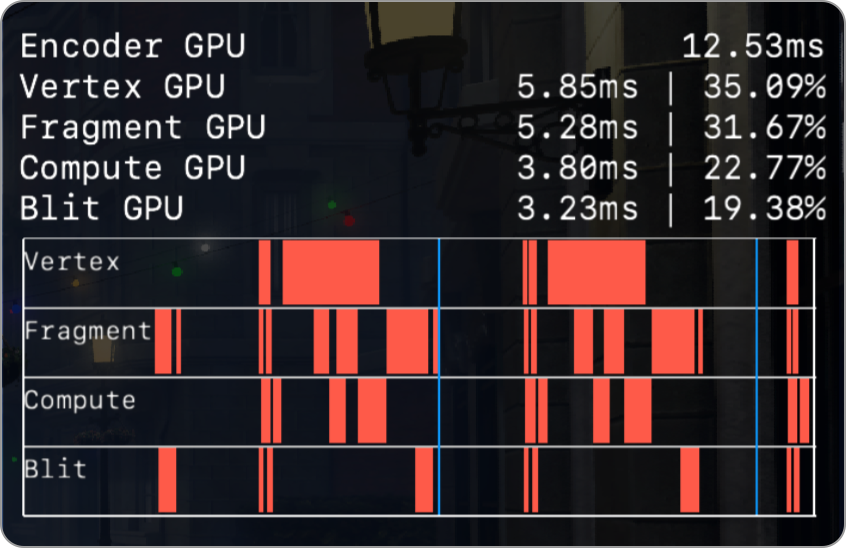

启用编码器 GPU 时间追踪后，Metal Performance HUD 还会追踪命令缓冲区和编码器标签。这样就有了两个新的可选指标：Top Labeled Command Buffers 和 Top Labeled Encoders。这些指标会按标签显示 GPU 占用最高的三个命令缓冲区和编码器，帮助你快速定位潜在的性能瓶颈。

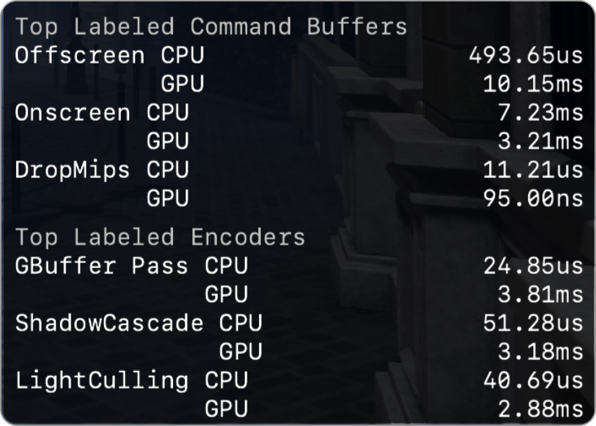

### 显示指标的取值范围

你可以通过在配置面板中启用 Show Metrics Value Range 选项，或在环境变量中将 `MTL_HUD_SHOW_VALUE_RANGE` 设为 `1`，来在叠加层中可视化常见指标的取值范围。

启用此选项后，HUD 会用三列来可视化常见指标：

- 第一列包含最近 120 帧的平均值。
- 第二列包含最近 1200 帧的最小值。
- 第三列包含最近 1200 帧的最大值。

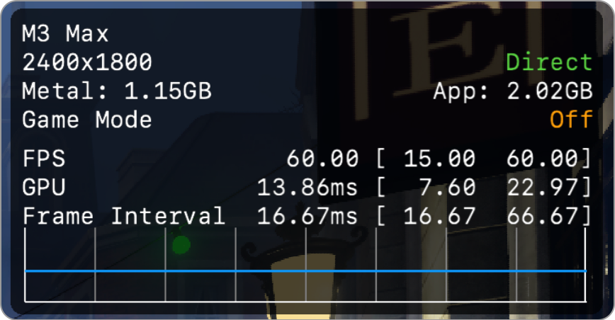

## 另请参阅

### 运行时诊断

- [在运行时检查实时资源](inspecting-live-resources-at-runtime.md) — 在调试你的 Metal App 时，通过查看纹理和缓冲区的内容来验证你的资源。
- [验证你 App 的 Metal API 用法](validating-your-apps-metal-api-usage.md) — 使用 API Validation 捕获你 Metal App 中的运行时问题。
- [验证你 App 的 Metal 着色器用法](validating-your-apps-metal-shader-usage.md) — 使用 Shader Validation 捕获常见的着色器运行时问题。
- [自定 Metal Performance HUD](customizing-metal-performance-hud.md) — 修改你 Metal 抬头显示的外观，以监测你的图形性能。
- [了解 Metal Performance HUD 指标](understanding-metal-performance-hud-metrics.md) — 了解抬头显示所报告的每项指标分别代表什么含义。
- [利用 Metal Performance HUD 获得性能洞察](gaining-performance-insights-with-metal-performance-hud.md) — 在你的 App 运行时，使用 Metal 抬头显示捕获潜在的性能问题。
- [使用 Metal Performance HUD 生成性能报告](generating-performance-reports-with-metal-performance-hud.md) — 使用抬头显示记录你 App 的性能。
