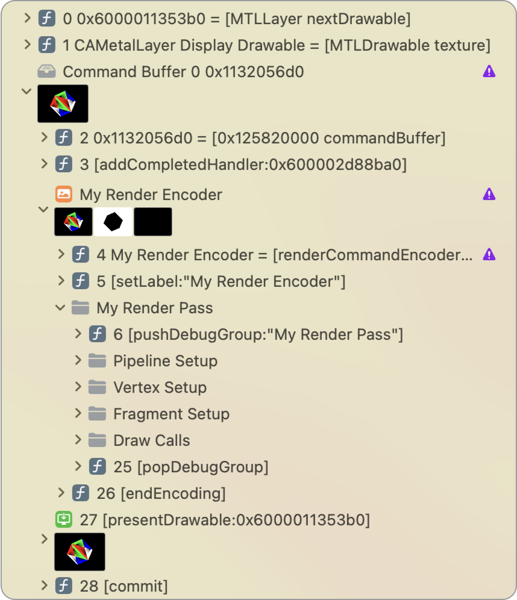

> 导航：[技术](../technologies.md) · [Xcode](../xcode.md) · [调试](debugging.md) · [Metal 开发者工作流](metal-developer-workflows.md)

# 命名资源与命令

<sub>文章</sub>

通过标签和分组增强你的 Metal App 的调试体验。

## 概述

在使用 Metal 工具调试和分析你的 App 时，资源标签（Resource Label）和命令调试组（Command Debug Group）非常有用。为资源赋予有意义的标签，有助于你更快地找到特定资源；对命令进行逻辑分组，则能让你在捕获命令后轻松浏览工作负载。

> [!note] 注意
> 本文描述的属性和方法不会影响你的 App 的图形渲染或计算处理行为。

### 标注资源

许多 Metal 对象都提供了 [label](../metal/mtlresource/label.md) 属性，你可以为其指定一个有意义的字符串。这些标签会出现在每个 Metal 工具中，方便你轻松识别特定对象。

此外，对于 [MTLBuffer](../metal/mtlbuffer.md)，还可以使用 [addDebugMarker(_:range:)](<../metal/mtlbuffer/adddebugmarker(__range_).md>) 方法来标记并识别特定的数据范围。你可以调用 [removeAllDebugMarkers()](<../metal/mtlbuffer/removealldebugmarkers().md>) 方法来清除已有的标记。

### 标注命令

命令缓冲区（Command Buffer）和命令编码器（Command Encoder）提供了以下方法，让你能轻松识别你的 App 中的特定 Metal 命令分组：

- 在 [MTLCommandBuffer](../metal/mtlcommandbuffer.md) 对象上，调用 [pushDebugGroup(_:)](<../metal/mtlcommandbuffer/pushdebuggroup(__).md>) 和 [popDebugGroup()](<../metal/mtlcommandbuffer/popdebuggroup().md>) 来对该缓冲区内的命令进行分组。
- 在 [MTLCommandEncoder](../metal/mtlcommandencoder.md) 对象上，调用 [pushDebugGroup(_:)](<../metal/mtlcommandencoder/pushdebuggroup(__).md>) 和 [popDebugGroup()](<../metal/mtlcommandencoder/popdebuggroup().md>) 来对该编码器内的命令进行分组。此外，还可以调用 [insertDebugSignpost(_:)](<../metal/mtlcommandencoder/insertdebugsignpost(__).md>) 来标记编码器中的关键位置。

Xcode 使用独立的栈（Stack）来推送和弹出调试组，这些栈只在其关联的 [MTLCommandBuffer](../metal/mtlcommandbuffer.md) 或 [MTLCommandEncoder](../metal/mtlcommandencoder.md) 的生命周期内存在。你可以通过向栈中推送多个调试组，并在弹出先前的组之前实现嵌套。

使用这些方法可以简化你的 App 的开发过程，特别是对于每个缓冲区或编码器包含大量 Metal 命令的任务。

以下示例展示了如何推送和弹出多个调试组：

```swift
func encodeRenderPass(commandBuffer: MTLCommandBuffer, descriptor: MTLRenderPassDescriptor) { 
    guard let renderEncoder = commandBuffer.makeRenderCommandEncoder(descriptor: descriptor) else { return }
    renderEncoder.label = "My Render Encoder"
    renderEncoder.pushDebugGroup("My Render Pass")

        renderEncoder.pushDebugGroup("Pipeline Setup")
        // 渲染管线命令。
        renderEncoder.popDebugGroup() // 弹出 "Pipeline Setup"。

        renderEncoder.pushDebugGroup("Vertex Setup")
        // 顶点函数命令。
        renderEncoder.popDebugGroup() // 弹出 "Vertex Setup"。

        renderEncoder.pushDebugGroup("Fragment Setup")
        // 片元函数命令。
        renderEncoder.popDebugGroup() // 弹出 "Fragment Setup"。

        renderEncoder.pushDebugGroup("Draw Calls")
        // 绘制命令。
        renderEncoder.popDebugGroup() // 弹出 "Draw Calls"。

    renderEncoder.popDebugGroup() // 弹出 "My Render Pass"。
    renderEncoder.endEncoding()
}
```

以下屏幕截图显示了在捕获一帧后，调试组在 Xcode 的调试导航器（Debug navigator）中的显示方式：



## 另请参阅

### 项目调试准备

- [使用内嵌着色器源码构建项目](building-your-project-with-embedded-shader-sources.md) — 通过在构建中包含源码来准备调试项目的着色器。
- [创建和使用自定义捕获范围](creating-and-using-custom-capture-scopes.md) — 使用自定义捕获范围捕获特定的 GPU 命令。
