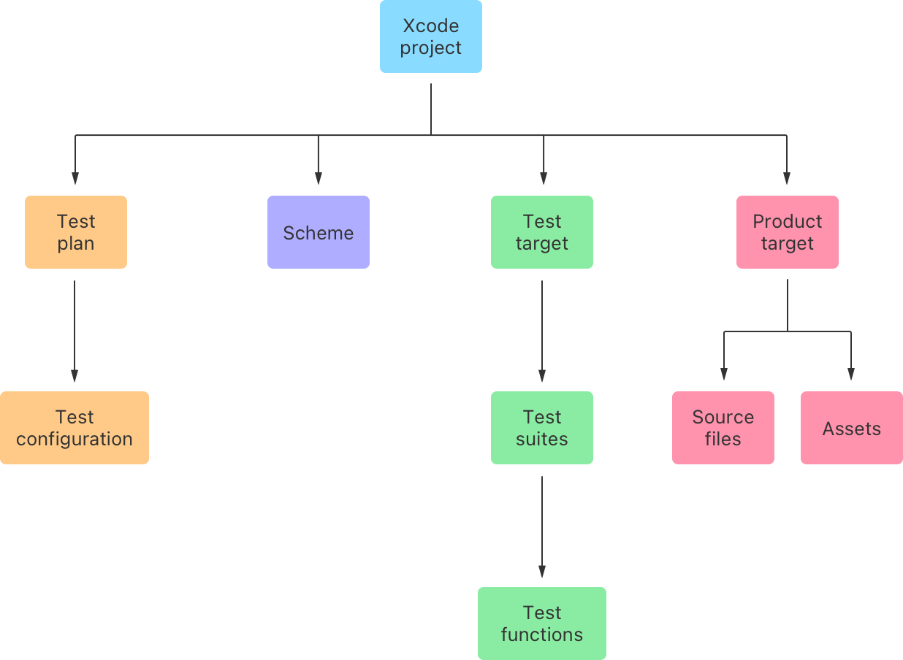
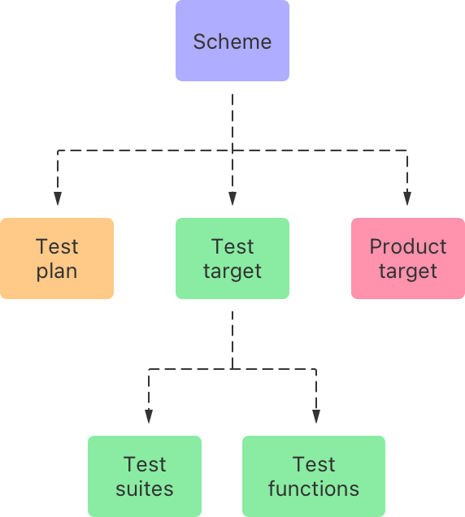
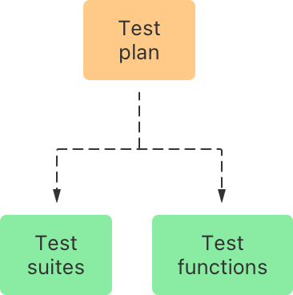
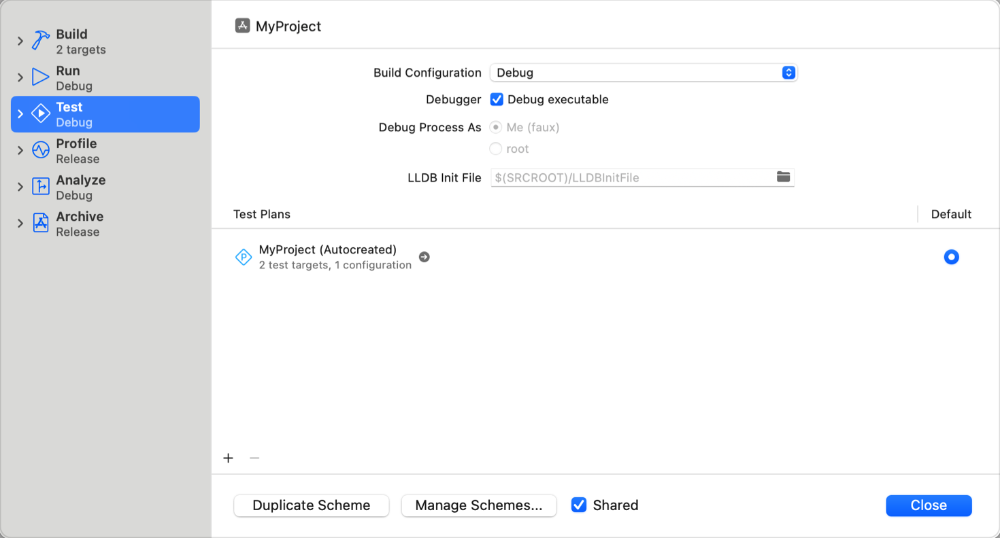
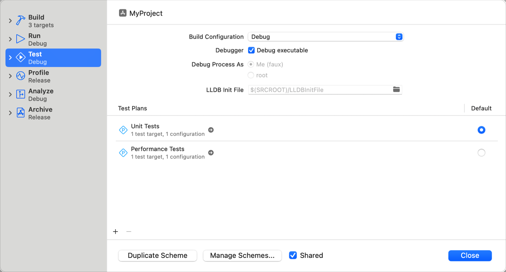
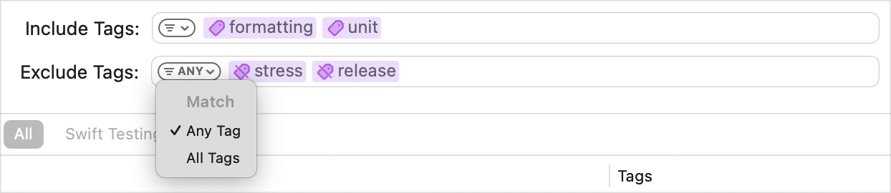
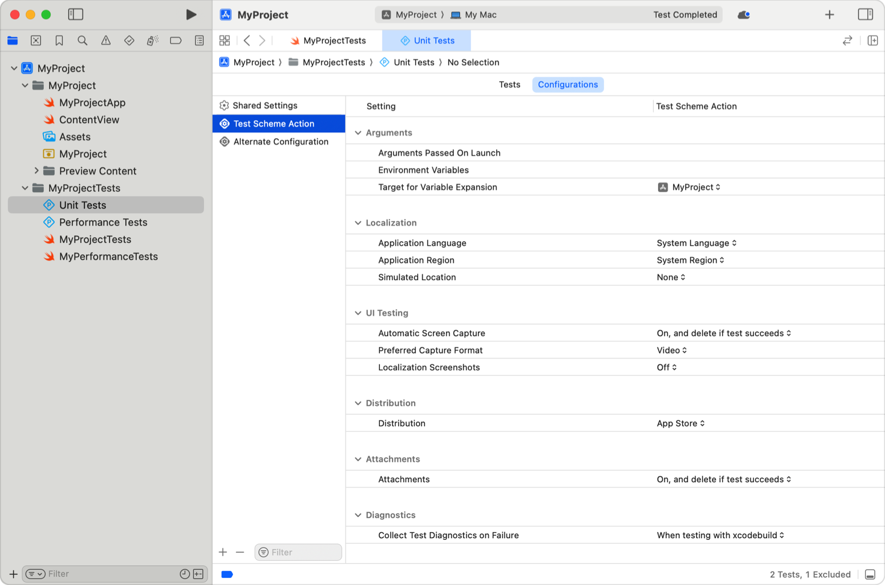

> 导航：[Technologies](../technologies.md) · [Xcode](../xcode.md) · [Testing](testing.md)

# 通过将测试整理为测试计划来改进代码评估

<sub>文章</sub>

通过创建和配置测试计划（test plan），控制你在软件工程流程的不同阶段从测试中获取的信息。

## 概述

成熟的项目会受益于大量覆盖各种场景的测试。测试可以验证代码行为或衡量性能；它们可以测试不同的产品，或同一产品在不同目标或配置下的表现。它们既可以是运行复杂工作流程的长时间运行 UI 测试，也可以是运行单个函数的小型单元测试，如 [Testing](testing.md) 中所述。

通过将这些测试整理为测试计划，并配置 Xcode 执行测试计划的方式，控制你在软件工程流程的不同阶段从测试中获取的信息。例如，你可以创建一个测试计划，在开发和调试某个模块时只运行该模块的单元测试；再创建第二个测试计划，在将 App 提交到 App Store 之前运行所有单元测试、集成测试和 UI 测试。



<sub>一张图表，展示了 Xcode 项目中 Xcode 用于确定测试活动的各个组成部分：测试计划、方案（scheme）、测试目标和产品目标。</sub>

借助 [Swift Testing](../testing.md)，你可以为测试声明并添加 _标签（tags）_，这是一种用于标识具有共同特征的测试的注解。

你可以添加标签来指定：

- 优先级（关键、正常、低）
- 类型（单元、集成、性能）
- 频率（提交前、每日、发布前）
- 功能区域
- 依赖关系

在 Xcode 16 及更高版本中，你可以在测试计划中使用标签来指定要包含哪些测试。有关声明标签以及为测试添加标签的更多信息，请参阅 [Adding tags to tests](../testing/addingtags.md)。有关将现有单元测试迁移到 Swift Testing 的更多信息，请参阅 [Migrating a test from XCTest](../testing/migratingfromxctest.md)。

> [!note] 注意
> 标签不能替代测试套件。套件在源代码层面为测试函数施加层级结构，而标签则帮助你把来自不同文件、套件和目标的测试关联起来。

### 创建方案以将测试目标与产品关联起来

方案会指示 Xcode 在调用构建、测试、运行、分析、评测和归档等操作时使用特定的目标，如下图所示。在方案的测试操作中，需包含受测产品的目标，以及包含与该产品相关测试的测试目标。



<sub>一张图表，展示了 Xcode 方案如何将产品目标、测试目标和测试计划关联起来，以定义测试操作的行为。</sub>

有关创建 Xcode 方案以及为方案分配目标的信息，请参阅 [Customizing the build schemes for a project](customizing-the-build-schemes-for-a-project.md)。

如果你的产品有多个目标——比如一个包含静态库和小组件扩展的 iOS App——那么除了创建一个构建适合发布的整个产品的「总括」方案外，还应为每个单独的目标各创建一个方案。团队中的开发者在处理各个目标的任务时，可以使用更具针对性的方案，只运行与该目标相关的测试以更快获得反馈。当他们准备好整合更改时，可以通过在总括方案中运行完整的测试集合，更好地确保没有引入衰退（regression）。

### 创建测试计划以整理某个方案的测试

_测试计划_ 是 Xcode 项目中的一个文档，用于描述当开发者调用测试操作时 Xcode 应运行哪些测试（如下图所示），以及 Xcode 用于运行这些测试的配置。



你可以为同一个方案创建多个测试计划，并在从 Xcode 或终端运行测试时使用其中任意一个。你必须为该方案选择一个测试计划作为默认计划；当没有明确指定时，Xcode 会使用该计划来运行测试。Xcode 会创建一个默认测试计划，其中包含该方案所构建的测试目标中的所有测试。



要编辑此测试计划，请选择 Product \> Scheme \> Edit Test Plan。Xcode 会提示你选择保存测试计划的位置。

要创建其他测试计划：

1. 选择 Product \> Test Plan \> New Test Plan。
2. 为新测试计划输入名称。
3. 选择保存测试计划的位置。
4. 点按 Create。

要为当前方案选择默认测试计划：

1. 选择 Product \> Test Plan \> Manage Test Plans。
2. 在所需测试计划旁边的 Default 列中选择单选按钮。



<sub>一张截图，展示了 Xcode 中方案编辑器显示 Test 面板的状态。该面板包含一个自动创建的测试计划。</sub>

### 在测试计划中包含或排除测试

指定要使用的测试目标，以及 Xcode 用来确定测试计划应包含或排除哪些测试的任何标签：

1. 在项目导航器中选择测试计划。
2. 在 Tests 面板中，点按 Choose Targets 以将测试目标添加到测试计划。
3. 要包含带有某个标签注解的测试，请点按 Include Tags 文本栏，并输入一个或多个标签的符号名称。从过滤按钮中选择 Any Tag，可在测试匹配你输入的任意标签时将其包含；选择 All Tags，则只有在匹配所有标签时才包含。
4. 要排除带有某个标签注解的测试，请在 Exclude Tags 字段中输入要排除的一个或多个标签的符号名称。从过滤按钮中选择 Any Tag，可在测试匹配你输入的任意标签时将其排除；选择 All Tags，则只有在匹配所有标签时才排除。



<sub>一张截图，展示了 Xcode 测试计划编辑器中的 Include Tags 和 Exclude Tags 字段。Include Tags 字段包含 formatting 和 unit 标签。Exclude Tags 字段包含 stress 和 release 标签。Exclude Tags 字段中的过滤按钮已展开，显示 Any Tag 和 All Tags 选项。</sub>

要在测试计划中包含所有测试，请将 Include Tags 和 Exclude Tags 字段留空。

### 选择要在测试计划中运行的测试套件和函数

要进一步过滤 Xcode 为给定测试计划所运行的测试，请在测试计划大纲视图中某一项旁边的 Included 列中选择复选框。你可以选中或取消选中任何符合 Include Tags 和 Exclude Tags 字段条件的项目。这些项目代表目标、套件、函数，以及传递给参数化测试函数的具体输入参数。Xcode 会在 Tags 列中，在标签所注解的套件和函数旁边显示该标签的符号名称。将指针悬停在某一项上会显示一个向右箭头按钮。点按该按钮可在源代码编辑器中显示该项的源代码。

如果你从测试计划中排除了某个测试函数或测试用例，Xcode 会跳过该测试函数或测试用例，并且不会提供其状态反馈。被排除的测试函数对测试操作结果唯一可能产生的影响，是当该测试包含构建错误时——此时整个测试操作都会失败。

Swift Testing 和 XCTest 都支持在仍然运行某个测试的同时修改它对测试操作结果的影响。在 Swift Testing 中，你可以使用特征（trait）来控制测试应在何种运行时条件下运行，参阅 [Enabling and disabling tests](../testing/enablinganddisabling.md)；使用 [Known issues](../testing/known-issues.md) 来标示你预期会失败的测试。要在 XCTest 中因执行平台或配置不适合某测试而跳过它，请使用 [XCTSkipIf(_:_:file:line:)](<../xctest/xctskipif(____file_line_).md>) 或 [XCTSkipUnless(_:_:file:line:)](<../xctest/xctskipunless(____file_line_).md>)。要在 XCTest 中标示某个测试预期会失败，请使用 [XCTExpectFailure(_:options:)](<../xctest/xctexpectfailure(__options_).md>)。

### 调整测试计划的配置

每个测试计划都包含一个或多个配置，用于告知 Xcode 如何为测试搭建运行时环境。在测试计划编辑器的 Configurations 标签页中（如下图所示），你可以设置环境变量、启用诸如 Address Sanitizer 和内存管理防护等附加检查，并为代码选择不同的本地化设置。



你可以在测试计划配置中指定的值包括：

- **Arguments Passed on Launch** — 传给受测产品的命令行参数。
- **Environment Variables** — 在受测产品的环境中设置的值。
- **Target for Variable Expansion** — Xcode 用作展开构建设置基础的目标。有关可用设置的列表，请参阅 [Build settings reference](build-settings-reference.md)。
- **Application Language** — 受测产品中本地化字符串所使用的语言，或选择 System Language 以使用系统设置中指定的语言。
- **Application Region** — 受测产品中区域设置所使用的地区，或选择 System Region 以使用系统设置中指定的地区。
- **Simulated Location** — 测试期间使用定位服务时返回的位置。可以指定一个位置，选择 None 以使用运行测试设备的位置，或指定一个 GPX 文件以在测试期间模拟沿路线移动。
- **Automatic Screen Capture** — 指定 UI Automation 测试运行程序在运行测试时是否截取屏幕截图，以及是否删除通过测试的截图。
- **Preferred Capture Format** — 指定 UI Automation 测试运行程序截取视频还是屏幕截图。
- **Localization Screenshots** — 为本地化人员收集你 App 的屏幕截图。更多信息请参阅 [Creating screenshots of your app for localizers](creating-screenshots-of-your-app-for-localizers.md)。
- **Distribution** — 受测产品所使用的分发方式。
- **Attachments** — 收集包含测试行为附加信息的附件。更多信息请参阅 [attachments](../xctest/xctissuereference/attachments.md)。
- **Collect Test Diagnostics on Failure** — 在测试失败的任何情况下收集诊断信息，仅在使用 `xcodebuild` 测试时收集，或从不收集。
- **Execution Order** — 控制 Xcode 是按字母顺序运行测试，还是每次随机选取顺序。以随机顺序运行测试有助于发现测试行为依赖于其他测试所执行操作的情况。
- **Test Timeouts** — 控制测试是否会在经过设定时间后自动失败。
- **Default Test Execution Time Allowance(s)** — 测试在自动失败前默认运行的秒数。可设置的最小值为 60 秒。可通过调用 [executionTimeAllowance](../xctest/xctestcase/executiontimeallowance.md) 为单个测试覆盖此设置。如果 Test Timeouts 设置为 No，此值将被忽略。
- **Maximum Test Execution Time Allowance(s)** — 测试在自动失败前可运行的最大秒数。可设置的最小值为 60 秒。即使测试通过 [executionTimeAllowance](../xctest/xctestcase/executiontimeallowance.md) 请求了更长的执行时间，一旦经过最大测试执行时限，测试仍会超时。如果 Test Timeouts 设置为 No，此值将被忽略。
- **Test Repetition Mode** — 选择测试运行一次、重复直到失败、重复直到通过，还是运行设定的次数。
- **Maximum Test Repetitions** — 测试重复运行的最高次数。
- **Relaunch Tests for Each Repetition** — Xcode 是否为每次重复运行启动一个新进程。
- **Code Coverage** — 在测试运行期间收集代码覆盖率指标。
- **Address Sanitizer** — 检测越界内存访问、使用已释放的内存，以及其他不正确的内存使用。
- **Thread Sanitizer** — 检测与线程相关的竞态条件。
- **Undefined Behavior Sanitizer** — 检测 C 编程语言中与未定义行为相关的问题。
- **Main Thread Checker** — 检测因在后台线程上使用本应只在主线程上使用的 API 而导致的问题。
- **Malloc Scribble** — 向已释放的内存写入特定值，以便检测对已释放内存的不正确使用。
- **Malloc Guard Edges** — 在大块分配的内存前后添加保护页，以便检测越界内存使用。
- **Guard Malloc** — 使用一个具有额外检测能力的内存分配器替代版本，用于检测不正确的内存使用。
- **Zombie Objects** — 用僵尸对象替换已释放的对象，当这些对象接收到 Objective-C 消息时会使你的 App 崩溃。
- **Malloc Stack Logging** — 在每次分配内存时记录函数调用栈。

有关 Address Sanitizer、Thread Sanitizer、Undefined Behavior Sanitizer 和 Main Thread Checker 的更多信息，请参阅 [Diagnosing memory, thread, and crash issues early](diagnosing-memory-thread-and-crash-issues-early.md)。

要创建其他测试计划配置，请点按添加按钮（+）。Xcode 会为该计划的每个配置各运行一次测试计划中指定的测试。

### 将测试计划添加到方案

你可以将一个测试计划关联到多个方案，以便在多个方案中使用相同配置包含相同的测试套件和函数。要将现有测试计划添加到某个方案，请执行以下操作：

1. 选择 Product \> Test Plan \> Manage Test Plans。
2. 点按测试计划列表下方的添加按钮。
3. 选择 Add existing Test Plan。
4. 选择要添加到该方案的测试计划。

### 在 Xcode 中运行测试计划指定的测试

当 Xcode 执行测试操作时，会为活跃测试计划中的每个配置各执行一次其中的测试。要设置活跃测试计划并运行该计划指定的测试，请执行以下操作：

1. 选择 Product \> Test Plan。
2. 选择要运行的测试计划。
3. 选择 Product \> Test。

有关在 Xcode 中解读测试结果的信息，请参阅 [Running tests and interpreting results](running-tests-and-interpreting-results.md)。

### 从命令行运行测试

要从命令行使用特定测试计划运行测试，必须显式指定要使用的测试计划名称。要发现 `SampleApp` 的测试计划，请运行以下命令：

```zsh
% xcodebuild -scheme SampleApp -showTestPlans
```

要运行「Performance Tests」测试计划中指定的测试，请运行以下命令：

```zsh
% xcodebuild -scheme SampleApp test -testPlan Performance\ Tests
```

要仅使用名为「My Config」的配置来运行「Performance Tests」测试计划中的测试，请运行以下命令：

```zsh
% xcodebuild -scheme SampleApp test -testPlan Performance\ Tests --only-test-configuration My\ Config
```

要使用除「My Config」以外的所有配置来运行「Performance Tests」测试计划中的测试，请运行以下命令：

```zsh
% xcodebuild -scheme SampleApp test -testPlan Performance\ Tests --skip-test-configuration My\ Config
```

## 另请参阅

### 测试开发

- [Adding tests to your Xcode project](adding-tests-to-your-xcode-project.md) — 包含用于测试函数逻辑、检查集成问题、自动化 UI 工作流程以及衡量性能的测试目标。
- [Updating your existing codebase to accommodate unit tests](updating-your-existing-codebase-to-accommodate-unit-tests.md) — 移除组件之间的耦合，以提高测试覆盖率和可靠性。
- [Determining how much code your tests cover](determining-how-much-code-your-tests-cover.md) — 使用代码覆盖率，将新测试开发的重点放在测试不足的区域上。
