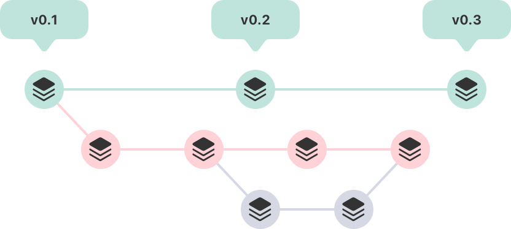
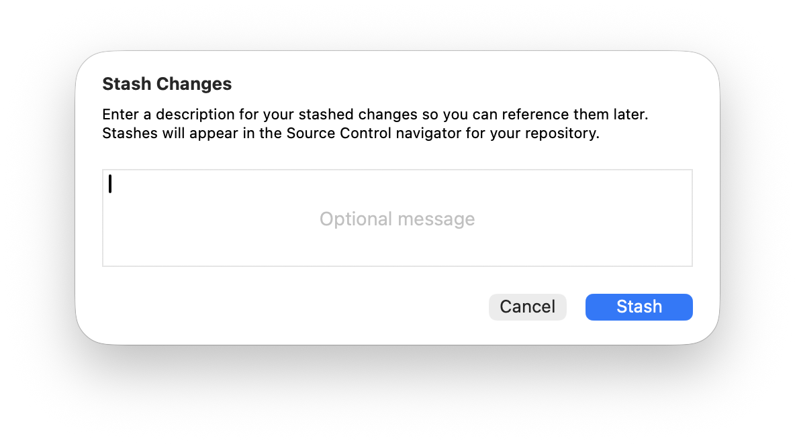
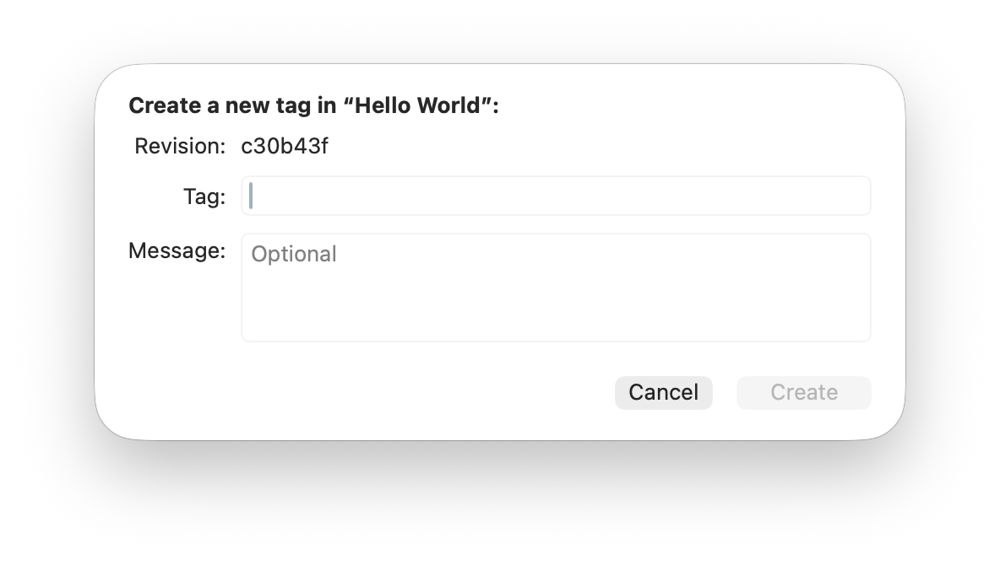

> 导航：[技术](../technologies.md) · [Xcode](../xcode.md) · [Source control management](source-control-management.md)

# 使用源代码管理来整理你的代码更改

文章

使用 Git 分支和标签来简化协作，并管理特性与发布。

## 概述

如果你需要同时追踪多条特性和发布时间线，可以将不同版本的代码整理到不同的分支中，并用标签为重要更改或里程碑加上注解。

概念示意图，展示了三行提交，每行代表一个分支。最上方分支中的每个提交都带有一个标签，将该提交与某个发布版本号相关联。

### 在分支中整理新特性或错误修复的更改

当你更新源代码以添加新特性或修复错误时，把所有更改都保留在同一个分支中，以便将它们作为一个整体来处理。例如，如果你在一个独立分支上开发某个特性，之后又决定推迟它，就不要把它合并到发布分支中。

在开始新工作之前，先为你的分支选择一个起点。要查看现有分支和远程仓库的列表，请点按源代码管理导航器中的 Repositories 标签页，展开你的仓库，然后展开 Branches 和 Remotes 子文件夹。

默认情况下，当你使用 Git 仓库创建新项目时，Xcode 会创建一个名为 _main_ 的分支。按住 Control 键点按你想用作起点的分支，选择「Branch from [_分支名称_]」，然后为你的分支输入一个能标识你所做工作的名称。点按 Create 后，Xcode 会创建该分支并将其设为当前分支，这样你提交并推送的所有更改都会成为该分支的一部分。

继续进行代码更改，并定期测试、暂存、提交并推送你的更改到该分支。当你的新特性或错误修复完成，并准备将你的工作并入主分支时，对其进行审阅并合并。更多信息请参阅 [Combining code changes in a source control repository](combining-code-changes-in-a-source-control-repository.md)。

> [!tip] 提示
> 你可以在当前分支存在未提交更改的情况下创建新分支，你的更改会成为新分支的一部分。如果存在未提交的更改，你无法切换到另一个分支，因此在切换分支前请先提交更改或将其储存。

### 搁置进行中的工作以进行其他更改

当你有一些尚未准备好提交的进行中工作，而又需要切换到另一个分支时，可以储存你的更改，在不提交到仓库的情况下保存它们。选择 Integrate \> Stash Changes，并可以选择输入对更改的描述。

Xcode 会创建一个包含你更改的储存条目，并从当前工作项目中移除这些更改，以便你切换分支或开始处理其他更改。

要查看你储存的更改，请点按源代码管理导航器中的 Repositories 标签页，展开你的仓库，然后展开 Stashed Changes 文件夹。选择一个储存的更改项目，即可在比较视图中查看更改内容。

要将这些更改添加回你当前的工作中，请按住 Control 键点按该储存的更改项目，并选择 Apply Stashed Changes。Xcode 会用储存的更改更新当前工作项目，以便你继续进行更新或将更改提交到仓库。

当你不再需要这些储存的更改时，按住 Control 键点按该储存的更改项目并选择 Delete 将其移除。

### 标记发布版本和重要里程碑

为代表重要里程碑（例如发布版本或大型特性新增）的提交添加标签，以便在源代码管理历史记录中轻松找到它们。

要找到需要打标签的分支或提交，请点按源代码管理导航器中的 Repositories 标签页，展开你的仓库，然后展开 Branches 文件夹。按住 Control 键点按某个分支或分支提交，并从弹出式菜单中选择 Tag「[_分支名称_]」或 Tag「[_提交哈希值_]」。

如果你选择的是分支，Xcode 会将标签应用到该分支中最新的提交上。为标签输入一段简短的字符串，并可以选择输入更详细的说明信息。点按 Create，Xcode 就会创建该标签并用它标记该提交。

要查看你打了标签的提交，请点按源代码管理导航器中的 Repositories，然后展开 Tags 文件夹。Xcode 会在详情区域中显示带标签的提交列表。使用列表上方的标签页和 Filter 字段来限制或扩展显示的提交。

## 另请参阅

### Git

- [Combining code changes in a source control repository](combining-code-changes-in-a-source-control-repository.md) — 使用 Xcode 中的源代码管理工具，整合来自多个来源的代码更改，并解决不同代码版本之间的冲突。
- [Configuring source control in Xcode](configuring-source-control-in-xcode.md) — 自定用于连接 Git 仓库、应用代码更改的默认 Xcode 设置，以及更多用于配置源代码管理的选项。
