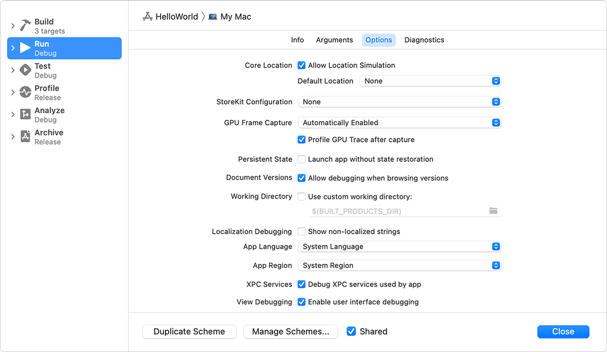

> 导航：[Technologies](../technologies.md) · [Xcode](../xcode.md) · [Localization](localization.md)

# 为本地化准备你的界面

文章

找出你 App 中需要翻译的文本，并验证你的界面能否适配已翻译的文本。

## 概述

在本地化你的 App 之前，使用 Xcode 找出界面中未本地化的字符串，并验证你的界面是否会根据已本地化字符串的特征进行调整。

### 查找未本地化的字符串

未本地化的字符串是指出现在你界面中、但 Xcode 不会将其包含进导出文件中的文本。要在你的 App 中查找未本地化的字符串，请在 Xcode 中选择「Product \> Scheme \> Edit Scheme」。在出现的表单中，选中左栏的「Run」方案操作，点按右侧的「Options」。然后在「本地化调试」下选中「显示未本地化的字符串」，点按「关闭」。

当你运行你的 App 时，未本地化的字符串会以全大写显示。

Xcode 方案编辑器的屏幕截图，已选中「Run」方案，详情区域显示「App 语言」和「App 地区」菜单。

### 使用伪语言运行你的 App

你可以使用具有不同语言类型特征的文本样本来测试你的界面。在 Xcode 中，选择「Product \> Scheme \> Edit Scheme」。在出现的表单中，选中左栏的「Run」方案操作，点按右侧的「Options」。在「App 语言」弹出式菜单底部选择一种伪语言，然后在表单中点按「关闭」。

| 伪语言 | 说明 |
|---|---|
| Double-Length Pseudolanguage | 将可本地化字符串的长度加倍，以测试视图是否会调整其大小和位置。 |
| Right-to-Left Pseudolanguage | 模拟从右到左的书写方向，以测试视图是否会相应翻转。 |
| Emotional Pseudolanguage | 在字符串中模拟表情符号。 |
| Accented Pseudolanguage | 为可本地化字符串添加重音符号，以测试视图是否能适配含有高低升部的语言。 |
| Bounded String Pseudolanguage | 对字符串进行换行，以找出本地化字符串可能被截断显示的位置。 |
| Right-to-Left Pseudolanguage With Right-to-Left Strings | 使用从右到左的字符串，模拟从右到左的书写方向。 |
| Tall Pseudolanguage | 模拟需要明显更多垂直空间的语言。 |

## 另请参阅

### 字符串与文本

- [为翻译准备你 App 的文本](preparing-your-apps-text-for-translation.md) — 使用可本地化 API，自动用你 App 面向用户的文本填充字符串目录。
- [为翻译准备日期、货币和数字](preparing-dates-numbers-with-formatters.md) — 使用格式化程序，确保日期、货币和数字能在多种语言和区域设置下正确显示。
</content>
