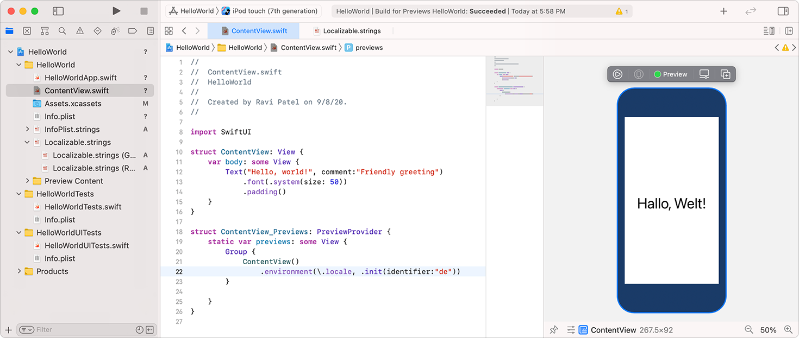
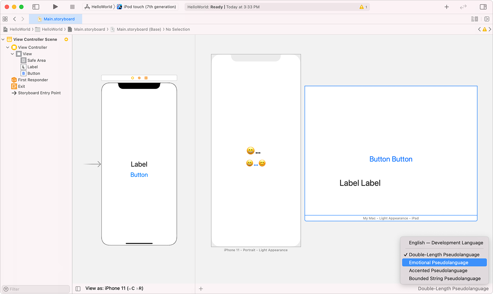

> 导航：[技术](../technologies.md) · [Xcode](../xcode.md) · [本地化](localization.md)

# 预览本地化

<sub>文章</sub>

在 SwiftUI 预览或 Interface Builder 预览中测试本地化（localization）。

## 概述

你可以在开发早期，在布局 SwiftUI 和 Interface Builder App 的界面时预览本地化。对于 SwiftUI App，你需要在预览本地化之前添加语言或导入本地化文件，相关操作在[添加对语言和区域的支持](adding-support-for-languages-and-regions.md)和[导入本地化](importing-localizations.md)中描述。对于 Interface Builder App，你可以先用伪语言（pseudolanguage）预览界面，之后再用你添加的本地化语言进行预览。

### 为 SwiftUI 预览添加本地化

对于 SwiftUI App，你可以通过在代码中设置 [`locale`](../swiftui/environmentvalues/locale.md) 环境变量来预览本地化。使用 [`environment(_:_:)`](<../swiftui/view/environment(____).md>) 函数为 SwiftUI 预览视图层级结构中的所有视图设置语言区域。例如，如果你向项目添加了德语，你可以将 `locale` 设置为德语（`de`）：

```swift
struct ContentView_Previews: PreviewProvider {
    static var previews: some View {
        ContentView()
                .environment(\.locale, .init(identifier: "de"))
    }
}
```

要预览从右到左的语言，还需要将 [`layoutDirection`](../swiftui/environmentvalues/layoutdirection.md) 键设置为 [`LayoutDirection.rightToLeft`](../swiftui/layoutdirection/righttoleft.md)。

要预览多个本地化，请在代码中添加更多预览，并为每个预览设置 [`locale`](../swiftui/environmentvalues/locale.md) 环境值。这些本地化会出现在 SwiftUI 预览中。



<sub>项目编辑器截图，导航器中选中了 ContentView.swift 文件，设置 locale 的代码行被高亮，右侧是其预览。</sub>

### 在 Interface Builder 中预览本地化

对于 Interface Builder，你可以在开发期间的任何时候通过选择本地化（包括伪语言）进行预览。你无需构建和运行 App 就能看到预览。

在 Interface Builder 中，选择所需的视图控制器。点击右上角的“调整编辑器选项”（Adjust Editor Options）按钮，然后选择“预览”（Preview）。画布右侧会出现布局预览。

在预览区域中，选择一个预览，或点击背景取消选择所有预览。如果你没有选择任何预览，你将更改所有预览的语言。点击右下角的语言按钮（例如“English”）。在弹出的菜单中，选择一个本地化或伪语言。



<sub>Interface Builder 截图，显示一个视图控制器场景的预览以及右下角语言弹出菜单的位置。</sub>

## 另请参阅

### 相关文档

- [添加对语言和区域的支持](adding-support-for-languages-and-regions.md) — 为你支持的每种语言和区域选择要本地化的资源。
- [导入本地化](importing-localizations.md) — 将你为某种语言和区域翻译或改编的文件导入你的项目。
- [EnvironmentValues](../swiftui/environmentvalues.md) — 通过视图层级结构传播的环境值集合。

### 测试

- [在运行 App 时测试本地化](testing-localizations-when-running-your-app.md) — 在你支持的每种语言和区域中运行 App，以全面测试你的 App。
