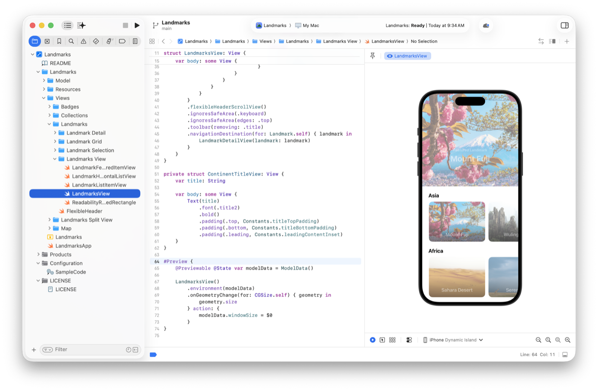
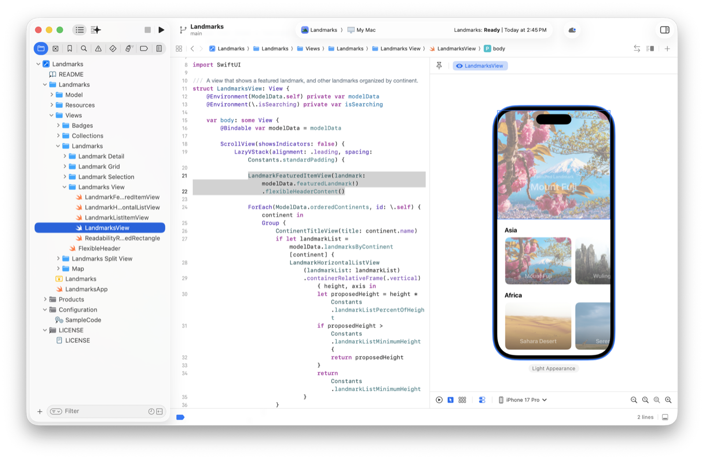
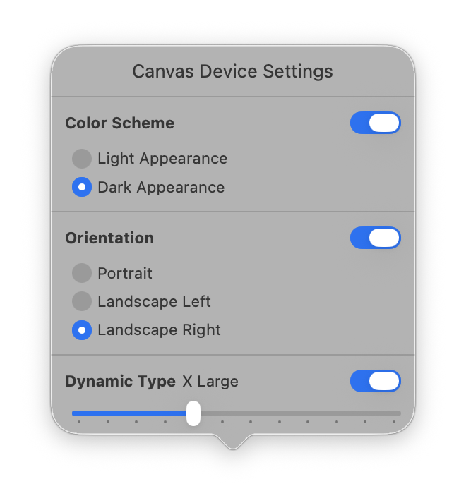
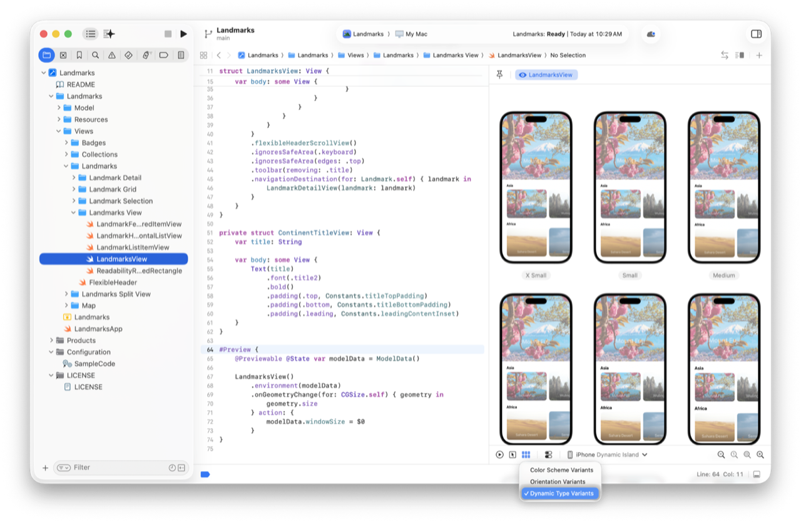
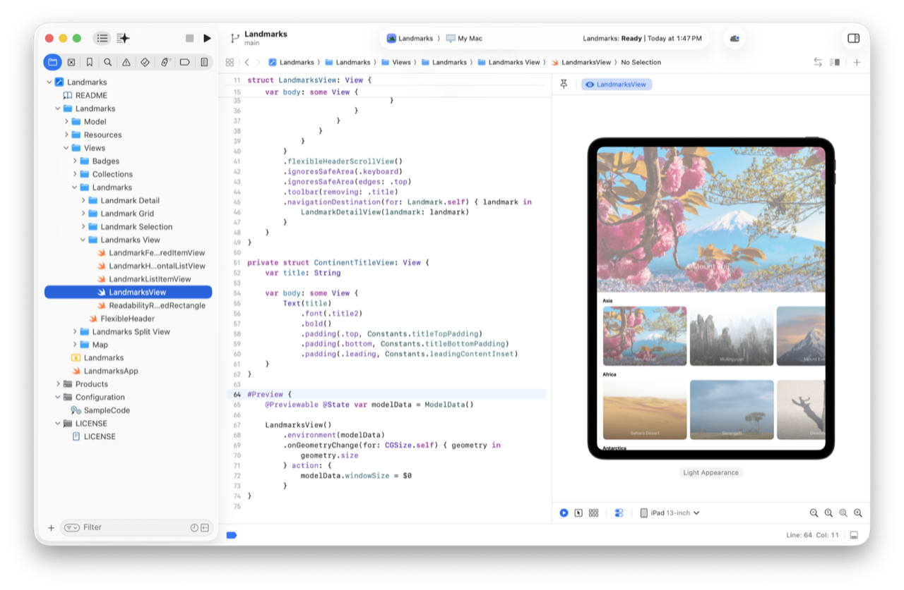
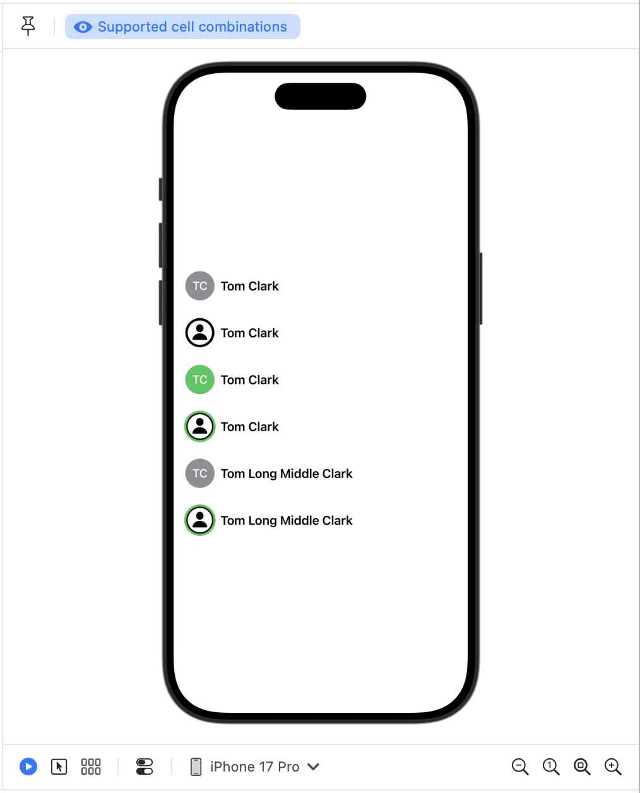

> 导航：[技术](../technologies.md) · [Xcode](../xcode.md)

# 在 Xcode 中预览 App 界面

<sub>文章</sub>

快速迭代设计，并预览 App 在不同 Apple 设备上的显示效果。

## 概述

借助 Swift 预览，你可以在代码中更改 App 的视图，并在预览画布中快速查看更改结果。使用预览宏向 SwiftUI、UIKit 和 AppKit 视图添加预览。然后使用预览画布控件或在代码中以编程方式配置预览的显示方式。

### 向界面文件添加预览宏

向代码添加视图时，可以在预览画布中显示它们。预览画布会展示视图在不同设备和各种配置下的外观。



<sub>Xcode 的屏幕截图，左侧为 Project 导览器，中间为代码编辑器，右侧为预览画布。</sub>

Swift 预览宏是一段用于创建和配置视图的代码。你可以使用一种预览宏（例如 [Preview(_:body:)](<../swiftui/preview(__body_).md>)）告诉 Xcode 要显示的内容。要手动显示或隐藏预览画布，请从 Xcode 菜单中选择 Editor \> Canvas。

**SwiftUI**

```swift
// SwiftUI 预览。
#Preview {
    // 要预览的视图。
}
```

**UIKit**

```swift
// UIKit 预览。
#Preview {
    // 要预览的视图或视图控制器（view controller）。
}
```

**AppKit**

```swift
// AppKit 预览。
#Preview {
    // 要预览的视图或视图控制器。
}
```

要向视图添加预览宏：

1. 打开要显示的视图的源文件。
2. 向文件添加 `#Preview` 宏。
3. 在宏的尾随闭包主体中，创建并返回要显示的视图配置实例。

**SwiftUI**

```swift
struct ContentView: View {
    var body: some View {
        // ...
    }
}

// SwiftUI 预览。
#Preview {
    ContentView()
}
```

**UIKit**

```swift
class WeatherViewController: UIViewController {
    // ...
}

// UIKit UIViewController 预览。
#Preview {
    let viewController = WeatherViewController()
    viewController.title = "Current Weather"
    return viewController
}

class WeatherView: UIView {
    var icon: UIImage?
}

// UIKit UIView 预览。
#Preview {
    let view = WeatherView()
    if let image = UIImage(systemName: "sun.max.fill") {
        view.icon = image
    }
    return view
}
```

**AppKit**

```swift
class WeatherViewController: NSViewController {
    // ...
}

// AppKit NSViewController 预览。
#Preview {
    let viewController = WeatherViewController()
    viewController.title = "Current Weather"
    return viewController
}

class WeatherView: NSView {
    var icon: NSImage?
}

// AppKit NSView 预览。
#Preview {
    let view = WeatherView()
    view.icon = NSImage(symbolName: "sun.max.fill", variableValue: 0.0)
    return view
}
```

### 使用智能功能生成预览

你可以使用 Xcode 编码智能功能生成预览。在源代码编辑器中选择一些视图代码并点按出现的编码助理图标，或者按住 Control 键点按某个符号并从弹出式菜单中选择 Show Coding Tools \> Show Coding Tools。在出现的编码工具弹出框中，点按 Generate a Preview。

有关编码智能功能的更多信息，请参阅[在 Xcode 中借助智能功能编写代码](writing-code-with-intelligence-in-xcode.md)。

### 在实时模式下与视图交互

选择实时或交互式预览选项时，视图的显示和交互方式与在设备或模拟器上一样。使用实时模式测试控制逻辑、动画和文本输入，以及对异步代码的响应。点按预览画布底部的 Live 按钮时，画布中会显示一个可供交互的设备预览。这是向文件添加新预览时的默认模式。

### 使用可选择模式快速尝试新设计

在可选择模式下，预览会显示视图的快照，以便你在画布中与视图的 UI 元素交互。要在源代码编辑器中高亮显示某个元素的代码，请点按预览画布底部的 Selectable 按钮，然后连按预览画布中的元素。Xcode 会同时高亮显示预览画布中的元素和源代码编辑器中的对应代码。随后，你可以在源代码编辑器中更改该元素的代码，并立即在预览画布中查看结果。



<sub>Xcode 的屏幕截图，中间为代码编辑器，右侧为预览。预览画布底部的可选择模式按钮处于启用状态。预览画布以可选择模式显示视图预览。</sub>

### 使用设备设置控制预览的显示方式

使用设备设置控制特定设备的预览显示方式。例如，要查看视图在深色外观、向右横排方向和特大文本下的效果：

1. 点按预览画布底部的 Device Settings。
2. 打开 Color Scheme，并在 Color Scheme 下选择 Dark Appearance。
3. 打开 Orientation，并在 Orientation 下选择 Landscape Right。
4. 打开 Dynamic Type，并将 Dynamic Type 滑块移到 X Large 文本设置。



<sub>“画布设备设置”对话框的屏幕截图，其中显示了 Color Scheme、Orientation 和 Dynamic Type 开关及控件。</sub>

### 测试不同的视图配置

使用变体模式查看视图在给定配置的不同变体下的外观。例如，要测试视图对辅助功能的支持程度，请从预览画布底部选择 Variant 模式，然后选择 Dynamic Type Variants 选项。Xcode 会以不同的文本大小显示视图。



<sub>预览画布的屏幕截图。预览画布底部的变体模式按钮处于启用状态。预览画布显示每种动态字体大小变体下的视图预览。画面中可见六个预览，每个预览都以不同的文本大小显示视图。</sub>

预览画布支持以下变体：

- **配色方案变体** — 显示视图的浅色和深色预览。
- **方向变体** — 以所有不同的竖排和横排方向显示视图。
- **动态字体变体** — 以 App 的所有辅助功能文本大小显示视图。

> [!example] 实验
> 由于变体模式会显示给定设备设置的所有值，你可以在“画布设备设置”中进一步更改设置，以覆盖变体模式所显示的内容。例如，要查看视图在深色外观下采用不同文本大小时的效果，请打开 Dynamic Type、打开 Color Scheme，并在 Color Scheme 下选择 Dark Appearance。

### 在特定设备上预览

要查看视图在特定设备上的显示效果，请从预览画布底部的 Preview Device 弹出式菜单中选择设备。随后，Xcode 会显示视图在该设备上的预览。



<sub>预览画布的屏幕截图。预览画布底部的预览目的地模式按钮处于启用状态，并设置为 iPad。预览画布显示视图在 iPad 上的预览。</sub>

### 在代码中捕获特定预览

除了 Xcode 提供的预览选项外，你还可以通过编程方式自定义和配置要重复使用的预览。

例如，可以添加名称，以便更轻松地跟踪每个预览显示的内容。将预览名称作为字符串传入预览宏时，该名称会显示在预览画布中预览的标题中。

```swift
// 带指定名称的预览。
#Preview("2x2 Grid Portrait") {
   Content()
}
```

> [!note] 注意
> 如果向文件添加多个预览宏和 playground 宏，可以使用画布顶部出现的标签页在它们之间切换。Xcode 会将传入宏的名称用作该预览的标签。要向 Swift 代码添加 playground，请参阅[使用 playground 宏运行代码片段](running-code-snippets-using-the-playground-macro.md)。

你还可以将一个或多个配置特征作为可变参数列表传入预览宏，以控制预览的显示方式。例如，要以向左横排方向显示视图，请将 [landscapeLeft](../developertoolssupport/previewtrait/landscapeleft.md) 类型属性传入 [init(_:traits:body:)](<../developertoolssupport/preview/init(__traits_body_)-8pemr.md>) 预览初始化器，告诉 Xcode 要显示的方向。

**SwiftUI**

```swift
// 带名称和方向的 SwiftUI 预览。
#Preview("2x2 grid", traits: .landscapeLeft) {
    CollageView(layout: .twoByTwoGrid)
}
```

**UIKit**

```swift
// 带名称和方向的 UIKit 预览。
#Preview("Camera setting sunning day", traits: .landscapeLeft) {
    let viewController = CameraViewController()
    if let image = UIImage(systemName: "sun.max.fill") {
        viewController.lastImage = image
    }
    return viewController
}
```

**AppKit**

```swift
// 带名称和方向的 AppKit 预览。
#Preview("Camera setting sunning day", traits: .landscapeLeft) {
    let viewController = CameraViewController()
    viewController.lastImage = NSImage(symbolName: "sun.max.fill", variableValue: 0.0)
    return viewController
}
```

### 将内联动态属性与 Previewable 搭配使用

当视图依赖 [Binding](../swiftui/binding.md) 属性包装器（property wrapper）时，可以使用 [Previewable()](<../swiftui/previewable().md>) 宏为该属性创建功能完备的绑定，并将其传入预览。此宏适用于任何遵循 [DynamicProperty](../swiftui/dynamicproperty.md) 协议的变量。

```swift
struct PlayButton: View {
    @Binding var isPlaying: Bool

    var body: some View {
        Button(action: {
            self.isPlaying.toggle()
        }) {
            Image(systemName: isPlaying ? "pause.circle" : "play.circle")
            .resizable()
            .scaledToFit()
            .frame(maxWidth: 80)
        }
    }
}

#Preview {
    // 使用 `Previewable` 标记动态属性。
    @Previewable @State var isPlaying = true

    // 将其传入视图。
    PlayButton(isPlaying: $isPlaying)
}
```

使用 `Previewable` 宏标记动态属性后，无需在预览中创建包装视图。

> [!note] 注意
> [Previewable()](<../swiftui/previewable().md>) 是仅适用于 SwiftUI 的宏，不适用于 UIKit 或 AppKit 预览。

### 使用预览修饰器让复杂对象可复用

为避免为每个需要昂贵对象的预览重新创建这些对象，你可以在 SwiftUI 中使用 [PreviewModifier](../swiftui/previewmodifier.md) 创建一次这些对象，然后使用 [Preview(_:traits:_:body:)](<../swiftui/preview(__traits___body_).md>) 宏将预览修饰器传入预览。

昂贵对象（例如进行网络调用、执行磁盘访问，或只是需要大量时间和精力来设置的对象）可能会延长预览加载时间。通过只创建一次这些昂贵对象并在所有预览之间共享，可以提高预览效率。

例如，假设你的 App 包含一个昂贵的 [Observable()](<../observation/observable().md>) 对象：

```swift
@Observable
class AppState {
    // 一个昂贵、复杂且庞大的对象。
    var expensiveObject = "Some expensive object"
}

@main
struct MyApp: App {
    @State private var appState = AppState()

    var body: some Scene {
        WindowGroup {
            ComplexView()
                .environment(appState)
        }
    }
}
```

你会在 App 中的多个视图间复用这个昂贵对象：

```swift
struct ComplexView: View {
    @Environment(AppState.self) var appState

    var body: some View {
        Text("\(appState.expensiveObject)")
    }
}
```

对于要预览的每个视图，你都要重新创建并传入这个昂贵对象：

```swift
#Preview {
    ComplexView()
        // 如果 `AppState` 很大或很复杂，这可能会很昂贵。
        .environment(AppState())
}
```

取而代之的是，只定义一次昂贵对象，并使用 [PreviewModifier](../swiftui/previewmodifier.md) 协议在多个预览之间共享该对象。

1. 定义一个遵循 `PreviewModifier` 协议的结构体。
2. 实现静态 [makeSharedContext()](<../swiftui/previewmodifier/makesharedcontext()-4zi8r.md>) 函数，返回包含昂贵状态的对象。
3. 使用 [body(content:context:)](<../swiftui/previewmodifier/body(content_context_).md>) 函数将该共享上下文注入要预览的视图。
4. 使用 [Preview(_:traits:_:body:)](<../swiftui/preview(__traits___body_).md>) 宏将修饰器添加到预览。

```swift
// 创建一个遵循 PreviewModifier 协议的结构体。
struct SampleData: PreviewModifier {

    // 定义要共享的对象，并将其作为共享上下文返回。
    static func makeSharedContext() async throws -> AppState {
        let appState = AppState()
        appState.expensiveObject = "An expensive object to reuse in previews"
        return appState
    }

    func body(content: Content, context: AppState) -> some View {
        // 将对象注入要预览的视图。
        content
            .environment(context)
    }
}

// 将修饰器添加到预览。
#Preview(traits: .modifier(SampleData())) {
    ComplexView()
}
```

### 只向视图传入所需数据

创建视图时，只传入视图显示所需的数据。避免传入获取数据的对象；这些对象会让视图预览的设置更加复杂，性能也更差。

应使用视图所需的最少数据创建视图，并优先采用更简单的不可变数据类型。以这种方式创建视图，可以更轻松地测试和预览视图，也有助于提高视图性能。

以下示例展示了如何使用 `String` 和 `enum` 等简单数据类型，通过预览宏以多种方式预览视图。

**SwiftUI**

```swift
struct CollaboratorCell: View {
    // 只使用视图所需的数据构造视图。
    let name: String
    let image: Image?
    let connectionStatus: ConnectionStatus
    
    enum ConnectionStatus {
        case online
        case offline
    }

    // ...
}

#Preview("Supported cell combinations", traits: .sizeThatFitsLayout) {
    let image = Image(systemName: "person.circle")
    VStack {
        // 然后在预览宏中测试每种场景。
        CollaboratorCell(name: "Tom Clark", image: nil, connectionStatus: .offline)
        CollaboratorCell(name: "Tom Clark", image: image, connectionStatus: .offline)
        CollaboratorCell(name: "Tom Clark", image: nil, connectionStatus: .online)
        CollaboratorCell(name: "Tom Clark", image: image, connectionStatus: .online)
        CollaboratorCell(name: "Tom Long Middle Clark", image: nil, connectionStatus: .offline)
        CollaboratorCell(name: "Tom Long Middle Clark", image: image, connectionStatus: .online)
    }
}
```

**UIKit**

```swift
class CollaboratorCell: UIView {
    // 只使用视图所需的数据构造视图。
    let name: String
    let image: UIImage?
    let connectionStatus: ConnectionStatus
    
    enum ConnectionStatus {
        case online
        case offline
    }
    
    // ...
}

#Preview("Supported cell combinations", traits: .sizeThatFitsLayout) {
    let image = UIImage(systemName: "person.circle")
    
    // 然后在预览宏中测试每种场景。
    let cell1 = CollaboratorCell(name: "Tom Clark", image: nil, connectionStatus: .offline)
    let cell2 = CollaboratorCell(name: "Tom Clark", image: image, connectionStatus: .offline)
    let cell3 = CollaboratorCell(name: "Tom Clark", image: nil, connectionStatus: .online)
    let cell4 = CollaboratorCell(name: "Tom Clark", image: image, connectionStatus: .online)
    let cell5 = CollaboratorCell(name: "Tom Long Middle Clark", image: nil, connectionStatus: .offline)
    let cell6 = CollaboratorCell(name: "Tom Long Middle Clark", image: image, connectionStatus: .online)
    
    // 创建要显示的测试工具。
    let stackView = UIStackView()
    stackView.axis = .vertical
    stackView.spacing = 8.0

    stackView.addArrangedSubview(cell1)
    stackView.addArrangedSubview(cell2)
    stackView.addArrangedSubview(cell3)
    stackView.addArrangedSubview(cell4)
    stackView.addArrangedSubview(cell5)
    stackView.addArrangedSubview(cell6)

    return stackView
}
```

**AppKit**

```swift
class CollaboratorCell: NSView {
    // 只使用视图所需的数据构造视图。
    let name: String
    let image: NSImage?
    let connectionStatus: ConnectionStatus

    enum ConnectionStatus {
        case online
        case offline
    }

    // ...
}

#Preview("Supported cell combinations", traits: .sizeThatFitsLayout) {
    let image = NSImage(systemSymbolName: "person.circle", accessibilityDescription: "A person symbol inside the outline of a circle.")

    // 然后在预览宏中测试每种场景。
    let cell1 = CollaboratorCell(name: "Tom Clark", image: nil, connectionStatus: .offline)
    let cell2 = CollaboratorCell(name: "Tom Clark", image: image, connectionStatus: .offline)
    let cell3 = CollaboratorCell(name: "Tom Clark", image: nil, connectionStatus: .online)
    let cell4 = CollaboratorCell(name: "Tom Clark", image: image, connectionStatus: .online)
    let cell5 = CollaboratorCell(name: "Tom Long Middle Clark", image: nil, connectionStatus: .offline)
    let cell6 = CollaboratorCell(name: "Tom Long Middle Clark", image: image, connectionStatus: .online)

    // 创建要显示的测试工具。
    let stackView = NSStackView()
    stackView.orientation = .vertical
    stackView.spacing = 8.0

    stackView.addArrangedSubview(cell1)
    stackView.addArrangedSubview(cell2)
    stackView.addArrangedSubview(cell3)
    stackView.addArrangedSubview(cell4)
    stackView.addArrangedSubview(cell5)
    stackView.addArrangedSubview(cell6)

    return stackView
}
```



<sub>预览画布的屏幕截图，其中显示数据行视图在各种测试场景配置下的六个预览。预览画布显示在线和离线状态、有无头像图像，以及长短显示名称的视图变体。</sub>

### 使用开发资源减小 App 大小

要在预览中访问资源而不将其包含在 App 最终版本中，请使用开发资源。开发资源让你可以在预览和 Simulator 中访问图像、视频、JSON 数据和代码文件等资源，而不会增加 App 的总体大小。

按以下步骤向项目 target 的 Development Assets 添加项目：

1. 在 Project 导览器中选择项目文件夹。
2. 选择要向其添加开发资源的 target。
3. 在 General 标签页中，向下滚动到 Development Assets。
4. 点按左下角的“添加项目”按钮 (+)。
5. 在出现的对话框中，选择要添加的项目，然后点按 Add。

## 另请参阅

### 基础

- [为 App 创建 Xcode 项目](creating-an-xcode-project-for-an-app.md) — 从模板创建 Xcode 项目，开始开发 App。
- [使用 SwiftUI 创建 App 界面](creating-your-app-s-interface-with-swiftui.md) — 使用交互式预览在 SwiftUI 中开发 App，使代码和布局保持同步。
- [构建并运行 App](building-and-running-an-app.md) — 编译源文件并组装 App 捆绑包，以便在设备或模拟器上运行。
- [Xcode 更新](../updates/xcode.md) — 了解 Xcode 的重要变化。
