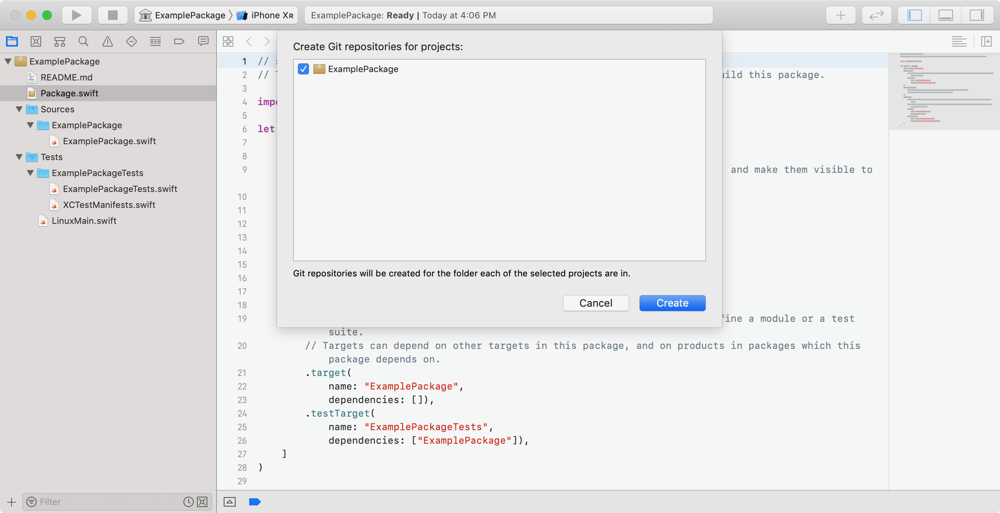

> 导航：[技术](../technologies.md) · [Xcode](../xcode.md) · [Swift 软件包](swift-packages.md)

# 使用 Xcode 发布 Swift 软件包

文章

以私有方式发布 Swift 软件包，或在全球范围内与其他开发者共享。

## 概述

将 Swift 软件包放到网上后，你便可以使用 Xcode 对 Swift 软件包依赖项的支持。通过将 Swift 软件包发布到私有 Git 仓库，你可以在各个项目中管理和集成内部依赖项，从而减少重复代码并提高可维护性。公开发布软件包，则可以与世界各地的开发者共享代码。要开始操作，只需要一个 Swift 软件包，以及托管 Git 仓库提供商的账户。

### 提供 Swift 软件包的信息

每个新创建的 Swift 软件包都包含一个可供修改的空白 `README.md` 文件。可以考虑在其中添加信息，以便其他开发者进一步了解你的 Swift 软件包，例如：

- Swift 软件包的功能描述
- 许可信息
- 支持的平台和 Swift 版本
- 联系信息

有些开发者甚至会选择在 `README.md` 文件中加入教程或使用文档。

### 将本地 Swift 软件包纳入版本控制

使用 Xcode 创建新的 Swift 软件包时，请在创建新软件包的表单（sheet）中选中“Create Git repository on my Mac”。

如果已有本地软件包尚未使用版本控制，请使用 Xcode 将其纳入版本控制。打开 Swift 软件包，选取 Integrate \> New Git Repository，选中软件包旁边的复选框，然后点按 Create。这会初始化 Git 仓库，将软件包添加到暂存区，并提交文件。

### 为最新提交添加标签

为 Swift 软件包创建版本标签是一项最佳做法；不过，也可以采用[向 App 添加软件包依赖项](adding-package-dependencies-to-your-app.md)中所述的其他方式将软件包添加到项目。要创建版本标签，请用软件包版本标记最后一次提交。_软件包版本_由三个以句点分隔的整数组成，例如 `1.0.0.`。软件包版本必须符合_语义化版本控制（semantic versioning）_，以确保开发者将软件包依赖项更新到较新版本时，软件包的行为可预测。

要进一步了解语义化版本控制标准，请访问[语义化版本 2.0.0](https://semver.org)。

> [!note] 注意
> 创建版本标签之前，请务必提交要包含在 Swift 软件包发布版本中的所有更改。

在 Source Code 导览器中，点按 Branches 旁边的展开三角形以显示分支列表，然后选择一个分支。在历史记录编辑器中，按住 Control 键点按某个提交，然后从弹出式菜单中选取 Tag “Your Identifier”。在出现的表单中，输入符合语义化版本控制标准的标签名称，例如 `1.2.4`。可以选择添加一条信息，然后点按 Create。

### 公开提供 Swift 软件包

确保 Source Control 导览器可见，然后选择本地仓库。右键点按该仓库，并选取 Create _[packageName]_ Remote。如果已为 Swift 软件包创建空的远程仓库，请选取 Add Existing Remote。

> [!important] 重要
> 你需要在 Xcode 的“设置”中添加托管 Git 账户，才能创建或连接 Git 远程仓库。

接下来，将本地更改和版本标签推送到 Git 远程仓库。点按 Source Control 菜单，选择 Push，从下拉式菜单中选取分支，选中 Include Tags 旁边的复选框，然后点按 Push。

确保 Git 仓库为公开仓库，并让其他人知道该软件包的存在。其他开发者只需要软件包的 Git URL 即可开始使用。

若要进一步了解如何采用软件包依赖项，请参阅[向 App 添加软件包依赖项](adding-package-dependencies-to-your-app.md)。
