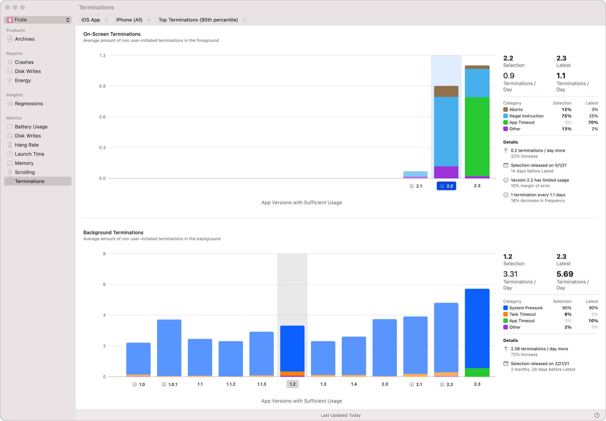

> 导航：[技术](../technologies.md) · [Xcode](../xcode.md) · [性能与指标](performance-and-metrics.md)

# 减少 App 终止

文章

处理常见终止原因，尽可能降低系统停止 App 的频率。

## 概述

终止是 App 生命周期的一部分，此时系统会停止你的进程。你可以通过修复错误和降低 App 的资源消耗显著减少终止；但是，终止是预期行为，无法完全消除。系统使用终止来优先保障保持前台用户体验流畅所需的资源。

系统终止 App 后，用户下次激活 App 时，App 必须重新启动。重新启动比重新激活 App 慢得多。

使用 [Xcode Organizer](https://developer.apple.com/videos/play/wwdc2020/10076/) 查看终止数据，或使用 MetricKit 的 [ForegroundTerminationMetric](https://developer.apple.com/documentation/metrickit/foregroundterminationmetric) 和 [BackgroundTerminationMetric](https://developer.apple.com/documentation/metrickit/backgroundterminationmetric) 在 App 中收集数据。

Xcode Organizer 中“终止”面板的屏幕截图。从左到右依次是指标和报告列表、报告列表、前台与后台终止图表，以及包含所选 App 版本和最新 App 版本其他详细信息的检查器。  

有关调试终止问题的更多信息，请观看以下 WWDC 讲座视频：[developer.apple.com/videos/play/wwdc2020/10078](https://developer.apple.com/videos/play/wwdc2020/10078/)。

### 了解终止原因

系统遇到以下任一问题时会停止 App。

- 中止（异常退出）。进程调用 `abort()` 时会发生中止。这通常发生在 App 遇到未捕获的异常或 `assert()` 调用失败时，并且经常通过 App 所使用的框架发生。中止使用 SIGABRT 信号。中止属于崩溃。
- 内存限制。在 iOS 上，系统会尝试为前台 App 提供尽可能多的内存。如果 App 尝试使用的内存超过系统可提供的内存，系统便会终止 App。
- 错误访问。当 App 尝试访问无效内存时会发生错误访问终止；例如，解引用空指针或尝试使用越界索引访问数组。错误访问终止属于崩溃。
- 非法指令。当 App 尝试执行系统无法解释的指令时会发生非法指令终止。非法指令终止属于崩溃。
- App 看门狗。当 App 启动时间过长时会发生 App 超时。系统为启动提供的时间较为宽松，超时通常表示 App 在启动时卡住。许多用户会在达到此限制之前退出 App，而这些退出不会被视为 App 超时。macOS App 没有启动时间限制。
- 内存压力。作为正常 App 生命周期的一部分，当系统需要的内存多于当前可用内存时，iOS 和 watchOS 会终止 App。当前台 App 需要更多内存时，系统通常会终止后台 App。通过降低 App 挂起时的内存用量，可以减少 App 因内存压力而终止的频率。你可以在 Xcode Organizer 中查看挂起时的内存用量。由于无法消除所有内存压力终止，请确保 App 具备适当的状态恢复（state restoration），以提供流畅的用户体验。

要解决属于崩溃的终止，请在 Xcode 的 Crashes Organizer 中查看崩溃的栈回溯（stack trace）。有关诊断和解决崩溃的更多信息，请参阅[使用崩溃报告和设备日志诊断问题](https://developer.apple.com/documentation/xcode/diagnosing-issues-using-crash-reports-and-device-logs)。

### 后台终止原因

有些终止原因仅适用于 App 位于后台时：

- 任务超时。用户将 App 置于后台后，系统允许 App 通过 [beginBackgroundTask API](https://developer.apple.com/documentation/uikit/uiapplication/1623051-beginbackgroundtask) 继续在后台执行。如果 App 未在分配的时间内完成工作，系统会以“任务超时”为由终止 App。
- 文件锁。当用户将 App 置于后台时，如果 App 继续持有对其 App Group 中某个共享文件的锁，就会发生文件锁终止。系统执行此终止操作，是为了避免因等待 App 可能永远不会释放的锁而遭到阻塞。

## 另请参阅

### 响应能力

- [分析已发布 App 中的响应能力问题](analyzing-responsiveness-issues-in-your-shipping-app.md) — 识别用户遇到的响应能力问题，并使用 Xcode Organizer 中的挂起（hang）和卡顿（hitch）数据确定最需要修复的问题。
- [改进 App 响应能力](improving-app-responsiveness.md) — 消除 App 的挂起和卡顿，打造响应迅速的用户体验。
- [了解用户界面响应能力](understanding-user-interface-responsiveness.md) — 通过检查事件处理和渲染循环，提高 App 的响应能力。
- [了解并改进 SwiftUI 性能](understanding-and-improving-swiftui-performance.md) — 识别并处理长时间运行的视图更新，同时降低更新频率。
- [了解 App 中的挂起](understanding-hangs-in-your-app.md) — 通过检查主线程和主运行循环（run loop），确定用户交互延迟的原因。
- [了解 App 中的卡顿](understanding-hitches-in-your-app.md) — 通过检查渲染循环，确定动态效果中断的原因。
- [尽早诊断性能问题](diagnosing-performance-issues-early.md) — 在开发和测试期间使用 Xcode 中的 Thread Performance Checker 工具诊断潜在的性能问题。
- [缩短 App 启动时间](reducing-your-app-s-launch-time.md) — 尽量减少启动过程所用时间，让 App 提供响应更迅速的体验。
