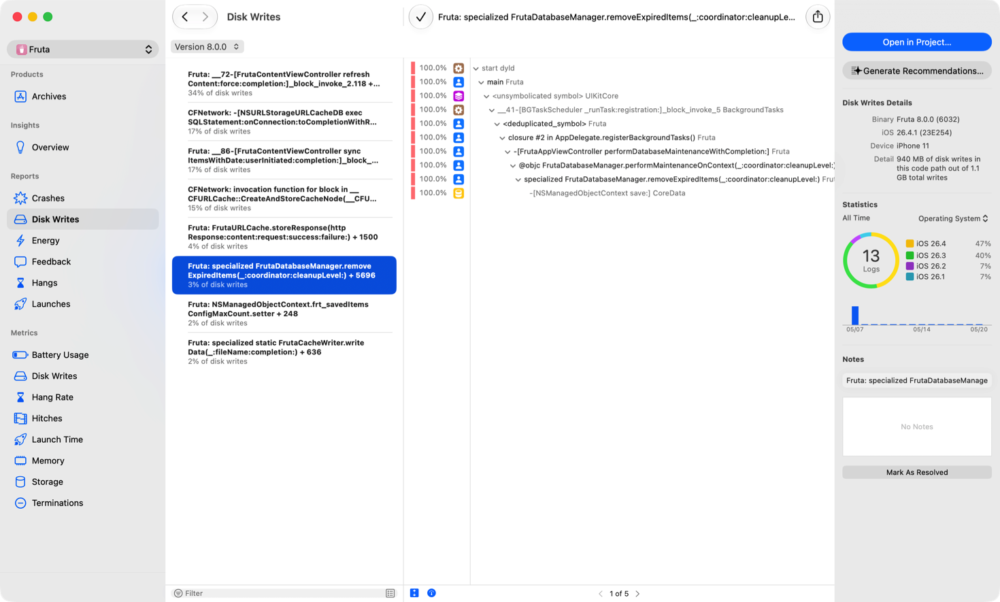
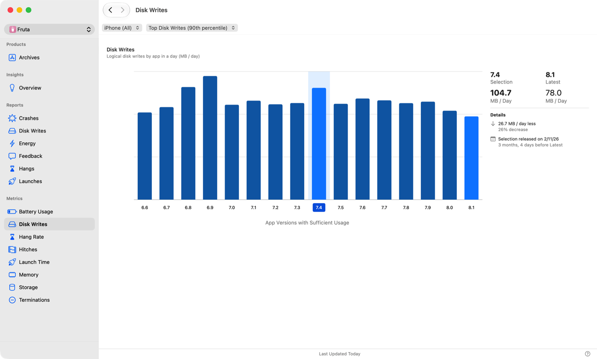
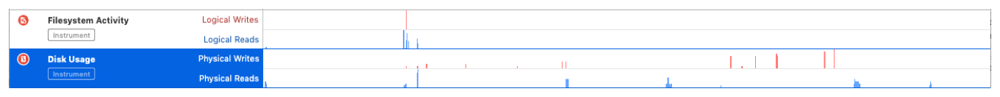

> 导航：[Technologies](../technologies.md) · [Xcode](../xcode.md) · [Performance and metrics](performance-and-metrics.md)

# 减少磁盘写入

<sub>文章</sub>

通过优化 App 向永久性存储写入数据的方式来提升其响应速度。

## 概述

所有 iOS 设备和部分 macOS 设备都使用固态硬盘（SSD）作为永久性存储。相比 RAM，在 SSD 或任何长期存储介质上访问数据都要慢得多。此外，系统对 SSD 同一区域的写入次数存在上限，超过该次数该区域就会损耗殆尽。

使用 Xcode 和 Instruments 了解你的 App 的磁盘写入性能，包括写入数据总量、写入大小、过量存储写入异常，以及其他可能的优化点。

### 优化 SSD 访问

当系统向 SSD 上的某个块写入数据时，针对该块的新读取请求会被排队，直到写入操作完成。写入 SSD 是比读取更慢的操作。交替进行读写请求会降低你的 App 的性能。

通过减少对 SSD 的写入操作次数来优化 App 的性能。例如，尽可能在 RAM 中的缓存里创建临时文件。

### 消除过量的写入操作

当你的 App 在 24 小时内的磁盘写入量超过某个阈值时，系统会抛出异常并生成报告。在 Xcode Organizer 的 Disk Writes 面板中查看某个 App 版本的汇总异常日志，或使用 [MetricKit](../metrickit.md) 捕获它们。



报告列表中的每份报告都显示了产生该异常的函数调用，以及它所占磁盘写入总量的百分比。点击某份报告可查看示例栈回溯，以及 Inspector 中的其他详情，包括：

- iOS 软件版本
- 设备型号
- 写入总量
- 收到的日志数量
- 14 天报告趋势

根据磁盘写入总占比，以及操作系统和受影响设备类型的信息来确定异常修复的优先级。使用报告列表中特定报告的函数签名及对应的栈回溯，找出导致写入增多的代码。更新代码并验证修复后，将该报告标记为已解决。

### 获取针对磁盘写入问题的编码助手建议

选中一份磁盘写入报告后，在 Inspector 中点击 Generate Recommendations，即可在 Xcode 中获得辅助分诊。选择工作区后，Xcode 会打开你的项目，并将栈回溯和受影响的代码路径粘贴到编码助手中，帮助你找出并修复导致过量写入的根本原因。

### 收集有关 App 磁盘使用情况的指标

在 Xcode Organizer 窗口的 Disk Writes 指标面板中查看你的 App 每日写入磁盘的数据量，或使用 [MetricKit](../metrickit.md)。

该面板以每天兆字节数展示你的 App 各发行版本的逻辑磁盘写入量。比较各版本以发现异常增长。可筛选查看不同设备间的差异，也可查看典型写入数据量（第 50 百分位）或最大写入数据量（第 90 百分位）。MetricKit 报告相同的数据。

下方屏幕截图显示，Fruta App 最新版本写入的最大数据量比早前版本每天少 26.7 MB。



评估记录的数据量对你的 App 而言是否合理。如果数字超出你的预期，你可能写入数据过于频繁。例如，如果你的 App 文件总共只有 100 KB，而每天却向磁盘写入 500 MB 数据，你可能需要调查每天将相同数据重复写入磁盘的次数。

利用按版本划分的磁盘写入频率图表来识别磁盘使用趋势。如果某个 App 的写入量逐日增长，可能是它确实在合法地处理更多数据，也可能是它在低效地处理已有数据。峰值可能表示用户为你的 App 创建或下载了新内容，也可能表示你的 App 修改同一内容的频率高于以往。谷值可能有助于你识别 App 所需的最小数据子集。

### 找出造成大量磁盘写入的代码

使用 File Activity 模板在 Instruments 中分析你的 App。Instruments 会追踪你的 App 对存储的逻辑和物理使用情况。



Filesystem Activity 工具以读写数据或将文件系统数据映射到内存的系统调用形式，记录逻辑文件系统的使用情况。Instruments 会将每个事件与其大小、持续时间以及可用于找出使用该文件系统的代码的回溯关联起来。Disk Usage 和 Disk I/O Latency 工具通过展示读写的大小和延迟，报告由这些文件系统事件引起的存储介质物理使用情况。

Filesystem Suggestions 工具以及 Xcode Organizer 中的 Disk Writes Reports 面板也会针对常见的文件系统使用问题提供建议。

> [!note] 注意
> 磁盘上物理读写的大小与逻辑文件系统活动的大小并不相关。磁盘控制器以称为块（block）的区域为单位工作，通常每块大小为 4 KB。对磁盘的写入以块为单位进行，因此即使只对文件做了单字节的改动并保存，也会向磁盘写入 4 KB。

### 批量处理多次写入操作

反复打开、保存再关闭同一个文件会增加磁盘写入的频率。将小的改动收集起来作为一次写入执行可以降低这一频率，不过这也可能导致 App 内存使用量增加。设计你的 App 的持久化模型时，需要在这两种资源的使用之间有效地取得平衡。参阅[减少 App 的内存使用](reducing-your-app-s-memory-use.md)。

### 尽量减少对序列化文件的写入

许多 App 使用属性列表、JSON、XML 或其他序列化格式来写入用户文稿。这些格式适合只读内容，例如 bundle 元数据，或用于通过网络传输数据。但这些格式并不适合存储频繁变化的用户文稿。修改一个序列化文稿需要重写整个文件，这会增加操作的延迟并加剧设备损耗。

如果可能，使用 [SwiftData](../swiftdata.md)、[Core Data](../coredata.md) 或 SQLite 来存储频繁编辑的文稿。如果做不到这一点，则针对频繁变化的数据和大多静态的数据使用不同的序列化文件。这样可以减少磁盘写入量并改善延迟。

Disk Writes Report 面板会针对序列化文件的使用优化提供建议。

### 避免快速创建和删除文件

在 iOS 上创建或删除文件时，系统会通过写入 8 KB 元数据来更新目录引用。快速创建或删除大量文件会导致对文件系统进行许多次小写入，从而降低性能并加剧设备损耗。在 iOS 上重命名或移动一个文件最多会新增 16 KB 的文件系统元数据写入。

以原子方式创建文件会带来额外的写入，因为系统必须创建一个临时文件、写入内容、取消现有目标文件的链接，然后将临时文件重命名为最终目标文件。常见场景包括 Foundation 对象的原子写入调用，例如 [NSString](../foundation/nsstring.md)、[NSArray](../foundation/nsarray.md)、[NSDictionary](../foundation/nsdictionary.md) 和 [NSData](../foundation/nsdata.md)。

仅在需要时使用原子写入。

### 尽量减少显式的存储同步

在 iOS 上写入数据会将数据加入统一缓冲区缓存，系统随后会将其写入文件存储。强制 iOS 从统一缓冲区中刷新待处理的文件系统更改，可能导致不必要的磁盘写入，从而降低性能并加剧设备损耗。如果可能，避免调用 `fsync(_:)`，或使用 `fcntl(_:_:)` 的 `F_FULLFSYNC` 操作来强制刷新。

有些 App 需要 _写入屏障（write barrier）_ 来确保数据持久化后才能继续进行后续操作。大多数 App 可以为此使用 `fcntl(_:_:)` 的 `F_BARRIERFSYNC`。

只有当你的 App 需要对数据持久化有强保证时才使用 `F_FULLFSYNC`。请注意，`F_FULLFSYNC` 只是尽力确保 iOS 将数据写入磁盘，在突然断电的情况下数据仍可能丢失。

### 防止磁盘写入频率出现衰退

通过编写 XCTest 性能测试来衡量你的 App 的磁盘使用情况。创建一个测试，将 [XCTStorageMetric](../xctest/xctstoragemetric.md) 的实例传给 [measure(metrics:block:)](<../xctest/xctestcase/measure(metrics_block_).md>) 函数。在 `measure(metrics:block:)` 的 block 参数内部调用你向磁盘写入数据的代码。

该测试会衡量为保存数据而写入文件系统的块数量。为磁盘使用量设定一个基准预期。如果写入的数据量明显超出该基准，测试就会失败。

```swift
func testDiskUse() {
  self.measure(metrics: [XCTStorageMetric()]) {
     // This is a disk-intensive operation.
  }
}
```

### 对频繁变化的文稿使用 Swift Data、Core Data 或 SQLite 数据库

SQLite 经过高度优化，能高效访问存储。它使用内存缓存和批量磁盘写入，以确保高性能并将存储损耗降到最低。其数据结构的设计使得插入新内容或更新现有内容时都能高效更新。

[SwiftData](../swiftdata.md) 和 [Core Data](../coredata.md) 都利用了 SQLite 高效的磁盘使用方式来存储你的数据。它们也使用了下文所述的 SQLite 最佳实践。

#### 避免不必要地关闭 SQLite 连接

打开和关闭 SQLite 连接是开销较大的操作，需要 SQLite 写出所有待处理的更改，以及包括一致性检查和日志记录在内的额外元数据。只在确有必要时才关闭连接，以更好地利用 SQLite 的效率。

#### 使用事务

对相关的多项更改使用事务来执行合并的写入操作，例如在同一个文稿中编辑多个字段。每个事务可以包含多条 `INSERT`、`UPDATE` 和 `DELETE` 语句。

事务同时也是原子的。要么所有更改都被保存到数据库中，要么数据库恢复到事务开始前的状态。这样可以防止数据库处于不一致的状态。

#### 使用合适的索引

通过在数据库表上使用合适的索引来缩短搜索时间并避免不必要的磁盘写入。例如，一个使用 SQLite 的邮件 App 可能会用下面的 SQL 语句按时间顺序显示收件箱中的所有邮件：

```
SELECT * FROM messages WHERE folder LIKE ‘Inbox’ ORDER BY sent_time
```

如果 `sent_time` 列没有索引，SQLite 会在内存中构建一个临时 B 树，读取整张表，并使用该 B 树执行排序。如果 B 树中的数据太大而无法放入内存缓存，SQLite 会将其写入磁盘，进一步拖慢查询速度。如果对 `sent_time` 建立了索引，SQLite 就可以按顺序读取消息并返回匹配的行。

对于表示无需逐行搜索的信息的列（例如可能包含 `NULL` 的行），使用部分索引。部分索引——即带 `WHERE` 子句的索引——在占用磁盘空间比完整索引更少的同时，还能带来性能上的优势。

使用 `EXPLAIN QUERY PLAN` 来判断某个查询是否可以从优化中受益。下面的代码展示了对未建立索引的 `sent_time` 列执行查询的解释结果。

```
> EXPLAIN QUERY PLAN SELECT * FROM messages WHERE folder
  LIKE ‘Inbox’ ORDER BY sent_time

QUERY PLAN
|--SEARCH TABLE <>
|--SEARCH TABLE <>
--*USE TEMP B-TREE FOR ORDER BY*
```

输出中出现 `USE TEMP B-TREE FOR ORDER BY` 表明该查询需要一个临时 B 树来对结果进行排序。

Disk Writes Report 面板的建议会找出可能受益于索引的查询。

#### 使用预写式日志记录模式

通过使用预写式日志记录（write-ahead logging，WAL）模式来提升 SQLite 中读写的效率。这种模式支持将对同一页面的多次写入合并、减少 SQLite 对写入屏障的使用，并支持多个数据库读取线程与一个写入线程并行工作。

使用 `PRAGMA journal_mode` 来查看你的 SQLite 数据库的日志记录模式。使用 `PRAGMA journal_mode=WAL` 切换到预写式日志记录模式。

当栈回溯显示使用了不同的日志记录模式时，Disk Writes Report 面板会建议改用预写式日志记录。

#### 避免使用显式的 VACUUM 命令

使用 SQLite 的 `VACUUM` 命令可以通过重建数据库来节省空间。该操作会将现有数据库复制到一个临时文件，然后再将信息移回数据库，这可能导致过量的磁盘写入。

如果可能，通过将 `auto_vacuum()` pragma 设为 `2` 来增量式地重建数据库。然后使用 `incremental_vacuum()` pragma 从空闲页面列表中移除任何现有的空页面。

当栈回溯显示数据库处于完全自动清理（auto-vacuum）模式时，Disk Writes Report 面板会建议改用增量式清理。

## 另请参阅

### 磁盘使用

- [减少 App 的磁盘使用](reducing-your-app-s-disk-usage.md) — 衡量并最小化你的 App 用于存储其文件的空间。
- [监控 App 的存储指标](monitoring-your-app-s-storage-metrics.md) — 使用 Xcode Organizer 随时间追踪 App 的存储占用情况，以捕获 Documents & Data 和 App Size 方面的衰退。
