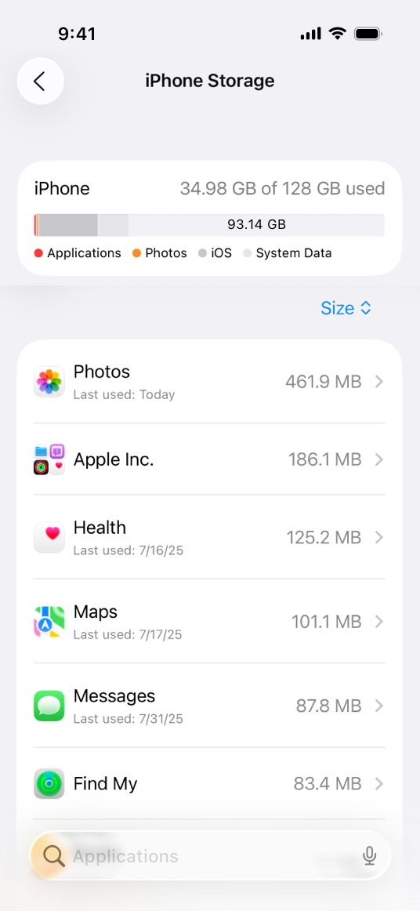

> 导航：[Technologies](../technologies.md) · [Xcode](../xcode.md) · [Performance and metrics](performance-and-metrics.md)

# 减少你的 App 的磁盘用量

测量并尽量减少你的 App 用于存储文件的空间。

<sub>文章</sub>

测量并尽量减少你的 App 用于存储文件的空间。

## 概述

人们会在设备上使用多个 App 来创建和访问重要内容。尽量减少你的 App 的磁盘用量，为人们的内容腾出更多空间，也让人们能在设备上安装更多 App。将可恢复的数据存储在可清除的位置，以便系统在需要时释放空间。

### 检查你的 App 的磁盘用量

要查看设备上每个 App 使用的存储空间，请打开「设置」，选择「通用 \> 储存空间」。



点按你的 App，可查看 App 的软件包、文稿和数据对总体磁盘用量的构成情况。

### 收集磁盘用量的指标

使用 [MetricKit](../metrickit.md) 收集你的 App 容器中文件数量及其占用磁盘空间的指标。观察 `metricReports` 这个异步序列，并从每日报告中读取文件数量和大小的值：

```swift
import MetricKit

let manager = MetricManager()

for await report in manager.metricReports {
    let entry = report.intervalEntries.fullDayEntry
    for value in entry.values {
        switch value {
        case let .totalFileSize(metric):
            // 分析你的 App 的磁盘用量。
            break
        case let .totalFileCount(metric):
            // 跟踪你的 App 容器中的文件数量。
            break
        @unknown default:
            break
        }
    }
}
```

### 对可恢复内容使用可清除的文件夹

当你下载或以其他方式生成一些内容、且这些内容在需要时可以由你的 App 重新恢复时，请将这些内容存储在 [cachesDirectory](../foundation/url/cachesdirectory.md) 或 [temporaryDirectory](../foundation/filemanager/temporarydirectory.md) 中。当系统检测到磁盘空间不足时，会自动删除 `cachesDirectory` 和 `temporaryDirectory` 中的内容——这一操作称为 _purging（清除）_。

```swift
let cacheDownloadTask = URLSession.shared.downloadTask(with: cacheURL) {
    fileURL, response, error

    // Check for download errors and handle them.

    guard let temporaryURL = fileURL else { return }
    do {
        let destinationURL = URL.cachesDirectory.appendingPathComponent(temporaryURL.lastPathComponent)
        try FileManager.default.moveItem(at: temporaryURL, to: destinationURL)
    }
    catch {
        // Handle the error.
    }
}
```

### 管理 iCloud 文件的本地副本

当某人不再使用存储在 iCloud 中的文件的本地副本时，调用 [evictUbiquitousItem(at:)](<../foundation/filemanager/evictubiquitousitem(at_).md>) 可以移除本地副本，同时保留 iCloud 上的原始文件：

```swift
func removeLocalDocument(at localURL: URL) throws {
    let resources = try localURL.resourceValues(forKeys: [.ubiquitousItemIsUploadedKey])
    guard resources.ubiquitousItemIsUploaded == true else { return }
    FileManager.default.evictUbiquitousItem(at: localURL)
}
```

之后你可以通过调用 [startDownloadingUbiquitousItem(at:)](<../foundation/filemanager/startdownloadingubiquitousitem(at_).md>) 从 iCloud 重新获取该文件：

```swift
func fetchRemoteDocument(for localURL: URL) throws {
    let resources = try localURL.resourceValues(forKeys: [.ubiquitousItemIsUploadedKey])
    guard resources.ubiquitousItemIsUploaded != true else { return }
    FileManager.default.startDownloadingUbiquitousItem(at: localURL)
}
```

> [!warning] 警告
> 如果你通过调用 [removeItem(at:)](<../foundation/filemanager/removeitem(at_).md>) 从 iCloud 删除文件，系统会同时删除本地副本和 iCloud 副本，且你无法恢复该文件。

### 通过创建克隆来复制文件

当你使用 [copyItem(at:to:)](<../foundation/filemanager/copyitem(at_to_).md>) 在 APFS 卷上复制文件时，系统会为该文件创建一个 _clone（克隆）_。克隆引用原始文件的内容，因此它在磁盘上占用的空间比通过其他方法复制文件要少。MetricKit 的 [TotalFileSizeMetric](../metrickit/totalfilesizemetric.md) 在计算你的 App 所占用的磁盘空间时会计入克隆。

更多信息请参阅[关于 Apple 文件系统](../foundation/about-apple-file-system.md#Clones-Reduce-the-Cost-of-Copying)。

## 另请参阅

### 磁盘用量

- [减少磁盘写入](reducing-disk-writes.md) — 通过优化 App 向永久性存储写入数据的方式，提升 App 的响应速度。
- [监控你的 App 的存储指标](monitoring-your-app-s-storage-metrics.md) — 使用 Xcode Organizer 随时间跟踪你的 App 的存储占用情况，以发现「文稿和数据」以及「App 大小」方面的衰退。
