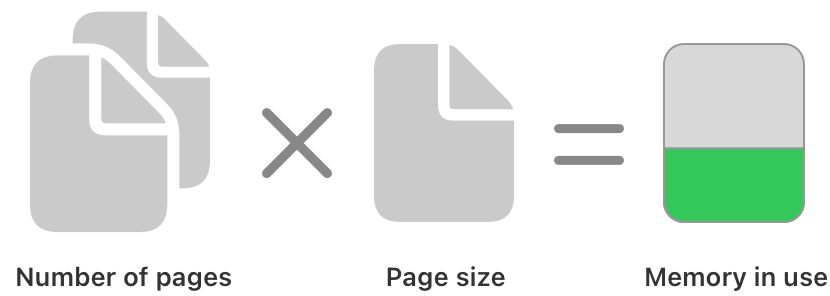
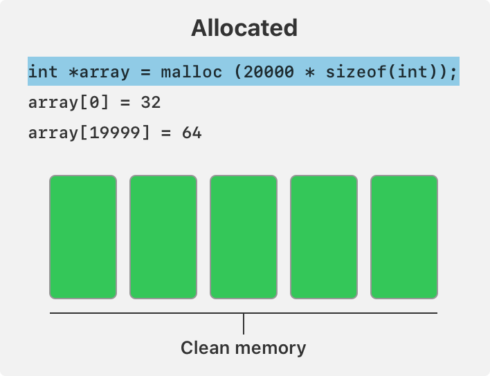
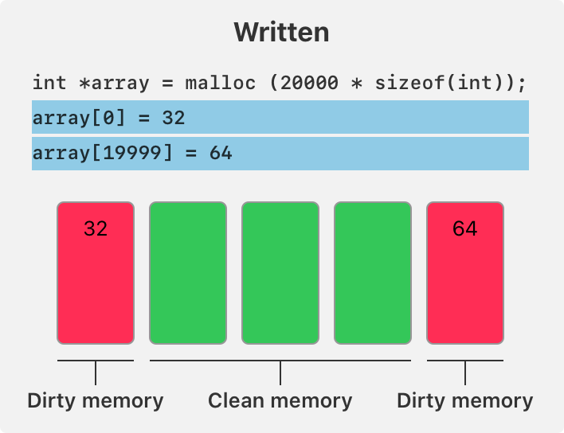
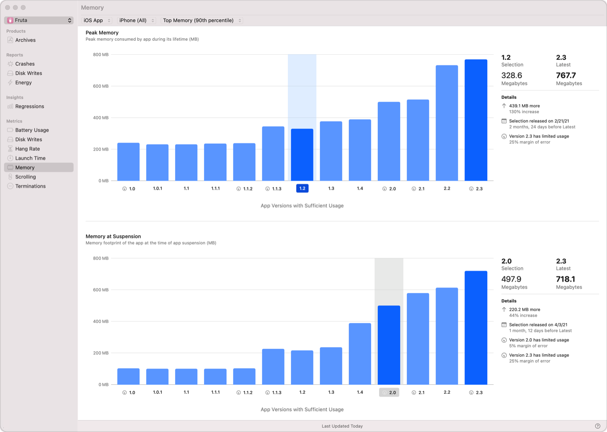

> 导航：[技术](../technologies.md) · [Xcode](../xcode.md) · [性能与指标](performance-and-metrics.md)

# 减少 App 的内存使用

通过分析内存使用指标并进行更改以最大限度提高内存效率，改善 App 的性能。

## 概述

设备上的内存（RAM）是一种有限资源，由 App、操作系统进程和内核共享。iOS 有多种技术来满足对内存的不同需求，但这些技术会牺牲速度和响应能力。例如，当某个内存密集型 App 在后台运行时，iOS 可能会将它转移到固态存储。该 App 随后返回前台或尝试运行后台任务（background task）时，就会产生延迟。

如果 App 使用的内存过多，iOS 会向它发送警告。你会以_崩溃报告_的形式收到这类警告的通知。该报告的异常类型为 `EXC_RESOURCE`、子类型为 `MEMORY`，表明 App 已接近其内存限制。这并不意味着 iOS 已终止 App，而只表示它检测到了内存使用问题。触发异常的内存限制取决于设备；一旦 App 超过此限制，iOS 就会将其终止。如果 App 在前台时被终止，用户会看到它从屏幕上消失。用户下次打开 App 时，App 会从头启动，这比从后台恢复需要更长时间。

由于设备会在 App 与 iOS 进程之间共享内存，一个 App 使用过多内存可能会损害整台设备上的用户体验。限制 App 使用的内存量，即便在用户使用其他 App 时也会为他们带来好处。

### 了解内存使用指标

Xcode Organizer 和 MetricKit 都会提供两项有关 App 内存使用的指标。第一项是内存使用峰值，即在采集的所有样本中观察到的最高内存使用量。iOS 会在一天中定期采样 App 的内存使用情况来收集此指标。第二项是在挂起时观察到的内存使用量，它在 App 进入后台时测量。

iOS 会将正在使用的内存页数乘以页大小来测量内存使用量，页大小通常为 16 KB。如果 iOS 必须分配新页面来存储某个字节，那么仅向已分配内存写入一个字节，就可能使内存使用量增加 16 KB。

App 可执行文件或链接的库和框架中所定义的数据结构会计入内存使用指标。App 在运行时分配的内存起初不会计入该指标。这类内存是「干净（clean）」内存，iOS 无需专门分配物理 RAM 来存储它。当 App 向已分配内存写入数据时，该内存会变为「脏（dirty）」内存，iOS 会分配 RAM 来存储其内容，如下图所示。脏内存会计入内存使用指标。

### 查看内存使用数据

在 Xcode Organizer 窗口的 Memory 面板中，或使用 [MetricKit](../metrickit.md) 查看 App 的内存使用情况。

Xcode Organizer 中 Memory 指标面板的截屏。从左到右依次是指标和报告列表；包含两个条形图的指标界面，上方为 Peak Memory，下方为 Memory at Suspension；峰值内存图中高亮显示的所选版本；以及右侧两幅图的比较数据。

Memory 面板在上方图表中显示内存峰值信息，在下方图表中显示挂起时的内存信息。使用右上角的两个菜单，按设备类型以及典型内存使用量（第 50 百分位数）或最高内存使用量（第 90 百分位数）筛选信息，以找出可能存在问题的区域。在图表中单击所需版本的条形，即可将当前版本的内存使用情况与先前版本进行比较。

## 主题

### 任务

- [收集内存使用信息](gathering-information-about-memory-use.md) — 通过测量和分析你的 App，识别内存使用效率低下的问题。
- [进行更改以减少内存使用](making-changes-to-reduce-memory-use.md) — 处理内存使用过量的常见原因，以减少 App 的内存使用。
- [防止内存使用衰退](preventing-memory-use-regressions.md) — 测量 App 功能所使用的内存，并使用 XCTest 性能测试检测内存使用量的增加。
- [响应低内存警告](responding-to-low-memory-warnings.md) — 检测 App 何时使用了过多内存，并使内存使用恢复到可控范围。

## 另请参阅

### 相关文档

- [通过 jetsam 事件报告识别高内存使用情况](identifying-high-memory-use-with-jetsam-event-reports.md) — 了解可用内存不足时操作系统终止 App 的原因。

### 内存和大小

- [缩减 App 的大小](reducing-your-app-s-size.md) — 测量 App 的大小，优化其资源和设置，并采用有助于简化通过移动互联网连接进行安装的技术。
