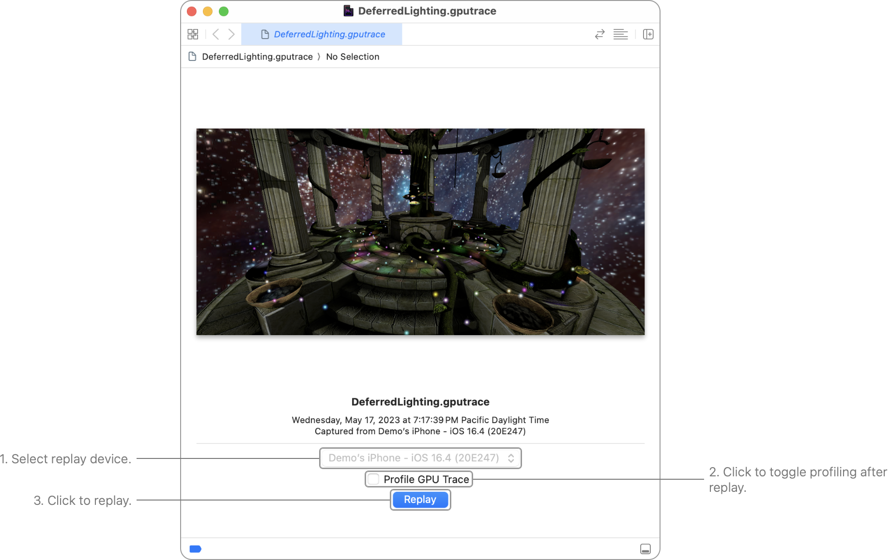

> 导航：[Technologies](../technologies.md) · [Xcode](../xcode.md) · [Debugging](debugging.md) · [Metal debugger](metal-debugger.md)

# 重放 GPU 追踪文件

文章

在 Metal debugger 中使用 GPU 追踪文件调试和分析你的 App 性能。

## 概述

重放 GPU 追踪文件让你能够使用 Metal debugger 调试和分析之前捕获的 GPU 命令。更多信息请参阅 [Capturing a Metal workload in Xcode](capturing-a-metal-workload-in-xcode.md) 或 [Capturing a Metal workload programmatically](capturing-a-metal-workload-programmatically.md)。

要重放 GPU 追踪文件，请在 Xcode 中打开它。在点按 Replay 之前，你可以配置要使用的设备（如果有多台可用设备），以及是否要在运行时进行性能分析。

### 配置重放

如果你有多台设备，就需要在重放 GPU 追踪文件之前选择一台设备。Xcode 会自动选择兼容性最好的设备，但你也可以通过 Device 弹出窗口选择其他设备。

> [!warning] 警告
> GPU 追踪文件只与相同类型、相同 GPU、相同操作系统的设备兼容。否则性能可能会有差异。例如，如果你在配备 AMD GPU 的 Mac 上捕获了一个 Metal workload，在配备 Apple M1 芯片的 Mac 上重放导出的 GPU 追踪文件可能无法正常运行，或表现不一致。

你可以选择启用 Profile GPU Trace 选项，让 Xcode 在重放后自动进行性能分析。性能分析对 Metal debugger 有初始的性能影响，因此只应在需要调试 App 性能时启用此选项。你随时都可以在之后按需进行性能分析。

## 另请参阅

### Essentials

- [Capturing a Metal workload in Xcode](capturing-a-metal-workload-in-xcode.md) — 通过配置你的项目以使用 Metal debugger 来分析 App 的性能。
- [Capturing a Metal workload programmatically](capturing-a-metal-workload-programmatically.md) — 通过调用 Metal 的帧捕获来分析 App 的性能。
- [Investigating visual artifacts](investigating-visual-artifacts.md) — 使用 Metal debugger 发现、诊断并修复 App 中的视觉伪影。
- [Optimizing GPU performance](optimizing-gpu-performance.md) — 使用 Metal debugger 查找并解决性能瓶颈。
- [Debugging with interactive command-line tools](debugging-with-interactive-command-line-tools.md) — 无需离开 Terminal 即可调查 GPU 追踪中的渲染问题。
- [Investigating GPU issues with AI agents](investigating-gpu-issues-with-ai-agents.md) — 通过将追踪文件交给 AI agent 进行自主调查，找出大型 GPU 追踪中问题的根本原因。
</content>
