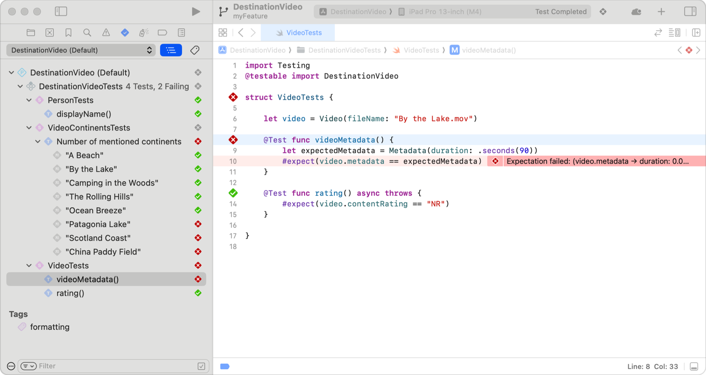
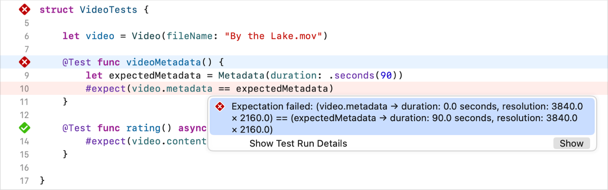
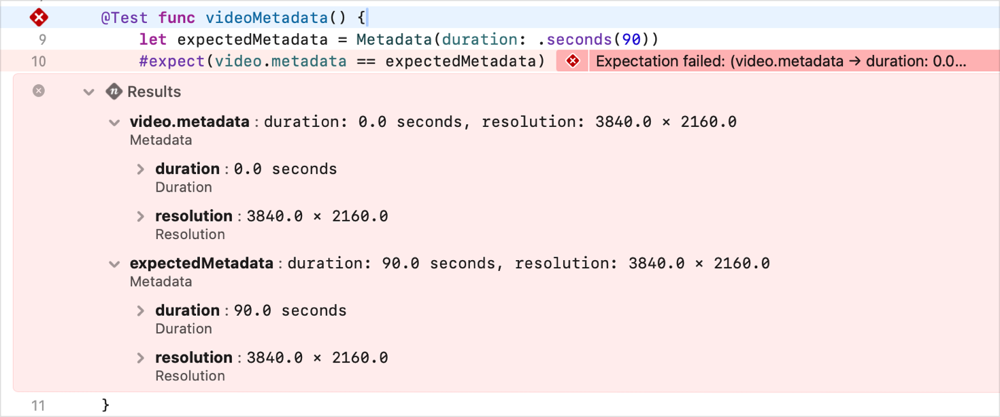
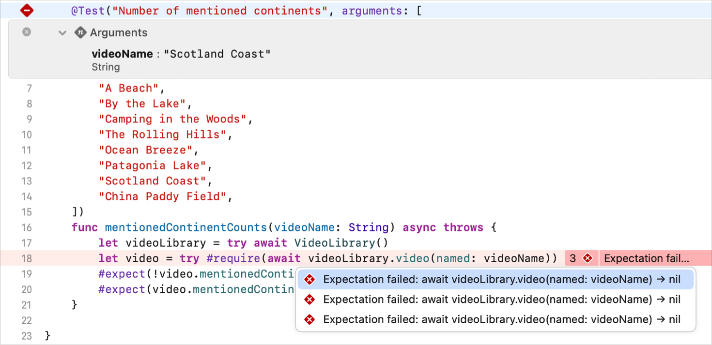
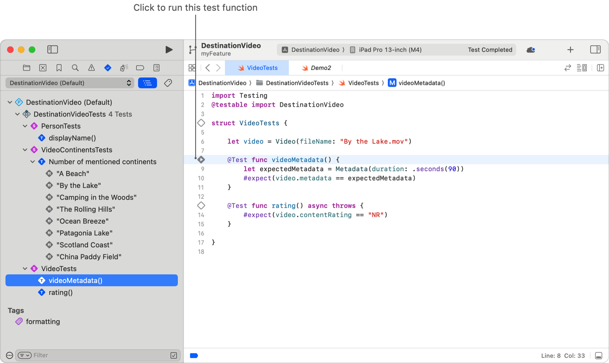
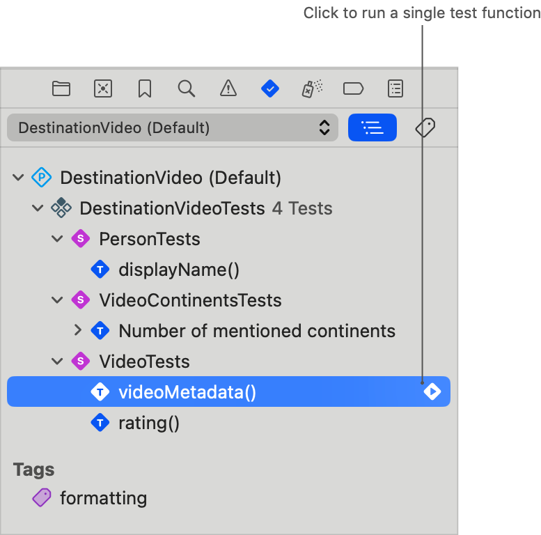
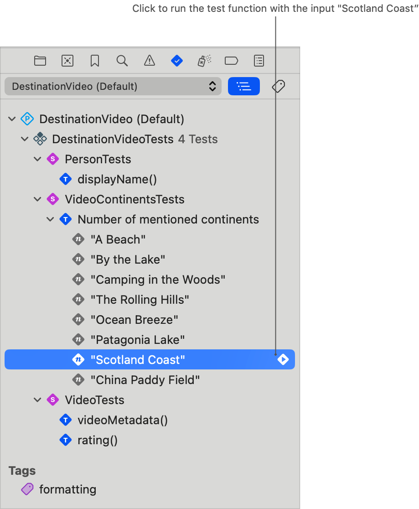
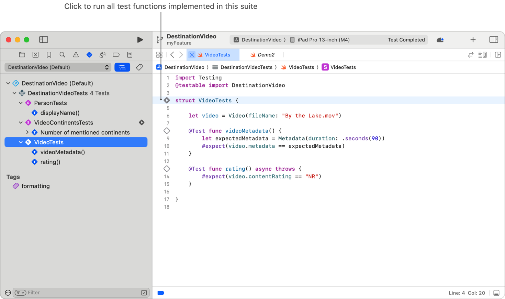
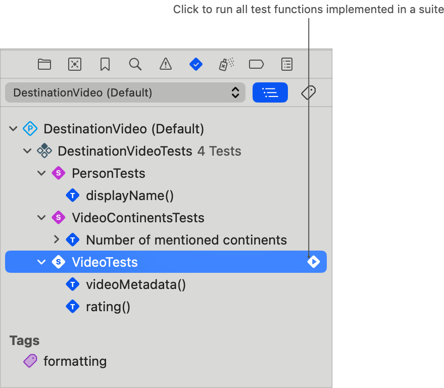
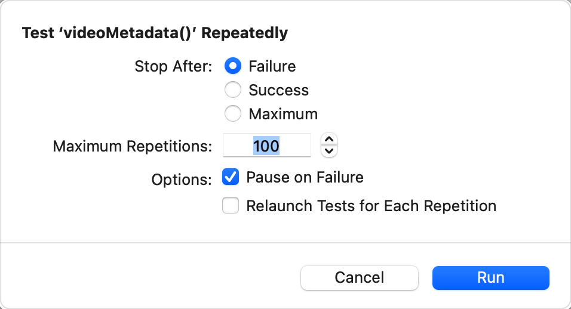

> 导航：[技术](../technologies.md) · [Xcode](../xcode.md) · [测试](testing.md)

# 运行测试与解读结果

<sub>文章</sub>

通过运行测试并理解结果，判断项目代码的行为是否符合预期。

## 概述

在软件开发工作流的不同节点，你会需要运行测试的子集：

- 在修改某个特定函数或类型时，仅运行与该单元相关的测试可以让你最快地获取有关当前修改状态的反馈。
- 当你的修改已准备好进行代码审查或集成时，运行受影响目标的所有测试，可以揭示出任何意料之外的衰退（regression）。
- 最后，Xcode Cloud 可以按计划使用多种配置运行全套测试，从而在管理执行大量测试所需的更长运行时间的同时，让你对代码的正确性更有信心。

## 从测试计划运行测试

要运行当前活跃测试计划中的所有测试，你有两个选择：可以在 Xcode 中运行（选取 Product \> Test），也可以在终端中运行 `xcodebuild` 命令：

```zsh
% xcodebuild test -scheme SampleApp
```

通过编辑 Xcode 目标的 scheme 中的测试计划，可以配置在执行此操作时测试运行器要运行哪些测试。有关更多信息，请参见 [为项目自定义构建 scheme](customizing-the-build-schemes-for-a-project.md)。如果你的构建 scheme 包含多个测试计划，请选取 Product \> Test Plan 以选择要运行的测试计划。在测试导览中查看活跃的计划，选取 View \> Navigators \> Tests。当你选择不同的测试计划或不同的构建 scheme 时，测试导览会更新以显示该计划。展开该计划的大纲视图，查看它所包含的目标、测试套件、测试函数以及参数化测试用例。你禁用或标记为跳过的项目会显示为灰色。

## 解读测试结果

测试运行后，Xcode 会在测试导览中的测试计划旁边，以及其大纲视图中的每个项目旁边，显示一个状态图标。



<sub>源代码编辑器展示了某个测试的实现，行号栏中显示一个内部含感叹号的红色实心圆角菱形图标，右侧显示一条调试信息。</sub>

可能的状态有：

| 测试状态图标 | 描述 |
|---|---|
|  | 测试已通过。 |
|  | 测试已失败。此失败也可能是由于一个本应失败却未失败的测试导致。 |
|  | 测试包含一些预期内的失败（expected failure），但没有非预期的失败。 |
|   <sub>一个内部含有一个从左侧角开始，朝菱形顶部曲线移动然后向下弯曲至右侧角的箭头的灰色实心圆角菱形图标。</sub> | Xcode 跳过了某项测试。 |
|  | 带有减号（–）的绿色图标表示测试的结果混杂：一些测试函数或参数化测试用例通过了，而其他的则因预期内的失败而失败，或者被跳过。 |
|  | 带有减号（–）的红色图标表示测试的结果混杂；一些测试函数或参数化测试用例失败了，而其他的则因预期内的失败而失败，或者被跳过。 |

> [!note] 注意
> Swift Testing 和 XCTest 支持通过一些方式来标识要跳过的测试，或由于已知问题而预期会失败的测试。Xcode 显示的状态图标会反映这种情况，如上表所示。要了解使用 Swift Testing 标记已知问题和启用测试的相关信息，请参见 [已知问题](../testing/known-issues.md) 和 [启用与禁用测试](../testing/enablinganddisabling.md)。要使用 XCTest 标识预期会失败的测试函数，请调用 [XCTExpectFailure(_:options:)](<../xctest/xctexpectfailure(__options_).md>)。要跳过一个测试函数，请调用 [XCTSkipIf(_:_:file:line:)](<../xctest/xctskipif(____file_line_).md>) 或 [XCTSkipUnless(_:_:file:line:)](<../xctest/xctskipunless(____file_line_).md>)，它们会抛出 [XCTSkip](../xctest/xctskip-swift.struct.md) 的实例。

在测试导览中点击选择某个项目，即可在源代码编辑器中显示该测试的实现，并访问特定测试失败或被跳过的测试的额外详细信息。相同的状态图标也会出现在行号栏中测试实现旁边，帮助你定位源代码编辑器中的失败点。点击调试信息旁边的菱形图标将其展开，查看调试信息所揭示的有关导致失败的条件的详细信息。



<sub>源代码编辑器展示了某个测试的实现，行号栏中显示一个内部含感叹号的红色实心圆角菱形图标，右侧显示一条展开的调试信息。调试信息右下角包含一个“Show”按钮。</sub>

你使用 Swift Testing 编写的测试函数会捕获变量在表达式中的状态，这些表达式传递给了期望宏（expectation macro），以及测试运行器传递给测试函数的输入参数。检查这些值以进一步了解失败的原因，点击调试信息底部的“Show”按钮，然后展开“Results”和“Arguments”区域，以查看期望表达式（expectation expression）和输入参数的状态。



<sub>源代码编辑器展示了某个测试的实现，行号栏中显示一个内部含感叹号的红色实心圆角菱形图标，右侧显示一条调试信息。测试函数的“Results”已展开，显示了在期望宏表达式中使用的两个结构体的值：video.metadata 和 expectedMetadata。结果显示，video.metadata 结构体中 duration 的属性值为 0.0 秒，而 expectedMetadata 中的该值为 90.0 秒。两个结构体的其他属性，如 resolution，是相等的。</sub>



<sub>源代码编辑器展示了某个测试的实现，行号栏中显示一个内部含感叹号的红色实心圆角菱形图标，右侧显示一条调试信息。参数化函数的“Arguments”已展开，显示了当前 videoName 参数为“Scotland Coast”。与该参数相关的失败调试信息表明，视频库中具有该名称的视频为 nil。</sub>

## 在测试报告中访问额外信息

每次测试运行都会生成一份测试报告。这些报告位于 Xcode 的报告导览（Report navigator）中，可通过选取 View \> Navigators \> Reports 找到，然后在你的构建 scheme 名称下选择“Test”操作。

一份测试报告的顶层会为你提供一个你所运行测试的高度概括。它会突出显示重要的失败模式信息、屏幕截图等内容，从而帮助你确定从何处开始你的调查。

更多信息可以在报告的其他部分下找到：

- **Insights（见解）** — 报告在分析跨多个配置和运行目的地的结果时发现的常见失败模式和耗时较长的测试。
- **Coverage（覆盖率）** — 你测试的代码覆盖率报告。有关代码覆盖率的更多信息，请参见 [确定测试覆盖了多少代码](determining-how-much-code-your-tests-cover.md)。
- **Tests（测试）** — 一个大纲视图，显示按测试计划、测试类型和测试函数组织的测试结果。
- **Log（日志）** — 系统生成的有关 App 和测试安装过程、启动操作、测试操作以及测试后过程（如生成代码覆盖率报告）的日志。
- **Build（构建）** — 构建系统在构建你的目标时生成的日志。

当你在终端中使用 `xcodebuild` 运行测试时，该命令会输出一个 Xcode 测试结果（`.xcresults`）包，其中包含会话结果、代码覆盖率（如果已启用）以及其他日志。你可以在 Xcode 中打开此文件进行查看，或与开发团队的其他成员共享。

## 运行单个测试函数

在 Xcode 中导航至包含你要运行的测试函数的 Swift 文件。将指针移动到编辑器行号栏中函数声明旁边的菱形图标上，然后点击灰色播放图标：



<sub>Xcode 源代码编辑器的截图。用于运行特定测试函数的图标在源代码编辑器行号栏中可见。</sub>

或者，在 Xcode 测试导览中找到该测试函数，将指针移到测试函数名称上方，然后点击播放图标。



Xcode 会运行所选测试函数，并更新图标以指示结果。

要在终端中运行单个测试函数，请运行 `xcodebuild`，将测试函数的标识符作为参数提供给 `-only-testing` 选项。测试函数的标识符的形式为 `test_target/test_type/test_function`。

```zsh
% xcodebuild test -scheme SampleApp -only-testing SampleAppTests/SampleAppTests/testEmptyArrayWhenNoOverlappingNotes
```

## 使用特定输入运行参数化测试函数

点击参数化测试函数旁边的播放图标，将运行该测试的所有测试用例。要选择运行特定的测试用例，请在测试导览中点击测试函数名称前的展开箭头，将指针移过特定测试用例旁的菱形图标，然后点击灰色播放图标。



<sub>Xcode 测试导览的截图。用于在参数化函数下运行特定测试用例的图标可见。</sub>

当你将一个或多个集合（collection）传递给支持参数化的 `@Test` 宏时，该宏会为每个元素或元素对生成一个测试用例。每个测试用例都代表一组唯一的输入参数集合，测试运行器会将这些参数传递给测试函数。如果针对一个或多个输入的测试失败，相应的诊断信息会指示出要检查哪些输入。选择特定的测试用例，会仅使用该用例的输入来运行测试函数，这在调试时非常有用。有关实现参数化测试的更多信息，请参见 [实现参数化测试](../testing/parameterizedtesting.md)。

## 运行一组测试函数

要运行在同一类型或套件下定义的测试函数，请将指针移到编辑器行号栏中该类型声明旁边的菱形图标上，然后点击灰色播放图标。在 Swift Testing 中，_测试套件_ 是指任何包含一个或多个测试函数定义的类型。



<sub>Xcode 在源代码编辑器中显示一个测试套件的截图。用于运行该类型中测试函数的图标可见。</sub>

或者，从 Xcode 测试导览运行一组测试函数，将指针移到导览中列出的计划、目标或套件上方，然后点击灰色播放图标：



你可以嵌套测试套件，并可选地使用 `@Suite` 宏注解它们，以提供其所包含测试函数的额外信息。有关更多信息，请参见 [使用套件类型组织测试函数](../testing/organizingtests.md)。

在 XCTest 中，你在 [XCTestCase](../xctest/xctestcase.md) 的子类上实现所有的测试函数。有关更多信息，请参见 [定义测试用例和测试方法](../xctest/defining-test-cases-and-test-methods.md)。

Xcode 会运行所选项目包含的测试函数，并更新图标以指示结果。

要在终端中运行测试用例中的测试函数，请运行 `xcodebuild`，将套件的标识符作为参数提供给 `-only-testing` 选项。套件的标识符形式为 `test_target/test_suite`。

```zsh
% xcodebuild test -scheme SampleApp -only-testing SampleAppTests/SampleAppTests
```

## 按标签查看和运行测试

在 Swift Testing 中，你可以使用 [tags(_:)](<../testing/trait/tags(__).md>) 特征（trait）来注解一组相关测试。这些额外的分组可以在测试导览“Tags”部分下的大纲视图中识别。点击测试导览顶部的标签图标，可以查看按标签组织的测试函数。有关声明标签和向测试添加标签的更多信息，请参见 [向测试添加标签](../testing/addingtags.md)。

要运行与某个标签关联的所有测试函数，或标签组下的单个测试函数，请将指针移到标签或测试函数上方，然后点击灰色播放图标。

## 重复运行测试以确定可靠性

按住 Control 键点击测试函数或测试套件类型旁边的菱形图标，然后选择“Run __ Repeatedly”。在出现的面板中，选择何时停止运行测试。选项包括:

- **Stop after failure（失败后停止）** — 运行测试直到它第一次失败，或者达到最大重复次数。
- **Stop after success（成功后停止）** — 运行测试直到它第一次通过，或者达到最大重复次数。
- **Stop after maximum repetitions（达到最大重复次数后停止）** — 运行测试指定的次数，无论其结果如何。

选择重复测试的最大次数，是否在测试失败时暂停执行，以及是否为每次重复重新启动测试运行器。最后，点击 Run 以重复运行测试。



要在终端中重复运行测试，请使用 `-test-repetitions` 选项指定重复次数，并可选地指定测试是否应重复直到成功或失败，以及是否要为每次重复重新启动测试运行器:

```zsh
% xcodebuild test -scheme SampleApp -only-testing SampleAppTests/SampleAppTests/testEmptyArrayWhenNoOverlappingNotes -run-tests-until-failure -test-iterations 20
```
