> 导航：[技术](../technologies.md) · [Xcode](../xcode.md) · [调试](debugging.md)

# 设置断点以暂停正在运行的 App

文章

指定你的 App 在运行调试器以调查 bug 时在何处暂停。

## 概述

当你在源代码中确定要调查某个 bug 的位置时，设置一个断点来暂停调试器，以便检查变量并单步执行代码来隔离 bug。

若要定位崩溃或其他难以确定断点位置的 bug，请使用符号断点或问题断点，在特定的问题条件下暂停，并快速确定 bug 发生的位置。

对于经过多次迭代后或在特定条件下才会出现的 bug，请在断点上指定条件。如果你希望在 App 中的特定位置记录信息，或在某行代码执行时收到通知，请使用断点操作。

### 指定在何处暂停 App

导航到代码中希望暂停执行的行，然后在源代码编辑器中点击装订线或行号来设置断点。Xcode 会显示一个断点图标来指示位置。

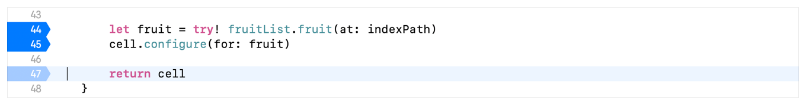

Xcode 在两行代码的行号上显示两个蓝色断点标记。Xcode 还在某行代码的行号上显示一个浅蓝色的已禁用断点标记。

向上或向下拖移断点以将其移动到其他位置；将其拖离装订线可将其移除。点击调试区域工具栏中的断点图标可激活或停用所有断点。

### 管理整个 App 中的断点

当你在多个源代码文件中设置了大量断点时，点击主窗口导航器区域中的“断点导航器”按钮，打开“断点导航器”，以查看和管理所有断点。

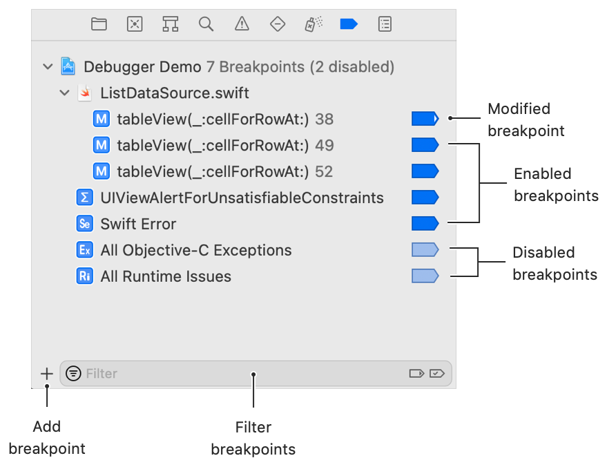

点击断点导航器中的断点标签，可快速导航到源代码编辑器中的断点。选中断点标签后按 Delete 键可从代码中删除该断点。点击断点导航器中的断点图标可启用或禁用它。

若要在断点导航器中轻松找到常用的断点，请按住 Control 键点击断点标签，选择“编辑断点”，然后为其输入名称。之后可使用断点导航器底部的筛选器。

你还可以使用该筛选器根据断点所在代码行中的符号来查找断点。筛选工具提供了仅显示已修改的断点和仅显示已启用的断点的选项。

### 指定暂停 App 的条件

对于在一定迭代次数后发生，或限于需要重复操作的有限条件下的 bug，在断点处暂停并反复点击“继续”按钮直到 bug 出现，这会很繁琐。调试器中有两种方法可以更高效地处理这种情况。

对于在一定迭代次数后发生的 bug，可设置调试器忽略断点若干次。按住 Control 键点击断点，选择“编辑断点”，然后指定在停止前要忽略断点的次数。

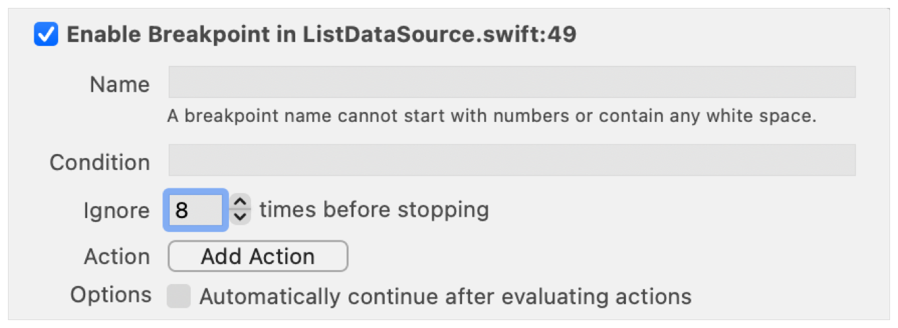

对于在有限条件下发生的 bug，可设置调试器在表达式为 true 时于断点处暂停。按住 Control 键点击断点，选择“编辑断点”，然后使用局部作用域中可用的变量输入一个条件。

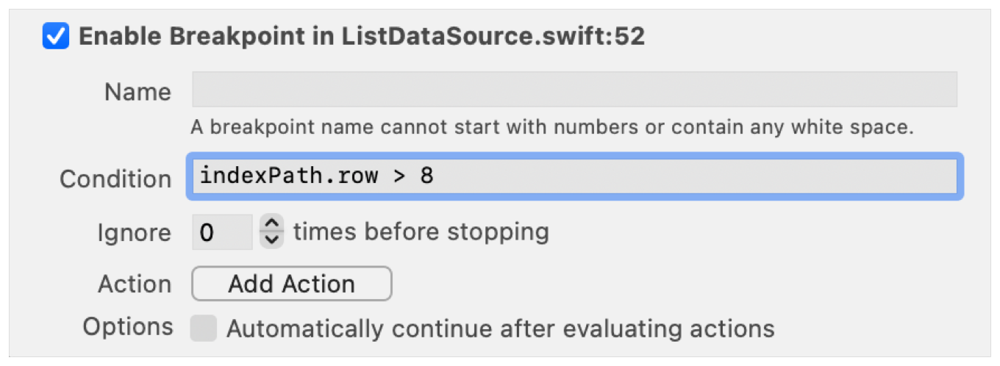

调试器在每次执行到达断点时都会计算该表达式，并且仅在表达式为 true 时暂停。

### 在代码之外的符号上暂停

要调试某些问题，你需要在源代码未定义的符号上暂停。例如，遇到 Auto Layout 问题时，错误消息会建议在 `UIViewAlertForUnsatisfiableConstraints` 上设置断点。要执行此操作，请使用符号断点。

在断点导航器中，点击左下角的“添加”按钮（+），然后选择“符号断点”。在“符号”字段中，按照示例文本的格式输入对象和符号。

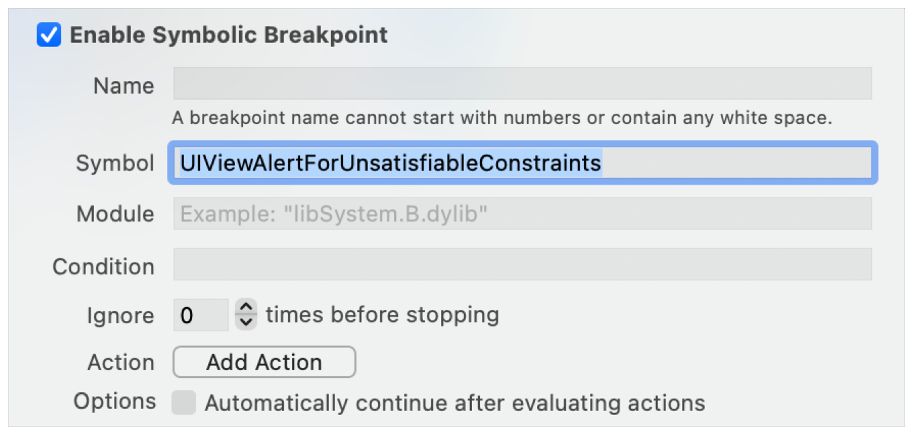

当 App 或你的代码调用你指定的符号时，调试器会暂停。示例符号 `UIViewAlertForUnsatisfiableConstraints` 通常会在 App 的 `main` 方法中暂停，而不是在你的某行代码上。发生这种情况时，请使用控制台通过 `po [[UIWindow keyWindow] _autolayoutTrace]` 查看 Auto Layout 追踪。

> [!tip] 提示
> 某些符号会被非常频繁地调用，每次都暂停可能难以管理。请为断点添加一个条件以减少调用频率，或禁用符号断点，直到你在代码中到达想要开始诊断问题的断点，然后再启用符号断点。

### 在未捕获的 Swift 错误或 Objective-C 异常上暂停

当你的 App 遇到未处理的 Swift 错误或 Objective-C 异常时，它会崩溃。通常，堆栈跟踪不会直接指向问题发生的位置。请设置一个断点，以在未捕获的 Swift 错误或 Objective-C 异常上暂停，以便定位问题。

当未处理的 Swift 错误导致崩溃时，调试器会在包含 `try!` 的行上显示致命错误，而不是在错误最初发生的位置。

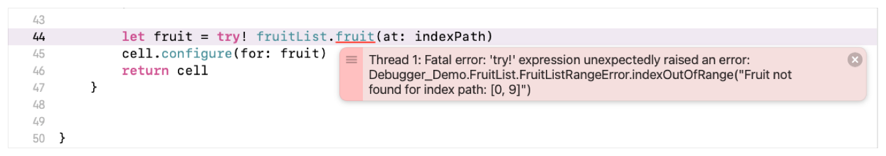

如果抛出的错误包含有用的错误消息，这可能足以解决问题。如果没有，请添加 Swift 错误断点，以在抛出错误的行上暂停。在断点导航器中，点击左下角的“添加”按钮，然后选择“Swift 错误断点”。随后，App 将在抛出的错误上暂停，而不是在 `try!` 处。

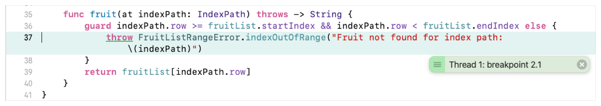

当未捕获的 Objective-C 错误导致崩溃时，调试器会在 `AppDelegate` 或 `main` 方法中显示崩溃。

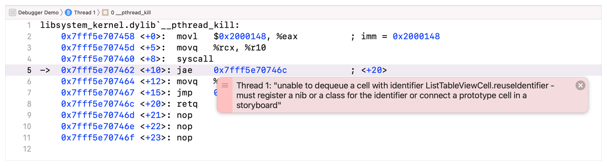

Xcode 显示一个因未捕获的 Objective-C 异常而崩溃的 App，并附有一条描述出列表格视图单元格时出现问题的错误消息。

请添加 Objective-C 异常断点，以在崩溃发生的行上暂停，而不是在 `main` 处。在断点导航器中，点击左下角的“添加”按钮，然后选择“异常断点”。

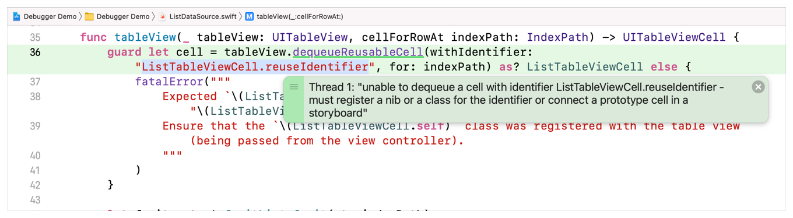

Xcode 显示一个 App 暂停在一行代码上，该代码从表格视图中出列一个可复用的单元格，但使用了无效的标识符，从而生成了一个 Objective-C 异常。

有关更多信息，请参阅[识别常见崩溃的原因](identifying-the-cause-of-common-crashes.md)。

### 当系统检测到运行时问题时自动暂停

Xcode 拥有名为“消毒器（sanitizer）”的工具，用于检测几种不同类型的运行时问题：在主线程之外更新用户界面、不安全地从不同线程更新变量、不安全地访问地址，以及执行导致未定义行为的代码。配置你的 scheme 以启用消毒器（sanitizer），从而在构建时通过静态分析检测这些问题。当你禁用消毒器并且你的 App 遇到上述问题之一时，你的 App 会崩溃，并且 Xcode 可能无法清楚地指示问题发生的位置。

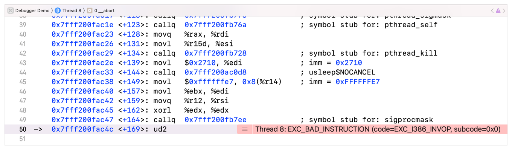

若要暂停 App 并进行调查，请点击断点导航器左下角的“添加”按钮，选择“运行时问题断点”，然后选择断点的运行时问题类型。

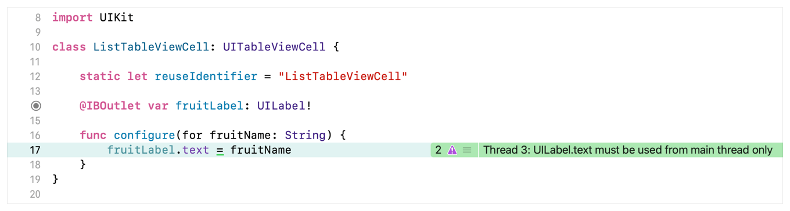

启用该问题的消毒器并运行你的 App。消毒器会识别出它预计会发生运行时问题的代码行。当 App 在你的运行时断点处暂停时，请调查问题发生的原因。有关更多信息，请参阅[及早诊断内存、线程和崩溃问题](diagnosing-memory-thread-and-crash-issues-early.md)。

### 在断点处记录变量值、运行脚本或播放声音

除了编写代码来记录变量值和 App 执行的详细信息之外，还可以使用断点操作来记录消息，以及执行将变量值打印到控制台的调试器命令。

调试器到达断点时，断点操作还可以播放声音，这对于在不暂停的情况下了解代码何时执行很有用。断点操作可以执行 AppleScript 或 shell 脚本来执行有用的调试任务，例如截取屏幕快照或保存一些 App 数据以供分析。

若要对断点执行操作，请在源代码编辑器或断点导航器中按住 Control 键点击断点，选择“编辑断点”，点击“添加操作”，选择一个操作并提供任何必要的附加信息。例如，为“记录消息”操作提供消息，或为“调试器命令”操作提供命令和参数。

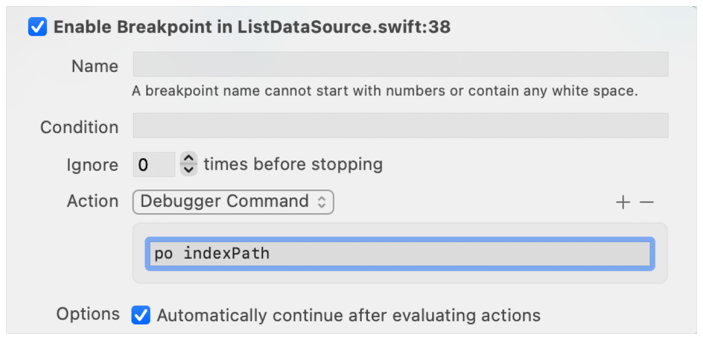

若要在某个断点处执行多个操作，请点击现有操作右侧的“添加”按钮以添加另一个操作。若要在执行操作后继续运行 App 而不暂停，请选中“评估操作后自动继续”选项。

## 另请参阅

### 断点与变量

- [单步执行代码并检查变量以隔离 bug](stepping-through-code-and-inspecting-variables-to-isolate-bugs.md) —— 通过观察在调试器中单步执行源代码时变量的变化来找到 bug 的原因。
