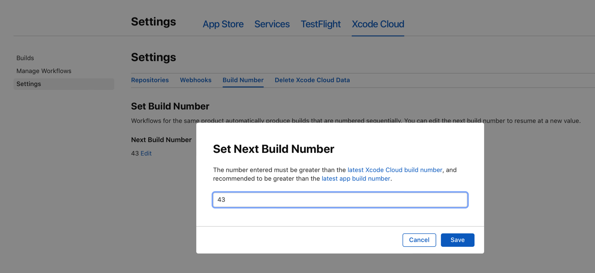

> 导航：[技术](../technologies.md) · [Xcode](../xcode.md) · [Xcode Cloud](xcode-cloud.md)

# 为 Xcode Cloud 构建设置下一个构建编号

文章

为现有的 Mac App 从自定义的构建编号开始编号，以避免版本冲突。

## 概述

Xcode Cloud 会为其执行的每次构建分配一个构建编号（build number）。_构建编号_是一个整数值，Xcode Cloud 会在每次构建时自动递增，从 `1` 开始。第一次 Xcode Cloud 构建的构建编号是 `1`，第二次构建的构建编号是 `2`，第三次构建的构建编号是 `3`，依此类推。

对于除现有 macOS App 之外的所有 App， Xcode Cloud 构建使用默认值 `1`。对于现有的 Mac App，请使用不同于 `1` 的值开始构建编号。

> [!important] 重要
> Xcode Cloud 构建编号始终是整数；例如 `42`、`420` 或 `420000` 等。你不能使用哈希值、时间戳或其他字符串作为构建编号。

当你通过 [TestFlight](https://developer.apple.com/testflight/) 分发 Xcode Cloud 构建或在 App Store 上发布时，[App Store Connect](http://appstoreconnect.apple.com) 会使用该 Xcode Cloud 构建的构建编号。这让你可以轻松识别与 TestFlight 或 App Store 中 App 版本相对应的 Xcode Cloud 构建。例如，假设你使用 Xcode Cloud 创建了一个名为 `Weekly Build` 的工作流程（workflow），该工作流程每周向外部测试人员提供一个新版本。对于最新的每周构建，它会分发版本 `1.2.1 (42)`，其中 `42` 是 Xcode Cloud 设置的构建编号。如果你需要查看该版本的详细构建信息，可以查看该版本的构建编号 — `42` — 并在 Xcode 或 App Store Connect 中导航到相应的 Xcode Cloud 构建。

### 查看构建编号要求

对于新 App，从构建编号 `1` 开始是合理的。当你开始为现有 App 使用 Xcode Cloud 时，它会将构建编号 `1` 分配给第一次构建。对于 iOS、iPadOS、tvOS、visionOS 和 watchOS App，此行为满足构建编号要求。这些平台的 App 可以对新版本使用比旧版本更低的构建编号，因为 App Store Connect 要求每个 App 版本使用 [CFBundleShortVersionString](../bundleresources/information-property-list/cfbundleshortversionstring.md) 和 [CFBundleVersion](../bundleresources/information-property-list/cfbundleversion.md) 的唯一组合。

例如，在你开始使用 Xcode Cloud 之前，App Store 中的最新 App 版本可能是 `1.2.1 (42)`。当你开始使用 Xcode Cloud 时，下一个 App 版本将是 `1.2.2 (1)`，因为 Xcode Cloud 构建编号从 `1` 开始。这是版本和构建编号的唯一组合，因此，当你提交新版本进行 App 审核时，App Store Connect 会接受它。

但是，Mac App 必须遵循不同的构建编号要求。要成功将 Mac App 提交到 App 审核，其构建编号必须持续递增，即使在跨 App 版本时也是如此。如果前面示例中的 App 是 Mac App，则版本 `1.2.2 (1)` 将是无效的，因为与之前的版本 `1.2.1 (42)` 相比，构建编号没有增加。此 Mac App 的有效构建编号应为 `1.2.2 (43)`。

为了帮助处理从 `1` 开始递增 Xcode Cloud 构建编号不可行的情况（例如对于现有的 Mac App），请使用 App Store Connect 将 Xcode Cloud 配置为从自定义值开始递增构建编号。

### 将下一个构建编号设置为自定义值

将下一个构建编号设置为自定义整数值，可以解决从 `1` 开始递增 Xcode Cloud 构建编号导致版本冲突的情况。

> [!important] 重要
> 只有你的 Apple Development Team 中具有 Admin 或 App Manager 角色的成员才能将下一个构建编号设置为自定义值。

配置下一个构建编号：

1.  开始为你的项目或工作区使用 Xcode Cloud。
2.  在 App Store Connect 网站上导航到你 App 的页面。
3.  点击 Xcode Cloud 标签页，然后选择侧边栏中的“设置”（Settings）。
4.  点击“设置”下方的“构建编号”（Build Number）标签页。
5.  点击“下一个构建编号”（Next Build Number）旁边的“编辑”（Edit）按钮。
6.  输入一个新的构建编号并保存更改。

下面的截图显示了你在 App Store Connect 网站上用于编辑构建编号的表单（form）。

一张截图，显示了 App Store Connect 网站上 App 的 Xcode Cloud 设置中的“构建编号”部分。用户已点击“下一个构建编号”旁边的编辑按钮，网站显示了一个包含文本字段的模态对话框，用户可以在其中输入下一个构建编号。

## 另请参阅

### 设置与维护

- [向 Xcode Cloud 提供依赖项](making-dependencies-available-to-xcode-cloud.md) — 在你将项目配置为使用 Xcode Cloud 之前，请检查依赖项并使其可用于 Xcode Cloud。
- [为你的团队配置 Xcode Cloud](configuring-xcode-cloud-for-your-team.md) — 开始作为团队使用 Xcode Cloud 进行持续集成和交付。
- [跨 Xcode Cloud 工作流程共享 macOS 和 Xcode 版本](sharing-custom-aliases-across-xcode-cloud-workflows.md) — 使用自定义别名与多个工作流程共享配置。
- [跨 Xcode Cloud 工作流程共享环境变量](sharing-environment-variables-across-xcode-cloud-workflows.md) — 通过使用共享环境变量将通用配置应用于多个工作流程。
- [在 Xcode Cloud 中构建 Swift 包和 Swift Playgrounds App 项目](building-swift-packages-or-swift-playground-app-projects-with-xcode-cloud.md) — 将你的 Swift 包或 Swift Playgrounds App 项目添加到 Xcode 项目，以便在 Xcode Cloud 中构建。
- [在 App 的 beta 版本中包含给测试人员的说明](including-notes-for-testers-with-a-beta-release-of-your-app.md) — 向 Xcode 项目中添加文本文件，以便向 beta 测试人员提供关于测试内容的说明。
- [从 Xcode Cloud 中移除你的项目](removing-your-project-from-xcode-cloud.md) — 从 Xcode Cloud 中移除你的项目，以删除 App 和工作流程数据、断开 Git 仓库的连接以及移除 Slack 集成。
- [更改 Bundle Identifier](changing-the-bundle-identifier.md) — 修改你的 App 的 Bundle Identifier，并在其出现的任何位置进行更新。
