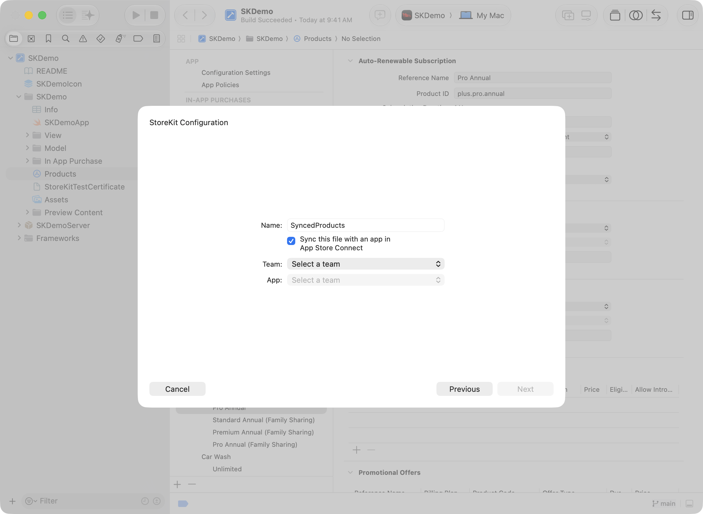
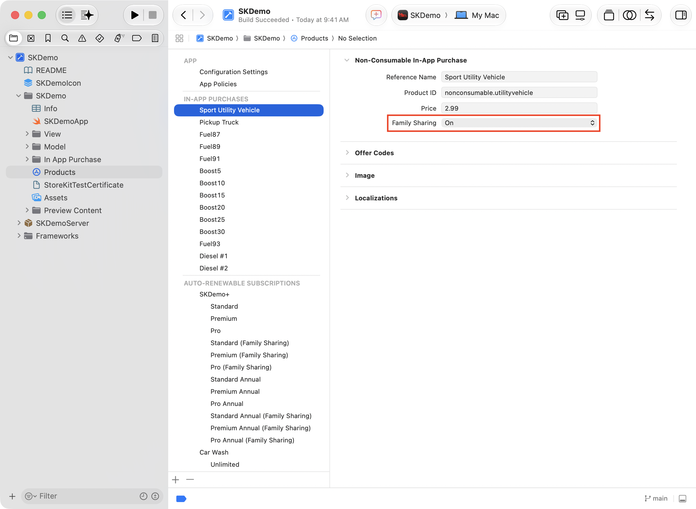
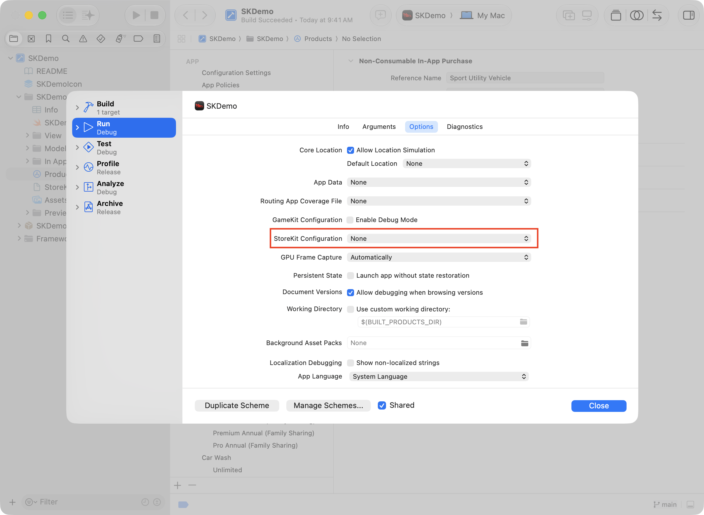
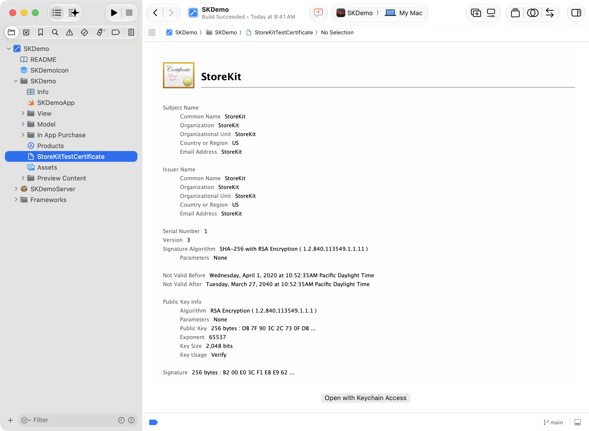

> 导航：[技术](../technologies.md) · [Xcode](../xcode.md) · [测试](testing.md)

# 在 Xcode 中设置 StoreKit 测试

<sub>文章</sub>

准备测试环境，使用本地配置的数据测试 App 内购买项目。

## 概述

Xcode 中的 StoreKit 测试是一个本地测试环境，用于测试 App 内购买项目，无需连接 App Store 服务器。你可以在 Xcode 项目的本地 StoreKit 配置文件中设置 App 内购买项目，也可以根据 App Store Connect 中的 App 内购买项目设置，在 Xcode 中创建同步的 StoreKit 配置文件。启用配置文件后，当 App 调用 StoreKit API 时，测试环境会使用这些本地数据。

> [!note] 注意
> 若要在运行 iOS 16 及更高版本、visionOS 或 watchOS 9 及更高版本的设备上测试 App，请启用开发者模式。有关如何启用开发者模式的更多信息，请参阅[在设备上启用开发者模式](enabling-developer-mode-on-a-device.md)。

在测试购买项目时，测试环境会显示含有本地化值的付款表单（sheet），并生成交易供你检查。

在 Xcode 中使用 StoreKit 测试 App 内购买项目场景适用于：

- 在 [App Store Connect](https://appstoreconnect.apple.com/login) 中配置 App 内购买项目之前，开发使用这些项目的功能。
- 在网络连接不可用时进行本地测试。
- 调试难以在沙盒环境中设置的 App 内购买项目用例，例如促销优惠资格。
- 在付款表单中查看本地化产品信息。
- 对交易进行端到端测试，包括失败的交易。

Xcode 中 StoreKit 测试的全部功能都可用于自动化。有关自动化 App 内购买项目测试的信息，请参阅 [StoreKit Test](../storekittest.md)。有关在不同开发阶段测试 StoreKit 的更多信息，请参阅[使用 Xcode 和沙盒在所有开发阶段进行测试](../storekit/testing-at-all-stages-of-development-with-xcode-and-the-sandbox.md)。

### 创建 StoreKit 配置文件

StoreKit 配置文件包含 App 内购买项目、订阅群组、自动续期订阅和非续期订阅的描述。当配置文件处于活跃状态时，App 在测试环境中调用 StoreKit API 时，StoreKit 会使用这些数据。StoreKit 配置文件有两种类型：本地配置文件，以及 Xcode 14 及更高版本中的同步配置文件。

- 如果尚未在 App Store Connect 中设置 App，或者想在 App Store Connect 中设置新类型的 App 内购买项目或订阅之前先试用，请设置本地配置文件。本地数据便于在 Xcode 中编辑，可代替通常来自 App Store Connect 的数据。
- 如果 App Store Connect 中已经设置了要在 Xcode 中测试的 App 内购买项目或订阅，请设置同步配置文件。

要创建 StoreKit 配置文件：

1. 启动 Xcode，然后选择 File \> New \> File from Template。
2. 在出现的表单中，在 Filter 搜索栏输入 _storekit_。
3. 选择 StoreKit Configuration File，然后点按 Next。
4. 在对话框中输入文件名。对于同步配置文件，请选择复选框，在出现的下拉菜单中指定团队和 App，然后点按 Next。对于本地配置，请不要选择复选框，然后点按 Next。
5. 选择位置，然后点按 Create。
6. 将文件保存到项目中。



<sub>Xcode 新建文件表单的屏幕截图，标题为 StoreKit Configuration，其中显示文件创建选项。选项包括 Name 字段、标签为 Sync this file with an app in App Store Connect 的复选框、Team 下拉菜单和 App 下拉菜单。复选框处于选中状态。</sub>

如果重命名配置文件，请务必保留其 .`storekit` 文件扩展名。

> [!note] 注意
> 你可以将同步配置文件转换为本地配置文件。如果要再次同步，请创建新的同步配置文件。

### 设置 StoreKit 配置

若要编辑本地 StoreKit 配置文件中的设置，请在 Project navigator 中选择该文件以打开自定编辑器。点按编辑器中的 Add 按钮（+），向配置文件添加产品详细信息。

> [!note] 注意
> 除非将同步配置文件转换为本地配置文件，否则无法编辑其中的某些产品类型。若要转换同步配置文件，请选择该文件，然后从 Xcode 菜单中选择 Editor \> Convert to Local StoreKit Configuration。在确认对话框中点按 Convert File。查看同步配置文件时，点按左下角的 Sync 按钮，从 App Store Connect 拉取最新更新。

请手动在本地 StoreKit 配置文件中输入信息。你在 StoreKit 配置文件中提供的产品名称、ID、价格、本地化和其他数据不会上传到 App Store Connect，也不会出现在经 App Store 签名的 App 中。App Store Connect 数据只会传输到同步的 StoreKit 配置文件，而该文件无法在 Xcode 中编辑。

> [!tip] 提示
> 如果同步配置文件中有想在本地配置文件中测试的项目，可以将项目从同步配置文件复制到本地配置文件。为此，请按住 Control 键点按同步配置文件中的项目，然后选择 Copy。在本地配置文件中选择要放置项目的位置，然后从 Xcode 菜单中选择 Edit \> Paste。

每个 App 内购买项目和非续期订阅都有参考名称、产品 ID 和价格。App 内购买项目和非续期订阅还可以选择提供本地化。点按 App 中的产品进行购买后，这些元数据会显示在付款表单中。请注意，该价格只是占位值，与价格层级或实际定价信息无关。不过，它会使用你正在测试的店面对应的正确货币符号显示。

对于非消耗型 App 内购买项目和自动续期订阅，请选择 Family Sharing，将产品标记为可共享，如下图所示：



<sub>Xcode StoreKit 配置文件编辑器的屏幕截图，其中选中了一个非消耗型购买项目示例，并显示两个展开三角形：Non-Consumable In-App Purchase 和 Localizations。Non-Consumable In-App Purchase 部分显示所选购买项目的 Reference Name、Product ID、Price 和 Family Sharing。Localizations 部分显示两个本地化条目 English (U.S.) 和 Arabic，以及每个条目对应的 Display Name 和 Description。</sub>

设置第一个自动续期订阅时，Xcode 会提示你创建第一个订阅群组。将订阅添加到群组后，为每项订阅分配的级别将决定其升级和降级选项。有关更多信息，请参阅[提供自动续期订阅](https://developer.apple.com/help/app-store-connect/manage-subscriptions/offer-auto-renewable-subscriptions)。

对于自动续期订阅，请使用 App Store Connect 中提供的选项设置推介优惠和促销优惠。若要开始测试，请至少配置一个 App 内购买产品。

### 在 Xcode 中启用 StoreKit 测试

要在 Xcode 中启用 StoreKit 测试，项目必须有一个活跃的 StoreKit 配置文件。默认情况下，Xcode 中的 StoreKit 测试处于停用状态。要选择配置文件并将其设为活跃状态：

1. 点按方案以打开 Scheme 菜单，然后选择 Edit Scheme。
2. 在方案编辑器中选择 Run 操作。
3. 点按 Options 标签页。
4. 对于 StoreKit Configuration 选项，选择一个配置文件，然后点按 Close。


<sub>Xcode 方案编辑器的屏幕截图，其中选中了 Run 操作和 Options 标签页。显示的内容包含若干选项，其中 StoreKit Configuration 选项已高亮显示。StoreKit Configuration 弹出式菜单显示已选择 configuration.storekit。</sub>

你也可以从此菜单将现有 StoreKit 配置文件添加到项目。请选择扩展名为 .`storekit` 的配置文件。

一个 Xcode 项目可以包含多个 StoreKit 配置文件，但同一时间只能有一个处于活跃状态。配置文件处于活跃状态时，照常构建并运行 App。App 不会访问 App Store Connect 或沙盒服务器，而是从测试环境获取 StoreKit 数据。

### 在 Xcode 中停用 StoreKit 测试

若要在 Xcode 中停用 StoreKit 测试，请从方案的运行选项中移除 StoreKit 配置文件：

1. 点按方案以打开 Scheme 菜单，然后选择 Edit Scheme。
2. 在方案编辑器中选择 Run 操作。
3. 点按 Options 标签页。
4. 对于 StoreKit Configuration 选项，选择 None。



<sub>Xcode 方案编辑器的屏幕截图，其中选中了 Run 操作和 Options 标签页。显示的内容包含若干选项，其中 StoreKit Configuration 选项已高亮显示。StoreKit Configuration 弹出式菜单显示已选择 None。</sub>

App 会停止使用配置文件中的本地数据，转而使用 App Store Connect 中的数据。有关更多信息，请参阅[配置 App 内购买项目概述](https://developer.apple.com/help/app-store-connect/configure-in-app-purchase-settings/overview-for-configuring-in-app-purchases)。

### 准备在测试环境中验证收据

Xcode 中的 StoreKit 测试会生成本地签名的收据，供 App 在本地验证。获取本地验证所需的证书，并按以下步骤将其添加到项目：

1. 在 Xcode 的 Project navigator 中，点按 StoreKit 配置文件。
2. 从 Xcode 菜单中选择 Editor \> Save Public Certificate。
3. 在项目中选择用于保存文件的位置。

> [!note] 注意
> 测试环境的证书是根证书。验证收据签名时，不需要验证证书链。



<sub>Xcode 的屏幕截图，其中在 Project navigator 中选中了 StoreKitCertificate.cer 文件。编辑器区域显示证书的详细信息，包括 Subject Name、Issuer Name、Serial Number、Version 等。</sub>

请确保代码在所有环境中都使用正确的证书。将以下条件编译块添加到收据验证代码中，以便测试时选择测试证书，否则选择 Apple 根证书：

```swift
#if DEBUG
    let certificate = "StoreKitTestCertificate" 
#else
    let certificate = "AppleIncRootCertificate" 
#endif
```

代码现已准备就绪，可以在测试环境和生产环境中选择适当证书来验证收据。

> [!important] 重要
> 在测试环境中生成的收据未经 App Store 签名，对生产环境中的 App 无效。

## 另请参阅

### StoreKit

- [使用 Xcode 中的 StoreKit 交易管理器测试 App 内购买项目](testing-in-app-purchases-with-storekit-transaction-manager-in-code.md) — 使用 Xcode 内的交易管理器测试 App 内购买项目，无需连接 App Store 服务器。
