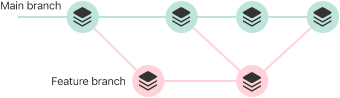

> 导航：[Technologies](../technologies.md) · [Xcode](../xcode.md)

# 源代码控制管理

借助 Xcode 对 Git 源代码控制的支持，备份你的文件、与他人协作，并为你的发行版本打标签。

## 概述

_源代码控制_是跟踪和管理代码变更的实践。用源代码控制来管理你的 Xcode 项目，可以为你所做的更改保留详尽的历史记录，并让代码协作变得更快、更高效。

Xcode 通过对 Git 的内置支持简化了源代码控制管理。你会创建一个 Git _源代码控制仓库_，用于存放你的项目文件，并通过 _提交_ 保存变更历史。当一组更改准备就绪后，你的审阅者会对其进行验证、提出建议并批准。然后，你就可以把你的更改合并到仓库中。

例如，你为某项功能开发创建一个分支，待其获得批准后，再把这些更改合并到主分支中。

概念图示：在一个由源代码控制支持的项目中，主分支和功能分支上的一系列提交。

## 主题

### 基础

- [Configuring your Xcode project to use source control](configuring-your-xcode-project-to-use-source-control.md) — 通过将你的 Xcode 项目配置为使用 Git 源代码控制，在团队成员和开发用计算机之间同步代码更改。
- [Tracking code changes in a source control repository](tracking-code-changes-in-a-source-control-repository.md) — 通过提交并推送到远程仓库，为你的项目创建一份增量更改的历史记录。

### Git

- [Organizing your code changes with source control](organizing-your-code-changes-with-source-control.md) — 使用 Git 分支和标签来简化协作、管理功能开发与发行版本。
- [Combining code changes in a source control repository](combining-code-changes-in-a-source-control-repository.md) — 使用 Xcode 中的源代码控制工具，整合来自多个来源的代码更改，并解决不同代码版本之间的冲突。
- [Configuring source control in Xcode](configuring-source-control-in-xcode.md) — 自定用于连接 Git 仓库、应用代码更改的默认 Xcode 设置，以及更多用于配置源代码控制的选项。

## 另请参阅

### Xcode IDE

- [Projects and workspaces](projects-and-workspaces.md) — 管理你用来为 Apple 平台构建 App、库以及其他软件的代码和资源。
- [Capabilities](capabilities.md) — 启用 Apple 提供的各种服务，例如内购、推送通知、Apple Pay、iCloud 等等。
- [Build system](build-system.md) — 把你的代码编译成二进制格式，并自定你的项目设置以构建你的代码。
- [Command-line tools](command-line-tools.md) — 在终端中开发和自定你的项目。
