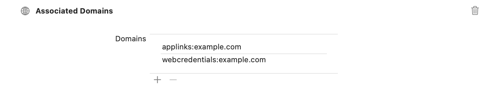

> 导航：[技术](../technologies.md) · [Xcode](../xcode.md) · [项目与工作区](projects-and-workspaces.md) · [允许 App 和网站链接到你的内容](allowing-apps-and-websites-to-link-to-your-content.md)

# 支持关联域

连接 App 与网站，同时提供原生 App 和浏览器体验。

## 概述

关联域会在域与 App 之间建立安全关联，使你能够共享凭证，或通过网站在 App 中提供功能。例如，在线零售商可以提供与网站配套的 App，从而改善用户体验。

共享 Web 凭证、通用链接、Handoff 和 App Clip 都使用关联域。关联域为通用链接提供基础；借助通用链接，App 可以代替网站的全部或部分内容来呈现信息。未下载 App 的用户则会在 Web 浏览器而不是原生 App 中获得相同信息。

若要将网站与 App 关联，需要在网站上提供关联域文件，并在 App 中提供相应的 entitlement。网站 `apple-app-site-association` 文件中的 App 必须具有匹配的 [Associated Domains Entitlement](../bundleresources/entitlements/com.apple.developer.associated-domains.md)。

### 将关联域文件添加到网站

用户安装 App 时，系统会尝试下载关联域文件，并验证 entitlement 中的域。

> [!note] 注意
> 如果网站使用多个子域（例如 `example.com`、`www.example.com` 和 `support.example.com`），每个子域都需要在 [Associated Domains Entitlement](../bundleresources/entitlements/com.apple.developer.associated-domains.md) 中有自己的条目，并且每个子域都必须提供自己的 `apple-app-site-association` 文件。

若要将关联域文件添加到网站，请创建名为 `apple-app-site-association`（无扩展名）的文件。根据域上支持的服务更新文件中的 JSON 代码。对于通用链接，请务必在 `applinks` 服务中列出域对应的 App 标识符。同样，如果创建 App Clip，请务必使用 `appclips` 服务列出 App Clip 的 App 标识符。

以下 JSON 代码表示一个简单关联文件的内容：

```other
{
  "applinks": {
      "details": [
           {
             "appIDs": [ "ABCDE12345.com.example.app", "ABCDE12345.com.example.app2" ],
             "components": [
               {
                  "#": "no_universal_links",
                  "exclude": true,
                  "comment": "Matches any URL with a fragment that equals no_universal_links and instructs the system not to open it as a universal link."
               },
               {
                  "/": "/buy/*",
                  "comment": "Matches any URL with a path that starts with /buy/."
               },
               {
                  "/": "/help/website/*",
                  "exclude": true,
                  "comment": "Matches any URL with a path that starts with /help/website/ and instructs the system not to open it as a universal link."
               },
               {
                  "/": "/help/*",
                  "?": { "articleNumber": "????" },
                  "comment": "Matches any URL with a path that starts with /help/ and that has a query item with name 'articleNumber' and a value of exactly four characters."
               }
             ]
           }
       ]
   },
   "webcredentials": {
      "apps": [ "ABCDE12345.com.example.app" ]
   },

    "appclips": {
        "apps": ["ABCDE12345.com.example.MyApp.Clip"]
    }
}
```

`appIDs` 和 `apps` 键指定可在此网站上使用的 App 标识符及其服务类型。这些键的值采用以下格式：

```javascript
<Application Identifier Prefix>.<Bundle Identifier>
```

`details` 字典只适用于 [applinks](../bundleresources/applinks.md) 服务类型；其他服务类型不使用该字典。`components` 键是一个字典数组，为 URL 的组成部分提供模式匹配。

构建关联文件后，将其放入网站的 .`well-known` 目录。文件 URL 应符合以下格式：

```other
https://<fully qualified domain>/.well-known/apple-app-site-association
```

必须使用具有有效证书的 `https://` 托管该文件，并且不得使用重定向。

### 将关联域 entitlement 添加到 App

若要在 App 中设置 entitlement，请在 Xcode 中打开目标的 Signing & Capabilities 标签页，并添加 Associated Domains 功能。如果尚不存在，此步骤会向 App 添加 [Associated Domains Entitlement](../bundleresources/entitlements/com.apple.developer.associated-domains.md)，并向 App ID 添加关联域功能。

> [!important] 重要
> 对于单目标的 watchOS App，请将 Associated Domains 功能添加到 watchOS App 目标。对于具有独立 WatchKit 扩展的 watchOS App，必须将 Associated Domains 功能添加到 WatchKit Extension 目标。

若要将域添加到 entitlement，请点按 Domains 表格底部的 Add 按钮（+）以添加占位域。请将占位内容替换为 App 支持的服务所对应的适当前缀和网站域。确保仅包含所需子域和顶级域，不要包含路径、查询组成部分或尾部斜杠（`/)`。



添加与 App 共享凭证的域。对于 `appclips` 以外的服务，可以为域添加 `*.` 前缀，以匹配其所有子域。

指定的每个域都采用以下格式：

```other
<service>:<fully qualified domain>
```

从 macOS 11 和 iOS 14 开始，App 不再直接向 Web 服务器发送 `apple-app-site-association` 文件请求，而是将这些请求发送到由 Apple 管理、专用于关联域的内容分发网络（CDN）。

在开发 App 时，如果公共互联网无法访问 Web 服务器，可以使用备用模式功能绕过 CDN，直接连接到私有域。

可以通过向关联域 entitlement 添加查询字符串来启用备用模式，如下所示：

```other
<service>:<fully qualified domain>?mode=<alternate mode>
```

有关备用模式的更多信息，请参阅 [Associated Domains Entitlement](../bundleresources/entitlements/com.apple.developer.associated-domains.md)。有关通用链接的信息，请参阅[允许 App 和网站链接到你的内容](allowing-apps-and-websites-to-link-to-your-content.md)。有关 Handoff 的信息，请参阅[在 App 中实现 Handoff](../foundation/implementing-handoff-in-your-app.md)。有关 App Clip 的信息，请参阅[配置 App Clip 体验](../appclip/configuring-the-launch-experience-of-your-app-clip.md)。

> [!important] 重要
> Apple 的内容分发网络会在 24 小时内请求域的 `apple-app-site-association` 文件。安装 App 后，设备大约每周检查一次更新。

## 主题

### Entitlement

- [Associated Domains Entitlement](../bundleresources/entitlements/com.apple.developer.associated-domains.md) — 用于共享 Web 凭证、通用链接和 App Clip 等特定服务的关联域。

### 服务

- [applinks](../bundleresources/applinks.md) — 通用链接服务定义的根对象。
