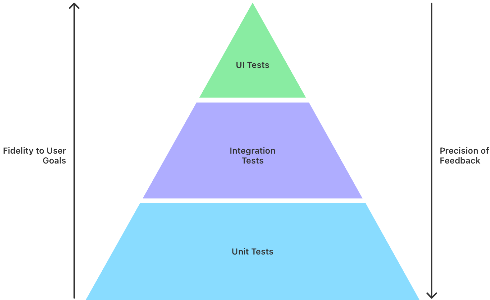

> 导航：[技术](../technologies.md) · [Xcode](../xcode.md)

# 测试

开发并运行测试，以检测逻辑故障、UI 问题和性能衰退（regression）。

## 概述

软件开发的一个重要环节是测试你的代码。为了尽早发现问题并交付最高质量的产品，请使用 Xcode 提供的框架（framework）和功能来开发测试、了解代码覆盖率并评估你的测试结果。

Xcode 16 及更高版本包含了 [Swift Testing](../testing.md)，这是一个新的测试框架，你可以用它来编写单元测试，它充分利用 Swift 强大且富有表现力的语言能力，输出富有表现力且可操作的内容。Xcode 仍继续包含 [XCTest](../xctest.md)，以便编写 UI 测试，通过 [XCUIAutomation](../xcuiautomation.md) 控制你的 App 的 UI。一个好的测试策略会结合多种类型的测试，以最大化每种测试的优势。

如下图所示，你的测试分布应呈现“金字塔”形状。包含大量快速、良好隔离的单元测试来覆盖 App 的逻辑，较少的集成测试来验证较小的部分是否正确连接，以及 UI 测试来断言常见用例的正确行为。

UI 测试是验证你的 App 是否按预期工作的最终指标，但它们运行起来比其他类型的测试耗时更长。各种 App 变量都可能导致同一个 UI 测试失败。测试金字塔在两方面取得了平衡：一方面是高保真度的测试，用于验证用户能否完成任务；另一方面是高度聚焦的测试，能快速反馈 App 逻辑的正确性以及所作修改的影响。

除了测试金字塔，还要编写性能测试，为性能关键的代码区域提供衰退覆盖。要了解识别性能关键代码的过程，请参阅[改进 App 性能](improving-your-app-s-performance.md)。

## 主题

### 测试开发

- [向 Xcode 项目添加测试](adding-tests-to-your-xcode-project.md) — 包含构建代码的测试目标，用于测试函数中的逻辑、检查集成问题、自动化 UI 工作流程以及衡量性能。
- [更新现有代码库以适应单元测试](updating-your-existing-codebase-to-accommodate-unit-tests.md) — 消除组件间的耦合，以提高测试覆盖率和可靠性。
- [确定测试覆盖的代码量](determining-how-much-code-your-tests-cover.md) — 使用代码覆盖率将新的测试开发重点放在缺乏充分测试的区域。
- [通过将测试组织到测试计划中来改进代码评估](organizing-tests-to-improve-feedback.md) — 通过创建和配置测试计划，控制在软件工程过程的不同阶段从测试中接收到的信息。

### 执行与结果

- [运行测试并解读结果](running-tests-and-interpreting-results.md) — 通过运行测试并理解结果，来确定项目的代码是否按预期运行。

### 性能测试

- [编写和运行性能测试](writing-and-running-performance-tests.md) — 可重复地收集代码性能指标。

### 位置

- [在测试中模拟位置](simulating-location-in-tests.md) — 在处理基于位置的代码时，提高测试的可靠性和覆盖率。

### StoreKit

- [在 Xcode 中设置 StoreKit Testing](setting-up-storekit-testing-in-xcode.md) — 准备你的测试环境，以便使用本地配置的数据测试 App 内购买项目。
- [在 Xcode 中使用 StoreKit 交易管理器测试 App 内购买项目](testing-in-app-purchases-with-storekit-transaction-manager-in-code.md) — 使用 Xcode 内的交易管理器测试 App 内购买项目，无需连接 App Store 服务器。

## 另请参阅

### 调优与调试

- [Device Hub](device-hub.md) — 管理用于测试 App 的模拟设备和物理设备。
- [调试](debugging.md) — 使用 Xcode 调试器、Xcode Organizer、Metal 调试器和 Instruments 识别并解决 App 中的问题。
- [性能与指标](performance-and-metrics.md) — 使用 Instruments 和 Xcode Organizer 衡量、调查并解决系统资源使用情况以及影响性能的问题。
