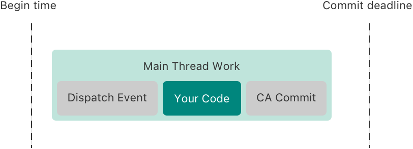
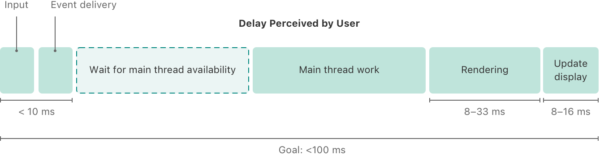
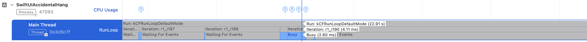
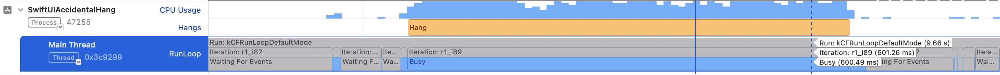

> 导航：[Technologies](../technologies.md) · [Xcode](../xcode.md) · [性能与指标](performance-and-metrics.md)

# 了解 App 中的挂起

<sub>文章</sub>

通过检查主线程和主运行循环，确定用户交互延迟的原因。

## 概述

离散用户交互是指用户执行一次边界明确的单次交互，随后屏幕发生更新。例如，用户按下键盘上的按键，相应的字母随后出现在屏幕上。尽管设备上运行的软件需要时间来处理传入的用户输入事件并计算相应的屏幕更新，但这个过程通常非常快，快到人无法察觉，屏幕更新看起来就像瞬间完成一样。

当处理离散用户交互的延迟变得明显时，这段无响应时间称为 _挂起（hang）_。这种行为还有一些常见名称，例如因为 App 停止更新而称为 _冻结（freeze）_，或者根据 macOS 中 App 无响应时出现的旋转等待光标而称为 _旋转等待（spin）_。

尽管离散交互对延迟的敏感程度低于连续交互，但用户很快就会察觉到操作与响应之间的间隔，并将其感受为停顿，从而破坏沉浸式体验。离散用户交互中低于 100 毫秒的延迟很少能被察觉，但即使只有几百毫秒，也可能让人感觉 App 没有响应。

挂起几乎总是主线程（main thread）上长时间运行的工作所致。本文介绍导致挂起的原因、主线程和主运行循环为何是理解挂起的关键，以及各种工具如何检测 Apple 设备上的挂起。

> [!note] 注意
> 本文假设你基本了解事件处理与渲染循环，也基本了解挂起和卡顿（hitch）及其区别。如果不熟悉挂起与卡顿，请参阅[了解用户界面响应能力](understanding-user-interface-responsiveness.md)，进一步了解它们以及事件处理与渲染循环。

### 了解主线程上的工作

处理传入事件并相应地更新 UI 是 App 主线程的职责。在处理事件的过程中，主线程会执行以下工作：

1. 将事件递送到正确的位置，并调用正确的处理程序。
2. 进行所有状态更改、获取数据、更新 UI 等。
3. 执行 Core Animation 提交（CA commit），将视图层级结构的所有更改提交给渲染服务器。你的代码处理完事件时，UI 框架通常会自动执行 CA 提交。



<sub>一幅时间线示意图，由两条竖直虚线之间的水平区块组成。左侧竖直虚线的标注为 Begin time，右侧竖直虚线的标注为 Commit deadline。中间的水平区块标题为 Main Thread Work，其中包含三个较小的矩形框。该区块略微向左偏移，没有与任一竖直虚线直接对齐。Main Thread Work 框内的第一个框标为 Dispatch Event，第二个标为 Your Code，第三个标为 CA Commit。</sub>

你的代码会参与每个阶段，但其中大部分通常与第二个阶段有关。

以一个使用 SwiftUI 的信息 App 中的 Send 按钮为例。其实现可能如下所示：

```swift
import SwiftUI 

struct MessengerView: View {
    @State var messageText: String

    var body: someView {
        // [...] 其他 UI
        Button("Send", action: {
            messageSender.send(message: messageText)
        })
        // [...] 其他 UI
    }
}
```

用户轻点 Send 按钮时，会触摸屏幕上显示该按钮的位置。操作系统会将其注册为 _按下触摸（touch-down）_ 事件。其他输入方式也有类似事件，例如 macOS 上的按下鼠标事件。

手指一接触屏幕，就会发送按下触摸事件。随后，App 的主线程会确定哪个视图负责处理该事件。它会将事件在屏幕上的位置与视图层级结构中所有视图的 frame 进行比较，以找出该位置最靠前的视图。由于用户触摸了 Send 按钮的位置，表示该按钮的视图会收到按下触摸事件。

用户从屏幕抬起手指时，触摸屏会注册手指离开屏幕，操作系统创建一个 _抬起触摸（touch-up）_ 事件并将其递送给你的 App。抬起触摸事件会前往收到相应按下触摸事件的同一视图，即使此时手指已经移动到其他位置也是如此。为响应抬起触摸事件，如果事件发生时手指位置仍位于 `Button` 的边界内，`Button` 就会调用其 `action` 闭包。

此时，第一个阶段 _事件分派（event dispatching）_ 或 _事件递送（event delivery）_ 已经完成。事件到达目的地，UI 框架在所选视图上调用相应的事件处理方法，通常也就是你的代码。你的设计也会影响系统递送事件的速度，因为你需要设置视图层级结构、决定按钮的位置，并添加可能包含自定视图的其他 UI 元素。所有这些都可能影响事件递送速度。不过，大多数情况下，这一步很快，无需担心。

在第二个阶段，SwiftUI 在调用 Button 的 `action` 闭包时会调用你的 `send(message:)` 方法；你的 App 很可能会在其中启动一些异步工作，例如将消息字符串序列化为数据包、将其发送到后端服务器等。你的 App 还需要将新消息添加到当前对话的消息列表中，以便将其存储起来，即使消息发送失败也不例外。此外，App 还需要更新 UI，向用户显示其操作结果。例如，你可能需要在屏幕上显示消息气泡，并清空文本栏，为下一条消息做好准备。有关异步响应 UI 事件的更多信息，请参阅[提高 App 的响应能力](improving-app-responsiveness.md)。

在第三个阶段，UI 框架再次接管工作并提交 UI 更改，让渲染服务器可以开始渲染新帧。你的代码通常不会直接参与 CA 提交，但它会影响 UI 框架需要提交多少更改以及提交的开销。

处理这个事件并不是 App 需要使用主线程的唯一工作。你可能设置了一个定时器，用于检查用户是否仍在输入并更新输入指示器；或者 App 向后端服务器发出的新消息检查请求已经完成，返回了一条需要在屏幕上显示的新消息。

在每种情况下，App 都需要更新用户界面，但这样做并非线程安全，也就是说，系统无法同时从多个线程修改 UI。系统需要将 UI 更新序列化，再依次执行。因此，只有一个线程可以更新 UI：主线程。在 Swift 中，使用 [MainActor](../swift/mainactor.md) 可以确保代码在主线程上执行。它还有助于编译器防止主线程之外的代码更改用户界面。

由于只有一个线程可以更改 UI，你不会希望阻塞该线程来等待用户按下 Send 按钮。因此，系统需要一种方法来调度要在主线程上执行的工作，并在工作到来时检查和执行它，无论这项工作是处理事件、处理网络请求结果，还是响应定时器触发。调度并按顺序处理各种工作项是主线程 [RunLoop](../foundation/runloop.md) 的职责。

### 了解主运行循环

运行循环（run loop）为线程提供一种机制，使线程能够等待输入源，并在任一输入源有数据或事件需要处理时触发输入处理程序。任何线程都可以有运行循环。App 完成启动后，主线程会立即启动一个运行循环，也就是 _主运行循环_。它负责处理所有传入的用户交互事件。

运行循环的极简实现可能如下所示：

```swift
class RunLoop {
    var stopped = false
    
    func run() {
        repeat {
            if let work = workSet.fetchNextWorkItem() {
                processWork(work)
            } else {
                sleepUntilNewWorkArrives()
            }
        } while(!stopped)
    }
}
```

调用 `run` 后，运行循环会在无限循环中持续运行，检查是否有新工作需要处理。如果有工作，运行循环会调用相应的处理程序来处理。如果没有工作，它会进入睡眠状态，这意味着主线程也会睡眠而不再运行。如果有新工作项到来，操作系统会唤醒主线程，其运行循环会处理传入工作，然后再次进入睡眠状态。

系统需要在主线程上执行的任何工作（例如更新 UI）都会成为提交给运行循环的工作项，随后运行循环会尽快处理它。工作项可能包括：

- 传入的用户事件
- 调度到运行循环上的定时器回调（定时器触发时，会提交其回调以在运行循环上运行。）
- 主 [DispatchQueue](../dispatch/dispatchqueue.md)、主 [OperationQueue](../foundation/operationqueue.md) 或主要 Actor（main actor）上的工作

尽管运行循环会在主线程上执行系统提交给它的工作项，但它并不等同于主调度队列。主调度队列、主 `NSOperationQueue`、主要 Actor 和主运行循环都可以用来提交要在主线程上运行的工作；但对于主线程而言，运行循环是这一切的基础。

主调度队列、主 `NSOperationQueue` 和主要 Actor 都是运行循环的客户端，运行循环会执行你提交给其中任何一个的工作，但它也可以执行来自其他来源的工作。因此，提交到主调度队列的长时间运行工作项会成为主运行循环上的长时间运行工作项，并阻止其他工作执行。同样，主运行循环上的长时间运行工作项会阻止它执行其他运行循环客户端的任何工作，无论该客户端是主调度队列、定时器还是其他工作。

理想情况下，运行循环只会短暂唤醒以处理传入事件，随后再次进入睡眠状态，并将大部分时间用于睡眠和等待新工作。

如果运行循环已经在处理工作，它必须等到处理完上一个工作项才能处理新的传入事件。因此，尽快完成主线程上的所有工作非常重要，这样运行循环才能重新进入睡眠状态并等待下一个传入事件。

对于传入的用户输入事件，运行循环只需调用 UIKit 或 AppKit 等相应的 UI 框架来处理事件，这个过程可能会调用你的部分代码。为了及时处理事件，当事件到来时，运行循环需要处于睡眠状态或刚刚完成一个工作项。

无论代码因何在主运行循环上运行，是为了处理事件还是通过上述任何其他方式：如果在主运行循环上运行的代码花费过长时间才能完成，就会阻止运行循环处理包括传入事件在内的其他工作，并可能导致挂起。

### 了解挂起

虽然与用户相关的延迟是从用户与实体设备交互到实体屏幕更新之间的时间，但事件处理与渲染循环中的大多数阶段耗时都很短，而且时间相当稳定。



<sub>一幅标题为 Delay Perceived by User 的时间线示意图，由六个水平区块组成，分别标为 Input、Event delivery、Wait for main thread availability、Main thread work、Rendering 和 Update display。Main Thread Work 和 Wait for main thread availability 区块明显比其他区块更宽。Wait for 区块使用虚线轮廓。Input 和 Event delivery 区块下方的一条线标为 \<10 ms。Rendering 下方的一条线标为 8 ms to 33 ms，Update display 下方的一条线标为 8 ms to 16 ms。六个区块下方有一条横跨全部宽度的线，标为 Goal: \<100 ms。</sub>

硬件设备识别用户输入、将其发送到操作系统，再由操作系统转发到正确进程，通常只需要几毫秒。尽管渲染新帧并更新显示器像素的输出阶段可能增加 16 至 50 毫秒的延迟，但当 App 中的其他部分工作正常时，这些步骤很少会耗费更长时间。

由于其他阶段的耗时相当稳定，当系统未达到这一阈值时，几乎总是主线程工作耗时过长。这可能是事件处理本身耗时过长，也可能是主线程正忙于其他工作，无法用于处理事件。观察主运行循环的行为是判断主线程是否过于繁忙的好方法。

健康的运行循环会将大部分时间用于睡眠和等待事件，如以下示例所示：



<sub>一张 Instruments 截屏，显示健康的主运行循环。所有繁忙时段都非常短，运行循环的总体时间大部分用于等待事件。</sub>

在上方截屏中，运行循环在大部分时间里都在等待事件（灰色区域），而它处于繁忙状态的时段（浅蓝色区域）非常短。

因此，Apple 平台上的挂起报告功能将主运行循环长时间无响应作为用户所遇挂起的替代指标。更具体地说，挂起报告会查看运行循环两段 _等待事件_ 时段之间的持续时间，也称为 _繁忙_ 部分。在繁忙时段内，运行循环无法处理其他传入事件，因此如果这个时段过长，系统就会将其报告为潜在挂起。



当主运行循环的无响应时间超过 250 毫秒时，Apple 的大多数开发者工具就会开始报告问题。其中一些工具（例如 Instruments App 中的 Hangs instrument）允许你选择更低的无响应主运行循环报告阈值。

挂起报告只测量主运行循环上的时间。即使在正常运行期间，将事件交给主运行循环前的事件递送时间，以及主线程完成 UI 更新后渲染新屏幕所需的时间，也可能为用户所经历的总体延迟增加 10 至 50 毫秒。有关主线程完成 UI 更新后所发生情况的更多详情，请参阅[了解帧生命周期和卡顿时长](understanding-hitches-in-your-app.md#Understand-frame-lifetime-and-hitch-duration)。

## 另请参阅

### 响应能力

- [分析已发布 App 中的响应能力问题](analyzing-responsiveness-issues-in-your-shipping-app.md) — 识别用户遇到的响应能力问题，并使用 Xcode Organizer 中的挂起和卡顿数据确定最需要修复的问题。
- [提高 App 的响应能力](improving-app-responsiveness.md) — 移除 App 中的挂起和卡顿，创建令人感觉响应迅速的用户体验。
- [了解用户界面响应能力](understanding-user-interface-responsiveness.md) — 通过检查事件处理与渲染循环，提高 App 的响应能力。
- [了解并改进 SwiftUI 性能](understanding-and-improving-swiftui-performance.md) — 识别并解决长时间运行的视图更新，并降低更新频率。
- [了解 App 中的卡顿](understanding-hitches-in-your-app.md) — 通过检查渲染循环确定动态效果中断的原因。
- [及早诊断性能问题](diagnosing-performance-issues-early.md) — 在开发和测试期间使用 Xcode 中的 Thread Performance Checker 工具诊断潜在性能问题。
- [缩短 App 启动时间](reducing-your-app-s-launch-time.md) — 尽量减少启动所用时间，从而让 App 的体验响应更快。
- [减少 App 终止](reduce-terminations-in-your-app.md) — 解决常见终止原因，尽量减少系统停止 App 的频率。
