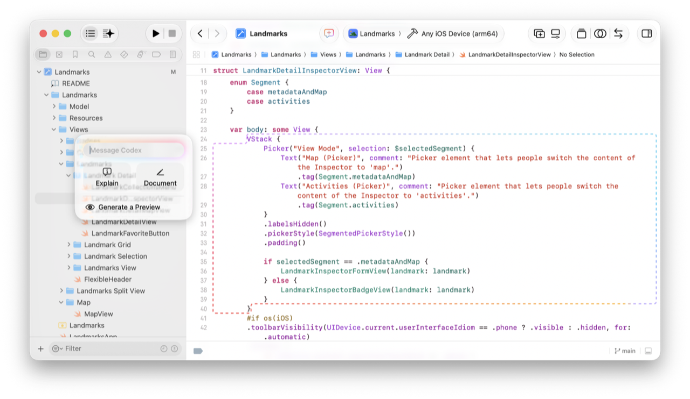
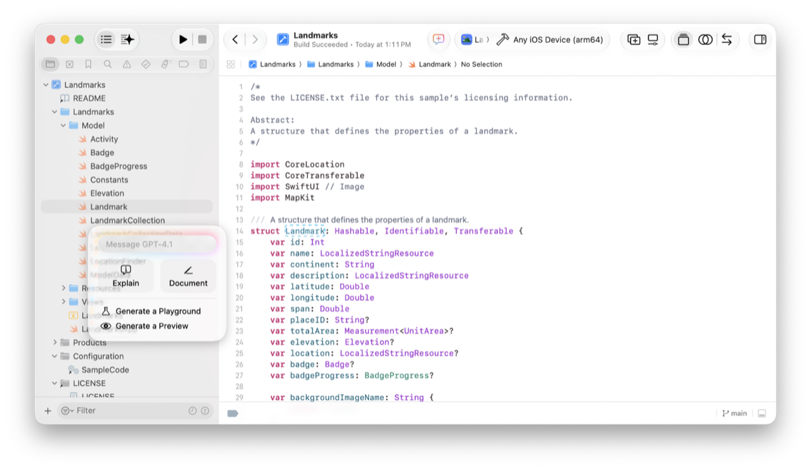
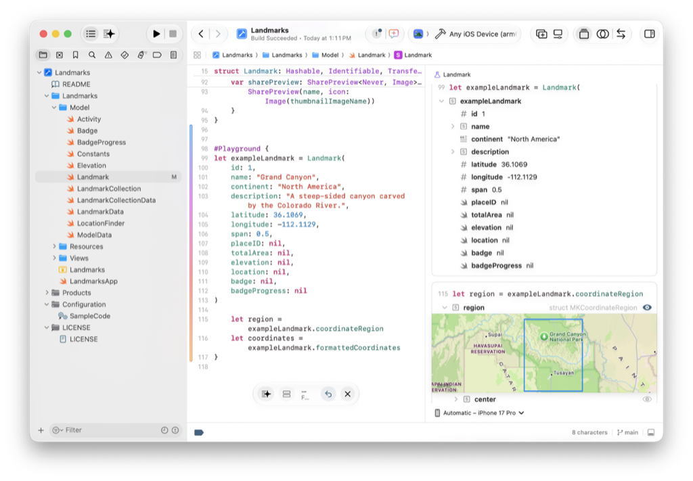
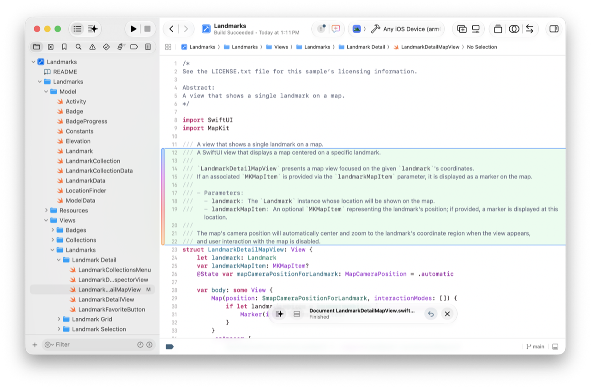
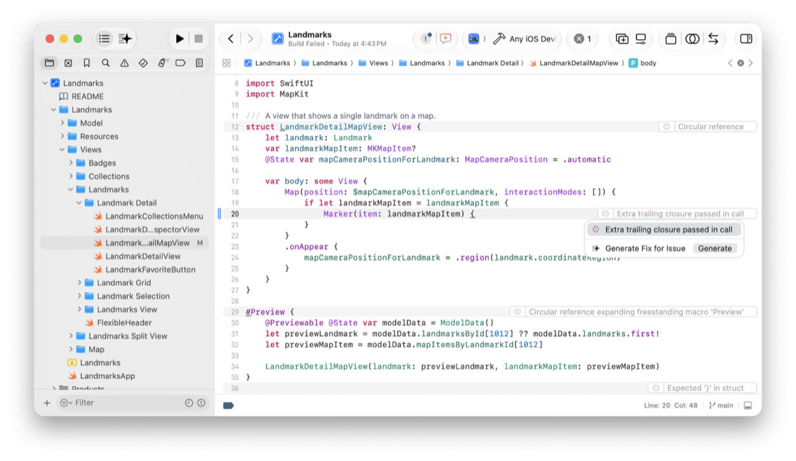

> 导航：[技术](../technologies.md) · [Xcode](../xcode.md) · [编码智能](coding-intelligence.md)

# 在源代码编辑器中使用编码智能

文章

在你想要更改代码的位置提交提示。

## 概述

你可以在源代码编辑器中使用编码智能，通过编码工具弹出窗口提交提示。你还可以针对 Xcode 在代码中检测到的问题生成修复。

开始之前，请在 Intelligence 设置中配置智能体或聊天提供方。有关更多信息，请参阅[设置编码智能](setting-up-coding-intelligence.md)。

## 在源代码编辑器中开始对话

要在源代码编辑器中显示编码工具弹出窗口，请执行以下操作之一：

- 按住 Control 键点按符号或所选代码，然后从上下文菜单中选择 Show Coding Tools \> Show Coding Tools。
- 选择一些代码，然后点按源代码编辑器边槽中出现的编码助手按钮。
- 在源代码编辑器中的任意位置按 Command-Option-0，无论是否选择了代码都可以。

一张截屏，显示侧边栏中的项目导览器和右侧的源代码编辑器；源代码编辑器中选择了一段代码，并显示带有 Explain 按钮的 Show Coding Tools 弹出窗口。

在编码工具弹出窗口的消息文本栏中输入提示，或者根据上下文点按 Explain、Generate a Preview 或 Generate a Playground 等按钮。

## 生成 playground 和预览

Playground 和预览让你可以在不修改 App 的情况下试验新代码。使用 playground 在画布中运行和显示代码片段，并使用预览在各个平台上验证 UI 代码。Xcode 生成的 playground 和预览代码可能包含示例数据，以帮助你理解代码并在画布中将其可视化。

要向项目添加 playground 宏，请打开编码工具弹出窗口，然后点按 Generate a Playground：

一张截屏，显示侧边栏中的项目导览器和右侧的源代码编辑器；源代码编辑器中选择了一个类，并显示带有 Generate a Playground 按钮的 Show Coding Tools 弹出窗口。

如果你使用智能体，Xcode 会使用 playground 提示开始新对话，在对话记录中显示响应，并在产物面板中显示生成的 playground 代码。要在源代码编辑器中查看代码，请在产物面板中双击文件名。要在画布中运行 playground，必要时请点按工具栏中的 Show Canvas。

如果使用聊天模型，Xcode 会直接在源代码编辑器中显示代码更改，并在画布中运行 playground。

一张截屏，显示侧边栏中的项目导览器、源代码编辑器中打开并包含所生成 playground 代码的文件，以及右侧画布中正在运行的 playground。

类似地，当源代码编辑器中打开界面文件时，请打开编码工具弹出窗口并点按 Generate a Preview。Xcode 会将生成的预览代码添加到文件中，并在产物面板或画布中渲染预览。

有关更多信息，请参阅[使用 playground 宏运行代码片段](running-code-snippets-using-the-playground-macro.md)和[在 Xcode 中预览 App 界面](previewing-your-apps-interface-in-xcode.md)。

## 生成文档

让 Xcode 在源文件中的符号上方起草 [Swift-DocC](https://www.swift.org/documentation/docc/) 样式的文档注释。

在源代码编辑器中，选择需要文档注释的符号，打开编码工具弹出窗口，然后点按 Document。

例如，如果选择一个类，Xcode 会为该类及其属性和方法添加文档，其中包括方法参数。对于智能体，Xcode 会在对话记录中显示提示，并在产物面板中显示文件更改。对于聊天模型，Xcode 会直接在源代码编辑器中显示文档注释。

一张截屏，左侧显示项目导览器，源代码编辑器中打开一个文件，结构体名称上方显示所生成的 DocC 样式注释。

要在 Xcode 的 Developer Documentation 窗口中查看文档，请选择 Product \> Build Documentation。

## 修复代码

如果你在开始对话时选择智能体，Xcode 会在编辑代码后自动构建你的 App，并尝试为你修复问题。如果构建 App 时遇到编译警告或错误，Xcode 通常也可以为你生成修复。

源代码编辑器会以红色或黄色下划线高亮显示所有问题，并提供问题摘要和图标。点按该图标以显示有关问题的更多信息，然后点按「Generate Fix for Issue」旁边的 Generate。

对于智能体，Xcode 会在对话记录中显示修复详情，并在产物面板中显示更改。对于聊天模型，Xcode 会直接在源代码编辑器中更改代码。

一张截屏，左侧显示项目导览器，右侧源代码编辑器中打开一个文件，还显示了一条带错误消息和 Generate 按钮的 Fix-it 对话框。

## 另请参阅

### 相关文档

- [在 Xcode 中借助智能编写代码](writing-code-with-intelligence-in-xcode.md) — 在 Xcode 中与智能体或模型开始对话，从而生成代码、导览不熟悉的代码库，以及修复或重构现有代码。

### 基础

- [设置编码智能](setting-up-coding-intelligence.md) — 启用你想在 Xcode 中使用的智能工具。
- [在 Xcode 中借助智能编写代码](writing-code-with-intelligence-in-xcode.md) — 在 Xcode 中与智能体或模型开始对话，从而生成代码、导览不熟悉的代码库，以及修复或重构现有代码。
